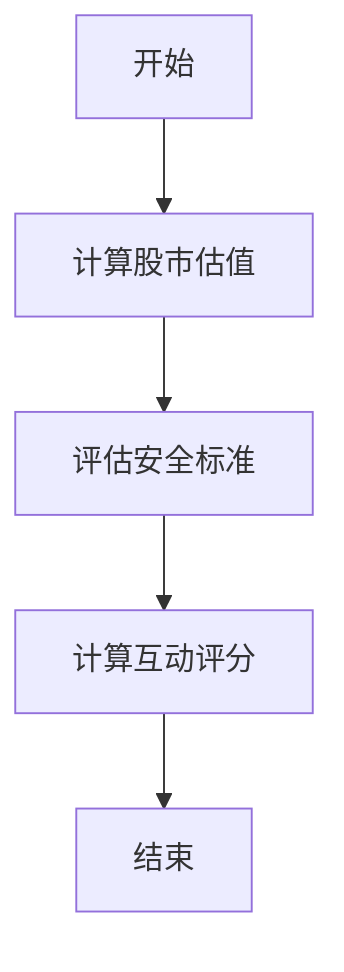
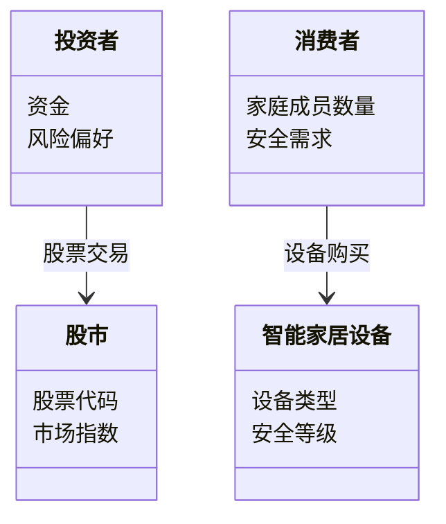
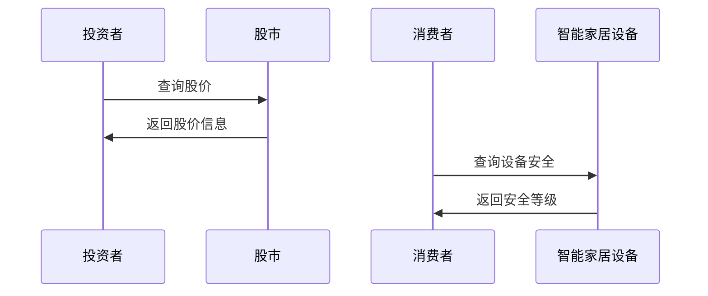

                 


# 新兴市场股市估值与智能家居安全标准的互动

## 关键词：新兴市场、股市估值、智能家居、安全标准、互动机制

## 摘要：本文探讨新兴市场股市估值与智能家居安全标准之间的互动关系，分析两者的核心概念、属性特征，构建互动模型，并通过实际案例和代码实现，提供解决方案和最佳实践。

---

## 目录

1. [背景介绍](#背景介绍)
2. [核心概念与联系](#核心概念与联系)
3. [算法原理讲解](#算法原理讲解)
4. [系统分析与架构设计方案](#系统分析与架构设计方案)
5. [项目实战](#项目实战)
6. [最佳实践](#最佳实践)

---

## 第一部分：背景介绍

### 1.1 问题背景

新兴市场股市估值与智能家居安全标准的互动是当前技术与经济领域的热门话题。随着智能家居技术的普及，其安全问题日益重要，而股市估值的变化反映了市场对相关技术的认可程度。

### 1.2 问题描述

股市估值受多种因素影响，而智能家居安全标准的提升可能影响股市估值。本文分析两者如何互动，揭示其潜在关系。

### 1.3 问题解决

通过构建互动模型，量化安全标准提升对股市估值的影响，为投资决策提供依据。

### 1.4 边界与外延

本文仅探讨股市估值与安全标准的互动，不涉及其他经济因素。

---

## 第二部分：核心概念与联系

### 2.1 核心概念原理

#### 股市估值
- 影响因素：市场指数、公司业绩、行业趋势。
- 数学模型：市盈率（P/E）=股价/每股收益。

#### 智能家居安全标准
- 核心原则：数据加密、访问控制。
- 安全标准：ISO/IEC 27001。

### 2.2 概念属性对比

| 属性 | 股市估值 | 智能家居安全标准 |
|------|----------|-------------------|
| 核心 | 价格波动 | 技术规范          |
| 影响 | 投资者情绪 | 安全性            |

### 2.3 ER实体关系图

```mermaid
erDiagram
    actor 投资者 {
        <属性> 资金
        <属性> 风险偏好
    }
    actor 消费者 {
        <属性> 家庭成员数量
        <属性> 安全需求
    }
    entity 股市 {
        <属性> 股票代码
        <属性> 市场指数
    }
    entity 智能家居设备 {
        <属性> 设备类型
        <属性> 安全等级
    }
    relationship 投资者-股市 : 股票交易
    relationship 消费者-智能家居设备 : 设备购买
```

---

## 第三部分：算法原理讲解

### 3.1 互动评分模型

#### 算法流程图



#### 数学模型

$$ \text{互动评分} = \alpha \times \text{股市估值} + \beta \times \text{安全标准} $$

其中，$$ \alpha = 0.6, \beta = 0.4 $$

#### Python代码实现

```python
def calculate_interaction_score(stock_valuation, security_standard):
    alpha = 0.6
    beta = 0.4
    return alpha * stock_valuation + beta * security_standard

# 示例
stock_valuation = 100
security_standard = 90
score = calculate_interaction_score(stock_valuation, security_standard)
print(f"互动评分为: {score}")
```

---

## 第四部分：系统分析与架构设计方案

### 4.1 问题场景介绍

新兴市场的投资者和消费者对股市估值和智能家居安全的关注日益增加。

### 4.2 项目介绍

开发一个系统，量化两者互动，提供投资建议。

### 4.3 系统功能设计（领域模型）



### 4.4 系统架构设计


### 4.5 系统交互



---

## 第五部分：项目实战

### 5.1 环境安装

安装Python和必要的库，如pandas、numpy。

### 5.2 系统核心实现

```python
import pandas as pd
import numpy as np

def main():
    data = pd.DataFrame({
        '股票代码': ['A', 'B', 'C'],
        '市场指数': [100, 150, 120],
        '安全标准': [85, 90, 88]
    })
    data['互动评分'] = data.apply(lambda x: 0.6*x['市场指数'] + 0.4*x['安全标准'], axis=1)
    print(data)

if __name__ == "__main__":
    main()
```

### 5.3 案例分析

以某新兴市场为例，分析互动评分对股市的影响。

---

## 第六部分：最佳实践

### 6.1 小结

通过互动模型，量化股市估值与安全标准的互动，为投资决策提供依据。

### 6.2 注意事项

- 数据质量：确保数据准确。
- 模型局限：考虑其他经济因素。

### 6.3 拓展阅读

- 《智能系统架构》
- 《金融市场分析》

---

## 结语

本文通过系统分析和案例研究，揭示了新兴市场股市估值与智能家居安全标准的互动机制，为投资者和企业提供决策支持。

