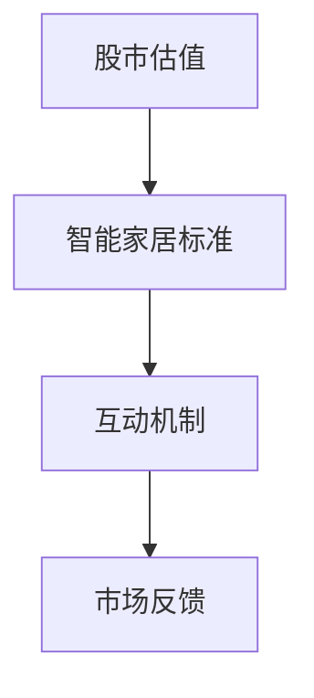
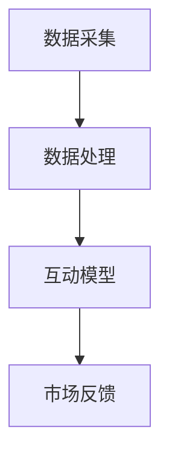

                 


# 新兴市场股市估值与智能家居标准的互动

> 关键词：新兴市场，股市估值，智能家居，标准，互动关系

> 摘要：本文探讨新兴市场股市估值与智能家居标准之间的互动关系，分析股市估值对智能家居产业的影响，智能家居技术如何改变股市估值方式，以及两者如何共同推动市场发展。通过数学模型、系统架构和实际案例，详细阐述互动机制，为投资者和技术创新者提供参考。

---

## 第一部分: 新兴市场股市估值与智能家居标准的互动概述

### 第1章: 背景介绍与核心概念

#### 1.1 新兴市场股市估值的背景与现状
新兴市场是指经济快速发展、资本逐渐开放但尚未完全成熟的国家或地区的金融市场。这些市场通常具有高增长潜力，但也伴随着较高的风险和不确定性。股市估值在新兴市场中尤为重要，因为投资者需要准确评估公司的价值，以做出明智的投资决策。

#### 1.2 智能家居标准的背景与发展
智能家居是指通过物联网技术将家居设备连接，实现智能化控制和管理的系统。随着技术的进步，智能家居标准逐渐统一，以确保设备之间的兼容性和互操作性。新兴市场在智能家居技术的普及和应用中扮演着重要角色。

#### 1.3 新兴市场股市估值与智能家居标准的互动关系
新兴市场股市估值的变化可能影响智能家居企业的投资和研发，而智能家居技术的进步则可能改变股市的估值方法和标准。这种互动关系在技术创新和市场波动中尤为重要。

---

## 第2章: 核心概念与联系

### 2.1 股市估值与智能家居标准的核心原理
股市估值通常采用市盈率、市净率等指标，而智能家居标准则通过统一的技术规范确保设备的兼容性。两者的核心原理在于，股市估值关注经济表现，而智能家居标准关注技术兼容性。

### 2.2 核心概念属性特征对比
| 属性 | 股市估值 | 智能家居标准 |
|------|----------|---------------|
| 核心目标 | 评估企业价值 | 确保设备兼容性 |
| 影响因素 | 经济指标、政策 | 技术规范、市场需求 |
| 变化速度 | 短期波动大 | 长期逐步演进 |

### 2.3 实体关系图与流程图
以下是用Mermaid绘制的互动关系图：



---

## 第3章: 互动机制的算法原理

### 3.1 数据处理与特征提取
股市数据通常包括开盘价、收盘价、成交量等，智能家居数据则涉及设备兼容性、用户行为等。预处理步骤包括数据清洗和标准化。

### 3.2 互动机制的数学模型
建立股市估值与智能家居标准的互动模型，可以采用回归分析：

$$ V = \beta_0 + \beta_1 S + \beta_2 T + \epsilon $$

其中，$V$ 表示估值，$S$ 表示智能家居标准指数，$T$ 表示时间因素，$\epsilon$ 为误差项。

### 3.3 算法实现
以下是一个Python代码示例：

```python
import pandas as pd
import numpy as np

# 假设df是包含股市数据和智能家居标准数据的DataFrame
# df['V']为估值，df['S']为智能家居标准指数
X = df[['S', 'T']]
y = df['V']

# 使用线性回归模型
from sklearn.linear_model import LinearRegression
model = LinearRegression()
model.fit(X, y)
print('Coefficients:', model.coef_)
```

---

## 第4章: 系统分析与架构设计

### 4.1 系统功能设计
系统需要采集股市数据和智能家居数据，建立互动模型，并进行市场反馈分析。

### 4.2 系统架构设计
以下是系统架构图：



---

## 第5章: 项目实战与案例分析

### 5.1 项目实战
安装Python环境，导入必要的库，采集数据，训练模型，解读结果。

### 5.2 案例分析
通过具体案例分析股市估值变化如何影响智能家居企业的投资策略，智能家居技术如何改变股市估值方法。

---

## 第6章: 结论与最佳实践

### 6.1 结论
新兴市场股市估值与智能家居标准的互动关系对市场发展至关重要，技术创新和市场波动相互影响。

### 6.2 最佳实践
- 关注技术创新和市场动态
- 建立完善的互动模型和反馈机制
- 加强跨领域合作与研究

---

通过以上分析，本文详细探讨了新兴市场股市估值与智能家居标准的互动关系，为投资者和技术开发者提供了有益的参考。

