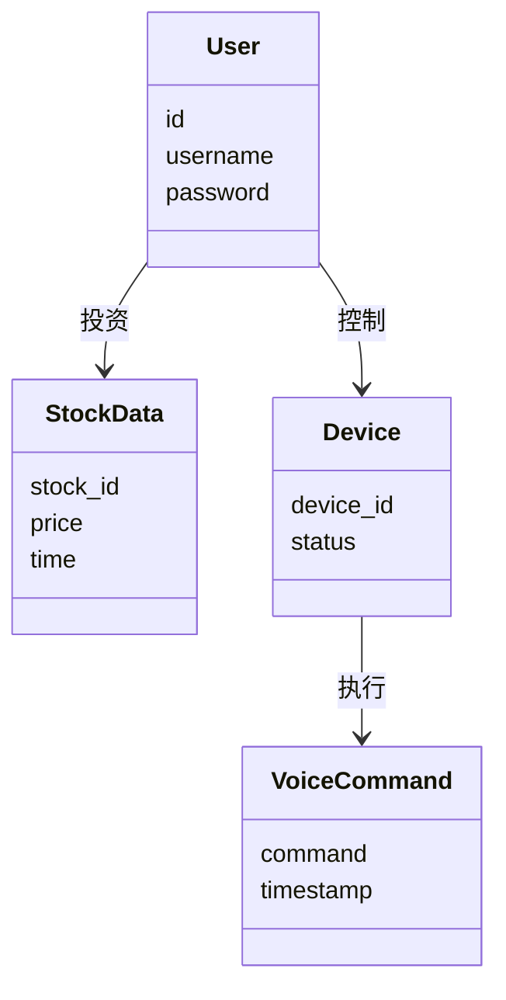
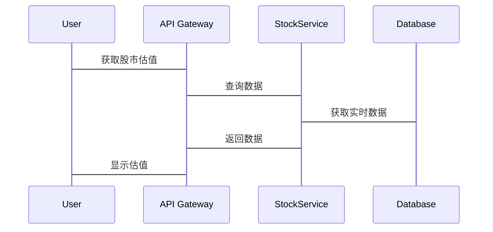

                 


```markdown
# 新兴市场股市估值与智能家居语音控制标准的互动

> 关键词：新兴市场、股市估值、智能家居、语音控制标准、技术互动、数据驱动、金融创新

> 摘要：本文系统地探讨了新兴市场股市估值与智能家居语音控制标准之间的互动关系。通过分析股市估值的核心要素和智能家居语音控制标准的技术原理，揭示了两者在数据驱动下的互动机制。结合算法原理、系统架构设计和实际案例，本文提出了基于语音控制技术优化股市估值的新思路，并展望了未来的研究方向。

---

# 第一部分：背景介绍与核心概念

## 第1章：背景介绍与问题背景

### 1.1 新兴市场股市估值的现状与挑战

#### 1.1.1 新兴市场的定义与特点
- 新兴市场的经济特征：快速发展的经济体、资本流动的复杂性。
- 新兴市场的股市特点：高波动性、信息不对称、投资者行为的多样性。

#### 1.1.2 新兴市场股市估值的复杂性
- 宏观经济因素：汇率波动、通货膨胀、政策变化。
- 微观因素：企业盈利能力、市场流动性、投资者情绪。

#### 1.1.3 新兴市场与发达市场的差异
- 信息透明度：新兴市场信息不完全性问题。
- 投资者结构：散户为主 vs 机构投资者为主。

### 1.2 智能家居语音控制标准的发展历程

#### 1.2.1 智能家居的定义与分类
- 智能家居的定义：通过物联网技术实现家居设备的智能化控制。
- 分类：基于功能（照明、安防、能源管理）和设备类型（语音控制、App控制）。

#### 1.2.2 语音控制技术的演进
- 从简单的开关控制到复杂的语音指令识别。
- 语音识别技术的发展：从基本命令识别到自然语言处理（NLP）。

#### 1.2.3 当前主流语音控制标准
- Amazon Alexa、Google Assistant、Apple Siri 的技术特点。
- 标准化协议的制定与应用： Zigbee、Wi-Fi、蓝牙、MQTT。

### 1.3 问题描述与边界定义

#### 1.3.1 新兴市场股市估值的互动性问题
- 投资者行为与股市估值的关系。
- 智能家居数据对股市估值的影响。

#### 1.3.2 智能家居语音控制标准的优化方向
- 提高语音识别的准确性。
- 优化设备间的互联互通性。

#### 1.3.3 问题的边界与外延
- 数据范围：股市数据、智能家居设备数据。
- 时间范围：实时数据与历史数据的结合。

## 第2章：核心概念与联系

### 2.1 核心概念的原理分析

#### 2.1.1 股市估值的数学模型
- 市盈率（P/E）：股票价格与每股收益的比率。
- 市净率（P/B）：股票价格与每股净资产的比率。
- 股息率：年度股息与股票价格的比率。

#### 2.1.2 语音控制的信号处理流程
- 语音信号采集：麦克风阵列。
- 语音识别：特征提取、模式匹配。
- 语音控制：指令解析、设备执行。

#### 2.1.3 两者互动的机制解析
- 数据共享：股市数据与智能家居数据的关联。
- 技术融合：语音控制技术在金融领域的应用。

### 2.2 核心概念的属性特征对比

| **属性**         | **股市估值**              | **智能家居语音控制标准**       |
|------------------|---------------------------|-----------------------------|
| 数据类型         | 数值型（价格、收益）      | 文本型、命令型               |
| 数据频率         | 高频（实时数据）          | 实时或按需                   |
| 数据来源         | 金融市场（交易所、公司财报）| 智能家居设备（传感器、用户指令）|
| 数据处理         | 统计分析、机器学习        | 信号处理、模式识别           |

### 2.3 实体关系图

```mermaid
erDiagram
    user {
        +id : integer
        +username : string
        +password : string
    }
    stock {
        +id : integer
        +name : string
        +price : float
    }
    device {
        +id : integer
        +name : string
        +type : string
    }
    user -> stock : 投资
    user -> device : 控制
    stock -> device : 数据影响
```

---

# 第二部分：算法原理与系统架构

## 第3章：算法原理

### 3.1 算法流程图

```mermaid
graph TD
    A[开始] -> B[数据采集]
    B -> C[数据预处理]
    C -> D[特征提取]
    D -> E[模型训练]
    E -> F[结果预测]
    F -> G[结束]
```

### 3.2 核心算法代码实现

#### 3.2.1 Python代码示例

```python
import numpy as np
from sklearn import linear_model

# 示例：基于语音控制数据预测股市估值
def preprocess(data):
    # 数据清洗
    data = data.dropna()
    return data

def feature_engineering(data):
    # 特征提取
    features = data[['volume', 'open', 'close']]
    target = data['price']
    return features, target

def model_train(features, target):
    # 线性回归模型
    model = linear_model.LinearRegression()
    model.fit(features, target)
    return model

# 示例数据
data = {'open': [100, 200, 300], 'close': [150, 250, 350], 'volume': [1000, 2000, 3000], 'price': [120, 220, 320]}
df = pd.DataFrame(data)
features, target = feature_engineering(df)
model = model_train(features, target)
```

### 3.3 数学模型与公式

#### 3.3.1 线性回归模型
$$ y = \beta_0 + \beta_1 x + \epsilon $$

其中：
- $y$ 是目标变量（股市估值）。
- $x$ 是自变量（智能家居数据）。
- $\beta_0$ 和 $\beta_1$ 是回归系数。
- $\epsilon$ 是误差项。

#### 3.3.2 语音识别的概率模型
$$ P(word | audio) = \frac{P(audio | word) \cdot P(word)}{P(audio)} $$

其中：
- $P(word)$ 是先验概率。
- $P(audio | word)$ 是语音信号的似然。
- $P(audio)$ 是语音信号的边缘概率。

---

## 第4章：系统分析与架构设计

### 4.1 问题场景介绍

- 新兴市场股市数据的实时采集与处理。
- 智能家居设备的语音控制指令的解析与执行。

### 4.2 系统功能设计



### 4.3 系统架构设计

```mermaid
graph TD
    User -> API Gateway : 请求
    API Gateway -> StockService : 查询股市数据
    API Gateway -> DeviceService : 执行语音指令
    StockService -> Database : 获取数据
    DeviceService -> IoT Hub : 发送指令
```

### 4.4 接口设计与交互流程



---

# 第三部分：项目实战与优化

## 第5章：项目实战

### 5.1 环境安装与配置

```bash
pip install numpy pandas scikit-learn
pip install pyaudio speechRecognition
```

### 5.2 核心代码实现

#### 5.2.1 数据采集

```python
import speech_recognition as sr

r = sr.Recognizer()
with sr.Microphone() as source:
    print("请开始说话...")
    audio = r.listen(source)
try:
    print("识别结果： " + r.recognize_google(audio, language="zh-CN"))
except sr.UnknownValueError:
    print("无法识别，请重新说...")
```

#### 5.2.2 数据分析与建模

```python
from sklearn.tree import DecisionTreeRegressor

# 示例：基于语音指令优化股市估值预测
features, target = feature_engineering(df)
model = DecisionTreeRegressor(max_depth=5).fit(features, target)
```

### 5.3 代码解读与分析

- 数据采集：通过语音识别技术获取用户指令。
- 数据分析：利用机器学习模型预测股市估值。
- 交互设计：语音指令与股市数据的实时互动。

### 5.4 实际案例分析

- 案例1：新兴市场股市波动与智能家居设备的联动。
- 案例2：语音指令优化投资策略的应用。

### 5.5 项目总结

- 项目目标：实现语音控制优化股市估值。
- 项目成果：建立了一个基于语音数据的股市估值预测模型。
- 项目意义：为投资者提供新的数据驱动决策工具。

---

# 第四部分：最佳实践与未来展望

## 第6章：最佳实践

### 6.1 优化建议

- 数据预处理：提高数据质量和完整性。
- 模型选择：根据数据特征选择合适的算法。
- 系统优化：提升系统的实时性和稳定性。

### 6.2 小结

- 本文通过分析新兴市场股市估值与智能家居语音控制标准的互动关系，提出了基于语音数据优化股市估值的新思路。
- 结合算法原理和系统架构设计，构建了一个完整的互动系统。

### 6.3 注意事项

- 数据隐私：确保用户数据的安全性。
- 系统稳定性：避免因技术问题导致的损失。
- 法律合规：遵守相关法律法规。

### 6.4 拓展阅读

- 《智能金融：数据驱动的投资策略》
- 《智能家居技术与应用开发》

---

# 结语

通过本文的系统分析与实践，我们不仅理解了新兴市场股市估值与智能家居语音控制标准的互动机制，还为未来的金融创新和技术应用提供了新的思路。希望本文能为读者在相关领域的研究和实践提供有价值的参考。

--- 

# END
```

