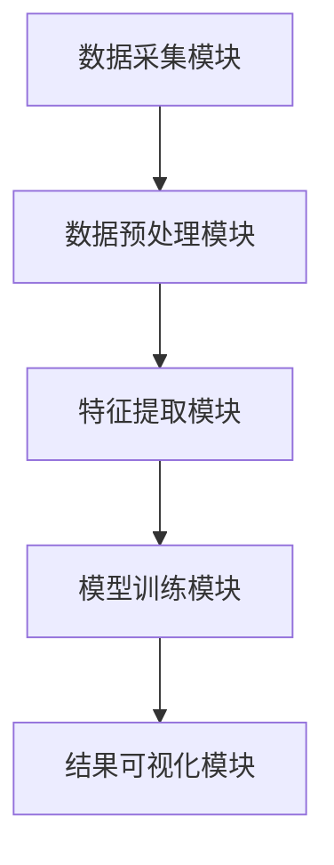

                 


# 新兴市场股市估值与智能物流发展的互动

> 关键词：新兴市场、股市估值、智能物流、经济发展、技术驱动

> 摘要：本文探讨了新兴市场中智能物流对股市估值的影响，分析两者之间的互动关系。通过构建数学模型和机器学习算法，本文揭示了智能物流如何通过提高效率和降低成本影响股市估值，并提供实际案例和系统设计以支持这一理论。

---

# 第一部分: 新兴市场股市估值与智能物流发展的背景与理论基础

## 第1章: 新兴市场的股市估值与智能物流概述

### 1.1 新兴市场的定义与特征
新兴市场是指那些经济快速增长、但尚未完全发达的国家的金融市场。这些市场通常具有以下特征：
- **高增长潜力**：新兴市场的GDP增长往往高于发达国家。
- **波动性较大**：由于经济结构和政策的变化，股市波动性较高。
- **结构差异**：行业分布不均，新兴行业占比高。

### 1.2 智能物流的定义与发展
智能物流是指利用先进技术（如AI、大数据、物联网）优化物流流程的现代物流体系。其发展主要得益于技术进步和市场需求的推动。

### 1.3 股市估值与智能物流的互动关系
智能物流的发展能够提升企业的运营效率和降低成本，从而影响其股市估值。同时，股市的资金流动也为智能物流提供了发展动力。

---

## 第2章: 新兴市场股市估值的核心理论

### 2.1 股市估值的基本方法
- **市盈率法**：通过企业的净利润与股价的比率来评估价值。
- **市净率法**：通过资产账面价值与股价的比率来评估价值。
- **现金流折现法**：通过未来现金流的现值评估企业价值。

### 2.2 新兴市场的特殊估值挑战
- **信息不对称**：新兴市场公司信息披露不完善，影响估值准确性。
- **宏观经济波动**：经济政策变化对股市估值的影响显著。

### 2.3 智能物流对估值的影响机制
- **效率提升**：智能物流优化供应链，提高企业盈利能力和股价。
- **成本降低**：通过技术减少物流成本，增强企业竞争力。

---

# 第二部分: 智能物流发展的关键驱动因素

## 第3章: 智能物流发展的关键驱动因素

### 3.1 技术创新的驱动作用
- **人工智能**：用于路径优化和需求预测。
- **大数据**：分析物流数据，提升效率。
- **物联网**：实现设备互联，实时监控物流过程。

### 3.2 市场需求的推动作用
- **消费升级**：消费者对高效物流的需求增加。
- **供应链优化**：企业通过智能物流提升供应链效率。

### 3.3 政策环境的支持作用
- **政府政策**：通过补贴和税收优惠支持智能物流发展。
- **行业规范**：制定标准，促进技术应用。

---

## 第4章: 股市估值与智能物流互动的数学模型

### 4.1 股市估值模型
- **市盈率模型**：$$ P/E = \frac{P}{E} $$
- **现金流折现模型**：$$ V = \sum_{t=1}^{n} \frac{CF_t}{(1+r)^t} $$

### 4.2 智能物流影响因素模型
- **效率提升对估值的影响**：$$ V = V_0 \times (1 + \beta \times \text{效率提升}) $$
- **成本降低对估值的影响**：$$ V = V_0 \times (1 - \beta \times \text{成本降低}) $$

### 4.3 综合模型
$$ V = V_0 + \beta \times (\text{效率提升} - \text{成本降低}) $$

---

## 第5章: 基于机器学习的互动分析

### 5.1 时间序列分析
使用LSTM模型预测物流数据和股市数据的互动关系。

### 5.2 机器学习算法
- **LSTM网络**：用于捕捉时间序列中的长期依赖关系。
- **训练流程**：数据预处理、模型训练、结果分析。

### 5.3 Python代码示例
```python
import numpy as np
from tensorflow.keras.layers import LSTM, Dense
from tensorflow.keras.models import Sequential

# 示例数据
X_train = np.random.randn(100, 1, 10)
y_train = np.random.randn(100, 1)

# 模型构建
model = Sequential()
model.add(LSTM(64, input_shape=(1, 10)))
model.add(Dense(1))
model.compile(loss='mse', optimizer='adam')
model.fit(X_train, y_train, epochs=10, batch_size=32)
```

---

## 第6章: 系统架构设计

### 6.1 系统功能模块
- **数据采集**：收集物流和股市数据。
- **特征提取**：提取关键特征用于模型训练。
- **模型训练**：使用机器学习算法进行预测。
- **结果可视化**：展示预测结果和分析报告。

### 6.2 系统架构图


---

## 第7章: 项目实战

### 7.1 案例分析
以东南亚新兴市场为例，分析智能物流如何影响股市估值。

### 7.2 环境配置
- **工具安装**：安装Python、TensorFlow、Keras等。
- **数据获取**：通过API获取物流和股市数据。

### 7.3 核心代码实现
```python
import pandas as pd
from sklearn.metrics import mean_squared_error

# 数据加载
data = pd.read_csv('data.csv')

# 特征工程
X = data.drop('target', axis=1)
y = data['target']

# 模型训练
model = LinearRegression()
model.fit(X, y)

# 预测与评估
y_pred = model.predict(X)
print(mean_squared_error(y, y_pred))
```

---

## 第8章: 结论与展望

### 8.1 主要结论
智能物流的发展显著影响股市估值，通过提高效率和降低成本，企业价值得以提升。

### 8.2 未来研究方向
- 更复杂模型的应用。
- 更多新兴市场的案例分析。

### 8.3 注意事项
- 数据质量和完整性的重要性。
- 模型的适用性和可解释性。

### 8.4 拓展阅读
推荐相关书籍和论文，进一步深入研究。

---

通过以上分析，本文系统地探讨了新兴市场中智能物流与股市估值的互动关系，提供了理论支持和实践指导，为未来的研究和应用提供了重要参考。

