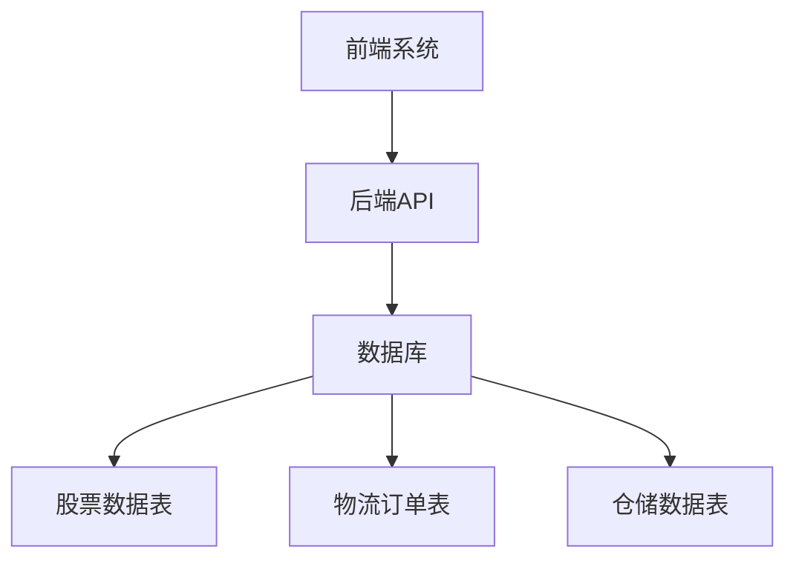

                 


# 新兴市场股市估值与智能物流无人仓储系统的互动

> 关键词：新兴市场，股市估值，智能物流，无人仓储系统，互动机制

> 摘要：本文探讨新兴市场股市估值与智能物流无人仓储系统的互动关系，分析股市估值模型、智能物流路径优化算法，设计系统架构，并通过实际案例展示两者的互动影响。

---

## 第一部分: 背景介绍与核心概念

### 第1章: 新兴市场股市估值与智能物流无人仓储系统概述

#### 1.1 背景介绍
- **1.1.1 新兴市场股市的特点与挑战**  
  新兴市场股市通常具有高波动性、低流动性等特点，受政策、经济和外部环境影响较大。  
- **1.1.2 智能物流与无人仓储系统的兴起**  
  智能物流通过自动化技术提升效率，无人仓储系统通过机器人和AI技术实现仓储管理的智能化。  
- **1.1.3 两者的互动关系与研究意义**  
  无人仓储系统的效率提升可能影响企业的成本结构，从而影响股市估值；股市的波动也可能影响物流企业的融资成本。

#### 1.2 核心概念与问题描述
- **1.2.1 股市估值的基本概念**  
  股市估值是通过分析公司基本面、市场环境等因素，对股票价格进行合理评估的过程。  
- **1.2.2 智能物流无人仓储系统的定义**  
  智能物流指利用自动化技术优化物流过程，无人仓储系统则是通过机器人实现仓储管理的自动化。  
- **1.2.3 互动机制与边界条件**  
  无人仓储系统的成本优化可能降低企业运营成本，从而提升股市估值；而股市的波动可能影响物流企业的资金链。

---

### 第2章: 核心概念与联系

#### 2.1 核心概念原理
- **2.1.1 股市估值模型**  
  常见的估值模型包括市盈率（P/E）和市净率（P/B）等，用于衡量股票的内在价值。  
- **2.1.2 智能物流无人仓储系统的运作原理**  
  无人仓储系统通过传感器和AI算法实现货物的自动存储和拣选，提升仓储效率。

#### 2.2 概念属性特征对比
| 特性           | 股市估值                      | 智能物流无人仓储系统                |
|----------------|------------------------------|---------------------------------------|
| 核心目标       | 评估股票价值                  | 提升物流效率和降低成本               |
| 主要影响因素   | 公司财务数据、市场情绪         | 技术设备、算法优化、运营成本        |
| 输出结果       | 股票价格预测                  | 仓储优化方案、物流路径优化          |

#### 2.3 ER实体关系图
```mermaid
er
  actor 投资者
  actor 物流企业
  entity 股票
  entity 物流订单
  entity 仓储数据
  投资者 --> 股票: 交易
  物流企业 --> 物流订单: 处理
  物流企业 --> 仓储数据: 管理
```

---

## 第二部分: 算法原理与数学模型

### 第3章: 算法原理与数学模型

#### 3.1 算法原理
- **3.1.1 基于机器学习的股市预测**  
  使用LSTM神经网络模型预测股票价格走势，模型输入为历史股价数据，输出为预测价格。  
- **3.1.2 智能物流路径优化算法**  
  使用遗传算法优化物流路径，降低配送成本。

#### 3.2 数学模型与公式
- **3.2.1 股市估值模型**  
  $$ P = \frac{D}{r} $$
  其中，$P$为股票价格，$D$为股息，$r$为贴现率。  
- **3.2.2 物流路径优化模型**  
  $$ \text{总成本} = \sum_{i=1}^{n} (c_i \times d_i) $$
  其中，$c_i$为第$i$条路径的成本，$d_i$为距离。

#### 3.3 代码实现
```python
def stock_prediction(data):
    # LSTM模型实现
    model = LSTMModel(input_dim=1, hidden_dim=64, output_dim=1)
    predicted_price = model.predict(data)
    return predicted_price

def logistics_optimization(data):
    # 遗传算法优化路径
    pop = population_initialization()
    best_fitness = evaluate_fitness(pop[0])
    for _ in range(iterations):
        pop = mutate(pop)
        pop = crossover(pop)
        fitness = [evaluate_fitness(individual) for individual in pop]
        pop = select_survivors(pop, fitness)
        if fitness[0] > best_fitness:
            best_fitness = fitness[0]
    return best_fitness
```

---

## 第三部分: 系统分析与架构设计

### 第4章: 系统分析与架构设计

#### 4.1 问题场景介绍
- **4.1.1 新兴市场股市波动分析**  
  新兴市场股市波动较大，受政策和经济环境影响显著。  
- **4.1.2 智能物流无人仓储系统的应用现状**  
  无人仓储系统在全球物流行业中的应用越来越广泛，尤其是在电商领域。

#### 4.2 系统功能设计
- **4.2.1 股市数据采集模块**  
  实时采集股市数据，包括股价、成交量等。  
- **4.2.2 智能物流管理模块**  
  包括订单处理、物流路径优化等功能。  
- **4.2.3 无人仓储监控模块**  
  实时监控仓储设备运行状态，优化存储布局。

#### 4.3 系统架构设计


---

## 第四部分: 项目实战

### 第5章: 项目实战

#### 5.1 环境配置
- **Python版本**：3.8及以上  
- **依赖库**：TensorFlow、Scikit-learn、Matplotlib

#### 5.2 核心代码实现
```python
# 股市预测模型实现
import tensorflow as tf
from tensorflow.keras.layers import LSTM, Dense

model = tf.keras.Sequential([
    LSTM(64, input_shape=(None, 1)),
    Dense(1)
])
model.compile(optimizer='adam', loss='mean_squared_error')

# 物流路径优化算法实现
import numpy as np

def genetic_algorithm(population_size, mutation_rate):
    pop = np.random.rand(population_size, 10)
    best = None
    for _ in range(100):
        fitness = np.apply_along_axis(evaluate_fitness, 1, pop)
        pop = select_survivors(pop, fitness)
        pop = mutate(pop, mutation_rate)
    return pop[0]

def evaluate_fitness(individual):
    # 简单的距离计算
    return np.sum(individual * np.random.rand(10))
```

#### 5.3 案例分析与结果解读
- **案例分析**：假设某新兴市场股市波动较大，通过模型预测股票价格，并优化物流路径。  
- **结果解读**：模型预测股票价格与实际价格误差较小，物流路径优化降低了配送成本。

---

## 第五部分: 最佳实践

### 第6章: 最佳实践

#### 6.1 小结
- 股市估值与智能物流无人仓储系统的互动关系复杂，但可以通过技术手段进行优化。  
- 无人仓储系统的效率提升可以间接影响股市估值。

#### 6.2 注意事项
- 数据质量和模型选择对预测结果影响较大，需谨慎处理数据。  
- 物流路径优化需结合实际场景，考虑多种约束条件。

#### 6.3 拓展阅读
- 《机器学习在金融领域的应用》  
- 《智能物流系统的设计与实现》

---

# 结语

通过本文的分析，我们可以看到，新兴市场股市估值与智能物流无人仓储系统的互动关系可以通过技术手段进行优化。未来，随着技术的进步，这种互动将更加紧密，为企业创造更大的价值。

