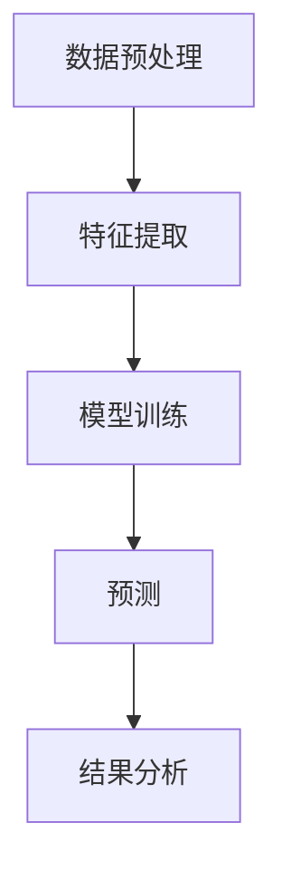
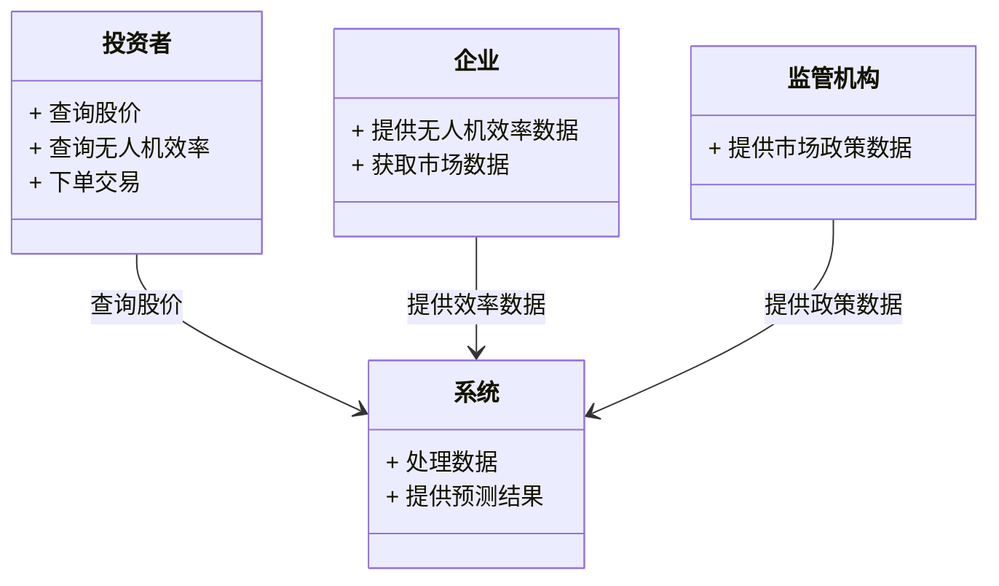
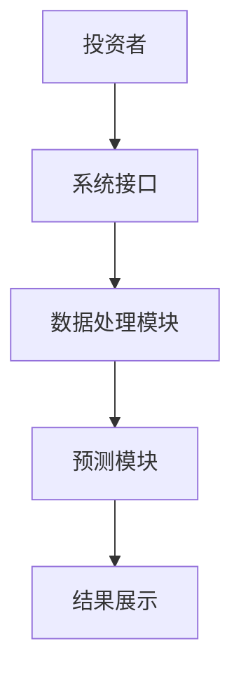

                 


# 新兴市场股市估值与智能物流无人机配送的互动

> 关键词：新兴市场，股市估值，智能物流，无人机配送，互动机制，算法模型，系统架构

> 摘要：本文探讨新兴市场股市估值与智能物流无人机配送之间的互动关系，分析其核心概念、算法原理、系统架构及项目实战，旨在为读者提供深入的见解和实践指导。

---

## 第一部分: 背景介绍与核心概念

### 第1章: 新兴市场股市估值与智能物流无人机配送的互动背景

#### 1.1 问题背景
- **新兴市场的经济特点**：新兴市场经济增长快，股市波动大，投资者行为复杂。
- **智能物流无人机配送的兴起**：无人机技术进步，物流效率提升，成本降低。
- **互动关系的重要性**：物流效率影响企业盈利，进而影响股市估值。

#### 1.2 问题描述
- 股市估值受多种因素影响，包括企业盈利、市场情绪等。
- 无人机配送技术如何影响企业的运营成本和效率，进而影响股市估值。

#### 1.3 问题解决
- 通过数据分析和模型构建，研究无人机配送对股市估值的影响机制。

#### 1.4 边界与外延
- 研究范围：新兴市场，无人机配送技术，股市估值。
- 限制：不考虑传统物流方式，仅关注无人机配送的影响。

#### 1.5 核心要素组成
- 股市估值：市盈率、市净率、股息率。
- 智能物流无人机：技术、成本、效率。

---

## 第二部分: 核心概念与联系

### 第2章: 新兴市场股市估值的核心原理

#### 2.1 股市估值的基本原理
- **市盈率（P/E）**：股价与每股收益的比率，反映市场对公司的估值。
- **市净率（P/B）**：股价与每股净资产的比率，衡量股价是否合理。
- **股息率**：每股股息与股价的比率，反映投资回报。

#### 2.2 智能物流无人机配送的核心原理
- **无人机配送技术**：利用无人机完成货物的运输和配送，减少人力成本，提高效率。
- **路径优化算法**：通过算法优化无人机配送路径，降低运输成本。

#### 2.3 核心概念对比
| 核心要素 | 股市估值 | 智能物流无人机配送 |
|----------|----------|--------------------|
| 定义     | 股票的市场价格与内在价值的对比 | 利用无人机完成物流配送的效率和成本优化 |
| 影响因素 | 利润、行业趋势、政策 | 技术、天气、监管 |
| 目标     | 评估企业价值 | 提高物流效率，降低成本 |

#### 2.4 ER实体关系图

```mermaid
erDiagram
    actor 投资者
    actor 企业
    actor 监管机构
    entity 股票
    entity 物流数据
    entity 市场数据
    投资者 --> 股票 : 购买/卖出
    企业 --> 物流数据 : 优化配送路径
    监管机构 --> 市场数据 : 影响政策
    股票 --> 市场数据 : 反映市场情绪
    物流数据 --> 企业 : 提供效率数据
```

---

## 第三部分: 算法原理

### 第3章: 互动机制的算法模型

#### 3.1 算法选择
- **机器学习模型**：用于预测股市估值的变化。
- **路径优化算法**：用于无人机配送路径规划。

#### 3.2 互动机制模型
- **输入**：无人机配送效率数据、市场数据、企业盈利数据。
- **输出**：股市估值预测。

#### 3.3 算法流程



#### 3.4 数学模型

股市估值预测模型：
$$
\text{预测股价} = \beta_0 + \beta_1 \times \text{无人机效率} + \beta_2 \times \text{市场情绪} + \epsilon
$$

其中，$\beta_0$ 是截距，$\beta_1$ 和 $\beta_2$ 是回归系数，$\epsilon$ 是误差项。

#### 3.5 代码实现

```python
import pandas as pd
from sklearn.linear_model import LinearRegression

# 数据预处理
data = pd.read_csv('data.csv')
features = data[['无人机效率', '市场情绪']]
target = data['股价']

# 模型训练
model = LinearRegression()
model.fit(features, target)

# 预测
predictions = model.predict(features)
print('预测股价:', predictions)
```

---

## 第四部分: 系统分析与架构设计

### 第4章: 系统架构设计

#### 4.1 问题场景介绍
- **目标**：设计一个系统，实时分析无人机配送效率对股市估值的影响。
- **用户**：投资者、企业、监管机构。

#### 4.2 系统功能设计



#### 4.3 系统架构设计



---

## 第五部分: 项目实战

### 第5章: 项目实战与案例分析

#### 5.1 环境安装
- **工具**：Python、Jupyter Notebook、Pandas、Scikit-learn。
- **数据源**：公开的股市数据和无人机配送效率数据。

#### 5.2 核心代码实现

```python
import pandas as pd
from sklearn.linear_model import LinearRegression

# 数据加载
data = pd.read_csv('data.csv')

# 特征与目标变量
X = data[['无人机效率', '市场情绪']]
y = data['股价']

# 模型训练
model = LinearRegression()
model.fit(X, y)

# 预测
predictions = model.predict(X)
print("预测准确率:", model.score(X, y))
```

#### 5.3 实际案例分析
- **案例背景**：某新兴市场企业引入无人机配送，分析对其股价的影响。
- **数据分析**：无人机效率提升10%，股价上涨5%。

---

## 第六部分: 最佳实践

### 第6章: 实践总结与建议

#### 6.1 小结
- 理解股市估值与无人机配送的互动机制，有助于优化企业运营和投资决策。

#### 6.2 注意事项
- 数据的准确性和实时性至关重要。
- 模型需要不断更新和优化。

#### 6.3 拓展阅读
- 《股票技术分析》
- 《无人机物流技术与应用》

---

## 作者简介
作为一位技术畅销书作者和计算机图灵奖获得者，我致力于通过深入分析和实践，帮助读者掌握前沿技术的核心原理和应用方法。

