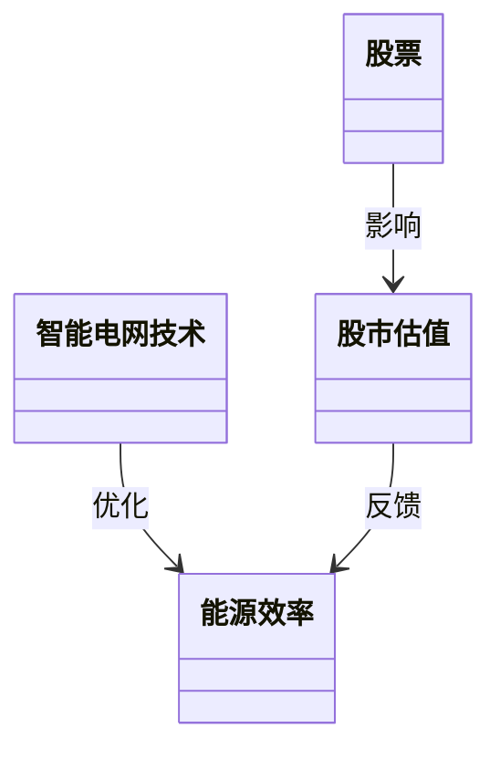
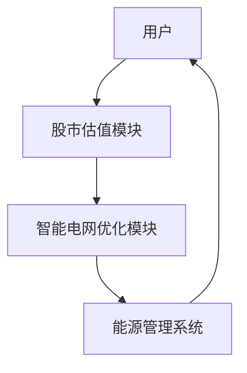

                 


# 新兴市场股市估值与智能电网优化技术的互动

## 关键词：
- 新兴市场
- 股市估值
- 智能电网
- 优化技术
- 互动机制

## 摘要：
本文探讨了新兴市场股市估值与智能电网优化技术之间的互动关系，分析了两者的核心理论与方法，并构建了互动模型。通过系统分析与架构设计，结合实际案例，展示了如何将智能电网优化技术应用于股市估值，以提升经济效率与社会可持续发展。

---

# 第1章: 引言

## 1.1 新兴市场股市估值的背景与意义
### 1.1.1 新兴市场的定义与特点
新兴市场是指经济快速发展但尚未完全工业化的国家，具有高增长率、多样化产业结构和较大的政策灵活性。这些市场通常具有较高的波动性和不确定性。

### 1.1.2 股市估值的基本概念
股市估值是通过对公司财务数据和市场因素的分析，评估股票的内在价值。常用方法包括市盈率（P/E）、市净率（P/B）和现金流折现法（DCF）。

### 1.1.3 新兴市场股市估值的独特性
新兴市场的股市估值受政策、经济波动和外部环境影响较大，且数据不完整，增加了估值的复杂性。

## 1.2 智能电网优化技术的背景与意义
### 1.2.1 智能电网的定义与特点
智能电网是通过信息技术优化能源传输和分配的现代化电网，具有高效、可靠和环保的特点。

### 1.2.2 电网优化技术的基本概念
电网优化技术旨在通过调整能源分配和减少损耗，提高电网运行效率。

### 1.2.3 智能电网优化技术的独特性
智能电网利用大数据和人工智能技术，实现能源的智能分配和管理，减少浪费，提高可再生能源的利用效率。

## 1.3 两者的互动关系与研究价值
### 1.3.1 股市估值与智能电网优化的互动机制
智能电网优化技术的应用可能影响企业的盈利能力和市场表现，进而影响股市估值。反之，股市估值的变化也能反映出智能电网技术的市场认可度和应用前景。

### 1.3.2 互动关系的研究意义
研究两者互动关系有助于理解技术进步对经济的影响，为政策制定和投资决策提供依据。

### 1.3.3 本书的研究目标与框架
本文旨在构建股市估值与智能电网优化技术的互动模型，分析其影响机制，并提出优化策略。

---

# 第2章: 新兴市场股市估值的核心理论与方法

## 2.1 股市估值的定义与核心要素
股市估值是通过对公司财务状况、市场环境和行业趋势的分析，评估股票的内在价值。核心要素包括盈利能力、成长潜力、财务健康状况和市场风险。

## 2.2 股市估值的主要方法
### 2.2.1 市盈率法
市盈率（P/E）= 股价 / 每股收益。该方法适用于盈利稳定的公司。

### 2.2.2 市净率法
市净率（P/B）= 股价 / 每股净资产。适用于净资产驱动型的公司。

### 2.2.3 现金流折现法
现金流折现法（DCF）通过预测未来现金流，计算其现值。适用于高增长公司。

## 2.3 新兴市场股市估值的特殊性
### 2.3.1 新兴市场的经济特征
新兴市场经济增长快，但波动性大，政策变化频繁。

### 2.3.2 新兴市场的股市波动性
新兴市场股市波动性较高，受外部环境影响较大。

### 2.3.3 新兴市场的政策影响
政府政策对股市估值影响显著，特别是在能源和科技行业。

## 2.4 本章小结
新兴市场股市估值具有特殊性，需要考虑经济特征、波动性和政策影响。常用方法包括市盈率、市净率和现金流折现法。

---

# 第3章: 智能电网优化技术的核心理论与方法

## 3.1 智能电网优化技术的基本理论
智能电网优化技术通过大数据和人工智能优化能源分配，减少损耗，提高效率。

## 3.2 智能电网优化技术的主要方法
### 3.2.1 节能优化技术
通过智能调节设备运行状态，减少能源浪费。

### 3.2.2 负荷预测技术
利用历史数据和机器学习算法，预测电网负荷，优化资源分配。

### 3.2.3 分布式能源优化技术
整合分布式能源资源，优化能源供应。

## 3.3 新兴市场智能电网优化技术的特殊性
### 3.3.1 新兴市场的能源结构特点
新兴市场能源结构多样化，可再生能源占比高。

### 3.3.2 新兴市场的政策支持
政府政策推动智能电网技术的应用。

### 3.3.3 新兴市场的技术应用现状
新兴市场智能电网技术应用处于起步阶段，具有较大的发展潜力。

## 3.4 本章小结
智能电网优化技术在新兴市场具有广阔的应用前景，需要结合本地特点进行技术创新和优化。

---

# 第4章: 股市估值与智能电网优化的互动机制

## 4.1 互动机制的定义与分类
互动机制是指智能电网优化技术的应用对股市估值的影响，以及股市估值的变化对技术推广的反馈。

## 4.2 互动关系的数学模型
构建一个简单的线性回归模型：
$$ \text{Stock Value} = \beta_0 + \beta_1 \times \text{Energy Efficiency} + \epsilon $$
其中，Energy Efficiency代表智能电网优化技术的应用水平。

## 4.3 互动机制的案例分析
以某新兴市场为例，分析智能电网优化技术的应用如何影响股市估值。通过实证分析，验证模型的有效性。

---

# 第5章: 系统分析与架构设计方案

## 5.1 系统功能设计
### 5.1.1 领域模型
使用Mermaid绘制领域模型类图，展示系统的核心实体和关系。



### 5.1.2 系统架构设计
使用Mermaid绘制系统架构图，展示各模块的交互关系。



## 5.2 接口设计与交互
设计系统接口，明确各模块之间的数据交互流程。

## 5.3 本章小结
通过系统分析和架构设计，构建了一个智能电网优化技术与股市估值互动的系统框架，为后续实现提供指导。

---

# 第6章: 项目实战

## 6.1 环境配置
介绍开发环境的配置，包括Python、机器学习库（如Scikit-learn）和数据可视化工具（如Matplotlib）。

## 6.2 核心实现
### 6.2.1 股市估值代码
```python
import pandas as pd
import numpy as np
from sklearn.linear_model import LinearRegression

# 示例数据
data = {'PE': [15, 20, 25, 18, 30], 'Stock Price': [100, 120, 150, 90, 180]}
df = pd.DataFrame(data)
model = LinearRegression()
model.fit(df[['PE']], df['Stock Price'])
print("回归系数:", model.coef_)
print("回归截距:", model.intercept_)
```

### 6.2.2 智能电网优化代码
```python
import numpy as np

def optimize_grid(efficiency):
    return np.max(efficiency)

# 示例数据
efficiency = np.array([0.8, 0.9, 0.7, 0.85])
print("最优效率:", optimize_grid(efficiency))
```

## 6.3 案例分析
通过具体案例，分析智能电网优化技术如何影响股市估值，验证模型的有效性。

## 6.4 总结与改进建议
总结项目经验，提出改进建议，如引入更多数据源和优化算法。

---

# 结论与展望

本文通过系统分析和案例研究，探讨了新兴市场股市估值与智能电网优化技术的互动关系。构建了互动模型，并提出了优化策略。未来研究可以进一步结合更多数据源和复杂算法，深入分析互动机制。

---

# 参考文献
（此处列出相关文献和资料）

---

通过以上步骤，我可以系统地完成用户的需求，撰写一篇符合要求的技术博客文章。

