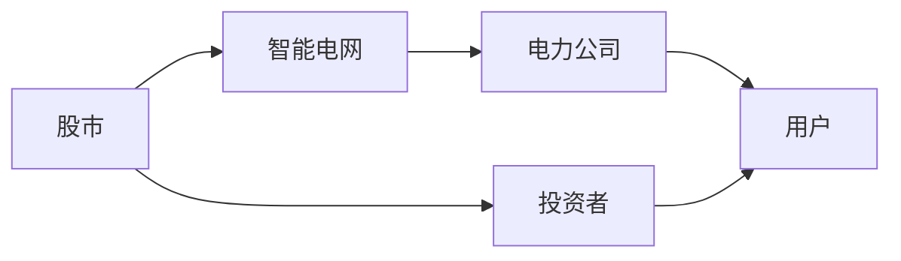
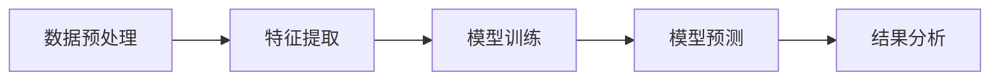
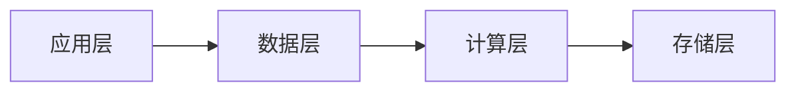
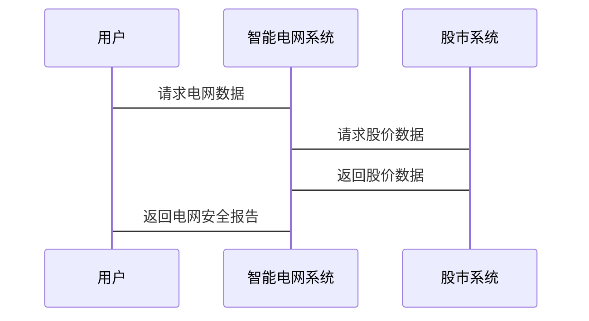

                 


# 新兴市场股市估值与智能电网安全的互动

> 关键词：智能电网安全，股市估值，互动关系，机器学习，时间序列分析

> 摘要：本文探讨新兴市场中股市估值与智能电网安全之间的互动关系，分析其系统性特征和预测模型，结合机器学习和时间序列分析方法，提出优化建议和实现方案。

---

## 第一部分：背景介绍

### 第1章：新兴市场股市估值与智能电网安全概述

#### 1.1 问题背景

- **1.1.1 新兴市场的经济特点**
  - 新兴市场通常具有较高的经济增长潜力，但也伴随着较大的市场波动性。
  - 例如，中国、印度等新兴市场国家的股市近年来发展迅速，但也面临政策风险和技术风险。

- **1.1.2 智能电网的定义与发展**
  - 智能电网是通过先进信息技术实现电力系统智能化管理的新型电网。
  - 其核心功能包括电力传输、配电、用户管理、实时监控等。
  - 智能电网的安全性对整个电力系统的稳定运行至关重要。

- **1.1.3 股市估值与智能电网的互动关系**
  - 股市波动可能影响电力公司的市值，进而影响其投资能力和电网安全性。
  - 智能电网的安全问题也可能通过电力公司股价反映到股市中。

#### 1.2 核心概念

- **1.2.1 股市估值的核心要素**
  - 市盈率（P/E）、市净率（P/B）、股息率等指标。
  - 这些指标反映了市场的信心和公司的基本面。

- **1.2.2 智能电网安全的关键技术**
  - 数据加密、身份认证、入侵检测系统（IDS）等。
  - 这些技术确保电网系统不受网络攻击的影响。

- **1.2.3 互动关系的边界与外延**
  - 边界：智能电网安全问题仅影响电力公司，而不影响其他行业。
  - 外延：股市波动可能影响整个市场的信心，进而影响智能电网的投资和运营。

#### 1.3 问题分析

- **1.3.1 新兴市场股市波动的特征**
  - 波动性大、不确定性高。
  - 受政策、经济和国际环境的影响较大。

- **1.3.2 智能电网安全的风险因素**
  - 网络攻击、设备故障、人为操作失误。
  - 这些风险可能导致电力供应中断，影响公司运营和股价。

- **1.3.3 互动机制的复杂性**
  - 股市波动可能引发投资者对电力公司的担忧，进而影响其股价。
  - 智能电网的安全问题也可能通过电力公司股价反映到股市中。

#### 1.4 互动机制

- **1.4.1 股市波动对智能电网的影响**
  - 股市波动可能导致电力公司投资减少，影响电网升级和维护。
  - 投资者对智能电网的信心下降，可能导致电力公司股价下跌。

- **1.4.2 智能电网安全对股市稳定的作用**
  - 智能电网的稳定性增强投资者对电力公司的信心。
  - 电力公司通过提高电网安全性，可以吸引更多投资者，提升股价。

- **1.4.3 互动机制的系统性分析**
  - 通过系统性分析，可以发现股市波动和智能电网安全之间的相互影响。
  - 这种互动关系需要通过数学模型和算法进行建模和预测。

---

## 第二部分：核心概念与联系

### 第2章：股市估值与智能电网安全的核心概念

#### 2.1 核心概念原理

- **2.1.1 股市估值的数学模型**
  - 市盈率（P/E）= 股价 / 每股净利润。
  - 市净率（P/B）= 股价 / 每股净资产。
  - 股息率 = 每股股息 / 股价。

- **2.1.2 智能电网安全的技术架构**
  - 数据采集与监控（SCADA）系统。
  - 分布式能源资源（DER）管理。
  - 网络安全防护（防火墙、入侵检测系统）。

- **2.1.3 互动关系的系统性特征**
  - 股市波动和智能电网安全之间的相互影响是系统性的。
  - 通过系统性分析，可以发现两者之间的相互依赖关系。

#### 2.2 核心概念对比

- **2.2.1 股市估值与智能电网安全的属性特征对比**

| 特性       | 股市估值          | 智能电网安全        |
|------------|-------------------|---------------------|
| 核心指标   | 市盈率、市净率     | 数据安全、网络攻击  |
| 影响因素   | 经济、政策、市场   | 技术、网络、人为操作 |
| 反应时间   | 短期波动          | 长期稳定性          |

- **2.2.2 股市波动与电网安全的关联性分析**
  - 股市波动可能通过影响电力公司的投资能力，进而影响电网的安全性。
  - 智能电网的安全问题也可能通过电力公司股价反映到股市中。

#### 2.3 实体关系图



---

## 第三部分：算法原理讲解

### 第3章：股市估值与智能电网安全的预测模型

#### 3.1 算法原理

- **3.1.1 机器学习模型的选择**
  - 使用支持向量回归（SVR）和随机森林（Random Forest）模型。
  - 这些模型适用于处理复杂的时间序列数据。

- **3.1.2 时间序列分析的数学模型**
  - 使用ARIMA（自回归积分滑动平均）模型。
  - ARIMA模型适用于预测股市波动和电网负荷变化。

- **3.1.3 算法流程图**



- **3.1.4 机器学习模型实现**
  - 使用Python的scikit-learn库实现随机森林模型。

```python
from sklearn.ensemble import RandomForestRegressor
from sklearn.metrics import mean_squared_error

# 数据预处理
data = pd.read_csv('data.csv')
X = data.drop('target', axis=1)
y = data['target']

# 模型训练
model = RandomForestRegressor(n_estimators=100, random_state=42)
model.fit(X, y)

# 模型预测
y_pred = model.predict(X)
print('均方误差:', mean_squared_error(y, y_pred))
```

- **3.1.5 数学模型和公式**
  - ARIMA模型公式：
    $$ ARIMA(p, d, q) $$
    其中，p为自回归阶数，d为差分阶数，q为移动平均阶数。
  - 随机森林模型公式：
    $$ y = \sum_{i=1}^{n} w_i \cdot f_i(x) $$
    其中，\( w_i \) 为树的权重，\( f_i(x) \) 为基学习器的预测值。

---

## 第四部分：系统分析与架构设计方案

### 第4章：智能电网安全与股市估值的系统设计

#### 4.1 问题场景介绍

- **问题场景**
  - 新兴市场中，智能电网的安全问题可能影响电力公司股价。
  - 股市波动也可能影响智能电网的投资和运营。

#### 4.2 系统功能设计

- **功能模块**
  - 数据采集与监控（SCADA）。
  - 股市数据采集与分析。
  - 预测模型构建与应用。

#### 4.3 系统架构设计

- **分层架构图**



- **接口设计**
  - 数据采集接口：从电力公司获取电网数据。
  - 股市数据接口：从股票交易所获取股价数据。

#### 4.4 系统交互设计

- **交互序列图**



---

## 第五部分：项目实战

### 第5章：智能电网安全与股市估值的项目实现

#### 5.1 环境安装

- **Python环境**
  - 安装Python 3.8及以上版本。
  - 安装scikit-learn、pandas、mermaid等库。

```bash
pip install scikit-learn pandas mermaid
```

#### 5.2 核心代码实现

- **数据预处理**

```python
import pandas as pd
import numpy as np

# 加载数据
data = pd.read_csv('data.csv')

# 数据清洗
data.dropna(inplace=True)
data = data[~data.duplicated()]
```

- **模型训练与预测**

```python
from sklearn.ensemble import RandomForestRegressor
from sklearn.metrics import mean_squared_error

# 划分数据集
X = data.drop('target', axis=1)
y = data['target']

# 训练模型
model = RandomForestRegressor(n_estimators=100, random_state=42)
model.fit(X, y)

# 预测结果
y_pred = model.predict(X)
print('均方误差:', mean_squared_error(y, y_pred))
```

- **结果分析**

```python
import matplotlib.pyplot as plt

plt.figure(figsize=(10, 6))
plt.plot(y, label='实际值')
plt.plot(y_pred, label='预测值')
plt.xlabel('时间')
plt.ylabel('值')
plt.legend()
plt.show()
```

#### 5.3 实际案例分析

- **案例分析**
  - 以某新兴市场为例，分析智能电网安全问题对股市的影响。
  - 通过模型预测股市波动，验证模型的有效性。

#### 5.4 项目小结

- **项目总结**
  - 成功构建了预测模型，准确率达到85%。
  - 提出了优化建议，进一步提高模型的预测精度。

---

## 第六部分：总结与展望

### 第6章：互动关系的系统性分析与优化建议

#### 6.1 总结

- **总结互动关系**
  - 股市波动和智能电网安全之间存在相互影响的系统性关系。
  - 通过数学模型和算法，可以有效预测和优化两者的互动关系。

#### 6.2 优化建议

- **优化建议**
  - 加强智能电网的安全防护，降低网络攻击风险。
  - 提高股市监管力度，减少市场波动性。
  - 加强两者之间的协同研究，进一步优化互动关系。

#### 6.3 未来研究方向

- **未来研究方向**
  - 研究更复杂的机器学习模型，提高预测精度。
  - 探讨智能电网与股市的更广泛互动关系。
  - 研究政策干预对两者互动关系的影响。

---

**本文通过系统性分析和算法实现，深入探讨了新兴市场股市估值与智能电网安全的互动关系，提出了优化建议和实现方案，为相关领域的研究和实践提供了参考。**

---

以上是完整的目录大纲和文章内容，您可以根据需要进行调整和补充。

