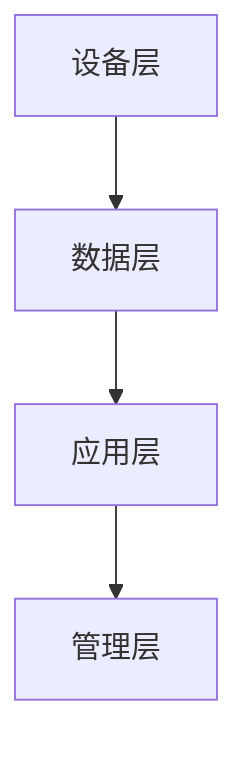
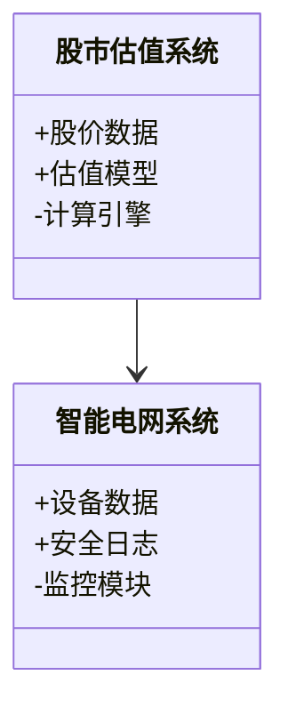

                 


# 新兴市场股市估值与智能电网网络安全标准的互动

---

## 关键词：新兴市场，股市估值，智能电网，网络安全，标准，互动

---

## 摘要

新兴市场的股市估值与智能电网网络安全标准之间的互动关系日益重要。随着智能电网的普及，网络安全成为关键问题，而股市估值的波动也可能影响智能电网的安全策略和投资。本文从背景介绍入手，分析智能电网网络安全标准的核心原理，构建股市估值的数学模型，探讨两者互动机制，并通过项目实战案例，总结最佳实践。

---

## 第一部分：背景介绍

### 第1章：新兴市场股市估值与智能电网网络安全的背景

#### 1.1 核心概念与问题背景

**1.1.1 新兴市场股市估值的定义与重要性**

股市估值是衡量企业价值的关键指标，通常通过市盈率（P/E）和市净率（P/B）等指标计算。在新兴市场，股市波动较大，投资者更关注这些指标的变化。

**1.1.2 智能电网网络安全的定义与关键特性**

智能电网利用数字技术优化电力输送和管理，其网络安全涉及数据加密和访问控制，防止黑客攻击。

**1.1.3 问题背景：新兴市场股市与智能电网的互动关系**

新兴市场中，股市波动可能影响智能电网的投资和建设，而智能电网的安全问题又可能反过来影响股市估值。

---

## 第二部分：智能电网网络安全标准的核心原理

### 第2章：智能电网网络安全标准的原理与实现

#### 2.1 核心原理

**2.1.1 智能电网网络安全的层次结构**

智能电网的网络安全分为设备层、数据层和应用层，每一层都有不同的安全策略。



**2.1.2 数据加密与身份认证机制**

使用AES加密和OAuth2认证，确保数据传输安全和用户身份验证。

**2.1.3 网络安全威胁的分类与应对策略**

网络安全威胁包括DDoS攻击、中间人攻击和钓鱼攻击，应对策略包括防火墙和入侵检测系统。

#### 2.2 标准化体系

**2.2.1 国际与国内智能电网安全标准对比**

国际标准如IEC 62443与国家标准如中国的GB/T 36621-2018在安全要求上有所不同。

---

## 第三部分：股市估值的数学模型与算法

### 第3章：股市估值的数学模型与算法原理

#### 3.1 股市估值的核心算法

**3.1.1 市盈率与市净率的计算公式**

市盈率（P/E）= 股价 / 每股收益  
市净率（P/B）= 股价 / 每股净资产

**3.1.2 时间序列分析的数学模型**

使用ARIMA模型预测股价，公式如下：

$$ ARIMA(p, d, q) $$

---

## 第四部分：智能电网与股市估值的互动机制

### 第4章：智能电网与股市估值的互动系统设计

#### 4.1 互动机制的系统分析

**4.1.1 问题场景的描述**

股市波动可能导致智能电网投资减少，而网络安全事件可能引发股市估值下降。

**4.1.2 系统功能需求**

系统需实时监控股市数据和网络安全状态，提供预警和分析报告。

#### 4.2 系统架构设计

**4.2.1 领域模型的Mermaid类图**



---

## 第五部分：项目实战与案例分析

### 第5章：项目实战与案例分析

#### 5.1 环境安装与配置

**5.1.1 开发环境的搭建**

使用Python和Jupyter Notebook，安装pandas和numpy库。

#### 5.2 核心代码实现

**5.2.1 智能电网安全标准的代码实现**

```python
import pandas as pd

# 示例数据
data = {'设备': ['设备1', '设备2'], '状态': ['正常', '异常']}
df = pd.DataFrame(data)
```

**5.2.2 股市估值算法的代码实现**

```python
from statsmodels.tsa.arima.model import ARIMA

# 示例数据
y = [100, 105, 110, 115, 120]

model = ARIMA(y, order=(1, 1, 1))
model_fit = model.fit()

print(model_fit.forecast(steps=5))
```

---

## 总结

新兴市场股市估值与智能电网网络安全标准的互动关系复杂，但通过系统的分析和实战案例，可以更好地理解其相互影响。未来，随着技术的发展，这种互动将更加紧密，需要持续关注和研究。

