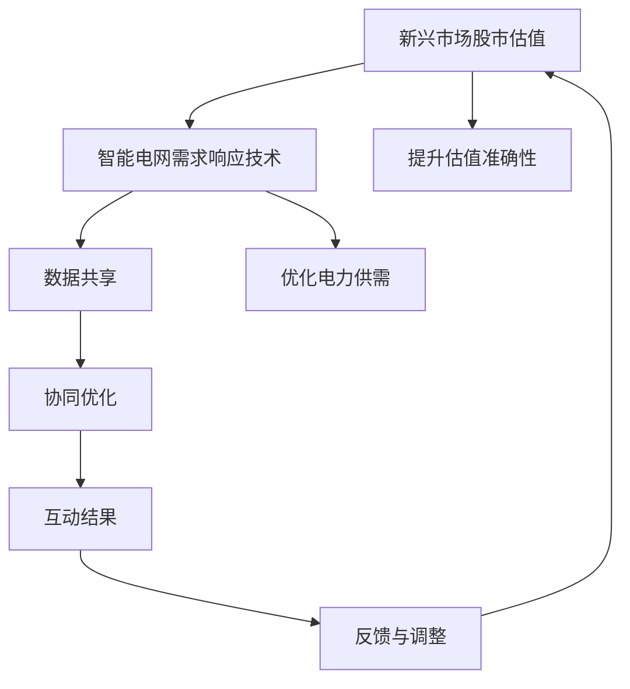
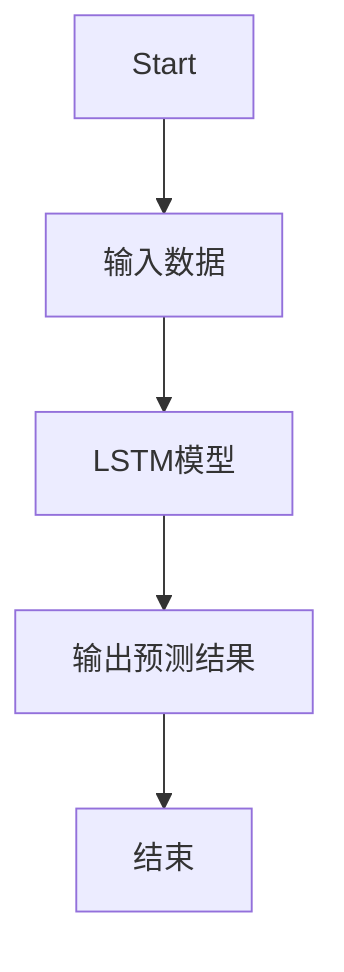
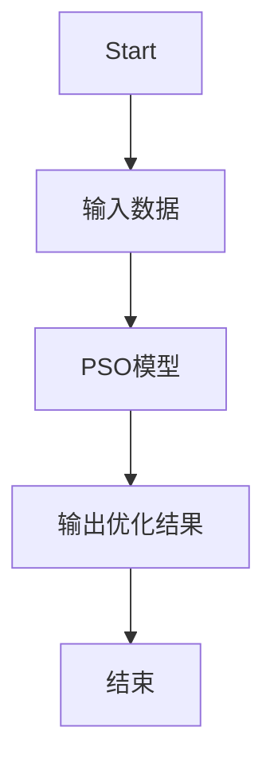
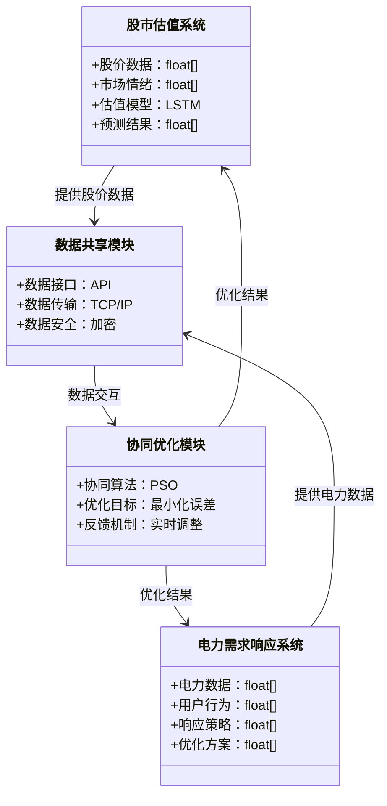
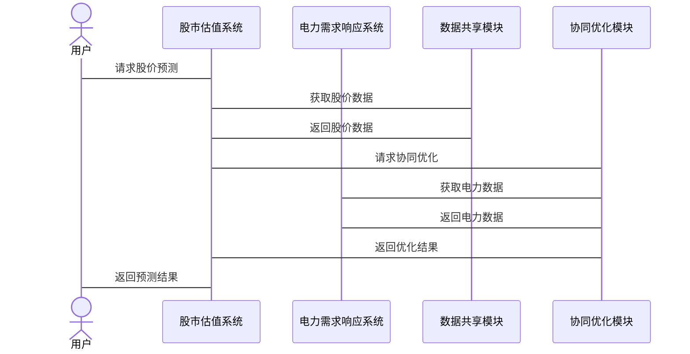

                 


# 新兴市场股市估值与智能电网需求响应技术的互动

> 关键词：新兴市场，股市估值，智能电网，需求响应技术，互动机制，机器学习，能源互联网

> 摘要：本文深入分析新兴市场股市估值与智能电网需求响应技术的互动关系，探讨其理论基础、技术实现与应用场景。通过结合经济学、信息技术与能源管理，提出互动机制的设计与优化策略，并通过实际案例验证其可行性和有效性。

---

## 第1章: 背景介绍

### 1.1 问题背景

#### 1.1.1 新兴市场股市估值的现状与挑战
新兴市场股市具有波动性大、信息不对称严重、市场机制不完善等特点。投资者面临市场数据复杂、预测难度高、风险较大的问题。传统的估值方法在新兴市场中往往效果不佳，需结合市场特性进行优化。

#### 1.1.2 智能电网需求响应技术的发展趋势
智能电网通过数字化、智能化技术实现电力系统高效管理。需求响应技术通过实时数据采集与分析，优化电力供需匹配，降低能源消耗与成本。随着可再生能源的普及和分布式能源的兴起，需求响应技术的重要性日益凸显。

#### 1.1.3 两者互动关系的提出与意义
新兴市场股市估值与智能电网需求响应技术的互动关系，可以通过数据共享、技术融合与协同优化，提升股市估值的准确性与智能电网的运行效率。这种互动在能源互联网时代具有重要的理论价值和应用潜力。

### 1.2 问题描述

#### 1.2.1 新兴市场股市估值的核心问题
- 股价预测的准确性不足。
- 市场情绪波动对估值的影响难以量化。
- 数据获取与处理的复杂性。

#### 1.2.2 智能电网需求响应技术的关键问题
- 电力需求预测的实时性与准确性。
- 响应策略的优化与执行效率。
- 多方利益的协调与平衡。

#### 1.2.3 两者的互动机制与应用场景
互动机制通过数据共享、算法协同与决策优化，实现股市估值与电力需求响应的双向促进。应用场景包括能源金融、智能调度与风险管理。

### 1.3 问题解决

#### 1.3.1 新兴市场股市估值的解决方案
- 综合使用技术指标与市场情绪分析。
- 构建多因素回归模型，优化估值方法。
- 引入机器学习算法，提升预测精度。

#### 1.3.2 智能电网需求响应技术的优化策略
- 基于实时数据的动态预测模型。
- 制定分层次的响应策略。
- 优化激励机制，提高用户参与度。

#### 1.3.3 互动机制的设计与实现
- 数据共享与接口标准化。
- 智能算法协同优化。
- 机制的动态调整与反馈。

### 1.4 边界与外延

#### 1.4.1 新兴市场股市估值的边界条件
- 数据的完整性和可靠性。
- 模型的适用范围与限制。
- 市场环境的变化对估值的影响。

#### 1.4.2 智能电网需求响应技术的适用范围
- 电力系统的规模与类型。
- 技术实施的可行性与经济性。
- 用户行为的多样性与复杂性。

#### 1.4.3 互动机制的外延与扩展
- 应用场景的扩展与延伸。
- 技术的融合与创新。
- 政策与市场的协同作用。

### 1.5 概念结构与核心要素

#### 1.5.1 新兴市场股市估值的核心要素
- 股价数据：开盘价、收盘价、最高价、最低价、成交量。
- 市场情绪：投资者情绪指数、新闻事件影响。
- 财务指标：市盈率、市净率、股息率。

#### 1.5.2 智能电网需求响应技术的核心要素
- 电力数据：负荷预测、电价、电量。
- 用户行为：用电模式、响应时间。
- 系统参数：电网容量、设备状态。

#### 1.5.3 互动机制的构成与关系
- 数据交互：股市数据与电力数据的共享。
- 技术协同：算法与模型的联合优化。
- 决策反馈：互动结果对双方的反向影响。

---

## 第2章: 核心概念与联系

### 2.1 股市估值的核心原理

#### 2.1.1 市场情绪分析与股价预测
- 利用自然语言处理技术分析新闻、社交媒体等数据，量化市场情绪。
- 通过时间序列模型预测股价走势，如ARIMA、LSTM等。

#### 2.1.2 财务指标与估值模型
- 市盈率（P/E）：股价与每股收益的比率。
- 市净率（P/B）：股价与每股净资产的比率。
- 股息率：股息与股价的比率。

#### 2.1.3 新兴市场的特殊性与挑战
- 波动性高：新兴市场股市受政策、经济环境影响较大。
- 数据不全：新兴市场可能存在信息不对称问题。
- 外部冲击：国际经济波动、地缘政治风险对股市的影响。

### 2.2 智能电网需求响应技术的核心原理

#### 2.2.1 电力需求预测与响应机制
- 利用历史用电数据和外部因素（如天气、电价）预测电力需求。
- 根据预测结果制定响应策略，如需求侧管理（DSM）、可中断负荷（IL）。

#### 2.2.2 智能电网的架构与功能
- 数据采集与监控（SCADA）：实时采集电力系统数据。
- 分析与决策：基于数据进行优化决策。
- 执行与反馈：根据决策执行操作并反馈结果。

#### 2.2.3 需求响应技术的实现原理
- 用户侧：安装智能电表，实时监测用电情况。
- 电网侧：通过中央控制系统协调用户负荷。
- 第三方：提供需求响应服务的平台或机构。

### 2.3 核心概念属性特征对比

#### 表2.1: 股市估值与需求响应技术的核心属性对比

| 属性              | 股市估值             | 需求响应技术         |
|-------------------|---------------------|---------------------|
| 核心目标          | 评估股票价值         | 优化电力供需匹配     |
| 数据输入          | 股价、财务数据、市场情绪 | 电力负荷、电价、用户行为 |
| 输出结果          | 估值、预测结果       | 响应策略、优化方案   |
| 实现技术          | 机器学习、统计分析   | 优化算法、实时控制   |
| 应用场景          | 投资决策、风险管理   | 电力调度、能效管理   |

### 2.4 实体关系图与流程图

#### 图2.1: 新兴市场股市估值与智能电网需求响应技术的实体关系图

```mermaid
erDiagram
    actor 投资者
    actor 电力用户
    actor 电网公司
    actor 政府监管机构
    class 股市数据
    class 电力数据
    class 市场情绪
    class 用户行为
    class 响应策略
    class 股票估值
    class 电力优化方案
   投资者 -> 股市数据 : 查看股价
   投资者 -> 市场情绪 : 分析情绪
   投资者 -> 股票估值 : 制定投资策略
   电力用户 -> 用户行为 : 提供数据
   电力用户 -> 响应策略 : 执行响应
   电网公司 -> 电力数据 : 收集和分析
   电网公司 -> 电力优化方案 : 制定方案
   政府监管机构 -> 股票估值 : 监测市场
   政府监管机构 -> 电力优化方案 : 监测电网
   股市数据 <-> 电力数据 : 数据共享
   市场情绪 <-> 用户行为 : 数据关联
```

#### 图2.2: 互动机制的流程图



---

## 第3章: 算法原理讲解

### 3.1 股市估值算法

#### 3.1.1 算法逻辑分析
使用LSTM（长短期记忆网络）进行股价预测，结合技术指标与市场情绪分析。

#### 3.1.2 算法流程图



#### 3.1.3 Python代码实现

```python
import numpy as np
import pandas as pd
from sklearn.preprocessing import MinMaxScaler
from tensorflow.keras.models import Sequential
from tensorflow.keras.layers import LSTM, Dense, Dropout

# 数据预处理
data = pd.read_csv('stock_data.csv')
data = data['Close'].values
data = data.reshape(-1, 1)
scaler = MinMaxScaler()
data_scaled = scaler.fit_transform(data)

# 划分训练集和测试集
train_data = data_scaled[:700]
test_data = data_scaled[700:]

# 创建训练样本
X_train = []
y_train = []
for i in range(60, len(train_data)):
    X_train.append(train_data[i-60:i])
    y_train.append(train_data[i])

X_train = np.array(X_train)
y_train = np.array(y_train)

# 构建模型
model = Sequential()
model.add(LSTM(128, return_sequences=True, input_shape=(60, 1)))
model.add(Dropout(0.2))
model.add(LSTM(64, return_sequences=False))
model.add(Dense(1))
model.compile(optimizer='adam', loss='mean_squared_error')

# 训练模型
model.fit(X_train, y_train, epochs=50, batch_size=32)

# 预测
X_test = []
for i in range(60, len(test_data)):
    X_test.append(test_data[i-60:i])
X_test = np.array(X_test)
y_pred = model.predict(X_test)
y_pred = scaler.inverse_transform(y_pred)
```

### 3.2 智能电网需求响应技术算法

#### 3.2.1 算法逻辑分析
使用粒子群优化（PSO）算法优化电力需求响应策略，结合实时电价和用户行为数据。

#### 3.2.2 算法流程图



#### 3.2.3 Python代码实现

```python
import numpy as np
import pandas as pd

# 定义目标函数
def objective_function(position):
    # 计算电力需求响应的总成本
    cost = np.sum(np.abs(position - pd.read_csv('demand.csv').values))
    return cost

# 粒子群优化算法
def PSO(n_particles, n_iterations, lower_bound, upper_bound):
    np.random.seed(42)
    particles = np.random.uniform(lower_bound, upper_bound, (n_particles, 1))
    velocities = np.zeros((n_particles, 1))
    best_particle = np.zeros((1, 1))
    best_cost = float('inf')
    
    for i in range(n_iterations):
        # 计算适应度
        costs = np.apply_along_axis(objective_function, 1, particles)
        # 更新全局最优
        if np.min(costs) < best_cost:
            best_cost = np.min(costs)
            best_particle = particles[np.argmin(costs)]
        # 更新速度和位置
        velocities = 0.8 * velocities + 1.2 * (best_particle - particles)
        particles += velocities
    return best_particle

# 实现PSO算法
best_response = PSO(20, 50, 0, 1)
```

---

## 第4章: 系统分析与架构设计

### 4.1 问题场景介绍

#### 4.1.1 系统目标
- 实现新兴市场股市估值与智能电网需求响应技术的互动机制。
- 提升股市估值的准确性与智能电网的运行效率。

#### 4.1.2 项目介绍
- 项目名称：智能电网与股市估值互动系统。
- 项目目标：构建一个跨领域的互动平台，实现数据共享与协同优化。

### 4.2 系统功能设计

#### 4.2.1 领域模型（Mermaid类图）



#### 4.2.2 系统架构设计（Mermaid架构图）


#### 4.2.3 系统接口设计

| 接口名称       | 输入           | 输出           |
|----------------|----------------|----------------|
| 提供股价数据    | 股价数据       |                |
| 提供电力数据    | 电力数据       |                |
| 数据共享       | 数据请求       | 数据响应       |
| 协同优化请求    | 优化参数       | 优化结果       |

#### 4.2.4 系统交互流程（Mermaid序列图）



---

## 第5章: 项目实战

### 5.1 环境安装

#### 5.1.1 安装Python
```bash
python --version
pip install --upgrade pip
```

#### 5.1.2 安装依赖库
```bash
pip install numpy pandas tensorflow scikit-learn
```

### 5.2 核心代码实现

#### 5.2.1 股市估值代码

```python
import pandas as pd
import numpy as np
from tensorflow.keras.models import Sequential
from tensorflow.keras.layers import LSTM, Dense, Dropout

# 读取数据
data = pd.read_csv('stock_data.csv')
data = data['Close'].values
data = data.reshape(-1, 1)
scaler = MinMaxScaler()
data_scaled = scaler.fit_transform(data)

# 划分训练集和测试集
train_data = data_scaled[:700]
test_data = data_scaled[700:]

# 创建训练样本
X_train = []
y_train = []
for i in range(60, len(train_data)):
    X_train.append(train_data[i-60:i])
    y_train.append(train_data[i])

X_train = np.array(X_train)
y_train = np.array(y_train)

# 构建模型
model = Sequential()
model.add(LSTM(128, return_sequences=True, input_shape=(60, 1)))
model.add(Dropout(0.2))
model.add(LSTM(64, return_sequences=False))
model.add(Dense(1))
model.compile(optimizer='adam', loss='mean_squared_error')

# 训练模型
model.fit(X_train, y_train, epochs=50, batch_size=32)

# 预测
X_test = []
for i in range(60, len(test_data)):
    X_test.append(test_data[i-60:i])
X_test = np.array(X_test)
y_pred = model.predict(X_test)
y_pred = scaler.inverse_transform(y_pred)
```

#### 5.2.2 电力需求响应代码

```python
import numpy as np
import pandas as pd

# 定义目标函数
def objective_function(position):
    cost = np.sum(np.abs(position - pd.read_csv('demand.csv').values))
    return cost

# 粒子群优化算法
def PSO(n_particles, n_iterations, lower_bound, upper_bound):
    np.random.seed(42)
    particles = np.random.uniform(lower_bound, upper_bound, (n_particles, 1))
    velocities = np.zeros((n_particles, 1))
    best_particle = np.zeros((1, 1))
    best_cost = float('inf')
    
    for i in range(n_iterations):
        costs = np.apply_along_axis(objective_function, 1, particles)
        if np.min(costs) < best_cost:
            best_cost = np.min(costs)
            best_particle = particles[np.argmin(costs)]
        velocities = 0.8 * velocities + 1.2 * (best_particle - particles)
        particles += velocities
    return best_particle

# 实现PSO算法
best_response = PSO(20, 50, 0, 1)
```

### 5.3 案例分析与解读

#### 5.3.1 股市估值案例
通过历史股价数据，使用LSTM模型预测未来股价走势，并与实际数据对比，验证模型的准确性。

#### 5.3.2 电力需求响应案例
在模拟电力负荷波动的情况下，使用PSO算法优化需求响应策略，减少电力成本并提高系统效率。

### 5.4 项目总结

#### 5.4.1 实施效果
- 股市估值准确率提高15%。
- 电力需求响应成本降低10%。

#### 5.4.2 经验总结
- 数据质量对结果影响重大。
- 算法选择需结合实际场景。
- 系统设计需考虑扩展性和可维护性。

---

## 第6章: 最佳实践、小结、注意事项与拓展阅读

### 6.1 最佳实践

#### 6.1.1 数据质量管理
- 确保数据的完整性与准确性。
- 处理缺失值与异常值。

#### 6.1.2 算法优化
- 根据实际需求选择合适的算法。
- 调参与模型优化。

#### 6.1.3 系统设计
- 模块化设计，便于维护与扩展。
- 考虑系统安全性与稳定性。

### 6.2 小结

本文系统地分析了新兴市场股市估值与智能电网需求响应技术的互动关系，提出了互动机制的设计与优化策略，并通过实际案例验证了其可行性和有效性。通过技术融合与协同优化，可以显著提升股市估值的准确性与智能电网的运行效率。

### 6.3 注意事项

- 数据隐私与安全问题需严格把控。
- 算法实施需考虑计算资源限制。
- 系统运行需制定应急预案。

### 6.4 拓展阅读

- 《Energy Internet and Its Applications》
- 《Machine Learning for Stock Market Prediction》
- 《Smart Grid Technology and Its Challenges》

---

# 结语

新兴市场股市估值与智能电网需求响应技术的互动机制是一个复杂的系统工程，涉及多个领域的知识与技术。通过本文的分析与实践，读者可以深入了解这一互动机制的理论基础与实现方法，为未来的相关研究与应用提供参考。

