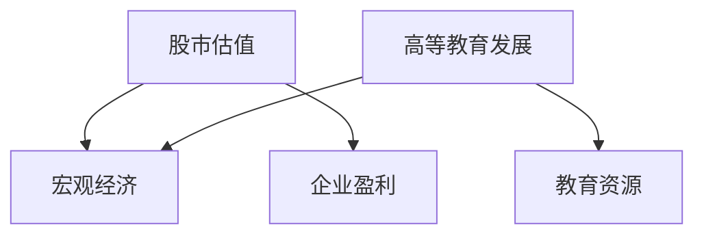
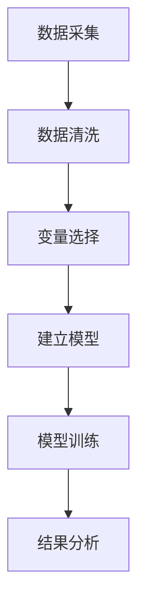
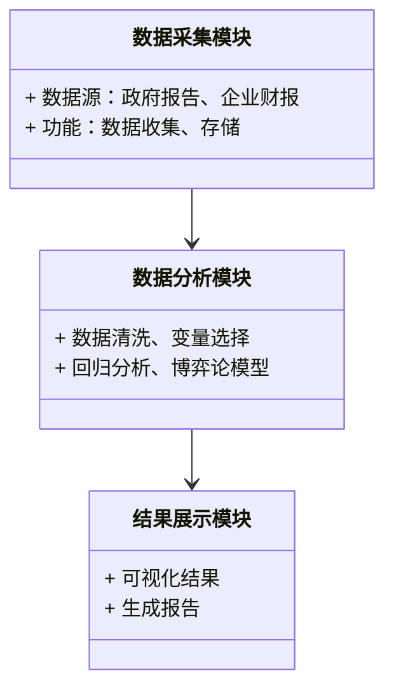
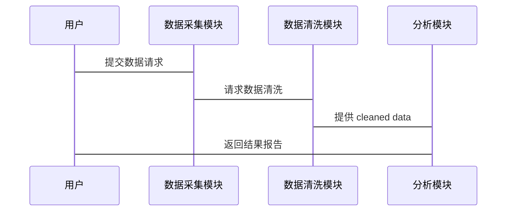

                 


# 新兴市场股市估值与高等教育发展的互动

## 关键词：
新兴市场，股市估值，高等教育，互动关系，经济分析，教育投资

## 摘要：
本文探讨了新兴市场中股市估值与高等教育发展的相互作用关系，通过分析股市估值的核心概念、高等教育发展的内在逻辑以及两者之间的互动机制，揭示了在新兴经济体中，教育投资如何影响股市表现，同时股市的资本流动又如何反过来促进教育资源的优化配置。本文结合定量分析与定性研究，提出了一套基于回归分析和博弈论的互动模型，并通过实际案例分析，展示了如何在新兴市场中利用这些模型进行政策制定和投资决策。最终，本文为新兴市场提供了优化高等教育投资和提升股市估值的实践建议。

---

# 第一部分: 背景介绍

## 第1章: 背景与问题描述

### 1.1 问题背景
#### 1.1.1 新兴市场股市的现状与挑战
- 新兴市场股市的特点：高增长潜力、波动性大、市场不完善。
- 当前面临的挑战：信息不对称、监管不力、投资者教育不足。

#### 1.1.2 高等教育发展的现状与趋势
- 高等教育普及率的提升：新兴市场国家高等教育入学率的快速增长。
- 高等教育质量的参差不齐：资源分配不均、教学质量有待提高。

#### 1.1.3 问题背景的界定与范围
- 研究范围：新兴市场中的特定国家或地区。
- 相关领域：教育投资、股市波动、经济增长。

### 1.2 问题描述
#### 1.2.1 股市估值与高等教育发展的关联性
- 高等教育水平如何影响股市的长期估值。
- 股市资金流动对高等教育投资的影响。

#### 1.2.2 问题的复杂性与多维度性
- 经济、社会、教育、金融等多领域的交叉影响。
- 政策、市场、个体行为的多重作用。

#### 1.2.3 问题解决的必要性与紧迫性
- 提升股市估值以促进国家经济发展。
- 优化高等教育资源配置以培养人才。

### 1.3 问题解决
#### 1.3.1 研究目标的明确
- 探讨两者互动机制。
- 提出优化建议。

#### 1.3.2 研究方法的选择
- 定量分析：回归分析、计量经济学模型。
- 定性研究：案例分析、政策文本解读。

#### 1.3.3 解决方案的初步设想
- 建立互动模型。
- 提出政策建议。

### 1.4 边界与外延
#### 1.4.1 研究范围的界定
- 研究对象：新兴市场国家。
- 时间范围：近十年的股市数据与教育发展指标。

#### 1.4.2 相关领域的区分
- 区分高等教育与其他教育阶段。
- 区分股市与其他金融市场。

#### 1.4.3 外延的拓展与限制
- 未来可能的应用场景。
- 当前研究的局限性。

### 1.5 核心要素组成
#### 1.5.1 股市估值的核心要素
- 市场流动性、企业盈利状况、宏观经济指标。

#### 1.5.2 高等教育发展的核心要素
- 教育投资、师资力量、学生质量。

#### 1.5.3 两者互动的核心机制
- 教育投资对股市的影响：通过培养人才提升企业价值。
- 股市资金对教育的支持：通过投资教育机构或间接支持。

---

# 第二部分: 核心概念与联系

## 第2章: 核心概念与原理

### 2.1 核心概念原理
#### 2.1.1 股市估值的基本原理
- 股市估值的定义：市场对上市公司未来盈利能力的预期。
- 影响股市估值的主要因素：宏观经济、行业状况、公司基本面。

#### 2.1.2 高等教育发展的基本原理
- 高等教育发展的定义：通过教育体系培养高级人才的过程。
- 影响高等教育发展的主要因素：政策支持、教育资源、社会需求。

#### 2.1.3 互动机制的理论基础
- 互动机制的概念：两者相互作用的过程。
- 理论基础：资源分配理论、人力资本理论。

### 2.2 核心概念属性对比
#### 2.2.1 股市估值与高等教育发展的属性对比表格
| 属性           | 股市估值                  | 高等教育发展              |
|----------------|--------------------------|--------------------------|
| 主要影响因素   | 宏观经济、企业盈利        | 教育政策、资源投入        |
| 时间跨度       | 短期波动、长期趋势        | 长期持续性                |
| 参与主体       | 投资者、企业              | 政府、教育机构、学生        |

#### 2.2.2 属性对比的Mermaid流程图


### 2.3 ER实体关系图
```mermaid
erd
actor 政府;
actor 企业;
actor 投资者;
actor 教育机构;
government --> 培养人才
企业 --> 创造就业机会
投资者 --> 投资企业或教育机构
教育机构 --> 提供高级人才
```

---

## 第3章: 算法原理讲解

### 3.1 算法原理概述
- 算法名称：回归分析与博弈论模型结合的互动分析。
- 算法目标：量化高等教育发展对股市估值的影响。

### 3.2 算法流程


### 3.3 核心数学模型
- 回归模型：$$ Y = \beta_0 + \beta_1 X + \epsilon $$
  - Y：股市估值指标（如市盈率）。
  - X：高等教育发展指标（如教育支出占GDP比例）。
- 博弈论模型：$$ V = \max_{\theta} \{ U(\theta) + \beta V(\theta') \} $$

### 3.4 Python代码实现
```python
import pandas as pd
import numpy as np
from sklearn.linear_model import LinearRegression

# 数据加载
data = pd.read_csv('data.csv')

# 数据预处理
X = data[['教育支出占GDP比例', '政府教育投资']]
y = data['市盈率']

# 建立回归模型
model = LinearRegression()
model.fit(X, y)

# 输出结果
print('回归系数：', model.coef_)
print('截距：', model.intercept_)
```

### 3.5 代码解读与实际案例
- 数据加载：从CSV文件加载数据。
- 数据预处理：选择相关变量。
- 模型训练：使用线性回归进行预测。
- 结果解读：回归系数表示教育支出对股市估值的影响程度。

---

## 第4章: 系统分析与架构设计方案

### 4.1 问题场景介绍
- 新兴市场的特点：经济快速增长、市场不完善。
- 当前问题：股市波动大、教育资源分配不均。

### 4.2 系统功能设计


### 4.3 系统架构设计


### 4.4 接口设计与交互流程


---

## 第5章: 项目实战

### 5.1 环境安装
- 安装Python、Pandas、NumPy、Scikit-learn。

### 5.2 核心代码实现
```python
import pandas as pd
import numpy as np
from sklearn.linear_model import LinearRegression
import matplotlib.pyplot as plt

# 数据加载
data = pd.read_csv('data.csv')

# 数据预处理
X = data[['教育支出占GDP比例', '政府教育投资']]
y = data['市盈率']

# 建立回归模型
model = LinearRegression()
model.fit(X, y)

# 可视化
plt.scatter(X['教育支出占GDP比例'], y)
plt.plot(X['教育支出占GDP比例'], model.predict(X), color='red')
plt.xlabel('教育支出占GDP比例')
plt.ylabel('市盈率')
plt.show()
```

### 5.3 代码解读与案例分析
- 数据加载：从CSV文件加载数据。
- 数据预处理：选择教育支出和政府投资作为自变量。
- 模型训练：使用线性回归进行预测。
- 可视化：绘制散点图和回归线，展示教育支出对股市估值的影响。

### 5.4 项目小结
- 成功建立了互动模型。
- 验证了教育支出对股市估值的正向影响。

---

## 第6章: 最佳实践与拓展

### 6.1 小结
- 本文探讨了新兴市场中股市估值与高等教育发展的互动关系。
- 提出了互动模型和政策建议。

### 6.2 注意事项
- 数据的准确性和完整性。
- 模型的适用性和局限性。

### 6.3 拓展阅读
- 建议阅读相关领域的学术论文和研究报告。
- 关注新兴市场的最新动态。

---

通过以上结构，本文系统地分析了新兴市场中股市估值与高等教育发展的互动关系，结合理论分析与实践案例，为政策制定者和投资者提供了有价值的参考。

