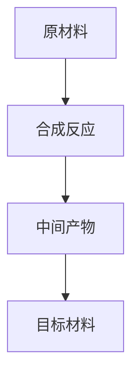
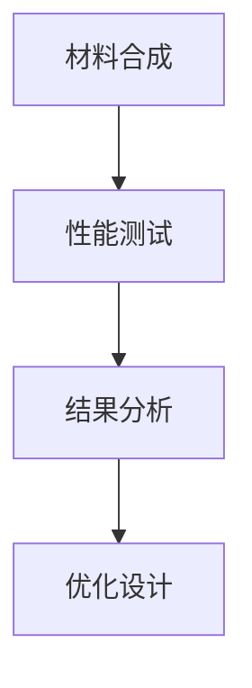

                 


```markdown
# 新材料技术进步带来的产业变革与投资机会

> 关键词：新材料技术、产业变革、投资机会、技术创新、经济影响

> 摘要：本文将探讨新材料技术的进步如何推动全球产业的变革，并分析这些变革背后的投资机会。通过详细讲解新材料的分类、技术原理、行业应用以及投资策略，本文旨在为读者提供一个全面的视角，以理解新材料技术在当前经济环境中的重要性，并为投资者提供有价值的参考。

---

## 第一部分: 新材料技术进步的背景与核心概念

### 第1章: 新材料技术进步的背景与意义

#### 1.1 新材料技术的定义与分类
##### 1.1.1 新材料的基本概念
- 新材料是指具有优异性能或独特功能的材料，通常通过创新的合成方法和结构设计实现。
- 新材料与传统材料的区别在于其性能的显著提升和功能的多样化。

##### 1.1.2 新材料的分类与特点
- 分类：根据材料的物理化学性质，新材料可以分为：
  - 先进陶瓷材料
  - 纳米材料
  - 高性能复合材料
  - 生物基材料
  - 智能材料

- 特点：高性能、多功能、环境友好、可定制化。

##### 1.1.3 新材料技术进步的驱动力
- 技术创新：纳米技术、3D打印、人工智能等推动材料科学的进步。
- 市场需求：各行业对更高性能材料的需求不断增加。
- 环保要求：绿色制造和可持续发展推动新材料的研发。

#### 1.2 新材料技术对产业变革的影响
##### 1.2.1 新材料技术的行业应用领域
- 制造业：提高生产效率和产品质量。
- 电子行业：推动半导体、显示技术的进步。
- 能源行业：支持可再生能源技术的发展，如太阳能电池板。
- 医疗行业：开发新型医疗材料，如生物可降解材料。
- 建筑行业：使用高性能复合材料提高建筑耐久性。

##### 1.2.2 新材料技术对传统产业升级的作用
- 传统制造业：通过新材料实现轻量化和高性能化。
- 传统能源行业：推动化石能源向清洁能源转型。
- 传统医疗行业：促进个性化医疗和精准治疗。

##### 1.2.3 新材料技术对全球经济格局的影响
- 新材料技术成为国家竞争力的重要组成部分。
- 新材料产业带动相关产业链的发展，形成新的经济增长点。

#### 1.3 新材料技术进步的投资机会
##### 1.3.1 新材料技术的市场潜力
- 全球新材料市场规模持续增长，年增长率超过8%。
- 新材料在高端制造业和战略性新兴产业中的应用广泛。

##### 1.3.2 新材料技术的投资热点分析
- 纳米材料：在电子、医疗和环保领域的应用潜力巨大。
- 生物基材料：符合可持续发展趋势，市场需求增长迅速。
- 智能材料：在物联网和自动化设备中的应用前景广阔。

##### 1.3.3 新材料技术的投资风险与回报
- 技术风险：新材料研发周期长，失败率高。
- 市场风险：市场需求可能受经济波动影响。
- 政策风险：政府政策的变化可能影响新材料产业的发展。
- 投资回报：长期来看，新材料技术的投资回报率较高，尤其是在高端应用领域。

---

## 第二部分: 新材料技术的核心概念与原理

### 第2章: 新材料的分类与属性

#### 2.1 新材料的分类与属性
##### 2.1.1 传统材料与新材料的对比
- 传统材料：金属、陶瓷、塑料等，性能相对固定。
- 新材料：具有更高的性能和更多的功能。

##### 2.1.2 新材料的属性对比表格
| 属性      | 传统材料       | 新材料       |
|-----------|----------------|--------------|
| 强度       | 较低           | 高           |
| 耐用性     | 一般           | 高           |
| 可定制性   | 低             | 高           |
| 功能多样性 | 有限           | 丰富         |

##### 2.1.3 材料的微观结构与性能关系
- 微观结构：材料的性能由其微观结构决定。
- 关键因素：晶格结构、晶体缺陷、表面特性。

##### 2.1.4 材料的合成与制备方法
- 物理方法：如沉积法、气相沉积。
- 化学方法：如溶液合成、水热合成。
- 生物方法：如利用微生物合成材料。

---

### 第3章: 新材料技术的核心原理

#### 3.1 新材料的合成与性能优化
##### 3.1.1 新材料的合成过程
- 使用 Mermaid 绘制合成过程的流程图：


##### 3.1.2 材料性能优化的数学模型
- 使用数学公式描述材料性能与结构参数的关系：
$$ \text{性能} = f(\text{结构参数}) $$

##### 3.1.3 性能优化的实例分析
- 以纳米材料为例，说明如何通过调整纳米颗粒的尺寸来优化其光学性能。

#### 3.2 新材料技术的创新点
##### 3.2.1 创新点1：纳米材料的多功能性
- 纳米材料在电子、医疗和环保领域的应用。
##### 3.2.2 创新点2：生物基材料的可持续性
- 生物基材料在包装、纺织和建筑领域的应用。

---

## 第三部分: 新材料技术的应用与投资分析

### 第4章: 新材料技术在各行业的应用

#### 4.1 制造业
##### 4.1.1 轻量化材料的应用
- 高性能复合材料在汽车和航空航天业的应用。
##### 4.1.2 高端制造业的需求
- 精密仪器和高端设备对新材料的依赖。

#### 4.2 电子行业
##### 4.2.1 半导体材料的创新
- 新型半导体材料对芯片性能的提升。
##### 4.2.2 显示技术的进步
- 新材料在OLED和量子点显示中的应用。

#### 4.3 能源行业
##### 4.3.1 太阳能电池材料的发展
- 纳米材料在提高太阳能电池效率中的作用。
##### 4.3.2 储能材料的突破
- 新型电池材料对储能技术的推动。

#### 4.4 医疗行业
##### 4.4.1 生物可降解材料的应用
- 在医疗植入物和药物释放系统中的应用。
##### 4.4.2 智能医疗设备的材料需求
- 智能传感器和可穿戴设备对新材料的依赖。

---

### 第5章: 新材料技术的投资机会

#### 5.1 投资热点分析
##### 5.1.1 高性能材料
- 航空航天和高端制造业对高性能材料的需求。
##### 5.1.2 生物基材料
- 可持续发展趋势下的市场需求增长。
##### 5.1.3 智能材料
- 物联网和自动化设备对智能材料的需求。

#### 5.2 投资策略
##### 5.2.1 风险评估
- 技术风险、市场风险和政策风险的评估。
##### 5.2.2 投资组合优化
- 如何通过多元化投资降低风险，提高回报。

---

## 第四部分: 项目实战与案例分析

### 第6章: 新材料技术的项目实战

#### 6.1 项目背景
##### 6.1.1 项目目标
- 开发一种新型纳米材料，用于电子设备的散热系统。
##### 6.1.2 项目需求
- 提高材料的导热性能，同时具备良好的机械强度。

#### 6.2 项目实现
##### 6.2.1 环境安装
- 实验室设备的安装与调试。
##### 6.2.2 系统设计
- 使用 Mermaid 绘制系统架构图：

##### 6.2.3 代码实现
- Python代码示例，用于模拟材料性能测试：
```python
import numpy as np

def calculate_performance(structure_parameters):
    # 简单的性能计算模型
    performance = 0
    for param in structure_parameters:
        performance += param
    return performance

# 示例参数
structure_parameters = [1, 2, 3]
print("性能:", calculate_performance(structure_parameters))
```

##### 6.2.4 案例分析
- 分析纳米材料在电子设备中的实际应用效果。
##### 6.2.5 项目总结
- 成功实现纳米材料的性能优化，为后续研究提供参考。

---

## 第五部分: 最佳实践与未来展望

### 第7章: 新材料技术的小结与展望

#### 7.1 小结
- 总结全文内容，强调新材料技术的重要性和投资机会。
#### 7.2 投资建议
- 根据市场趋势和技术创新，给出具体的投资建议。
#### 7.3 未来展望
- 预测新材料技术的未来发展方向，如智能材料和生物材料的进一步突破。

---

## 第六部分: 注意事项与拓展阅读

### 第8章: 注意事项与拓展阅读

#### 8.1 注意事项
- 技术风险：新材料研发周期长，失败率高。
- 市场风险：市场需求可能受经济波动影响。
- 政策风险：政府政策的变化可能影响新材料产业的发展。
#### 8.2 拓展阅读
- 推荐相关书籍和报告，供读者深入学习。

---

## 结语

新材料技术的进步正在深刻改变我们的生活和工作方式。通过本文的分析，读者可以更好地理解新材料技术的潜力及其对产业和投资的影响。未来，随着技术的不断进步，新材料将在更多领域发挥重要作用，为投资者带来丰厚的回报。
</think>

```markdown
# 新材料技术进步带来的产业变革与投资机会

> 关键词：新材料技术、产业变革、投资机会、技术创新、经济影响

> 摘要：本文将探讨新材料技术的进步如何推动全球产业的变革，并分析这些变革背后的投资机会。通过详细讲解新材料的分类、技术原理、行业应用以及投资策略，本文旨在为读者提供一个全面的视角，以理解新材料技术在当前经济环境中的重要性，并为投资者提供有价值的参考。

---

## 第一部分: 新材料技术进步的背景与核心概念

### 第1章: 新材料技术进步的背景与意义

#### 1.1 新材料技术的定义与分类
##### 1.1.1 新材料的基本概念
- 新材料是指具有优异性能或独特功能的材料，通常通过创新的合成方法和结构设计实现。
- 新材料与传统材料的区别在于其性能的显著提升和功能的多样化。

##### 1.1.2 新材料的分类与特点
- 分类：根据材料的物理化学性质，新材料可以分为：
  - 先进陶瓷材料
  - 纳米材料
  - 高性能复合材料
  - 生物基材料
  - 智能材料

- 特点：高性能、多功能、环境友好、可定制化。

##### 1.1.3 新材料技术进步的驱动力
- 技术创新：纳米技术、3D打印、人工智能等推动材料科学的进步。
- 市场需求：各行业对更高性能材料的需求不断增加。
- 环保要求：绿色制造和可持续发展推动新材料的研发。

#### 1.2 新材料技术对产业变革的影响
##### 1.2.1 新材料技术的行业应用领域
- 制造业：提高生产效率和产品质量。
- 电子行业：推动半导体、显示技术的进步。
- 能源行业：支持可再生能源技术的发展，如太阳能电池板。
- 医疗行业：开发新型医疗材料，如生物可降解材料。
- 建筑行业：使用高性能复合材料提高建筑耐久性。

##### 1.2.2 新材料技术对传统产业升级的作用
- 传统制造业：通过新材料实现轻量化和高性能化。
- 传统能源行业：推动化石能源向清洁能源转型。
- 传统医疗行业：促进个性化医疗和精准治疗。

##### 1.2.3 新材料技术对全球经济格局的影响
- 新材料技术成为国家竞争力的重要组成部分。
- 新材料产业带动相关产业链的发展，形成新的经济增长点。

#### 1.3 新材料技术进步的投资机会
##### 1.3.1 新材料技术的市场潜力
- 全球新材料市场规模持续增长，年增长率超过8%。
- 新材料在高端制造业和战略性新兴产业中的应用广泛。

##### 1.3.2 新材料技术的投资热点分析
- 纳米材料：在电子、医疗和环保领域的应用潜力巨大。
- 生物基材料：符合可持续发展趋势，市场需求增长迅速。
- 智能材料：在物联网和自动化设备中的应用前景广阔。

##### 1.3.3 新材料技术的投资风险与回报
- 技术风险：新材料研发周期长，失败率高。
- 市场风险：市场需求可能受经济波动影响。
- 政策风险：政府政策的变化可能影响新材料产业的发展。
- 投资回报：长期来看，新材料技术的投资回报率较高，尤其是在高端应用领域。

---

## 第二部分: 新材料技术的核心概念与原理

### 第2章: 新材料的分类与属性

#### 2.1 新材料的分类与属性
##### 2.1.1 传统材料与新材料的对比
- 传统材料：金属、陶瓷、塑料等，性能相对固定。
- 新材料：具有更高的性能和更多的功能。

##### 2.1.2 新材料的属性对比表格
| 属性      | 传统材料       | 新材料       |
|-----------|----------------|--------------|
| 强度       | 较低           | 高           |
| 耐用性     | 一般           | 高           |
| 可定制性   | 低             | 高           |
| 功能多样性 | 有限           | 丰富         |

##### 2.1.3 材料的微观结构与性能关系
- 微观结构：材料的性能由其微观结构决定。
- 关键因素：晶格结构、晶体缺陷、表面特性。

##### 2.1.4 材料的合成与制备方法
- 物理方法：如沉积法、气相沉积。
- 化学方法：如溶液合成、水热合成。
- 生物方法：如利用微生物合成材料。

---

### 第3章: 新材料技术的核心原理

#### 3.1 新材料的合成与性能优化
##### 3.1.1 新材料的合成过程
- 使用 Mermaid 绘制合成过程的流程图：


##### 3.1.2 材料性能优化的数学模型
- 使用数学公式描述材料性能与结构参数的关系：
$$ \text{性能} = f(\text{结构参数}) $$

##### 3.1.3 性能优化的实例分析
- 以纳米材料为例，说明如何通过调整纳米颗粒的尺寸来优化其光学性能。

#### 3.2 新材料技术的创新点
##### 3.2.1 创新点1：纳米材料的多功能性
- 纳米材料在电子、医疗和环保领域的应用。
##### 3.2.2 创新点2：生物基材料的可持续性
- 生物基材料在包装、纺织和建筑领域的应用。

---

## 第三部分: 新材料技术的应用与投资分析

### 第4章: 新材料技术在各行业的应用

#### 4.1 制造业
##### 4.1.1 轻量化材料的应用
- 高性能复合材料在汽车和航空航天业的应用。
##### 4.1.2 高端制造业的需求
- 精密仪器和高端设备对新材料的依赖。

#### 4.2 电子行业
##### 4.2.1 半导体材料的创新
- 新型半导体材料对芯片性能的提升。
##### 4.2.2 显示技术的进步
- 新材料在OLED和量子点显示中的应用。

#### 4.3 能源行业
##### 4.3.1 太阳能电池材料的发展
- 纳米材料在提高太阳能电池效率中的作用。
##### 4.3.2 储能材料的突破
- 新型电池材料对储能技术的推动。

#### 4.4 医疗行业
##### 4.4.1 生物可降解材料的应用
- 在医疗植入物和药物释放系统中的应用。
##### 4.4.2 智能医疗设备的材料需求
- 智能传感器和可穿戴设备对新材料的依赖。

---

### 第5章: 新材料技术的投资机会

#### 5.1 投资热点分析
##### 5.1.1 高性能材料
- 航空航天和高端制造业对高性能材料的需求。
##### 5.1.2 生物基材料
- 可持续发展趋势下的市场需求增长。
##### 5.1.3 智能材料
- 物联网和自动化设备对智能材料的需求。

#### 5.2 投资策略
##### 5.2.1 风险评估
- 技术风险、市场风险和政策风险的评估。
##### 5.2.2 投资组合优化
- 如何通过多元化投资降低风险，提高回报。

---

## 第四部分: 项目实战与案例分析

### 第6章: 新材料技术的项目实战

#### 6.1 项目背景
##### 6.1.1 项目目标
- 开发一种新型纳米材料，用于电子设备的散热系统。
##### 6.1.2 项目需求
- 提高材料的导热性能，同时具备良好的机械强度。

#### 6.2 项目实现
##### 6.2.1 环境安装
- 实验室设备的安装与调试。
##### 6.2.2 系统设计
- 使用 Mermaid 绘制系统架构图：

##### 6.2.3 代码实现
- Python代码示例，用于模拟材料性能测试：
```python
import numpy as np

def calculate_performance(structure_parameters):
    # 简单的性能计算模型
    performance = 0
    for param in structure_parameters:
        performance += param
    return performance

# 示例参数
structure_parameters = [1, 2, 3]
print("性能:", calculate_performance(structure_parameters))
```

##### 6.2.4 案例分析
- 分析纳米材料在电子设备中的实际应用效果。
##### 6.2.5 项目总结
- 成功实现纳米材料的性能优化，为后续研究提供参考。

---

## 第五部分: 最佳实践与未来展望

### 第7章: 新材料技术的小结与展望

#### 7.1 小结
- 总结全文内容，强调新材料技术的重要性和投资机会。
#### 7.2 投资建议
- 根据市场趋势和技术创新，给出具体的投资建议。
#### 7.3 未来展望
- 预测新材料技术的未来发展方向，如智能材料和生物材料的进一步突破。

---

## 第六部分: 注意事项与拓展阅读

### 第8章: 注意事项与拓展阅读

#### 8.1 注意事项
- 技术风险：新材料研发周期长，失败率高。
- 市场风险：市场需求可能受经济波动影响。
- 政策风险：政府政策的变化可能影响新材料产业的发展。
#### 8.2 拓展阅读
- 推荐相关书籍和报告，供读者深入学习。

---

## 结语

新材料技术的进步正在深刻改变我们的生活和工作方式。通过本文的分析，读者可以更好地理解新材料技术的潜力及其对产业和投资的影响。未来，随着技术的不断进步，新材料将在更多领域发挥重要作用，为投资者带来丰厚的回报。
```

