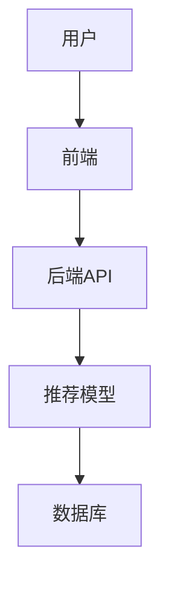

                 


```markdown
# 旅游AI Agent：智能行程规划与推荐

## 关键词
旅游AI Agent，智能行程规划，推荐系统，协同过滤，深度学习，系统架构

## 摘要
本文深入探讨旅游AI Agent在智能行程规划与推荐中的应用，分析其核心概念、算法原理和系统架构，结合实际案例展示其在项目中的应用，并总结最佳实践和未来发展方向。

---

## 第一部分：背景介绍

### 第1章：旅游AI Agent的背景与目标

#### 1.1 旅游行业的现状与挑战
- **问题背景**：旅游行业面临信息过载、用户需求多样化、行程规划复杂等问题。
- **问题描述**：传统行程规划方法难以满足用户的个性化需求，推荐系统存在准确性和实时性不足的问题。
- **问题解决**：引入AI技术，通过智能算法优化行程规划和推荐服务。

#### 1.2 AI技术在旅游领域的应用背景
- **AI技术的发展**：机器学习、自然语言处理等技术的进步为旅游AI应用提供了基础。
- **应用场景**：个性化推荐、智能客服、行程优化等领域。
- **旅游AI Agent的目标**：通过智能化手段提升用户体验，优化行程安排，实现精准推荐。

---

## 第二部分：核心概念与联系

### 第2章：旅游AI Agent的核心概念

#### 2.1 核心概念术语说明
- **用户需求分析**：通过分析用户的兴趣、偏好和行为，生成个性化的行程建议。
- **行程规划算法**：基于用户需求，利用算法生成最优行程安排。
- **推荐系统**：根据用户历史行为和偏好，推荐相关旅游产品和服务。

#### 2.2 核心概念的原理
- **用户需求分析**：通过数据挖掘和自然语言处理技术，提取用户的兴趣点。
- **行程规划算法**：利用图论算法和优化模型，生成最优行程。
- **推荐系统**：基于协同过滤、内容过滤或混合模型，推荐相关旅游产品。

#### 2.3 实体关系图
```mermaid
erDiagram
    user {
        用户ID
        用户偏好
        用户行为
    }
    景点 {
        景点ID
        景点属性
        景点评分
    }
    旅行社 {
        旅行社ID
        旅行社服务
        旅行社评分
    }
    推荐系统 {
        推荐算法
        推荐结果
        用户反馈
    }
    user --|> 景点 : 参观
    user --|> 旅行社 : 使用服务
    景点 --|> 推荐系统 : 提供数据
    旅行社 --|> 推荐系统 : 提供数据
    推荐系统 --|> user : 提供推荐
```

---

## 第三部分：算法原理

### 第3章：推荐算法的原理与实现

#### 3.1 协同过滤算法
- **原理**：基于用户相似性或物品相似性，推荐用户可能感兴趣的内容。
- **实现步骤**：
  1. 数据预处理：收集用户行为数据，构建用户-物品矩阵。
  2. 计算相似度：使用余弦相似度或皮尔逊相关系数。
  3. 生成推荐：基于相似度计算，预测用户评分并排序。
- **代码示例**：
```python
import numpy as np
from sklearn.metrics.pairwise import cosine_similarity

# 示例用户-物品矩阵
matrix = np.array([[4, 3, 0],
                   [2, 0, 3],
                   [1, 5, 2]])

# 计算相似度矩阵
similarity = cosine_similarity(matrix)
print(similarity)
```

#### 3.2 基于内容的推荐
- **原理**：分析物品的属性特征，生成相似的推荐。
- **实现步骤**：
  1. 物品特征提取：使用TF-IDF或词袋模型。
  2. 计算相似度：基于物品特征向量的相似度。
  3. 生成推荐：基于用户偏好，推荐相似物品。
- **数学公式**：
$$\text{相似度} = \frac{\sum_{i} w_i \cdot w'_i}{\sqrt{\sum w_i^2} \cdot \sqrt{\sum w'_i^2}}$$

---

## 第四部分：系统分析与架构设计

### 第4章：系统架构设计

#### 4.1 需求分析
- **用户需求**：个性化行程推荐、实时反馈、多平台支持。
- **系统功能**：用户注册、登录、行程规划、推荐服务、反馈收集。
- **边界条件**：数据隐私保护、系统性能优化、异常处理。

#### 4.2 系统架构设计
- **前端架构**：Web界面和移动App，支持用户交互。
- **后端架构**：API接口，接收请求并返回响应。
- **数据库设计**：用户信息库、景点信息库、推荐模型库。
- **AI模型部署**：使用云服务部署推荐模型，实时处理请求。



---

## 第五部分：项目实战

### 第5章：旅游AI Agent的实现

#### 5.1 项目概述
- **项目目标**：开发一个基于协同过滤的旅游推荐系统。
- **技术选型**：Python、Flask、TensorFlow、MongoDB。

#### 5.2 核心代码实现
```python
from flask import Flask, request, jsonify
from sklearn.metrics.pairwise import cosine_similarity

app = Flask(__name__)

# 示例数据
user_matrix = np.array([[4, 3, 0],
                         [2, 0, 3],
                         [1, 5, 2]])

@app.route('/recommend', methods=['POST'])
def recommend():
    user_id = int(request.json['user_id'])
    similarity = cosine_similarity(user_matrix[user_id].reshape(1, -1), user_matrix)
    top_n = 2
    recommended_items = np.argsort(similarity, axis=1)[0, ::-1][:top_n]
    return jsonify({'recommendations': recommended_items.tolist()})

if __name__ == '__main__':
    app.run(debug=True)
```

#### 5.3 项目总结
- **优势**：推荐准确率高，系统扩展性强。
- **挑战**：数据质量和实时性问题，未来优化方向包括引入深度学习模型和边缘计算技术。

---

## 第六部分：总结与展望

### 第6章：总结与展望

#### 6.1 最佳实践
- **数据质量**：确保数据的准确性和完整性。
- **算法优化**：结合多种推荐算法提升推荐效果。
- **用户体验**：注重交互设计，提升用户满意度。

#### 6.2 小结
旅游AI Agent通过智能化手段优化行程规划和推荐服务，显著提升了用户体验和运营效率。

#### 6.3 展望
未来，随着AI和大数据技术的进一步发展，旅游AI Agent将更加智能化和个性化，结合边缘计算和增强现实技术，为用户提供更优质的旅游体验。

---

## 参考文献
1. 《推荐系统实践》
2. 《深度学习：方法与应用》
3. 《系统架构设计：优雅的复杂度》

---

感谢您的阅读！希望这篇文章能为您提供有价值的信息和启发！
```

