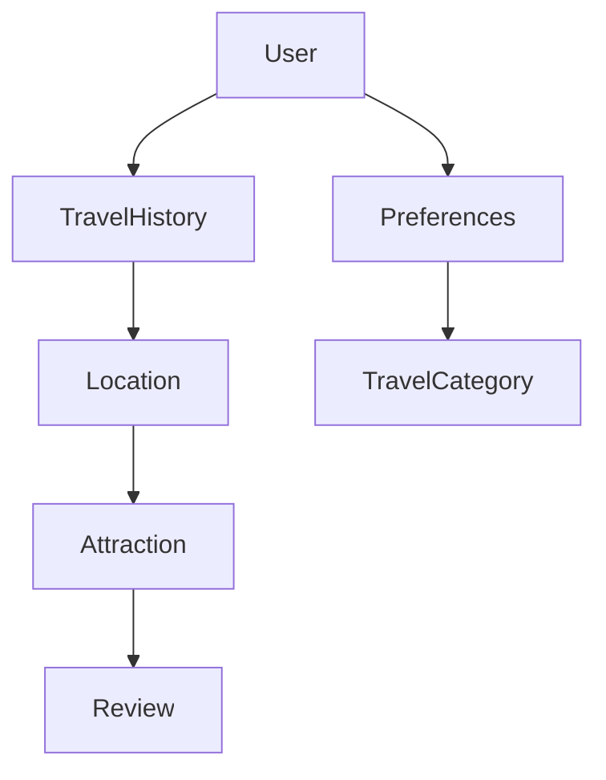
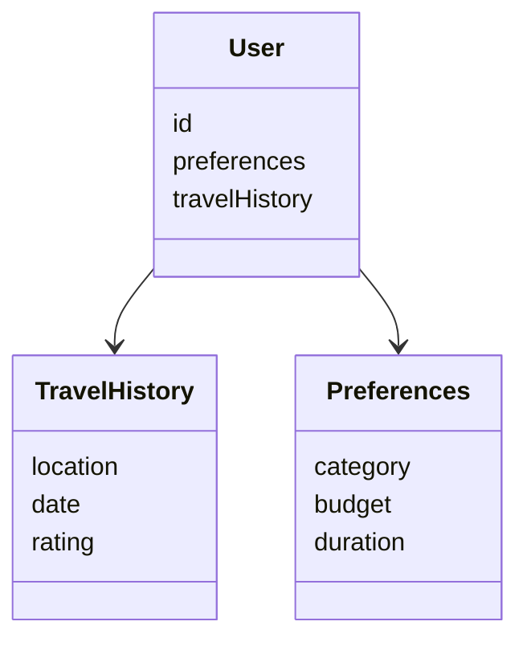

                 


# 旅游业AI Agent：个性化行程规划

> 关键词：人工智能，个性化行程规划，AI Agent，旅游业，行程推荐系统

> 摘要：本文探讨了如何利用人工智能技术实现个性化行程规划，介绍了AI Agent在旅游业中的应用，详细分析了其核心算法原理、系统架构设计以及实际应用案例。通过本文，读者可以深入了解如何利用AI技术提升旅游体验，并为相关领域的研究和实践提供参考。

---

## 第1章: 背景介绍

### 1.1 问题背景

#### 1.1.1 传统旅游服务的痛点
传统旅游服务依赖于旅行社或在线平台，往往难以满足用户的个性化需求。用户可能需要根据兴趣、时间、预算等因素定制行程，但传统服务难以高效满足这些多样化需求。

#### 1.1.2 用户需求的多样化与个性化
现代用户对旅游体验的要求越来越高，他们希望行程能够贴合自己的兴趣爱好、预算限制和时间安排。例如，一位用户可能希望在5天内访问3个城市，每天安排特定的景点和活动。

#### 1.1.3 旅游业的数字化转型趋势
随着科技的发展，旅游业正在经历数字化转型。AI技术的引入为个性化服务提供了新的可能性，AI Agent可以通过数据分析和机器学习算法，为用户提供更精准的行程推荐。

---

### 1.2 问题描述

#### 1.2.1 个性化行程规划的核心问题
个性化行程规划的核心问题在于如何根据用户的需求，生成最优的行程安排。这需要考虑多个因素，如时间、地点、预算、用户偏好等。

#### 1.2.2 用户行为分析与需求挖掘
用户的行为数据和偏好数据是个性化行程规划的重要依据。通过分析用户的搜索记录、点击行为和评价，可以挖掘出用户的潜在需求。

#### 1.2.3 旅游行程规划的复杂性与挑战
旅游行程规划涉及多个变量，如交通、住宿、景点、餐饮等，如何在这些变量之间找到最优解是一个复杂的组合优化问题。

---

### 1.3 问题解决

#### 1.3.1 AI技术在旅游行程规划中的应用
AI技术可以通过自然语言处理、机器学习和知识图谱等技术，帮助用户生成个性化的行程规划。例如，基于用户的兴趣爱好，推荐合适的景点和活动。

#### 1.3.2 AI Agent的核心价值与优势
AI Agent可以实时分析用户的反馈和需求，动态调整行程安排。相比传统旅游服务，AI Agent能够提供更高效、更个性化的服务。

#### 1.3.3 个性化行程规划的实现路径
个性化行程规划的实现路径包括数据采集、需求分析、行程生成、优化调整和结果输出。

---

### 1.4 边界与外延

#### 1.4.1 AI Agent的适用范围
AI Agent适用于个性化需求较强的用户，但对复杂行程（如跨国旅行）的支持可能有限。

#### 1.4.2 个性化行程规划的边界条件
个性化行程规划需要考虑用户的预算、时间、兴趣等因素，这些因素可能会影响行程的生成和优化。

#### 1.4.3 与相关技术的区分与联系
个性化行程规划与推荐系统有相似之处，但行程规划更注重时间和空间的约束，需要考虑行程的可行性和连贯性。

---

### 1.5 概念结构与核心要素

#### 1.5.1 AI Agent的基本构成
AI Agent通常包括感知模块、推理模块和执行模块。感知模块负责采集用户数据，推理模块负责分析数据并生成行程，执行模块负责输出行程。

#### 1.5.2 个性化行程规划的核心要素
个性化行程规划的核心要素包括用户需求、行程约束、行程推荐和行程优化。

#### 1.5.3 系统架构与功能模块
个性化行程规划系统通常包括数据采集模块、需求分析模块、行程生成模块和优化调整模块。

---

## 第2章: 核心概念与联系

### 2.1 AI Agent的基本原理

#### 2.1.1 AI Agent的定义与分类
AI Agent是一种能够感知环境并采取行动以实现目标的智能体。根据应用场景的不同，AI Agent可以分为任务型AI Agent和交互型AI Agent。

#### 2.1.2 个性化行程规划的算法原理
个性化行程规划算法通常基于协同过滤、遗传算法和模拟退火等方法。例如，协同过滤可以通过用户行为数据生成相似用户的推荐。

#### 2.1.3 知识图谱与语义理解
知识图谱可以帮助AI Agent理解景点、酒店和交通等实体之间的关系，从而生成更合理的行程安排。

---

### 2.2 核心概念对比

#### 2.2.1 传统旅游服务与AI Agent的对比
传统旅游服务依赖人工经验，而AI Agent通过数据分析和机器学习，能够提供更精准的服务。

#### 2.2.2 不同AI模型的性能对比
不同AI模型在个性化行程规划中的表现可能不同。例如，基于深度学习的模型可能在复杂场景下表现更好。

#### 2.2.3 个性化推荐算法的优劣势分析
协同过滤算法简单但推荐效果可能有限，而基于内容的推荐算法能够提供更精准的推荐。

---

### 2.3 ER实体关系图



---

## 第3章: 算法原理讲解

### 3.1 算法流程

#### 3.1.1 算法步骤
1. 数据采集：收集用户的基本信息和偏好。
2. 需求分析：通过数据分析，识别用户的潜在需求。
3. 行程生成：基于需求生成初步行程。
4. 行程优化：根据反馈调整行程。

#### 3.1.2 算法实现
```python
def generate_itinerary(userPreferences):
    # 根据用户偏好生成初步行程
    itinerary = []
    for constraint in userPreferences:
        if constraint.satisfied:
            itinerary.append(constraint)
    return itinerary
```

---

### 3.2 算法数学模型

#### 3.2.1 基于协同过滤的推荐算法
$$similarity(u, v) = \frac{\sum_{i=1}^{n}(u_i - \bar{u})(v_i - \bar{v})}{\sqrt{\sum_{i=1}^{n}(u_i - \bar{u})^2} \sqrt{\sum_{i=1}^{n}(v_i - \bar{v})^2}}$$

---

## 第4章: 系统分析与架构设计方案

### 4.1 问题场景介绍

#### 4.1.1 问题描述
用户希望根据自己的需求生成个性化的行程安排。

#### 4.1.2 项目介绍
本项目旨在开发一个基于AI的个性化行程规划系统，帮助用户高效地制定旅行计划。

---

### 4.2 系统功能设计

#### 4.2.1 领域模型


---

### 4.3 系统架构设计

#### 4.3.1 架构图
```mermaid
graph LR
    Client --> API Gateway
    API Gateway --> Recommender
    Recommender --> Database
    Database --> KnowledgeGraph
```

---

## 第5章: 项目实战

### 5.1 环境安装

#### 5.1.1 安装Python和相关库
```bash
pip install numpy pandas scikit-learn
```

---

### 5.2 核心代码实现

#### 5.2.1 数据处理
```python
import pandas as pd
import numpy as np

def preprocess_data(data):
    # 数据预处理代码
    return processed_data
```

---

### 5.3 代码解读与分析

#### 5.3.1 算法实现
```python
def generate_itinerary(userPreferences):
    # 生成行程的核心逻辑
    return itinerary
```

---

### 5.4 实际案例分析

#### 5.4.1 案例描述
假设用户希望在5天内访问3个城市，预算为5000元。

---

## 第6章: 最佳实践与总结

### 6.1 最佳实践 Tips

#### 6.1.1 系统设计中的注意事项
确保系统的可扩展性和可维护性。

#### 6.1.2 项目开发中的经验分享
注重数据质量和算法优化。

---

### 6.2 小结

个性化行程规划是AI技术在旅游业中的重要应用，能够显著提升用户体验。

---

### 6.3 注意事项

在实际应用中，需要注意用户隐私和数据安全。

---

### 6.4 拓展阅读

推荐阅读《机器学习实战》和《知识图谱入门》。

---

以上是《旅游业AI Agent：个性化行程规划》的技术博客文章的大纲和部分内容，后续可以按照此结构继续撰写完整文章。

