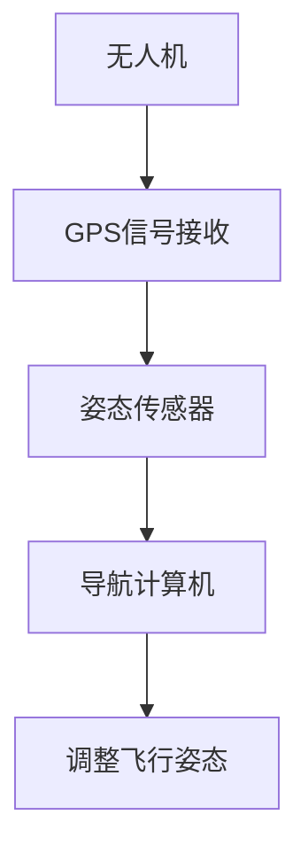
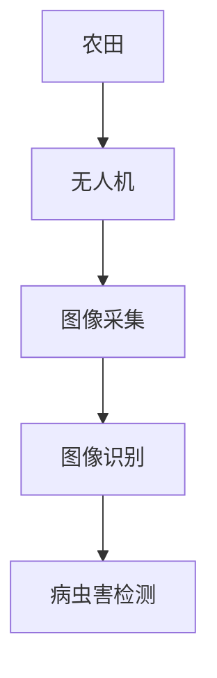
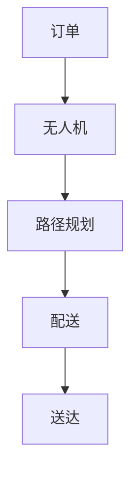

                 

# 无人机技术在各行业应用的投资机会

> 关键词：无人机技术、投资机会、行业应用、市场分析、技术创新

> 摘要：无人机技术作为一种革命性的技术，正在迅速渗透到各个行业中，带来了巨大的投资机会。本文将深入分析无人机技术在农业、物流、安防、能源等领域的应用，探讨其市场潜力、商业模式和技术挑战，为投资者提供全面的投资分析和策略建议。

---

## 第一部分：无人机技术的背景与基础

### 第1章：无人机技术概述

#### 1.1 无人机的基本概念

##### 1.1.1 无人机的定义与分类
无人机（Unmanned Aerial Vehicle, UAV）是指没有机载人员的空中飞行器，通过遥控或自主飞行完成特定任务。无人机按用途可分为消费级无人机、工业级无人机和军用无人机。

##### 1.1.2 无人机的发展历程
- 早期阶段：20世纪初至20世纪末，无人机主要用于军事侦察和靶机。
- 快速发展阶段：21世纪初，技术进步推动无人机向民用领域扩展，消费级无人机兴起。
- 现阶段：无人机技术日益成熟，应用领域不断扩展，特别是在工业和服务业中的应用。

##### 1.1.3 无人机的核心技术与组成
无人机主要由飞行控制系统、导航系统、通信系统、动力系统和传感器组成。

#### 1.2 无人机的技术特点

##### 1.2.1 飞行控制系统
飞行控制系统是无人机的核心，负责接收指令并调整飞行姿态。常见的飞行控制算法包括PID控制和模糊控制。

##### 1.2.2 导航与定位技术
无人机使用GPS、惯性导航系统（INS）和视觉识别技术进行定位和导航。Mermaid流程图展示了无人机导航的基本流程：

##### 1.2.3 通信与数据传输
无人机通过无线电通信技术与地面站进行数据传输，常用的通信技术包括Wi-Fi、蓝牙和LTE。

#### 1.3 无人机的应用领域

##### 1.3.1 农业
无人机在农业中的应用包括农田监测、精准喷洒和病虫害防治。例如，使用图像识别技术进行作物健康监测，Mermaid流程图如下：

##### 1.3.2 物流
无人机物流可以提高配送效率，减少成本。例如，使用多旋翼无人机进行定点配送，流程图如下：

##### 1.3.3 安防监控
无人机用于公共安全监控、边境巡逻和灾害救援。例如，使用热成像技术进行夜间监控。

---

## 第二部分：无人机技术在各行业的投资机会分析

### 第2章：农业领域的无人机应用

#### 2.1 农业无人机的应用场景

##### 2.1.1 病虫害监测与防治
无人机搭载多光谱传感器进行农田监测，帮助农民及时发现病虫害。图像识别算法用于分类识别作物健康状况，数学模型如下：

$$
\text{健康指数} = \frac{\text{健康像素数}}{\text{总像素数}} \times 100
$$

##### 2.1.2 精准农业与无人机喷洒
无人机可以精确喷洒农药，减少浪费，提高效率。喷洒系统由无人机的飞行控制系统和喷嘴组成。

##### 2.1.3 农田监测与管理
无人机可以用于农田测绘和作物生长监测，帮助农民优化种植策略。

#### 2.2 农业无人机的市场潜力

##### 2.2.1 市场规模分析
全球农业无人机市场预计将以年均15%的速度增长，到2025年市场规模将达到100亿美元。

##### 2.2.2 投资回报周期
农业无人机的投资回报周期约为3-5年，具体取决于使用频率和维护成本。

##### 2.2.3 市场竞争格局
主要竞争者包括大疆创新、极飞科技和精准农业公司。

---

### 第3章：物流领域的无人机应用

#### 3.1 无人机物流的优势与挑战

##### 3.1.1 高效配送
无人机可以在偏远地区和交通不便的地方进行快速配送。

##### 3.1.2 远程监控
无人机物流系统可以通过实时监控优化配送路径，减少能源消耗。

##### 3.1.3 无人机配送的法律与技术障碍
法律方面，无人机配送需要获得空域使用权和相关许可。技术方面，电池续航和通信距离是主要挑战。

#### 3.2 无人机物流的投资机会

##### 3.2.1 城市配送市场
无人机可以用于城市内的最后一公里配送，减少交通拥堵。

##### 3.2.2 边远地区覆盖
无人机物流在偏远地区具有巨大潜力，尤其是在医疗物资配送方面。

##### 3.2.3 企业合作与商业模式
与物流公司合作，共同开发无人机配送服务，探索新的商业模式。

---

### 第4章：安防监控领域的无人机应用

#### 4.1 无人机在安防中的应用场景

##### 4.1.1 公共安全监控
无人机可以用于大型活动的实时监控，预防和处理突发事件。

##### 4.1.2 边境巡逻
无人机在边境和海岸线巡逻，监测非法活动。

##### 4.1.3 灾害救援
无人机在地震、洪水等灾害中进行灾后评估和救援物资投送。

#### 4.2 安防无人机的投资分析

##### 4.2.1 市场需求分析
随着公共安全需求的增加，安防无人机市场稳步增长，预计年增长率超过20%。

##### 4.2.2 技术发展与成本
技术进步降低了无人机的成本，但高端安防无人机仍面临较高的研发投入。

##### 4.2.3 政策与行业标准
各国政府正在制定无人机使用的相关政策和标准，推动行业规范化发展。

---

## 第三部分：无人机技术的投资策略与风险分析

### 第6章：无人机项目投资策略

#### 6.1 投资前的市场分析

##### 6.1.1 行业趋势分析
无人机技术在各行业的应用趋势，包括农业、物流、安防、能源等领域的增长潜力。

##### 6.1.2 市场容量评估
通过数据分析，评估目标市场容量和增长潜力。

##### 6.1.3 竞争对手分析
分析现有竞争者的优势和劣势，制定差异化竞争策略。

#### 6.2 投资策略与风险控制

##### 6.2.1 市场定位与产品策略
根据市场需求，选择合适的产品和市场定位，制定营销策略。

##### 6.2.2 技术与运营策略
注重技术创新，优化运营成本，提高产品竞争力。

##### 6.2.3 风险管理与退出策略
识别潜在风险，制定应对措施，评估退出渠道和时机。

---

## 结语

无人机技术在各行业应用的投资机会巨大，但同时也面临技术和市场的双重挑战。投资者需要深入分析市场，制定科学的投资策略，抓住技术变革带来的机遇。未来，随着技术的进步和政策的支持，无人机将在更多领域发挥重要作用，为投资者带来丰厚的回报。

