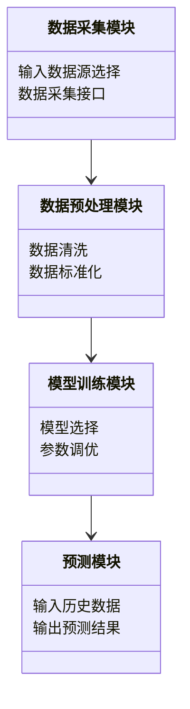
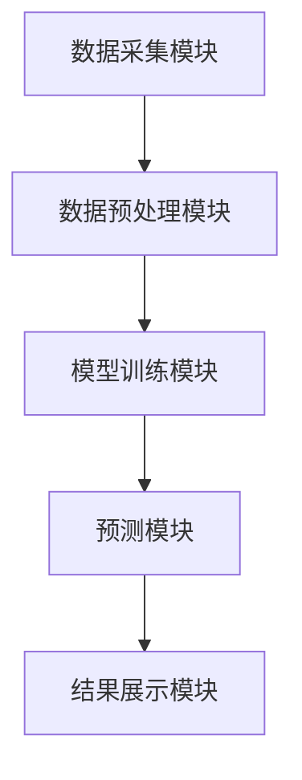
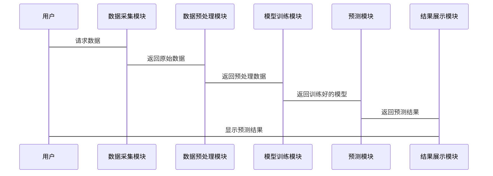

                 


# 《时序预测：赋予AI Agent预测未来的能力》

---

## 关键词：
- 时序预测
- AI Agent
- 时间序列
- 预测模型
- LSTM
- ARIMA
- 机器学习

---

## 摘要：
时序预测是人工智能领域中的一个重要分支，通过分析历史数据，预测未来趋势，赋予AI Agent对未来事件的预见能力。本文从时序预测的核心概念、算法原理、系统设计到实际应用进行全面解析，帮助读者掌握时序预测的精髓。

---

# 第四部分: 系统分析与架构设计

# 第4章: 时序预测系统分析与架构设计

## 4.1 系统分析

### 4.1.1 问题场景介绍
时序预测系统通常用于金融、气象、交通等领域，帮助用户预测股票价格、天气变化或交通流量。

### 4.1.2 项目介绍
本章将设计一个完整的时序预测系统，涵盖数据采集、预处理、模型训练、预测和结果展示。

## 4.2 系统功能设计

### 4.2.1 领域模型设计


### 4.2.2 系统架构设计


### 4.2.3 系统接口设计
- 数据采集接口：负责从数据库或API获取原始数据。
- 预测接口：接收输入数据，返回预测结果。
- 结果展示接口：将预测结果以图表形式展示。

## 4.3 系统交互设计



---

# 第五部分: 项目实战

# 第5章: 时序预测项目实战

## 5.1 环境配置

### 5.1.1 Python环境安装
```bash
pip install numpy pandas scikit-learn tensorflow keras
```

## 5.2 系统核心实现源代码

### 5.2.1 数据获取与预处理
```python
import pandas as pd
import numpy as np

# 数据获取
data = pd.read_csv('stock_price.csv')

# 数据预处理
data = data.dropna()
data = (data - data.mean()) / data.std()
```

### 5.2.2 模型训练
```python
from tensorflow.keras.models import Sequential
from tensorflow.keras.layers import LSTM, Dense

model = Sequential()
model.add(LSTM(64, input_shape=(None, 1)))
model.add(Dense(1))
model.compile(loss='mean_squared_error', optimizer='adam')
model.fit(x_train, y_train, epochs=100, batch_size=32)
```

### 5.2.3 模型预测
```python
predicted_price = model.predict(x_test)
```

### 5.2.4 结果评估
```python
from sklearn.metrics import mean_squared_error

mse = mean_squared_error(y_test, predicted_price)
print(f'MSE: {mse}')
```

## 5.3 代码应用解读与分析

### 5.3.1 数据获取与预处理
- 数据获取：从CSV文件中读取股票价格数据。
- 数据预处理：去除缺失值，标准化数据。

### 5.3.2 模型训练
- 使用LSTM网络进行训练，输入为标准化后的数据，输出为预测的股票价格。

### 5.3.3 模型预测
- 使用训练好的模型对测试数据进行预测。

### 5.3.4 结果评估
- 使用均方误差（MSE）评估模型的预测精度。

## 5.4 实际案例分析

### 5.4.1 股票价格预测案例
```python
import matplotlib.pyplot as plt

plt.plot(y_test, label='实际价格')
plt.plot(predicted_price, label='预测价格')
plt.legend()
plt.show()
```

## 5.5 项目小结

---

# 第六部分: 总结与扩展

# 第6章: 总结与扩展

## 6.1 最佳实践 Tips

### 6.1.1 数据预处理的重要性
- 数据清洗和标准化是模型训练的基础，直接影响模型的预测精度。

### 6.1.2 模型选择的策略
- 根据数据特征选择合适的模型，如ARIMA适合线性趋势，LSTM适合非线性复杂序列。

### 6.1.3 模型调优技巧
- 使用交叉验证和网格搜索优化模型参数。

## 6.2 小结与回顾

## 6.3 注意事项

### 6.3.1 数据质量问题
- 数据噪声和异常值会影响模型预测的准确性。

### 6.3.2 模型过拟合问题
- 在训练过程中，避免模型过拟合训练数据，可以通过正则化和交叉验证来解决。

## 6.4 拓展阅读

### 6.4.1 经典文献
- "Deep Learning" by Ian Goodfellow
- "Time Series Analysis" by James D. Hamilton

### 6.4.2 实战书籍
- 《Python机器学习实战》
- 《深度学习入门：基于Python的CNN、RNN、GAN基础》

---

# 第七部分: 附录与索引

# 第7章: 附录

## 7.1 附录A: 时序预测相关数学公式

### 7.1.1 ARIMA模型公式
$$ ARIMA(p, d, q) $$
其中：
- p：自回归（AR）的阶数
- d：差分的阶数
- q：移动平均（MA）的阶数

### 7.1.2 LSTM模型公式
$$ f(t) = \text{sigmoid}(W_f \cdot [h(t-1), x(t)] + b_f) $$
$$ i(t) = \text{sigmoid}(W_i \cdot [h(t-1), x(t)] + b_i) $$
$$ c(t) = f(t) \cdot c(t-1) + i(t) \cdot tanh(W_c \cdot [h(t-1), x(t)] + b_c) $$
$$ o(t) = \text{sigmoid}(W_o \cdot [h(t-1), c(t)] + b_o) $$
$$ h(t) = o(t) \cdot tanh(c(t)) $$

## 7.2 附录B: 代码库与工具

### 7.2.1 常用库
- NumPy
- Pandas
- Scikit-learn
- TensorFlow/Keras

## 7.3 附录C: 参考文献

### 7.3.1 中文文献
1. 《机器学习实战》
2. 《深度学习入门》

### 7.3.2 英文文献
1. "Deep Learning" by Ian Goodfellow
2. "Time Series Analysis" by James D. Hamilton

---

# 第8章: 索引

## 8.1 关键术语索引
- ARIMA
- LSTM
- 时序预测
- 数据预处理
- 模型调优

## 8.2 代码片段索引
- 数据预处理代码
- LSTM模型代码
- 结果评估代码

---

希望这篇目录大纲能满足您的要求。如果需要进一步调整或补充，请随时告知！

