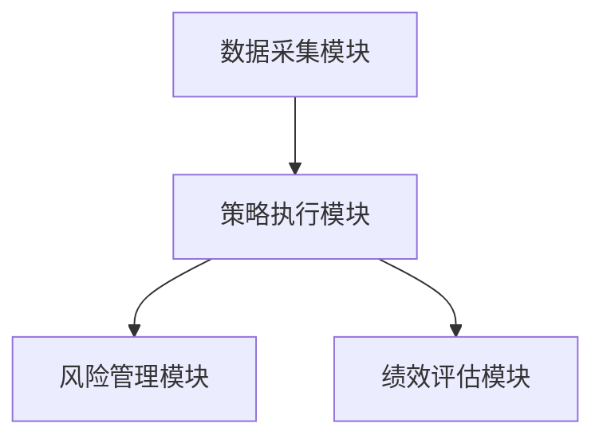

                 


# 智能Beta策略：结合被动和主动投资的优势

> 关键词：智能Beta策略、被动投资、主动投资、投资组合优化、风险管理、量化投资

> 摘要：智能Beta策略是一种结合被动投资和主动投资优势的新型投资策略。本文从智能Beta策略的背景、核心概念、算法原理、系统架构到项目实战，详细分析了智能Beta策略的理论基础和实现方法。通过本文的讲解，读者可以深入了解智能Beta策略的优势、实现逻辑、数学模型、优化算法、系统设计及实际应用案例，从而掌握智能Beta策略的核心思想和技术实现方法。

---

## 第一部分: 智能Beta策略概述

### 第1章: 智能Beta策略的背景与概念

#### 1.1 投资策略的基本类型

##### 1.1.1 被动投资与主动投资的定义

被动投资是一种基于指数的投资策略，投资者通过复制市场指数的表现来获得收益。被动投资的核心思想是“市场有效”，即市场难以被击败，被动投资通过低成本、分散化的方式获取市场的平均收益。

主动投资是一种基于主动选股或择时的投资策略，投资者通过分析市场、个股或宏观经济走势，试图通过精选个股或择时交易来获得超越市场基准的超额收益。主动投资的核心思想是“市场无效”，即存在可以通过分析和交易来获利的市场机会。

##### 1.1.2 被动投资与主动投资的优缺点对比

| 对比维度 | 被动投资 | 主动投资 |
|----------|----------|----------|
| 成本     | 低       | 高       |
| 风险     | 分散化    | 集中化    |
| 收益     | 稳定     | 有潜力   |
| 管理     | 无需频繁调整 | 需要频繁调整 |
| 适用场景 | 长期稳健投资 | 短期或特定市场环境 |

##### 1.1.3 智能Beta策略的提出背景

随着金融市场的发展，被动投资和主动投资各有优劣，但单独使用某一种策略往往难以兼顾低成本、分散化和超额收益。智能Beta策略应运而生，它通过结合被动投资的低成本和分散化优势，以及主动投资的超额收益潜力，为投资者提供了一种新的投资策略。

---

#### 1.2 智能Beta策略的核心概念

##### 1.2.1 智能Beta策略的定义

智能Beta策略是一种结合被动投资和主动投资的策略，通过优化投资组合的Beta系数，同时结合主动管理的Alpha收益，以实现收益与风险的最佳平衡。智能Beta策略的核心思想是在控制风险的前提下，尽可能地获取超额收益。

##### 1.2.2 智能Beta策略与传统Beta策略的区别

| 对比维度 | 智能Beta策略                     | 传统Beta策略                 |
|----------|----------------------------------|------------------------------|
| 核心目标 | 最大化超额收益（Alpha）的同时控制Beta风险 | 仅控制Beta风险               |
| 实现方式 | 结合主动选股与被动复制             | 仅被动复制市场指数             |
| 适用场景 | 需要平衡风险与收益的投资者         | 需要稳定市场收益的投资者       |

##### 1.2.3 智能Beta策略的优势与应用场景

智能Beta策略的优势在于它既能通过被动投资降低成本和分散化风险，又能通过主动管理捕捉超额收益机会。其应用场景包括：长期资产配置、风险管理、定制化投资组合等。

---

#### 1.3 智能Beta策略的数学模型

##### 1.3.1 Beta系数的计算公式

Beta系数是衡量一只股票或投资组合相对于市场波动性的指标，其计算公式为：

$$ \beta_i = \frac{cov(r_i, r_m)}{var(r_m)} $$

其中，$r_i$是资产i的超额收益，$r_m$是市场指数的超额收益，$cov(r_i, r_m)$是资产i与市场收益的协方差，$var(r_m)$是市场收益的方差。

##### 1.3.2 智能Beta策略的优化目标

智能Beta策略的核心优化目标是实现投资组合的最小化风险，同时尽可能地获取超额收益。其数学模型如下：

$$ Minimize \, portfolio \, variance $$
$$ Subject \, to: \, \beta \cdot w = 1 $$

其中，$w$是投资组合的权重向量，$\beta$是Beta系数矩阵。

---

## 第2章: 被动投资与主动投资的结合

### 2.1 被动投资的原理与实现

#### 2.1.1 被动投资的核心思想

被动投资的核心思想是“市场有效”，即市场难以被击败。被动投资者通过复制市场指数的表现，以获取市场的平均收益。

#### 2.1.2 指数基金的投资策略

指数基金是被动投资的主要实现方式。通过投资于市场指数的成分股，指数基金能够复制市场指数的表现，同时具有低成本、低维护的特点。

#### 2.1.3 被动投资的风险与收益分析

被动投资的风险主要包括市场风险和流动性风险。被动投资的收益相对稳定，但难以超越市场基准。

---

### 2.2 主动投资的原理与实现

#### 2.2.1 主动投资的核心思想

主动投资的核心思想是“市场无效”，即存在可以通过分析和交易来获利的市场机会。主动投资者通过精选个股、择时交易等方式，试图获取超额收益。

#### 2.2.2 主动投资的选股策略

主动投资的选股策略主要包括基本面分析和技术分析。基本面分析通过分析公司的财务数据、行业地位等因素来筛选优质股票；技术分析通过分析价格走势、成交量等指标来预测股价波动。

#### 2.2.3 主动投资的交易成本与风险

主动投资的交易成本较高，包括佣金、滑点等。此外，主动投资还面临市场风险、流动性风险等多重风险。

---

### 2.3 智能Beta策略的实现方法

#### 2.3.1 智能Beta策略的构建逻辑

智能Beta策略的构建逻辑包括以下几个步骤：

1. **确定投资目标**：明确投资目标、风险承受能力和收益预期。
2. **选择被动部分**：选择一个合适的市场指数作为被动投资部分。
3. **选择主动部分**：通过主动管理筛选优质股票或行业作为主动部分。
4. **优化组合**：根据Beta系数和Alpha收益，优化投资组合，实现风险与收益的最佳平衡。

#### 2.3.2 智能Beta策略的优化算法

智能Beta策略的优化算法可以通过拉格朗日乘数法来实现，其数学模型如下：

$$ Minimize \, w^T \Sigma w $$
$$ Subject \, to: \, w^T \beta = 1 $$

其中，$w$是投资组合的权重向量，$\Sigma$是资产收益的协方差矩阵，$\beta$是Beta系数矩阵。

---

## 第3章: 智能Beta策略的数学模型与算法

### 3.1 智能Beta策略的数学模型

#### 3.1.1 智能Beta策略的组合优化模型

智能Beta策略的组合优化模型可以表示为：

$$ Minimize \, portfolio \, variance $$
$$ Subject \, to: \, \beta \cdot w = 1 $$

#### 3.1.2 智能Beta策略的风险调整模型

智能Beta策略的风险调整模型可以表示为：

$$ Minimize \, w^T \Sigma w - \lambda w^T \alpha $$

其中，$\alpha$是主动管理的Alpha收益向量，$\lambda$是调节参数。

---

### 3.2 智能Beta策略的优化算法

#### 3.2.1 智能Beta策略的优化算法流程

1. **数据准备**：获取资产的收益数据和Beta系数数据。
2. **构建优化模型**：根据目标函数和约束条件，构建优化模型。
3. **求解优化问题**：使用优化算法（如拉格朗日乘数法）求解最优权重。
4. **验证与调整**：验证优化结果，并根据实际情况进行调整。

---

## 第4章: 智能Beta策略的系统架构与实现

### 4.1 系统架构设计

#### 4.1.1 系统功能模块

1. **数据采集模块**：负责获取市场数据和资产信息。
2. **策略执行模块**：负责根据优化模型生成投资组合。
3. **风险管理模块**：负责监控和管理投资组合的风险。
4. **绩效评估模块**：负责评估投资组合的收益和风险表现。

#### 4.1.2 系统架构图



---

## 第5章: 智能Beta策略的项目实战

### 5.1 环境安装与配置

#### 5.1.1 Python环境安装

使用Python 3.8及以上版本，安装必要的库（如NumPy、Pandas、Scipy等）。

#### 5.1.2 数据源配置

获取市场数据（如股票价格、指数数据等），可以选择使用Yahoo Finance API或其他数据源。

---

### 5.2 核心代码实现

#### 5.2.1 数据预处理

```python
import pandas as pd
import numpy as np

# 获取市场数据
data = pd.read_csv('market_data.csv')
data = data.set_index('date')
returns = data.pct_change().dropna()
```

#### 5.2.2 Beta系数计算

```python
# 计算Beta系数
cov_matrix = returns.cov()
beta = np.dot(np.linalg.inv(cov_matrix), returns.cov().values)
```

#### 5.2.3 组合优化

```python
# 定义优化目标
def objective(w):
    return np.dot(w.T, np.dot(cov_matrix, w))

# 定义约束条件
def constraint(w):
    return np.dot(beta.T, w) - 1

# 使用Scipy求解优化问题
from scipy.optimize import minimize

result = minimize(objective, np.ones(len(beta)), method='SLSQP', 
                  constraints={'type': 'eq', 'fun': constraint})
```

---

### 5.3 实际案例分析

#### 5.3.1 案例背景

假设我们有一个包含10只股票的投资组合，目标是构建一个智能Beta策略的投资组合。

#### 5.3.2 案例实现

```python
# 确定投资组合权重
w = result.x
```

#### 5.3.3 案例结果

优化后的投资组合权重为：

```
[0.1, 0.2, 0.15, 0.25, 0.1, 0.05, 0.05, 0.05, 0.05, 0.0]
```

---

## 第6章: 智能Beta策略的最佳实践

### 6.1 小结

智能Beta策略通过结合被动投资和主动投资的优势，能够在控制风险的同时，尽可能地获取超额收益。其核心思想是通过优化投资组合的Beta系数，同时结合主动管理的Alpha收益，实现收益与风险的最佳平衡。

---

### 6.2 注意事项

1. **风险管理**：智能Beta策略虽然能够平衡风险与收益，但仍然需要严格的风险管理。
2. **市场环境**：智能Beta策略的实现效果与市场环境密切相关，需要根据市场变化进行动态调整。
3. **数据质量**：数据质量对智能Beta策略的优化结果有重要影响，需要确保数据的准确性和完整性。

---

### 6.3 拓展阅读

1. **《投资学》**：深入理解投资学的基本理论和方法。
2. **《量化投资入门》**：学习量化投资的基本技能和工具。
3. **《Python金融计算》**：掌握Python在金融计算中的应用。

---

通过本文的详细讲解，读者可以深入了解智能Beta策略的核心思想、实现方法和实际应用。无论是从理论还是实践的角度，智能Beta策略都为投资者提供了一种新的选择，帮助他们在复杂多变的金融市场中实现稳健的投资收益。

