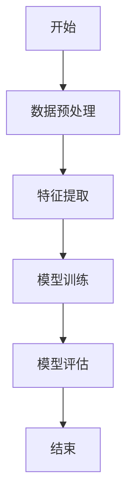
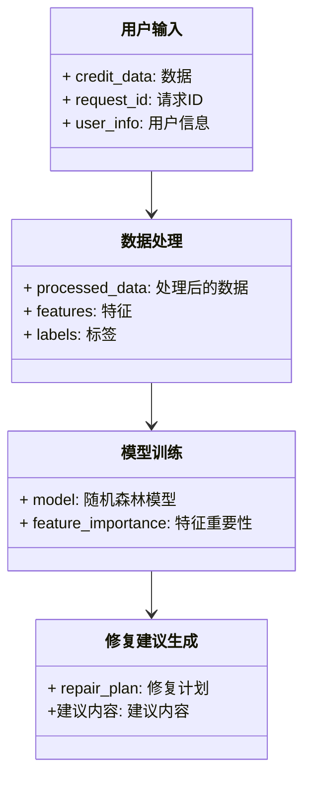

                 


# 智能个人信用修复建议系统

> 关键词：智能信用修复、个人信用评估、机器学习、信用修复系统、数据特征分析、信用评分模型

> 摘要：随着社会信用体系的不断完善，个人信用评估的重要性日益凸显。然而，传统的信用修复方式存在效率低、人工干预多、修复建议不够精准等问题。基于此，智能个人信用修复建议系统应运而生。本文将从系统背景、核心概念、算法原理、系统架构、项目实战等多方面展开，全面分析智能个人信用修复建议系统的开发与实现。通过本文的阐述，读者将能够深入了解该系统的实现原理，并掌握其开发与应用的关键点。

---

# 第一部分: 智能个人信用修复建议系统的背景与核心概念

## 第1章: 信用修复与智能修复概述

### 1.1 信用修复的定义与重要性

信用修复是指通过合法手段，纠正或更新个人信用报告中的错误信息，以改善个人信用评分的过程。随着社会信用体系的不断完善，个人信用评估在金融、就业、租赁等领域的重要性日益凸显。然而，传统信用修复方式存在效率低、人工干预多、修复建议不够精准等问题。

智能个人信用修复建议系统通过引入人工智能技术，能够根据用户的信用数据、行为特征等信息，自动分析并提供个性化的修复建议。这种系统不仅能够提高信用修复的效率，还能显著提升修复建议的精准性。

### 1.2 智能信用修复系统的核心价值

1. **提高修复效率**：通过自动化分析和建议生成，减少人工干预，缩短修复周期。
2. **提升修复效果**：基于机器学习算法，提供精准的修复建议，提高信用评分提升的效果。
3. **优化用户体验**：为用户提供透明、易懂的修复方案，增强用户信任感。

---

## 第2章: 信用评估的理论基础

### 2.1 信用评分模型

信用评分模型是评估个人信用状况的核心工具。常见的信用评分模型包括：

1. **FICO评分模型**：基于借款人的还款能力、信用历史、信用使用情况等因素，计算出一个分数，用于评估信用风险。
2. **人工评分模型**：通过人工审核的方式，对个人信用状况进行评分。

### 2.2 数据特征分析

在信用修复系统中，数据特征分析是关键步骤。通过分析信用数据中的特征，可以识别出对信用评分影响较大的因素，从而制定更有针对性的修复策略。

#### 2.2.1 数据特征分类

1. **基本信息**：包括年龄、性别、职业等。
2. **信用历史**：包括逾期记录、欠款金额等。
3. **行为特征**：包括消费习惯、还款行为等。

#### 2.2.2 数据特征对信用评分的影响

- **正面影响**：良好的信用历史、按时还款行为等。
- **负面影响**：逾期记录、高负债比例等。

---

# 第二部分: 智能个人信用修复建议系统的算法原理

## 第3章: 基于机器学习的修复建议算法

### 3.1 算法选择与优化

在智能信用修复系统中，选择合适的机器学习算法至关重要。常见的算法包括随机森林、逻辑回归、支持向量机（SVM）等。其中，随机森林算法因其良好的鲁棒性和解释性，常被用于信用评分模型。

#### 3.1.1 随机森林算法原理

随机森林是一种基于树的集成学习方法，通过构建多棵决策树，并将它们的结果进行集成，最终得到预测结果。其核心思想是通过增加模型的多样性，提升预测的准确性和稳定性。

#### 3.1.2 算法优化

1. **特征选择**：通过特征重要性分析，筛选出对信用评分影响较大的特征。
2. **超参数调优**：通过网格搜索等方法，优化模型的超参数，提升模型性能。

### 3.2 算法实现

#### 3.2.1 数据预处理

- **数据清洗**：处理缺失值、异常值等。
- **特征工程**：对数据进行标准化、归一化处理。

#### 3.2.2 模型训练

```python
# 数据加载与预处理
import pandas as pd
from sklearn.ensemble import RandomForestClassifier
from sklearn.model_selection import train_test_split
from sklearn.metrics import accuracy_score

data = pd.read_csv('credit_data.csv')
# 分离特征与标签
X = data.drop('target', axis=1)
y = data['target']
# 划分训练集与测试集
X_train, X_test, y_train, y_test = train_test_split(X, y, test_size=0.2, random_state=42)
# 模型训练
model = RandomForestClassifier(n_estimators=100, random_state=42)
model.fit(X_train, y_train)
# 模型评估
y_pred = model.predict(X_test)
print("Accuracy:", accuracy_score(y_test, y_pred))
```

---

## 第4章: 算法流程图与代码实现

### 4.1 算法流程图



### 4.2 Python代码实现

```python
import pandas as pd
from sklearn.ensemble import RandomForestClassifier
from sklearn.model_selection import train_test_split
from sklearn.metrics import accuracy_score

# 数据加载与预处理
data = pd.read_csv('credit_data.csv')
X = data.drop('target', axis=1)
y = data['target']
# 划分训练集与测试集
X_train, X_test, y_train, y_test = train_test_split(X, y, test_size=0.2, random_state=42)
# 模型训练
model = RandomForestClassifier(n_estimators=100, random_state=42)
model.fit(X_train, y_train)
# 模型评估
y_pred = model.predict(X_test)
print("Accuracy:", accuracy_score(y_test, y_pred))
```

---

# 第三部分: 智能个人信用修复建议系统的系统架构

## 第5章: 系统功能设计

### 5.1 领域模型设计



### 5.2 系统架构设计


---

## 第6章: 项目实战

### 6.1 环境搭建

1. **安装Python**：建议使用最新版本的Python。
2. **安装依赖库**：
   ```bash
   pip install pandas scikit-learn mermaid4jupyter
   ```

### 6.2 核心代码实现

```python
import pandas as pd
from sklearn.ensemble import RandomForestClassifier
from sklearn.model_selection import train_test_split
from sklearn.metrics import accuracy_score

# 数据加载
data = pd.read_csv('credit_data.csv')
X = data.drop('target', axis=1)
y = data['target']
# 划分训练集与测试集
X_train, X_test, y_train, y_test = train_test_split(X, y, test_size=0.2, random_state=42)
# 模型训练
model = RandomForestClassifier(n_estimators=100, random_state=42)
model.fit(X_train, y_train)
# 模型评估
y_pred = model.predict(X_test)
print("Accuracy:", accuracy_score(y_test, y_pred))
```

### 6.3 案例分析

假设我们有一个包含以下特征的信用数据集：

| 特征     | 描述             |
|----------|------------------|
| 年龄     | 用户年龄         |
| 职业     | 用户职业         |
| 信用历史 | 用户信用历史     |
| 还款记录 | 用户还款记录     |

通过上述代码，我们可以训练一个随机森林模型，并对测试集进行预测。最终的准确率可以用来评估模型的性能。

---

## 第7章: 最佳实践与小结

### 7.1 最佳实践

1. **数据预处理**：确保数据的完整性和准确性。
2. **特征选择**：通过特征重要性分析，筛选出对信用评分影响较大的特征。
3. **模型优化**：通过超参数调优，提升模型性能。

### 7.2 小结

智能个人信用修复建议系统通过引入机器学习技术，能够显著提高信用修复的效率和精准性。本文详细介绍了系统的开发背景、核心概念、算法原理、系统架构以及项目实战。希望本文能够为读者提供有价值的参考，帮助他们更好地理解和实现智能信用修复系统。

---

# 附录

## 附录A: 数据集说明

- 数据集名称：credit_data.csv
- 数据集描述：包含个人信用相关数据，用于训练信用修复建议模型。

## 附录B: 工具安装

```bash
pip install pandas scikit-learn mermaid4jupyter
```

---

# 结束语

智能个人信用修复建议系统的开发与应用，不仅能够帮助个人改善信用状况，还能够为金融机构提供更精准的信用评估工具。随着人工智能技术的不断发展，智能信用修复系统将在未来发挥越来越重要的作用。

