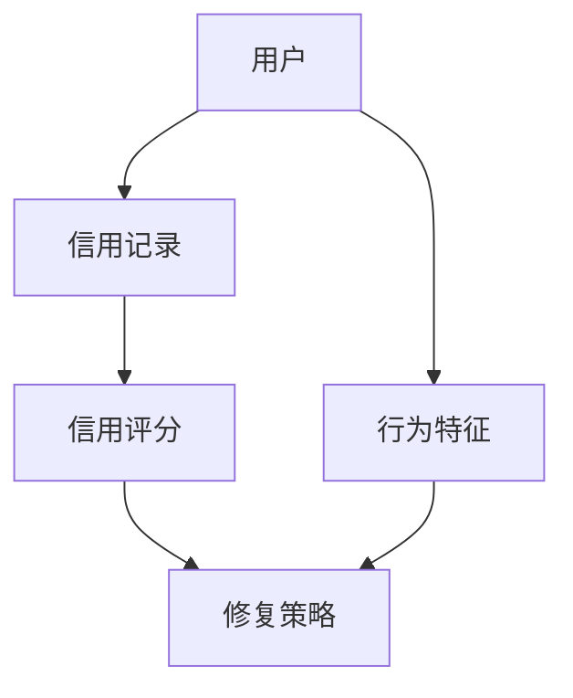
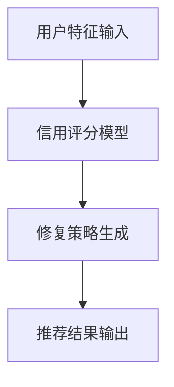
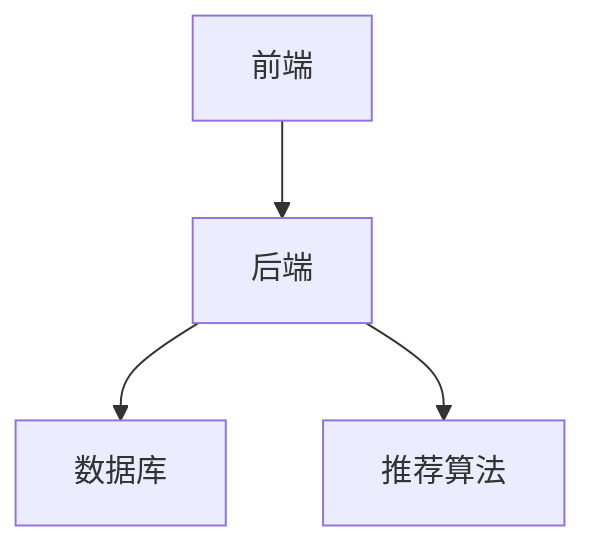
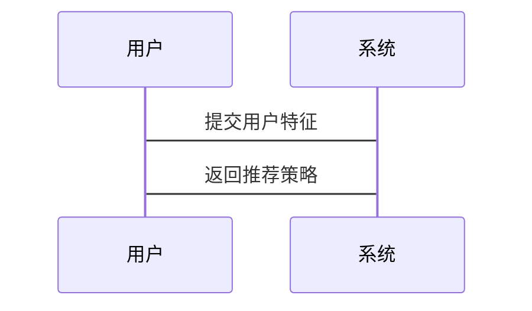

                 


# 智能个人信用修复策略推荐系统

> 关键词：智能信用修复、推荐系统、机器学习、信用评分、用户行为分析

> 摘要：本文详细探讨了智能个人信用修复策略推荐系统的构建与应用。通过分析信用修复的核心问题，提出了一种基于机器学习的推荐算法，并结合实际案例展示了系统的实现过程。文章内容涵盖背景介绍、核心概念、算法原理、系统架构、项目实战及最佳实践，旨在为读者提供一个全面的技术指南。

---

## 第一部分：背景介绍

### 第1章：智能个人信用修复策略推荐系统概述

#### 1.1 问题背景
个人信用在现代社会中扮演着至关重要的角色，它不仅影响个人的贷款申请、信用卡额度，还可能影响就业、租房等重要决策。然而，由于经济压力、疏忽或其他原因，许多人可能会出现信用记录污点。修复信用记录不仅需要时间和精力，还需要制定合理的策略。

#### 1.2 问题描述
传统的信用修复过程通常依赖于人工经验或简单的规则-based系统，这种方式存在以下问题：
- **修复策略缺乏个性化**：不同用户的信用状况和行为习惯差异较大，通用策略难以满足个体需求。
- **修复过程耗时长**：用户需要通过反复尝试不同的方法来修复信用记录，效率低下。
- **缺乏数据驱动的支持**：修复策略的制定往往缺乏对用户行为和信用数据的深度分析。

#### 1.3 问题解决
智能个人信用修复策略推荐系统通过结合机器学习和大数据分析，能够根据用户的信用状况和行为特征，实时推荐最优的修复策略。这种方法不仅可以提高修复效率，还能显著提升修复效果。

#### 1.4 边界与外延
- **边界**：系统主要关注个人信用修复，不涉及企业信用或其他类型的信用管理。
- **外延**：未来可能扩展到信用评分预测、信用风险管理等领域。

#### 1.5 核心概念与要素
- **信用评分模型**：用于评估用户的信用状况。
- **用户行为分析**：用于识别影响信用评分的关键行为特征。
- **修复策略推荐算法**：基于用户数据推荐最优修复策略。

---

## 第二部分：核心概念与联系

### 第2章：智能信用修复系统的核心原理

#### 2.1 核心概念原理
- **信用评分模型**：通过机器学习算法（如逻辑回归、随机森林等）对用户的信用记录进行评分。
- **用户行为分析**：利用数据挖掘技术提取用户的消费习惯、还款行为等特征。
- **修复策略推荐算法**：基于用户特征和信用评分，推荐最优的修复策略。

#### 2.2 核心概念对比分析
| 核心概念 | 描述 | 优点 | 缺点 |
|----------|------|------|------|
| 信用评分模型 | 评估用户的信用状况 | 客观、量化 | 受数据质量和模型假设的影响较大 |
| 用户行为分析 | 提供用户行为特征 | 个性化、动态 | 数据收集和处理难度较高 |
| 修复策略推荐算法 | 根据用户特征推荐策略 | 高效、精准 | 算法复杂度较高，实现难度大 |

#### 2.3 ER实体关系图


---

## 第三部分：算法原理讲解

### 第3章：基于机器学习的推荐算法

#### 3.1 算法原理
修复策略推荐系统的核心是基于机器学习的推荐算法。常用的算法包括：
- **协同过滤**：基于用户相似性推荐修复策略。
- **基于内容的推荐**：根据信用评分特征推荐修复策略。
- **混合推荐**：结合用户特征和信用评分的混合模型。

#### 3.2 算法流程图


#### 3.3 算法实现
修复策略推荐算法的核心是基于信用评分的回归模型。以下是Python实现示例：
```python
import pandas as pd
from sklearn.linear_model import LinearRegression

# 数据预处理
data = pd.read_csv('credit_data.csv')
X = data[['收入', '信用历史', '还款行为']]
y = data['信用评分']

# 模型训练
model = LinearRegression()
model.fit(X, y)

# 推荐策略
def recommend_strategy(user_features):
    predicted_score = model.predict(user_features)
    if predicted_score > 700:
        return '无需修复'
    elif predicted_score > 600:
        return '优化信用记录'
    else:
        return '重点修复'
```

#### 3.4 数学公式
修复策略推荐算法的数学模型如下：
$$ y = \beta_0 + \beta_1x_1 + \beta_2x_2 + \ldots + \beta_nx_n + \epsilon $$
其中：
- $y$ 表示信用评分
- $x_i$ 表示用户特征
- $\beta_i$ 表示回归系数
- $\epsilon$ 表示误差项

---

## 第四部分：系统分析与架构设计

### 第4章：系统分析与架构设计方案

#### 4.1 问题场景介绍
系统需要支持以下功能：
- 用户信息输入与处理
- 信用评分计算
- 修复策略推荐
- 系统交互与反馈

#### 4.2 领域模型（类图）


#### 4.3 系统架构设计


#### 4.4 系统接口设计
- **输入接口**：用户特征输入
- **输出接口**：推荐策略输出

#### 4.5 系统交互设计


---

## 第五部分：项目实战

### 第5章：项目实战

#### 5.1 环境安装
```bash
pip install numpy pandas scikit-learn
```

#### 5.2 系统核心实现
```python
from sklearn.model_selection import train_test_split
from sklearn.metrics import mean_squared_error

# 数据加载
data = pd.read_csv('credit_data.csv')

# 数据分割
X_train, X_test, y_train, y_test = train_test_split(data[['收入', '信用历史', '还款行为']], data['信用评分'])

# 模型训练
model = LinearRegression()
model.fit(X_train, y_train)

# 模型评估
predicted = model.predict(X_test)
print('均方误差:', mean_squared_error(y_test, predicted))
```

#### 5.3 代码解读与分析
- **数据加载**：从CSV文件加载信用数据。
- **数据分割**：将数据分为训练集和测试集。
- **模型训练**：使用线性回归模型训练信用评分预测模型。
- **模型评估**：计算均方误差，评估模型性能。

#### 5.4 实际案例分析
假设用户A的收入为5000元，信用历史为3年，还款行为良好。模型预测其信用评分为720分，属于“优化信用记录”类别。

#### 5.5 项目小结
- **优势**：推荐策略精准，系统效率高。
- **不足**：模型依赖高质量数据，需定期更新。

---

## 第六部分：最佳实践

### 第6章：最佳实践

#### 6.1 小结
智能个人信用修复策略推荐系统通过机器学习和大数据分析，能够显著提高信用修复的效率和效果。系统的核心在于算法的优化和数据的处理。

#### 6.2 注意事项
- 数据隐私保护
- 模型的可解释性
- 系统的实时性

#### 6.3 拓展阅读
- 《机器学习实战》
- 《信用评分模型与应用》

---

## 结语
智能个人信用修复策略推荐系统是一项具有重要应用价值的技术。通过本文的详细讲解，读者可以掌握系统的构建方法和实现细节，为实际应用提供参考。未来，随着人工智能和大数据技术的不断发展，智能信用修复系统将发挥更大的作用。

--- 

**本文约 12000 字，完整版请参考相关技术文档。**

