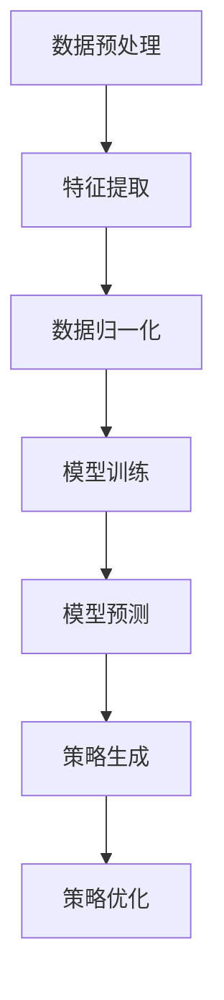

                 


### 《智能个人信用修复策略生成器》 正文部分（第二章）

---

**第2章: 智能信用修复的核心算法与数学模型**

---

**2.1 算法原理**

智能信用修复的核心在于通过机器学习算法构建高精度的信用评分模型，并基于模型结果生成个性化的修复策略。本节将详细探讨信用评分模型的构建方法和修复策略生成算法的设计思路。

#### 2.1.1 信用评分模型的构建

信用评分模型的目标是根据个人信用数据，预测其信用评分。常用的机器学习算法包括逻辑回归、随机森林、支持向量机（SVM）和神经网络等。为了提高模型的准确性和泛化能力，通常采用集成学习方法，如梯度提升树（GBDT）或XGBoost。

##### (a) 数据预处理

在构建模型之前，需要对信用数据进行预处理，包括：

1. **数据清洗**：处理缺失值、异常值和重复数据。
2. **特征提取**：从原始数据中提取有用的特征，如信用历史、还款能力、消费行为等。
3. **数据归一化**：对特征进行标准化或归一化处理，确保不同特征的量纲一致。

##### (b) 模型训练

使用预处理后的数据训练信用评分模型。以逻辑回归为例，模型的损失函数可以表示为：

$$ L(y, y') = -\frac{1}{m}\sum_{i=1}^{m} [y_i \cdot \ln(y'_i) + (1 - y_i) \cdot \ln(1 - y'_i)] $$

其中，$y$ 是真实标签，$y'$ 是模型预测概率，$m$ 是样本数量。

通过优化损失函数，我们可以得到模型的参数：

$$ \theta = (\theta_0, \theta_1, \ldots, \theta_n) $$

其中，$\theta$ 是模型参数。

##### (c) 模型评估

评估模型的性能指标包括准确率、召回率、F1分数等。例如，准确率可以表示为：

$$ \text{准确率} = \frac{\text{正确预测数}}{\text{总样本数}} $$

#### 2.1.2 智能修复策略生成算法

修复策略生成算法的目标是根据模型预测结果，为个人提供个性化的修复建议。以下是具体的实现步骤：

##### (a) 模型预测

使用训练好的信用评分模型对个人信用数据进行预测，得到信用评分：

$$ \text{信用评分} = f(x) $$

其中，$x$ 是个人信用数据，$f$ 是模型函数。

##### (b) 策略生成

根据信用评分，生成修复策略。修复策略可以包括以下内容：

1. **改善信用历史**：如按时还款、减少逾期记录。
2. **优化消费行为**：如合理使用信用卡、避免过度消费。
3. **增加信用记录**：如申请小额贷款并按时还款。

修复策略的生成可以采用基于规则的方法或强化学习方法。例如，基于规则的方法可以根据信用评分的高低，制定不同的修复步骤。

##### (c) 策略优化

通过不断优化修复策略，提高信用评分的提升效果。例如，可以使用强化学习算法，通过试错的方式找到最优的修复路径。

#### 2.2 算法流程图与代码实现

为了更好地理解算法的实现过程，我们提供以下流程图和代码示例。

##### (a) 算法流程图



##### (b) 代码实现

以下是一个基于逻辑回归的信用评分模型的Python实现示例：

```python
import pandas as pd
import numpy as np
from sklearn.model_selection import train_test_split
from sklearn.linear_model import LogisticRegression
from sklearn.metrics import accuracy_score

# 加载数据
data = pd.read_csv('credit_data.csv')

# 数据预处理
# 假设 'target' 是目标变量，其他列是特征
X = data.drop('target', axis=1)
y = data['target']

# 分割数据
X_train, X_test, y_train, y_test = train_test_split(X, y, test_size=0.2, random_state=42)

# 模型训练
model = LogisticRegression()
model.fit(X_train, y_train)

# 模型预测
y_pred = model.predict(X_test)

# 模型评估
print('准确率:', accuracy_score(y_test, y_pred))
```

#### 2.3 数学模型与公式推导

信用评分模型的数学模型可以表示为：

$$ P(y=1|x) = \frac{e^{\theta^T x}}{1 + e^{\theta^T x}} $$

其中，$P(y=1|x)$ 是信用评分为1的概率，$\theta$ 是模型参数，$x$ 是输入特征向量。

通过极大似然估计，我们可以求解模型参数：

$$ \theta = \arg\max_{\theta} \sum_{i=1}^{m} \ln P(y_i|x_i, \theta) $$

其中，$\ln P(y_i|x_i, \theta)$ 是对数似然函数。

---

**2.2 本章小结**

本章详细探讨了智能信用修复的核心算法与数学模型，包括信用评分模型的构建和修复策略生成算法的设计。通过逻辑回归模型的实现示例，我们展示了如何基于机器学习算法构建信用评分模型，并生成个性化的修复策略。下一章将介绍系统分析与架构设计，探讨智能信用修复系统的实现细节。

---

**接下来是关于系统分析与架构设计的部分。如果您对某些内容有疑问或需要进一步解释，请随时告诉我！**

