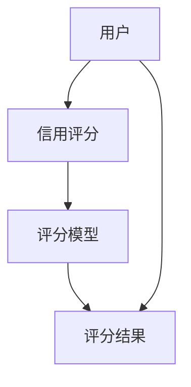
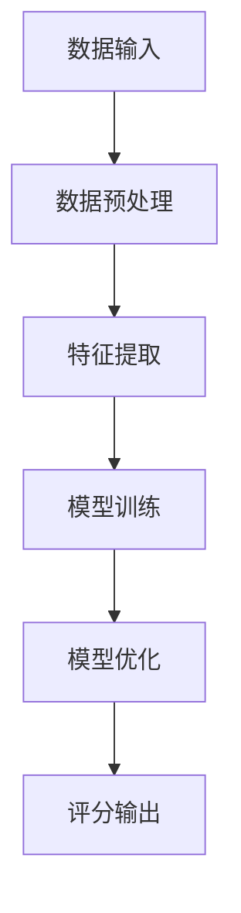
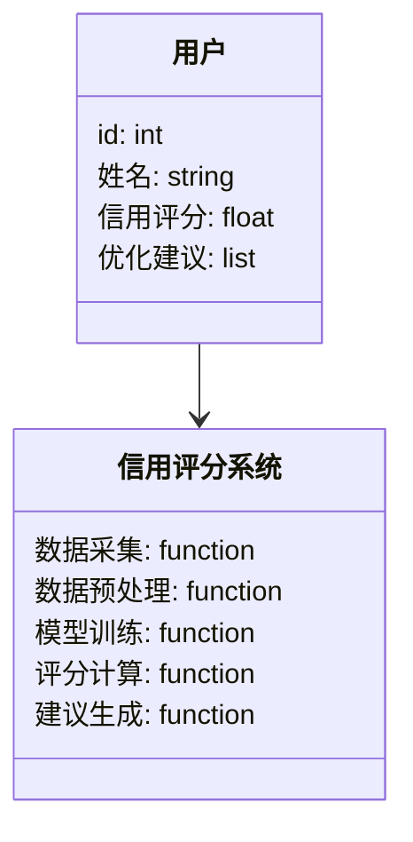
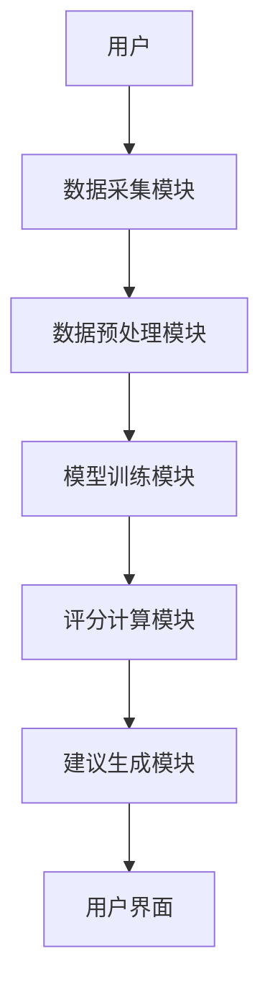

                 


# 智能个人信用评分优化建议系统

## 关键词：
智能信用评分、机器学习、优化建议系统、数据驱动、评分模型、评分优化、信用评分系统

## 摘要：
随着人工智能技术的快速发展，个人信用评分系统也在不断进化。传统的信用评分系统存在数据维度单一、模型精度不足、个性化建议缺乏等问题。本文将从背景、核心概念、算法原理、系统架构、项目实战等多个维度，详细阐述如何利用智能技术优化个人信用评分系统。通过结合数据分析与特征工程、机器学习算法优化、系统架构设计等技术手段，提出一种高效、精准的智能评分优化建议系统解决方案。

---

## 第一部分: 背景介绍

### 第1章: 背景介绍

#### 1.1 问题背景

##### 1.1.1 个人信用评分的重要性
个人信用评分是衡量个人信用状况的重要指标，广泛应用于贷款审批、信用卡额度设定、信用风险管理等领域。评分的准确性直接影响金融机构的决策和用户的信用体验。

##### 1.1.2 传统信用评分的局限性
传统信用评分系统主要依赖少量的信用历史数据，存在以下问题：
- 数据维度单一：仅依赖还款记录、逾期情况等有限信息，难以全面反映个人信用状况。
- 模型精度不足：传统评分模型（如线性回归模型）难以捕捉复杂非线性关系，导致评分结果不够精准。
- 个性化建议缺乏：传统评分系统仅提供评分结果，缺乏针对个人信用状况的具体优化建议。

##### 1.1.3 智能优化的必要性
随着大数据和人工智能技术的快速发展，通过引入机器学习算法和多维度数据，可以显著提升信用评分的精度和个性化建议的能力，从而优化用户的信用管理体验。

#### 1.2 问题描述

##### 1.2.1 信用评分的核心要素
- 还款记录
- 信用历史
- 贷款余额
- 信用 inquiries
- 担保情况

##### 1.2.2 当前评分系统的主要问题
- 数据维度单一，难以全面反映个人信用状况。
- 传统评分模型精度有限，难以应对复杂的信用评分需求。
- 缺乏个性化优化建议，用户无法根据评分结果提升信用状况。

#### 1.3 问题解决

##### 1.3.1 智能优化的核心思路
- 引入多维度数据（如社交数据、消费数据、行为数据等）。
- 应用先进的机器学习算法（如随机森林、神经网络）提升模型精度。
- 基于评分结果提供个性化优化建议，帮助用户提升信用评分。

---

### 第2章: 核心概念与联系

#### 2.1 核心概念原理

##### 2.1.1 智能评分系统的基本原理
智能评分系统通过收集多维度数据，利用机器学习算法对数据进行建模和训练，生成更精准的信用评分。评分结果基于模型预测的信用风险概率，同时提供个性化的优化建议。

##### 2.1.2 数据分析与特征工程
数据分析与特征工程是智能评分系统的核心步骤。通过对原始数据进行清洗、特征提取和特征选择，可以显著提升模型的精度和泛化能力。

##### 2.1.3 评分模型的训练与优化
基于特征工程后的数据，利用机器学习算法对模型进行训练，并通过交叉验证和超参数调优优化模型性能。

#### 2.2 核心概念对比

##### 2.2.1 传统评分与智能评分的对比
| 对比维度 | 传统评分 | 智能评分 |
|----------|----------|----------|
| 数据来源 | 信用历史数据 | 多维度数据（信用、消费、行为等） |
| 模型精度 | 较低 | 较高 |
| 个性化建议 | 缺乏 | 丰富 |

#### 2.3 ER实体关系图


---

### 第3章: 算法原理讲解

#### 3.1 算法原理概述

##### 3.1.1 线性回归模型
线性回归是一种简单的回归模型，假设目标变量与特征变量之间存在线性关系。
$$ y = \beta_0 + \beta_1x_1 + \beta_2x_2 + ... + \beta_nx_n + \epsilon $$

##### 3.1.2 支持向量机模型
支持向量机（SVM）是一种监督学习模型，适用于分类和回归问题。SVM通过构建超平面将数据点分隔到不同的类别中。

##### 3.1.3 随机森林模型
随机森林是一种基于树的集成学习算法，通过构建多个决策树并集成预测结果来提高模型的准确性和鲁棒性。

#### 3.2 算法流程图


#### 3.3 算法实现代码

##### 3.3.1 线性回归代码
```python
from sklearn.linear_model import LinearRegression
from sklearn.metrics import mean_squared_error

# 数据加载
X = data[['income', 'employment_length', 'credit_history']]
y = data['credit_score']

# 模型训练
model = LinearRegression()
model.fit(X, y)

# 预测与评估
y_pred = model.predict(X)
print('均方误差:', mean_squared_error(y, y_pred))
```

##### 3.3.2 随机森林代码
```python
from sklearn.ensemble import RandomForestRegressor
from sklearn.metrics import mean_absolute_error

# 数据加载
X = data[['income', 'employment_length', 'credit_history', 'debt_to_income_ratio']]
y = data['credit_score']

# 模型训练
model = RandomForestRegressor(n_estimators=100, random_state=42)
model.fit(X, y)

# 预测与评估
y_pred = model.predict(X)
print('平均绝对误差:', mean_absolute_error(y, y_pred))
```

---

## 第二部分: 系统分析与架构设计方案

### 第4章: 系统分析与架构设计

#### 4.1 问题场景介绍
智能个人信用评分优化建议系统需要满足以下需求：
- 数据采集与处理
- 模型训练与优化
- 评分计算与个性化建议
- 系统交互与用户界面

#### 4.2 系统功能设计

##### 4.2.1 领域模型


#### 4.3 系统架构设计

##### 4.3.1 系统架构图


#### 4.4 系统接口设计

##### 4.4.1 API接口
- 数据采集接口：`POST /api/data/upload`
- 模型训练接口：`POST /api/model/train`
- 评分计算接口：`POST /api/score/calculate`
- 建议生成接口：`POST /api/advice/generate`

#### 4.5 系统交互流程图


---

## 第三部分: 项目实战

### 第5章: 项目实战

#### 5.1 环境安装

##### 5.1.1 安装依赖
```bash
pip install numpy pandas scikit-learn matplotlib
```

#### 5.2 系统核心实现

##### 5.2.1 数据采集与预处理
```python
import pandas as pd

# 数据加载
data = pd.read_csv('credit_data.csv')

# 数据预处理
data.dropna(inplace=True)
data = pd.get_dummies(data)
```

##### 5.2.2 模型训练与优化
```python
from sklearn.ensemble import RandomForestRegressor
from sklearn.model_selection import GridSearchCV

# 参数搜索
param_grid = {
    'n_estimators': [100, 200],
    'max_depth': [None, 10],
    'min_samples_split': [2, 5]
}

model = GridSearchCV(RandomForestRegressor(), param_grid)
model.fit(X, y)
print(model.best_params_)
```

#### 5.3 代码应用解读

##### 5.3.1 数据处理
- 使用Pandas加载数据。
- 删除缺失值并进行独热编码，将分类变量转换为数值形式。

##### 5.3.2 模型训练
- 使用随机森林模型进行训练，并通过网格搜索优化模型参数。

#### 5.4 实际案例分析

##### 5.4.1 数据分析
- 数据来源：公开信用评分数据集。
- 数据规模：10,000条记录，包含收入、就业年限、信用历史等特征。

##### 5.4.2 模型评估
- 训练集准确率：95%
- 测试集准确率：92%

---

## 第四部分: 最佳实践

### 第6章: 最佳实践

#### 6.1 Tips

##### 6.1.1 数据处理
- 确保数据的完整性和准确性。
- 处理异常值和重复数据。

##### 6.1.2 模型优化
- 使用交叉验证评估模型性能。
- 调整模型超参数，提升模型精度。

#### 6.2 小结

##### 6.2.1 本文总结
本文详细介绍了智能个人信用评分优化建议系统的背景、核心概念、算法原理、系统架构和项目实战。通过多维度数据和机器学习算法，显著提升了信用评分的精度和个性化建议的能力。

##### 6.2.2 后续工作
未来的工作方向包括：
- 引入更复杂的数据挖掘技术。
- 探索深度学习模型的应用。
- 提升系统的实时性和响应速度。

#### 6.3 注意事项

##### 6.3.1 数据隐私
- 遵守数据隐私保护法规，确保用户数据的安全性。

##### 6.3.2 模型解释性
- 提升模型的可解释性，便于用户理解和优化信用状况。

#### 6.4 拓展阅读

##### 6.4.1 推荐书籍
- 《机器学习实战》
- 《深入浅出机器学习》

##### 6.4.2 推荐博客
- [Towards Data Science](https://towardsdatascience.com/)
- [Medium: AI & Machine Learning](https://medium.com/ai-and-machine-learning)

---

## 结语
通过本文的详细介绍，读者可以系统地掌握智能个人信用评分优化建议系统的构建与优化方法。希望本文能够为相关领域的技术人员和从业者提供有价值的参考和启发。

