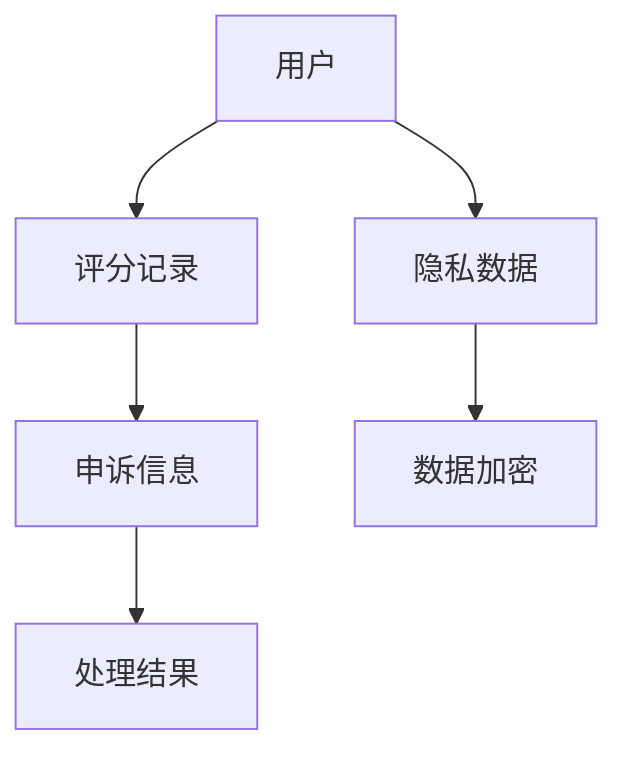
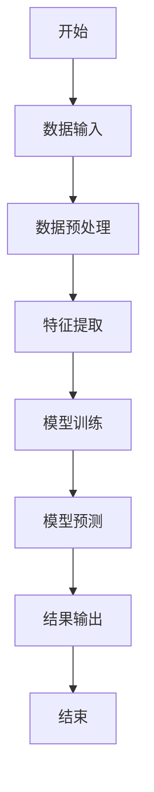
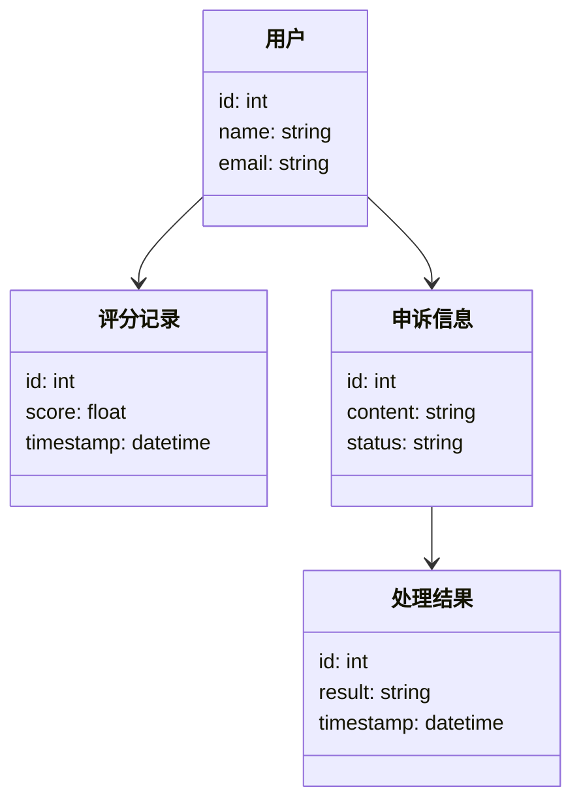
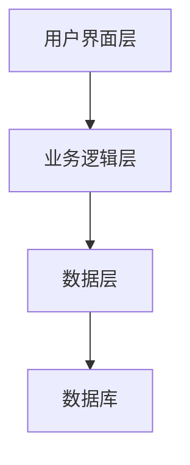
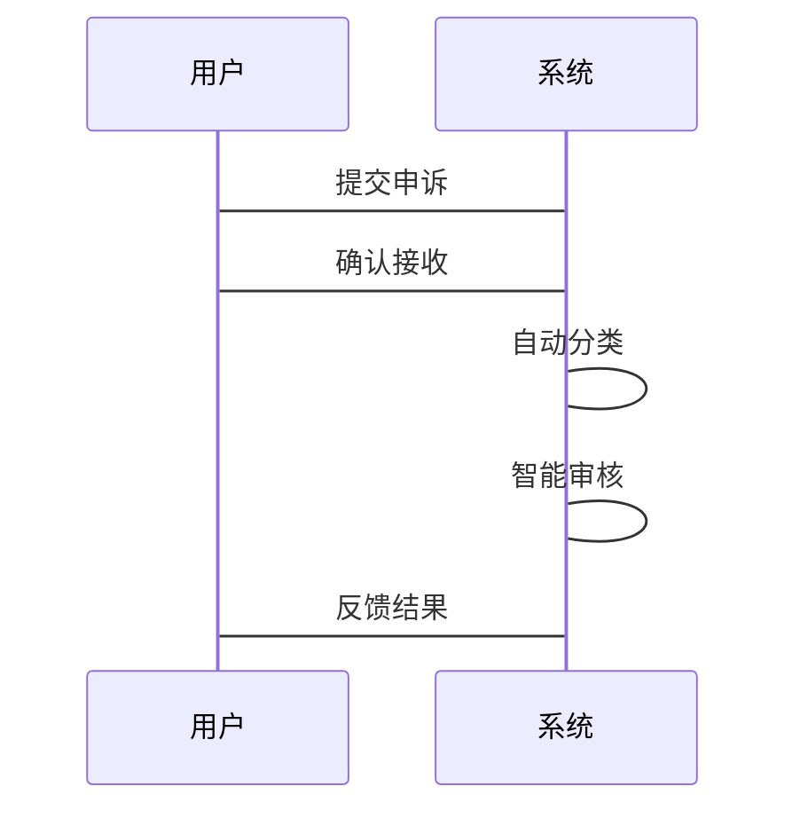

                 


# 智能个人信用评分申诉系统

> 关键词：智能信用评分、人工智能、申诉系统、机器学习、数据隐私、自然语言处理

> 摘要：随着人工智能技术的飞速发展，个人信用评分系统的智能化成为了现代金融领域的重要趋势。传统信用评分系统存在效率低、透明度差、数据隐私保护不足等问题，而智能个人信用评分申诉系统通过结合机器学习、自然语言处理和自动化流程，能够有效解决这些问题。本文将详细探讨智能个人信用评分申诉系统的背景、核心概念、算法原理、系统架构、项目实战及最佳实践，帮助读者全面理解并掌握该系统的设计与实现。

---

# 第一部分：智能个人信用评分申诉系统概述

## 第1章：智能个人信用评分申诉系统背景与问题分析

### 1.1 个人信用评分的重要性

#### 1.1.1 信用评分的定义与作用

信用评分是评估个人信用状况的重要指标，广泛应用于银行贷款、信用卡审批、租赁服务等领域。信用评分的高低直接影响个人能否获得金融服务以及获得的条件（如利率、额度等）。传统的信用评分主要基于统计模型，依赖于历史数据和人工判断，存在信息不透明、处理效率低、容易受主观因素影响等问题。

#### 1.1.2 传统信用评分的局限性

1. **信息不对称**：传统信用评分系统中，评分机构掌握着核心数据和技术，个人难以了解评分的具体依据。
2. **处理效率低**：传统的信用评分流程依赖人工操作，处理时间长，尤其是在申诉阶段，容易出现拖延。
3. **数据隐私问题**：传统系统中，个人数据的收集、存储和处理缺乏严格的隐私保护机制，容易引发数据泄露风险。
4. **模型局限性**：传统信用评分模型主要基于历史数据和统计分析，难以充分利用实时数据和非结构化信息。

#### 1.1.3 智能化信用评分的必要性

随着人工智能技术的快速发展，智能化信用评分系统能够通过机器学习算法、自然语言处理技术等，实现更高效、更透明、更精准的评分和申诉处理。智能化信用评分系统能够实时分析多种数据源，包括结构化数据（如交易记录）和非结构化数据（如社交媒体信息），从而提供更全面的信用评估。

---

### 1.2 申诉机制的现状与挑战

#### 1.2.1 传统信用申诉的流程与问题

传统的信用申诉流程通常包括以下几个步骤：
1. 用户提交申诉申请。
2. 人工审核员接收申诉并初步审查。
3. 人工审核员调取相关数据进行分析。
4. 人工审核员与用户沟通，了解具体情况。
5. 人工审核员做出最终决定并反馈结果。

传统申诉流程的缺点包括：
1. **效率低下**：人工审核耗时长，尤其是在数据量大、申诉数量多的情况下。
2. **主观性较强**：审核结果容易受到人工判断的影响，可能存在不公。
3. **透明度低**：用户难以了解申诉处理的具体进展和依据。

#### 1.2.2 申诉过程中的信息不对称问题

在传统申诉过程中，用户通常只能提供有限的信息，而评分机构掌握的核心评分逻辑和数据对用户不透明。这种信息不对称不仅降低了用户的信任度，还可能导致申诉处理的不公正。

#### 1.2.3 数据隐私与安全的挑战

在传统信用评分和申诉过程中，用户的个人数据容易被滥用或泄露。尤其是在数字化时代，数据隐私保护显得尤为重要。如何在申诉过程中保护用户的隐私数据，是一个亟待解决的问题。

---

### 1.3 智能化信用评分申诉的解决方案

#### 1.3.1 AI技术在信用评分中的应用

人工智能技术，特别是机器学习和深度学习，能够从海量数据中提取有价值的信息，帮助信用评分系统更精准地评估个人信用状况。例如，基于自然语言处理技术，系统可以自动分析用户的社交媒体信息、聊天记录等非结构化数据，从而更全面地了解用户的信用状况。

#### 1.3.2 智能申诉系统的核心目标

智能个人信用评分申诉系统的核心目标包括：
1. 提供高效的申诉处理流程，缩短用户等待时间。
2. 增强申诉处理的透明度，让用户了解申诉处理的每一步进展。
3. 保护用户隐私数据，确保数据的安全性和合规性。
4. 提供个性化的申诉建议，帮助用户优化信用记录。

#### 1.3.3 系统的预期效益与价值

通过智能化改造，信用评分申诉系统能够显著提升效率、透明度和用户体验。具体效益包括：
1. 提高申诉处理效率，减少人工干预。
2. 降低数据隐私泄露风险，增强用户信任。
3. 提供个性化服务，提升用户体验。
4. 优化信用评分模型，提高评分准确性。

---

## 1.4 本章小结

本章主要介绍了智能个人信用评分申诉系统的重要性和必要性，分析了传统信用评分和申诉系统的局限性，并提出了智能化改造的解决方案。通过本章的学习，读者可以理解为什么需要构建智能个人信用评分申诉系统，以及该系统在实际应用中的潜在价值。

---

## 第2章：智能个人信用评分申诉系统的核心概念与联系

### 2.1 核心概念原理

#### 2.1.1 评分模型的构建与优化

评分模型是智能个人信用评分申诉系统的核心部分。基于机器学习算法，系统能够从结构化和非结构化数据中提取特征，并构建高性能的评分模型。例如，可以使用随机森林、梯度提升树（如XGBoost、LightGBM）等算法，通过训练数据优化模型性能。

#### 2.1.2 申诉流程的自动化处理

智能系统通过自然语言处理技术和自动化流程，能够实现申诉的自动分类、自动审核和自动反馈。例如，系统可以自动识别用户的申诉类型，匹配相关规则，快速生成处理结果。

#### 2.1.3 用户隐私保护机制

为了保护用户的隐私数据，系统需要采用加密技术、数据脱敏技术等手段，确保数据在传输、存储和处理过程中的安全性。此外，系统还需要遵循相关法律法规（如GDPR），确保用户数据的合法合规性。

---

### 2.2 核心概念属性对比

#### 2.2.1 传统评分系统与智能评分系统的对比

| 属性                | 传统评分系统                          | 智能评分系统                          |
|---------------------|---------------------------------------|---------------------------------------|
| 数据来源            | 主要依赖结构化数据                    | 结构化数据 + 非结构化数据             |
| 模型类型            | 基于统计模型                          | 基于机器学习模型                      |
| 处理效率            | 人工处理，效率低                      | 自动化处理，效率高                    |
| 透明度              | 低，用户难以了解评分依据              | 高，用户可以查看评分依据和逻辑       |
| 数据隐私保护        | 措施有限，容易泄露                   | 措施完善，保护用户隐私               |

---

### 2.3 ER实体关系图架构



图2-1：智能个人信用评分申诉系统的ER实体关系图展示了用户、评分记录、申诉信息、处理结果和隐私数据之间的关系。用户提交申诉信息后，系统会根据评分记录生成处理结果，并对用户的隐私数据进行加密处理。

---

## 2.4 本章小结

本章详细介绍了智能个人信用评分申诉系统的核心概念和相关原理，包括评分模型的构建与优化、申诉流程的自动化处理以及用户隐私保护机制。同时，通过对比传统评分系统与智能评分系统的属性，帮助读者更好地理解智能化改造的优势。

---

## 第3章：智能个人信用评分申诉系统的算法原理

### 3.1 评分模型的构建

#### 3.1.1 机器学习算法的选择与优化

在构建评分模型时，可以选择多种机器学习算法，如逻辑回归、支持向量机（SVM）、随机森林和梯度提升树（如XGBoost）。以下是基于XGBoost算法的评分模型构建流程：

1. **数据预处理**：清洗数据、处理缺失值、特征提取。
2. **特征工程**：对特征进行标准化、独热编码等处理。
3. **模型训练**：使用XGBoost算法训练模型，并通过交叉验证优化参数。
4. **模型评估**：通过准确率、召回率、F1分数等指标评估模型性能。

以下是一个简单的Python代码示例：

```python
import xgboost as xgb

# 数据预处理
data = ...  # 处理后的数据集
X = data.drop('label', axis=1)
y = data['label']

# 模型训练
model = xgb.XGBClassifier(n_estimators=100, learning_rate=0.1, max_depth=6)
model.fit(X, y)

# 模型预测
predictions = model.predict(X)
```

---

#### 3.1.2 神经网络模型的设计与训练

对于复杂的信用评分问题，可以使用深度学习模型（如神经网络）进行建模。以下是基于神经网络的评分模型设计：

1. **数据预处理**：将数据转换为适合神经网络输入的格式。
2. **模型设计**：设计多层感知机（MLP）或卷积神经网络（CNN）模型。
3. **模型训练**：使用梯度下降算法优化模型参数。
4. **模型评估**：通过混淆矩阵、ROC曲线等指标评估模型性能。

以下是一个简单的神经网络模型代码示例：

```python
import tensorflow as tf
from tensorflow.keras import layers

# 数据预处理
X_train = ...  # 处理后的输入数据
y_train = ...  # 标签

# 模型设计
model = tf.keras.Sequential([
    layers.Dense(64, activation='relu'),
    layers.Dense(32, activation='relu'),
    layers.Dense(1, activation='sigmoid')
])

# 模型训练
model.compile(optimizer='adam', loss='binary_crossentropy', metrics=['accuracy'])
model.fit(X_train, y_train, epochs=10, batch_size=32)
```

---

#### 3.1.3 模型评估与调优

模型的评估指标包括准确率（Accuracy）、精确率（Precision）、召回率（Recall）和F1分数（F1 Score）。以下是计算F1分数的公式：

$$ F1 = 2 \times \frac{Precision \times Recall}{Precision + Recall} $$

通过调整模型参数和优化特征工程，可以提高模型的性能。

---

### 3.2 自然语言处理在申诉分析中的应用

#### 3.2.1 文本预处理与特征提取

在处理用户的申诉文本时，需要先进行文本清洗、分词、去除停用词等预处理步骤。以下是文本预处理的示例代码：

```python
import nltk
from sklearn.feature_extraction.text import TfidfVectorizer

text = "我的信用评分被错误地降低了。"
tokens = nltk.word_tokenize(text.lower())
tfidf = TfidfVectorizer().fit_transform([" ".join(tokens)])
```

---

#### 3.2.2 情感分析与关键词提取

通过情感分析技术，可以识别用户的申诉文本中的情绪倾向。例如，使用VADER情感分析工具：

```python
from vaderSentiment.vader_sentiment import SentimentIntensityAnalyzer

analyzer = SentimentIntensityAnalyzer()
sentiment = analyzer.polarity_scores(text)
print(sentiment)
```

关键词提取可以通过TF-IDF方法实现，提取申诉文本中的关键词，帮助系统更好地理解用户的需求。

---

#### 3.2.3 基于NLP的申诉分类算法

通过自然语言处理技术，可以将用户的申诉文本分类到不同的类别（如“信用评分错误”、“交易记录错误”等）。以下是基于朴素贝叶斯算法的分类示例：

```python
from sklearn.naive_bayes import MultinomialNB
from sklearn.feature_extraction.text import CountVectorizer

vectorizer = CountVectorizer()
X = vectorizer.fit_transform(text_list)
model = MultinomialNB()
model.fit(X, y)
```

---

### 3.3 申诉流程的自动化处理算法

#### 3.3.1 自动分类算法

通过机器学习算法，可以实现申诉类型的自动分类。以下是基于支持向量机（SVM）的分类示例：

```python
from sklearn.svm import SVC

X = ...  # 特征向量
y = ...  # 标签

model = SVC(kernel='linear')
model.fit(X, y)
predictions = model.predict(X)
```

---

#### 3.3.2 流程优化算法

通过优化算法，可以减少申诉处理的时间和资源消耗。例如，可以使用遗传算法优化申诉处理流程中的路径选择。

---

#### 3.3.3 基于规则的自动化处理

对于一些简单的申诉情况（如重复记录错误），系统可以基于预定义规则进行自动化处理。例如，检测到用户多次提交相同类型的问题时，直接触发快速处理流程。

---

### 3.4 算法流程图



---

## 3.5 本章小结

本章详细介绍了智能个人信用评分申诉系统的算法原理，包括评分模型的构建、自然语言处理在申诉分析中的应用以及申诉流程的自动化处理算法。通过算法的优化和流程的自动化，系统能够实现高效的申诉处理和精准的信用评分。

---

## 第4章：智能个人信用评分申诉系统的系统分析与架构设计

### 4.1 项目背景

智能个人信用评分申诉系统的开发背景包括：
1. 用户对高效信用评分申诉的需求日益增长。
2. 数据隐私保护的重要性不断提高。
3. 人工智能技术的快速发展为系统智能化提供了技术基础。

---

### 4.2 系统功能设计

系统功能设计可以分为以下几个模块：
1. **用户模块**：用户提交申诉、查看处理进度、获取结果反馈。
2. **评分模块**：基于机器学习模型进行信用评分。
3. **申诉模块**：自动分类申诉、智能审核、结果反馈。
4. **隐私保护模块**：数据加密、访问控制。

以下是系统功能模块的领域模型图：



---

### 4.3 系统架构设计

系统架构采用分层架构，包括数据层、业务逻辑层和用户界面层。以下是系统架构图：



---

### 4.4 系统接口设计

系统需要设计以下接口：
1. 用户提交申诉接口：`submit_complaint()`
2. 系统处理申诉接口：`process_complaint()`
3. 用户查询进度接口：`check_progress()`
4. 系统反馈结果接口：`return_result()`

---

### 4.5 系统交互流程图

以下是系统交互流程图：



---

## 4.6 本章小结

本章详细分析了智能个人信用评分申诉系统的项目背景、功能设计、系统架构、接口设计和交互流程。通过分层架构和模块化设计，系统能够实现高效的申诉处理和数据管理。

---

## 第5章：智能个人信用评分申诉系统的项目实战

### 5.1 环境安装

#### 5.1.1 安装Python

```bash
python --version
# 如果未安装，请使用以下命令：
python install --version 3.8
```

#### 5.1.2 安装机器学习库

```bash
pip install numpy
pip install pandas
pip install scikit-learn
pip install xgboost
pip install tensorflow
pip install vader-sentiment
```

---

### 5.2 系统核心实现

#### 5.2.1 评分模型实现

以下是基于XGBoost算法的评分模型实现代码：

```python
import xgboost as xgb
import pandas as pd

# 加载数据
data = pd.read_csv('credit_scores.csv')
X = data.drop('label', axis=1)
y = data['label']

# 模型训练
model = xgb.XGBClassifier(n_estimators=100, learning_rate=0.1, max_depth=6)
model.fit(X, y)

# 模型保存
model.save_model('credit_model.xgb')
```

---

#### 5.2.2 自然语言处理实现

以下是基于VADER情感分析的申诉文本处理代码：

```python
from vaderSentiment.vader_sentiment import SentimentIntensityAnalyzer

analyzer = SentimentIntensityAnalyzer()
text = "我的信用评分被错误地降低了。"
sentiment = analyzer.polarity_scores(text)
print(sentiment)
```

---

#### 5.2.3 申诉流程自动化实现

以下是基于规则的申诉分类代码：

```python
def classify_complaint(text):
    keywords = ['评分错误', '信用记录', '申诉']
    for keyword in keywords:
        if keyword in text:
            return 'credit_score_error'
    return 'other'

complaint_text = "我的信用评分被错误地降低了。"
result = classify_complaint(complaint_text)
print(result)  # 输出：credit_score_error
```

---

### 5.3 实际案例分析

以下是一个实际案例分析：

**案例背景**：用户提交了一条申诉，称其信用评分被错误地降低了。

**处理过程**：
1. 系统接收申诉信息，并自动分类为“credit_score_error”类型。
2. 系统调用评分模型进行重新计算，并结合自然语言处理技术分析申诉文本。
3. 系统确认评分错误，并自动更新评分记录。
4. 系统向用户反馈处理结果。

---

### 5.4 项目总结

通过本章的项目实战，读者可以掌握智能个人信用评分申诉系统的具体实现方法。从环境安装到系统核心实现，再到实际案例分析，系统性地展示了如何构建一个高效的智能申诉系统。

---

## 第6章：智能个人信用评分申诉系统的最佳实践

### 6.1 小结

智能个人信用评分申诉系统通过结合人工智能技术，显著提升了信用评分的效率和透明度。通过机器学习算法和自然语言处理技术，系统能够实现高效的申诉处理和精准的信用评估。

---

### 6.2 注意事项

1. **数据隐私保护**：在系统设计和实现过程中，必须严格遵守数据隐私保护法规，确保用户数据的安全性。
2. **模型优化**：定期更新评分模型，确保模型的准确性和适应性。
3. **用户体验优化**：简化用户操作流程，提升用户体验。

---

### 6.3 拓展阅读

1. 《机器学习实战》
2. 《Python机器学习》
3. 《自然语言处理实战》

---

## 6.4 本章小结

本章总结了智能个人信用评分申诉系统的最佳实践，包括小结、注意事项和拓展阅读等内容。通过本章的学习，读者可以更好地理解和应用智能信用评分申诉系统的设计与实现。

---

## 结语

智能个人信用评分申诉系统的开发和应用，不仅提升了信用评分的效率和准确性，还增强了用户的信任度和满意度。随着人工智能技术的不断进步，未来的信用评分系统将更加智能化、个性化和安全化。希望本文能够为读者提供有价值的参考和启示，帮助他们更好地理解和应用智能个人信用评分申诉系统。

--- 

# THE END

