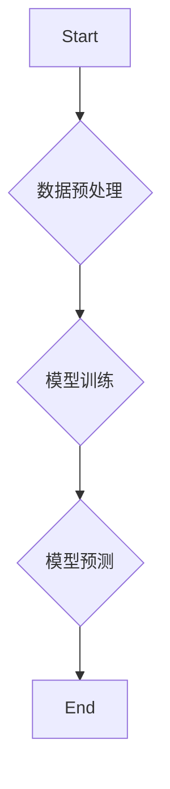

                 


# 智能个人信贷审批系统

## 关键词：
智能信贷审批、机器学习、风控模型、系统架构、Python实现

## 摘要：
智能个人信贷审批系统利用机器学习和大数据技术，通过分析用户数据，构建风险评估模型，实现自动化信贷审批。本文详细探讨了系统的背景、核心概念、算法原理、系统架构设计及项目实战，展示了如何利用技术提升信贷审批效率和准确性。

---

## 第一部分：背景介绍

### 第1章：智能个人信贷审批系统概述

#### 1.1 问题背景
- 传统信贷审批过程耗时长，依赖人工审核，效率低且可能存在主观偏差。
- 随着数据量的增加，人工处理难以应对海量申请，亟需智能化解决方案。
- 金融机构需要更精准的评估方法，以降低风险和提高审批效率。

#### 1.2 问题描述
- 信贷审批的核心在于评估申请人的信用风险，需考虑收入、信用历史、负债等多个因素。
- 数据驱动的决策需求：利用历史数据和机器学习模型预测违约风险。
- 智能化审批系统的必要性：通过自动化处理减少人为错误，提高审批速度。

#### 1.3 问题解决
- 引入机器学习算法，构建风险评估模型，实现自动化审批决策。
- 数据预处理和特征工程：确保数据质量，提取有效特征。
- 模型优化与部署：通过模型迭代提升准确率，实现系统的实际应用。

#### 1.4 系统边界与外延
- 系统功能边界：包括数据采集、模型训练、审批决策输出等核心功能。
- 适用范围：适用于个人信贷审批，不包括企业贷款或其他金融业务。
- 系统与其他系统接口：与数据库、前端界面、第三方征信系统等的交互。

#### 1.5 核心概念与组成
- 用户数据：包括申请人的个人信息、信用记录、财务数据等。
- 风险评估模型：基于机器学习算法构建，用于预测违约概率。
- 审批决策：根据模型输出结果，生成最终审批意见。

---

## 第二部分：核心概念与联系

### 第2章：智能个人信贷审批系统的构成要素

#### 2.1 核心概念原理
- 数据采集与预处理：收集用户数据，处理缺失值、异常值，进行特征提取。
- 风险评估模型：使用逻辑回归、随机森林等算法训练模型，评估信用风险。
- 审批决策：根据模型预测结果，结合业务规则，生成审批结论。

#### 2.2 核心概念属性对比
- 数据特征对比表：
  | 特征 | 重要性 | 类型 |
  |------|--------|------|
  | 收入 | 高     | 数值 |
  | 信用历史 | 高   | 类型 |
  | 负债 | 中     | 数值 |

- 模型性能对比表：
  | 模型 | 准确率 | 召回率 |
  |------|--------|--------|
  | 逻辑回归 | 85%   | 80%   |
  | 随机森林 | 87%   | 85%   |

- 系统功能对比表：
  | 功能模块 | 输入 | 输出 |
  |-----------|------|------|
  | 数据预处理 | 原始数据 | 清洗数据 |
  | 模型训练 | 清洗数据 | 训练好的模型 |
  | 审批决策 | 用户申请 | 审批结果 |

#### 2.3 ER实体关系图


---

## 第三部分：算法原理讲解

### 第3章：基于机器学习的信贷审批算法

#### 3.1 算法选择与原理
- 逻辑回归：用于分类问题，输出违约概率。
  - 模型公式：
    $$ P(y=1) = \frac{e^{\beta_0 + \beta_1x_1 + \beta_2x_2}}{1 + e^{\beta_0 + \beta_1x_1 + \beta_2x_2}} $$
  - 优势：简单易懂，适合二分类问题。
- 随机森林：基于决策树的集成方法，适合高维数据。
  - 优势：鲁棒性强，对异常值不敏感。

#### 3.2 算法流程图


#### 3.3 Python实现代码
```python
import pandas as pd
from sklearn.model_selection import train_test_split
from sklearn.linear_model import LogisticRegression
from sklearn.metrics import accuracy_score

# 数据加载与预处理
data = pd.read_csv('credit_data.csv')
X = data[['income', 'credit_history', 'debt']]
y = data['default']

# 划分训练集和测试集
X_train, X_test, y_train, y_test = train_test_split(X, y, test_size=0.2)

# 模型训练
model = LogisticRegression()
model.fit(X_train, y_train)

# 模型预测
y_pred = model.predict(X_test)

# 评估准确率
print('Accuracy:', accuracy_score(y_test, y_pred))
```

#### 3.4 数学模型和公式
- 逻辑回归损失函数：
  $$ L(\theta) = -\frac{1}{m}\sum_{i=1}^{m} [y_i \cdot \ln h(\theta;x_i) + (1 - y_i)\ln(1 - h(\theta;x_i))] $$
  其中，$$ h(\theta;x_i) = \frac{1}{1 + e^{-\theta^T x_i}} $$

---

## 第四部分：系统分析与架构设计

### 第4章：智能个人信贷审批系统的架构设计

#### 4.1 系统功能设计
- 领域模型类图：
  ```mermaid
  classDiagram
      class 用户信息 {
          用户ID
          姓名
          收入
          信用记录
      }
      class 风险评估 {
          评估结果
          违约概率
      }
      用户信息 --> 风险评估
  ```

#### 4.2 系统架构设计
- 系统架构图：
  ```mermaid
  graph TD
      Client{客户端} --> API Gateway{网关}
      API Gateway --> Service1{数据处理服务}
      Service1 --> Service2{模型服务}
      Service2 --> Database{数据库}
  ```

#### 4.3 接口设计
- RESTful API：
  - POST /api/submit
  - GET /api/status?id=123

#### 4.4 系统交互流程图
```mermaid
graph TD
    Client --> API Gateway
    API Gateway --> Service1
    Service1 --> Service2
    Service2 --> Database
    Database --> Service2
    Service2 --> API Gateway
    API Gateway --> Client
```

---

## 第五部分：项目实战

### 第5章：智能个人信贷审批系统实现

#### 5.1 环境安装
- Python 3.8+
- 安装库：
  ```bash
  pip install pandas scikit-learn matplotlib
  ```

#### 5.2 核心代码实现
```python
import pandas as pd
from sklearn.ensemble import RandomForestClassifier
from sklearn.metrics import classification_report

# 数据加载
data = pd.read_csv('credit_data.csv')

# 特征工程
X = data.drop('default', axis=1)
y = data['default']

# 划分数据集
X_train, X_test, y_train, y_test = train_test_split(X, y, test_size=0.2)

# 模型训练
model = RandomForestClassifier()
model.fit(X_train, y_train)

# 预测与评估
y_pred = model.predict(X_test)
print(classification_report(y_test, y_pred))
```

#### 5.3 案例分析
- 案例背景：用户A，收入高，信用良好，无债务。
- 模型预测：批准贷款。
- 案例小结：模型准确率高，减少人工审核时间。

---

## 第六部分：总结与展望

### 第6章：总结与展望

#### 6.1 最佳实践 tips
- 数据质量至关重要，需进行充分的清洗和特征工程。
- 模型部署后需定期更新，适应数据分布的变化。
- 采用多模型融合，提升系统鲁棒性。

#### 6.2 小结
智能个人信贷审批系统通过机器学习技术，显著提高了审批效率和准确性，降低了人为错误和欺诈风险。

#### 6.3 注意事项
- 保护用户隐私，确保数据安全。
- 遵守相关法律法规，合法合规开展业务。

#### 6.4 拓展阅读
- 《机器学习实战》
- 《Python机器学习》

---

通过以上详细的内容，本文全面介绍了智能个人信贷审批系统的构建过程，从背景分析到系统实现，为读者提供了丰富的技术见解和实践指导。

