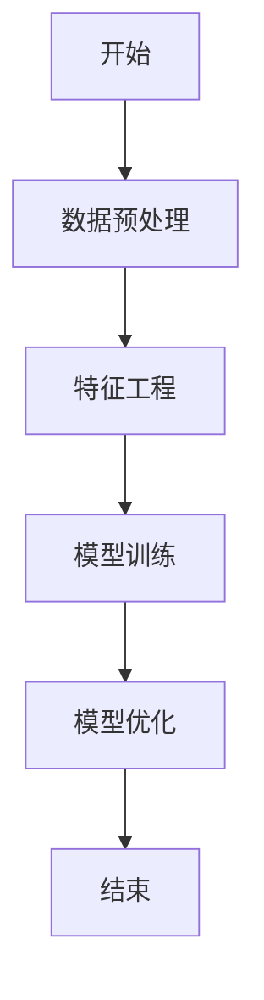
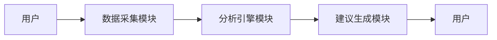
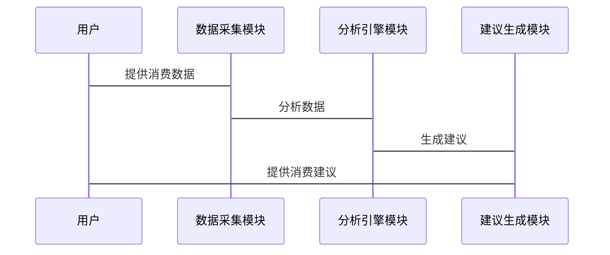

                 


# 第一部分: 智能个人消费模式分析与建议系统概述

# 第1章: 智能个人消费模式分析与建议系统背景介绍

## 1.1 问题背景
### 1.1.1 个人消费模式的现状与挑战
### 1.1.2 智能化消费分析的必要性
### 1.1.3 传统消费分析的局限性

## 1.2 问题描述
### 1.2.1 消费行为分析的核心问题
### 1.2.2 消费建议系统的目标
### 1.2.3 系统边界与外延

## 1.3 核心概念与系统组成
### 1.3.1 智能消费分析的核心要素
### 1.3.2 系统功能模块的构成
### 1.3.3 系统的核心目标与实现方式

## 1.4 本章小结

# 第2章: 智能个人消费模式分析与建议系统的核心概念与联系

## 2.1 核心概念原理
### 2.1.1 数据采集与处理
### 2.1.2 特征提取与分析
### 2.1.3 模型训练与优化

## 2.2 核心概念属性特征对比表
### 表2.1: 核心概念属性特征对比

## 2.3 系统ER实体关系图
```mermaid
er
    actor: 用户
    data_source: 消费数据
    analysis_engine: 分析引擎
    suggestion_module: 建议模块
    rule_set: 规则库
    user_profile: 用户画像
    interaction_log: 交互记录
    actor --> data_source: 提供
    data_source --> analysis_engine: 输入
    analysis_engine --> suggestion_module: 输入
    suggestion_module --> actor: 输出
    analysis_engine --> rule_set: 参考
    user_profile --> analysis_engine:
```

# 第3章: 智能个人消费模式分析与建议系统的算法原理讲解

## 3.1 算法原理概述
### 3.1.1 数据预处理
### 3.1.2 特征工程
### 3.1.3 模型训练

## 3.2 算法流程图


## 3.3 算法实现代码
```python
import pandas as pd
from sklearn.model_selection import train_test_split
from sklearn.linear_model import LinearRegression

# 数据加载
data = pd.read_csv('consumption_data.csv')

# 数据预处理
X = data.drop('消费金额', axis=1)
y = data['消费金额']

# 划分训练集和测试集
X_train, X_test, y_train, y_test = train_test_split(X, y, test_size=0.2, random_state=42)

# 模型训练
model = LinearRegression()
model.fit(X_train, y_train)

# 模型预测
y_pred = model.predict(X_test)
```

## 3.4 数学模型与公式
### 3.4.1 线性回归模型
$$ y = \beta_0 + \beta_1x + \epsilon $$

### 3.4.2 评估指标
$$ R^2 = 1 - \frac{\sum (y_i - \hat{y}_i)^2}{\sum (y_i - \bar{y})^2} $$

# 第4章: 智能个人消费模式分析与建议系统的系统分析与架构设计

## 4.1 问题场景介绍
### 4.1.1 用户消费数据的收集
### 4.1.2 数据分析与处理
### 4.1.3 消费建议的生成

## 4.2 系统功能设计
### 4.2.1 数据采集模块
### 4.2.2 分析引擎模块
### 4.2.3 建议生成模块

## 4.3 系统架构设计


## 4.4 系统接口设计
### 4.4.1 数据接口
### 4.4.2 分析接口
### 4.4.3 建议接口

## 4.5 系统交互流程图


# 第5章: 智能个人消费模式分析与建议系统的项目实战

## 5.1 环境安装与配置
### 5.1.1 安装Python
### 5.1.2 安装必要的库（如Pandas, Scikit-learn）
### 5.1.3 安装Jupyter Notebook

## 5.2 系统核心实现
### 5.2.1 数据预处理代码
### 5.2.2 模型训练代码
### 5.2.3 结果展示代码

## 5.3 实际案例分析
### 5.3.1 数据集介绍
### 5.3.2 数据分析过程
### 5.3.3 模型评估与优化

## 5.4 项目总结与经验分享
### 5.4.1 项目小结
### 5.4.2 经验分享
### 5.4.3 常见问题解答

# 第6章: 智能个人消费模式分析与建议系统的最佳实践

## 6.1 小结
### 6.1.1 核心要点回顾
### 6.1.2 系统设计总结
### 6.1.3 项目实施总结

## 6.2 注意事项
### 6.2.1 数据隐私保护
### 6.2.2 模型优化建议
### 6.2.3 系统维护建议

## 6.3 拓展阅读
### 6.3.1 推荐的书籍
### 6.3.2 关键技术的深入探讨
### 6.3.3 未来研究方向

# 参考文献

# 索引

