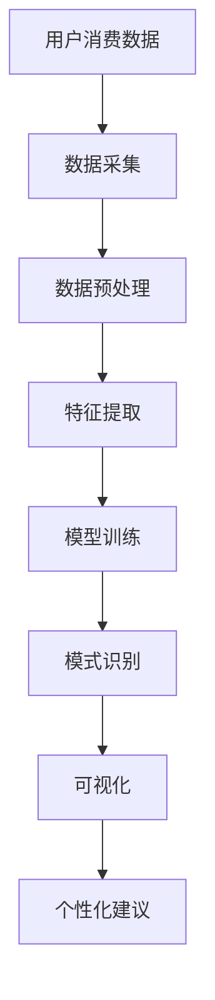
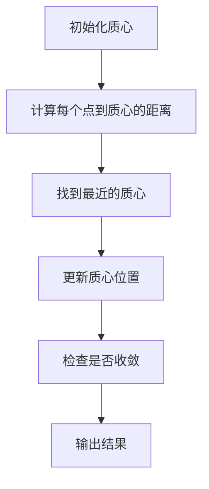
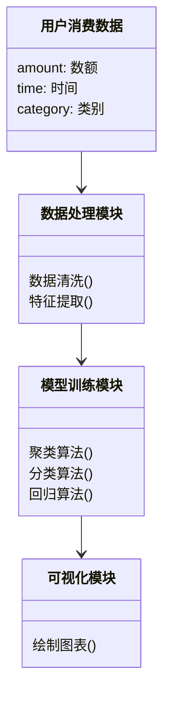
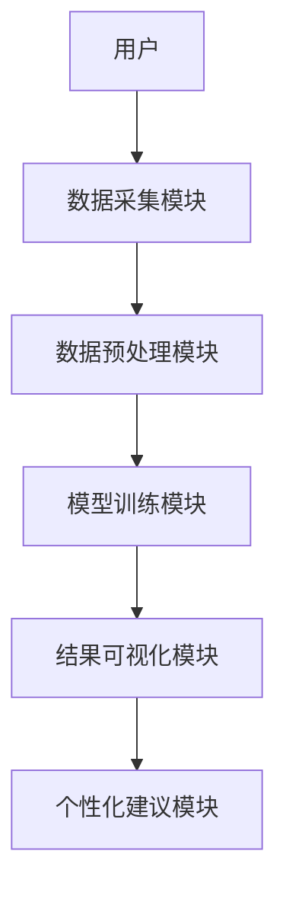
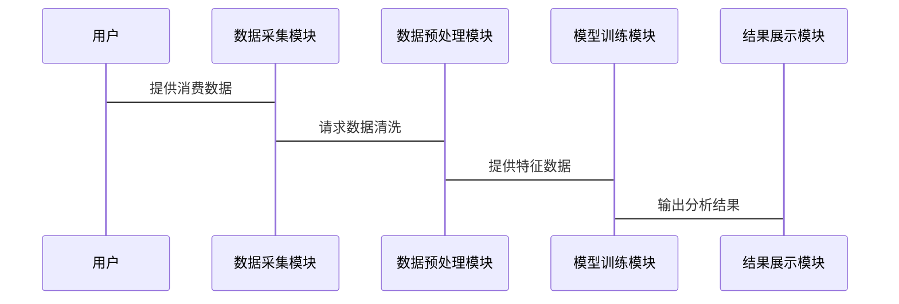

                 


# 《智能个人消费模式分析器》

> 关键词：智能消费分析、数据挖掘、机器学习、系统架构、项目实战

> 摘要：本文旨在探讨如何通过智能个人消费模式分析器，利用数据分析与机器学习技术，实现对个人消费数据的深度挖掘与模式识别。通过系统化的分析流程，本文将介绍从数据收集、预处理、特征提取、模型训练到消费模式分析的完整过程，并结合实际案例进行详细阐述，最终为读者提供一套可操作的解决方案。

---

## 目录

### 第1章: 背景介绍与核心概念

1.1 问题背景与问题描述

1.2 问题解决与边界定义

1.3 核心概念与联系

### 第2章: 数据分析基础

2.1 数据收集与预处理

2.2 数据建模与分析

### 第3章: 数据挖掘与机器学习原理

3.1 数据挖掘基础

3.2 机器学习原理

3.3 算法原理与实现

### 第4章: 系统分析与架构设计

4.1 系统功能设计

4.2 系统架构设计

4.3 系统接口与交互设计

### 第5章: 项目实战

5.1 数据集选择与环境搭建

5.2 核心功能实现

5.3 实际案例分析

### 第6章: 总结与展望

6.1 项目小结

6.2 最佳实践与注意事项

6.3 拓展阅读

---

## 第1章: 背景介绍与核心概念

### 1.1 问题背景与问题描述

#### 1.1.1 个人消费模式的现状与挑战

在当今社会，个人消费行为日益复杂，消费者面临着海量的产品选择和复杂的市场环境。传统的消费分析方法依赖于人工记录和简单的统计分析，难以捕捉消费行为中的深层模式和潜在趋势。随着大数据技术的兴起，如何利用智能技术对个人消费数据进行深度分析，成为了提升消费决策效率和优化个人财务管理的重要课题。

#### 1.1.2 传统消费分析的局限性

- 数据分散：消费数据可能分布在多个平台（如银行、电商、线下商店）中，难以整合。
- 数据量小：传统方法通常基于少量数据进行分析，难以发现复杂模式。
- 分析维度有限：传统分析主要关注总量和时间维度，难以深入挖掘用户行为特征。

#### 1.1.3 智能分析的必要性与目标

智能个人消费模式分析器的目标是通过机器学习和数据挖掘技术，从多源数据中提取有价值的信息，识别消费模式，提供个性化建议。其必要性体现在以下几个方面：

- 提供精准的消费建议，帮助用户优化预算和消费习惯。
- 识别异常消费行为，预防财务风险。
- 为商家提供用户画像，助力精准营销。

### 1.2 问题解决与边界定义

#### 1.2.1 智能个人消费模式分析器的核心目标

- 数据整合与清洗：从多源数据中提取消费数据，并进行标准化处理。
- 模型训练：利用机器学习算法识别消费模式和预测未来消费行为。
- 可视化与建议：以用户友好的方式呈现分析结果，并提供个性化建议。

#### 1.2.2 解决方案的边界与外延

智能个人消费模式分析器的边界包括：

- 数据范围：仅限于用户的消费数据，不涉及其他类型的数据（如社交数据）。
- 使用场景：主要用于个人用户，不支持企业级应用。
- 功能范围：仅限于消费模式分析，不包括预算管理、投资建议等其他功能。

#### 1.2.3 核心要素与组成结构

智能个人消费模式分析器的核心要素包括：

- 数据采集模块：负责从多个数据源采集消费数据。
- 数据处理模块：对数据进行清洗、转换和存储。
- 模型训练模块：基于机器学习算法进行模式识别和预测。
- 可视化模块：将分析结果以图表形式呈现给用户。
- 建议生成模块：根据分析结果生成个性化消费建议。

### 1.3 核心概念与联系

#### 1.3.1 数据流图（Mermaid）



---

## 第2章: 数据分析基础

### 2.1 数据收集与预处理

#### 2.1.1 数据来源与采集方法

- 数据来源：银行交易记录、电商订单数据、线下消费记录。
- 数据采集方法：API接口、数据库抽取、文件导入。

#### 2.1.2 数据清洗与标准化

- 数据清洗：处理缺失值、重复值、异常值。
- 数据标准化：将不同单位的数据转换为统一标准（如金额单位统一）。

#### 2.1.3 数据存储与管理

- 数据存储：使用数据库（如MySQL）或分布式存储系统（如Hadoop）。
- 数据管理：建立数据索引、数据分区、数据归档。

### 2.2 数据建模与分析

#### 2.2.1 数据建模的基本原理

- 数据建模：将数据抽象为模型，便于分析和解释。
- 常见模型：聚类模型、分类模型、回归模型。

#### 2.2.2 数据分析的常用方法

- 描述性分析：总结数据的基本特征。
- 预测性分析：预测未来的消费行为。
- 实验性分析：通过A/B测试优化消费策略。

#### 2.2.3 数据可视化与结果解读

- 数据可视化工具：Matplotlib、Seaborn、Tableau。
- 可视化方法：柱状图、折线图、热力图、散点图。

---

## 第3章: 数据挖掘与机器学习原理

### 3.1 数据挖掘基础

#### 3.1.1 数据挖掘的定义与流程

- 数据挖掘：从海量数据中提取隐含模式和知识的过程。
- 数据挖掘流程：数据清洗、数据预处理、特征提取、模型训练、结果分析。

#### 3.1.2 常见数据挖掘算法

- 聚类算法：K-means、层次聚类。
- 分类算法：决策树、随机森林。
- 关联规则挖掘：Apriori算法。

#### 3.1.3 数据挖掘在消费分析中的应用

- 购物篮分析：识别高频购买的商品组合。
- 消费趋势预测：预测未来的消费热点。

### 3.2 机器学习原理

#### 3.2.1 机器学习的基本概念

- 机器学习：通过数据训练模型，使其具备预测能力。
- 监督学习：有标签的数据训练模型。
- 无监督学习：无标签的数据中发现结构。

#### 3.2.2 监督学习与无监督学习的区别

| 特性       | 监督学习                 | 无监督学习                 |
|------------|--------------------------|--------------------------|
| 数据类型   | 标签数据                 | 无标签数据                 |
| 目标       | 预测或分类               | 发现数据结构               |
| 应用场景   | 预测消费行为             | 聚类消费群体               |

#### 3.2.3 常用机器学习算法及其适用场景

- K-means聚类：用于消费群体划分。
- 逻辑回归：用于消费行为分类。
- 支持向量机（SVM）：用于消费趋势预测。

### 3.3 算法原理与实现

#### 3.3.1 K-means聚类算法（Mermaid流程图）



#### 3.3.2 逻辑回归算法（Python实现）

```python
import numpy as np
from sklearn.linear_model import LogisticRegression

# 数据预处理
X = (X - X.mean()) / X.std()
y = np.array(y).reshape(-1, 1)

# 模型训练
model = LogisticRegression()
model.fit(X, y)

# 预测
y_pred = model.predict(X)
```

#### 3.3.3 数学模型与公式

逻辑回归的损失函数：

$$
L(\theta) = -\frac{1}{m} \sum_{i=1}^{m} [y^{(i)} \log(h(x^{(i)})) + (1 - y^{(i)}) \log(1 - h(x^{(i)}))]
$$

其中，$$h(x) = \frac{1}{1 + e^{-\theta^T x}}$$ 是sigmoid函数。

---

## 第4章: 系统分析与架构设计

### 4.1 系统功能设计

- 用户界面：数据上传、分析结果展示、个性化建议。
- 数据处理：数据清洗、特征提取、模型训练。
- 算法模块：聚类、分类、回归算法实现。

#### 4.1.1 领域模型（Mermaid类图）



### 4.2 系统架构设计

#### 4.2.1 系统架构（Mermaid架构图）



### 4.3 系统接口与交互设计

#### 4.3.1 系统交互（Mermaid序列图）



---

## 第5章: 项目实战

### 5.1 数据集选择与环境搭建

#### 5.1.1 数据集选择

选择一个包含消费金额、时间、商品类别等字段的CSV数据集。

#### 5.1.2 环境搭建

安装Python、Pandas、Scikit-learn、Matplotlib等库。

### 5.2 核心功能实现

#### 5.2.1 数据预处理

```python
import pandas as pd
import numpy as np

# 读取数据
df = pd.read_csv('consumption_data.csv')

# 处理缺失值
df.dropna(inplace=True)

# 标准化处理
from sklearn.preprocessing import StandardScaler
scaler = StandardScaler()
df[['amount', 'time']] = scaler.fit_transform(df[['amount', 'time']])
```

#### 5.2.2 模型训练与分析

```python
from sklearn.cluster import KMeans

# 训练模型
model = KMeans(n_clusters=3, random_state=0)
model.fit(df[['amount', 'time']])

# 可视化
import matplotlib.pyplot as plt

plt.scatter(df['amount'], df['time'], c=model.labels_, cmap='viridis')
plt.xlabel('消费金额')
plt.ylabel('时间')
plt.title('消费聚类分析')
plt.show()
```

### 5.3 实际案例分析

#### 5.3.1 案例背景

假设我们有一个用户的消费数据，包含过去一年的消费记录。

#### 5.3.2 数据分析

- 聚类分析：将消费行为分为高、中、低三个类别。
- 趋势分析：识别出用户的消费高峰和低谷。

#### 5.3.3 消费建议

- 针对高消费群体，建议优化支出结构。
- 针对低消费群体，建议增加某些类别消费。

---

## 第6章: 总结与展望

### 6.1 项目小结

通过智能个人消费模式分析器，我们成功实现了对个人消费数据的深度分析，识别了消费模式，并提供了个性化建议。整个过程涵盖了数据预处理、特征提取、模型训练和结果可视化等多个环节。

### 6.2 最佳实践与注意事项

- 数据隐私保护：在处理用户数据时，必须遵守相关法律法规，保护用户隐私。
- 模型优化：根据实际效果不断调整模型参数，提升分析精度。
- 可视化设计：确保分析结果以直观的方式呈现，方便用户理解。

### 6.3 拓展阅读

- 《集体智慧编程》：学习数据挖掘和群体智慧的应用。
- 《机器学习实战》：深入理解机器学习算法的实现和应用。

---

通过以上内容，我们系统地介绍了智能个人消费模式分析器的构建过程，从理论到实践，为读者提供了一个完整的解决方案。希望本文能为相关领域的研究和应用提供有价值的参考。

