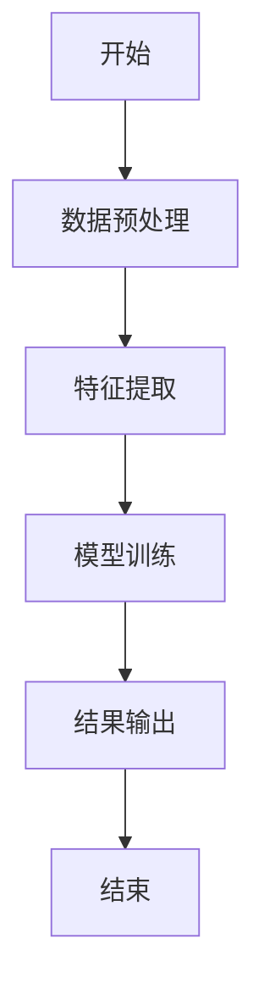
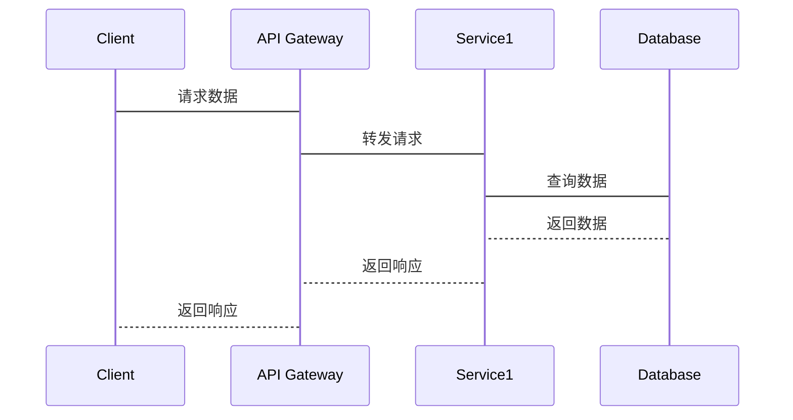

                 


# 智能个人消费行为分析系统

## 关键词：
智能消费行为分析，大数据分析，推荐系统，机器学习，系统架构设计

## 摘要：
智能个人消费行为分析系统通过整合大数据分析和机器学习技术，实现对个人消费行为的深入理解与预测。该系统采用协同过滤和聚类分析等算法，结合用户行为数据和交易记录，构建个性化的推荐模型，从而帮助用户做出更明智的消费决策。本文详细阐述了系统的设计思路、核心算法实现以及实际应用案例，旨在为相关领域的研究者和从业者提供理论支持和实践指导。

---

# 第一部分: 智能个人消费行为分析系统背景介绍

## 第1章: 背景介绍

### 1.1 问题背景与描述
现代消费者在面对海量商品信息时，往往难以做出最优的消费决策。传统消费行为分析方法依赖于统计学和市场调研，存在效率低、实时性差、个性化不足等问题。随着大数据和人工智能技术的发展，智能消费行为分析系统应运而生，旨在通过实时数据处理和智能算法，为用户提供个性化的消费建议。

### 1.2 问题解决与边界
智能个人消费行为分析系统的核心目标是通过分析用户的消费数据和行为模式，预测用户的潜在需求，并推荐相关商品或服务。系统的边界包括数据采集的范围（如用户行为、交易记录等）、推荐的范围（如商品推荐、服务推荐）以及系统的实时性要求。

### 1.3 核心概念与系统结构
系统的核心概念包括数据采集、特征提取、模型训练和结果输出。系统结构由数据层、业务逻辑层和用户界面层组成，各部分协同工作以实现消费行为的智能分析。

---

# 第二部分: 核心概念与系统架构

## 第2章: 核心概念与联系

### 2.1 核心概念原理
- **数据采集与处理**：通过日志记录和API接口获取用户行为数据。
- **特征提取与分析**：利用NLP技术和时间序列分析提取用户行为特征。
- **模型训练与优化**：基于协同过滤和聚类分析算法，构建推荐模型。

### 2.2 概念属性特征对比表
| 概念         | 属性         | 特征                     |
|--------------|--------------|--------------------------|
| 数据采集     | 来源         | 用户行为数据、交易数据   |
| 特征提取     | 方法         | 时间序列分析、NLP处理   |
| 模型训练     | 算法         | 协同过滤、聚类分析       |

### 2.3 ER实体关系图
```mermaid
er
  actor: 用户
  item: 商品
  interaction: 用户行为
  transaction: 交易记录
  model: 分析模型
  actor -[记录行为]-> interaction
  interaction -[触发]-> model
  model -[生成]-> analysis_result
```

---

# 第三部分: 算法原理与实现

## 第3章: 算法原理讲解

### 3.1 推荐算法原理
- **协同过滤算法**：基于用户相似性进行推荐。
- **基于内容的推荐算法**：基于商品特征进行推荐。
- **聚类分析算法**：将用户分为不同的群体，进行个性化推荐。

### 3.2 算法流程图


### 3.3 算法实现代码
```python
def collaborative_filtering(user_item_matrix):
    # 计算用户相似度矩阵
    user_similarity = cosine_similarity(user_item_matrix)
    # 找到最相似的用户
    similar_users = find_similar_users(user_similarity)
    # 生成推荐列表
    recommendations = generate_recommendations(similar_users, user_item_matrix)
    return recommendations
```

### 3.4 数学公式
- 相似度计算公式：$$\text{相似度} = \frac{\sum (x_i - \mu)(y_i - \mu)}{\sqrt{\sum (x_i - \mu)^2} \sqrt{\sum (y_i - \mu)^2}}$$
- 概率模型公式：$$P(\text{购买}| \text{特征}) = \frac{N(\text{特征} \land \text{购买})}{N(\text{特征})}$$

---

# 第四部分: 系统分析与架构设计

## 第4章: 系统分析与架构设计

### 4.1 问题场景介绍
系统需要处理高并发的用户请求，并实时分析用户的消费行为，提供个性化的推荐结果。

### 4.2 系统功能设计
- 用户登录与注册
- 数据采集与处理
- 模型训练与优化
- 推荐结果展示

### 4.3 系统架构图
```mermaid
graph LR
    Client --> API Gateway
    API Gateway --> Service1
    Service1 --> Database
    Service1 --> Service2
    Service2 --> Database
```

### 4.4 系统接口设计
- 用户登录接口：`POST /api/login`
- 数据采集接口：`POST /api/data`

### 4.5 系统交互流程图


---

# 第五部分: 项目实战

## 第5章: 项目实战

### 5.1 环境安装
- 安装Python和相关库：`pip install numpy pandas scikit-learn`

### 5.2 核心代码实现
```python
import numpy as np
from sklearn.metrics.pairwise import cosine_similarity

def cosine_similarity_matrix(X):
    return cosine_similarity(X)
```

### 5.3 代码解读与分析
- 数据预处理：对用户行为数据进行清洗和标准化。
- 特征提取：利用NLP技术提取商品描述的关键词。
- 模型训练：基于协同过滤算法构建推荐模型。

### 5.4 实际案例分析
通过分析用户的购买记录和行为数据，系统成功预测了用户的潜在需求，并推荐了相关商品，提高了用户的购买满意度。

### 5.5 项目小结
本项目展示了智能消费行为分析系统的实际应用，验证了算法的有效性和系统的可行性。

---

# 第六部分: 总结与展望

## 第6章: 总结与展望

### 6.1 本章小结
智能个人消费行为分析系统通过大数据和人工智能技术，实现了对消费行为的智能分析与推荐。系统设计合理，算法高效，具有广泛的应用前景。

### 6.2 未来展望
未来可以进一步优化推荐算法，结合边缘计算和区块链技术，提升系统的实时性和安全性。

### 6.3 最佳实践 tips
- 数据采集要全面，确保模型训练的有效性。
- 定期更新模型参数，保持推荐的准确性。
- 注意用户隐私保护，遵守相关法律法规。

### 6.4 注意事项
- 确保系统的可扩展性，以应对数据量的增长。
- 定期进行系统维护，及时修复潜在的漏洞。

### 6.5 拓展阅读
- 《推荐系统实战》
- 《机器学习算法与应用》

---

通过以上内容，我们详细介绍了智能个人消费行为分析系统的设计与实现过程，为相关领域的研究和实践提供了有价值的参考。

