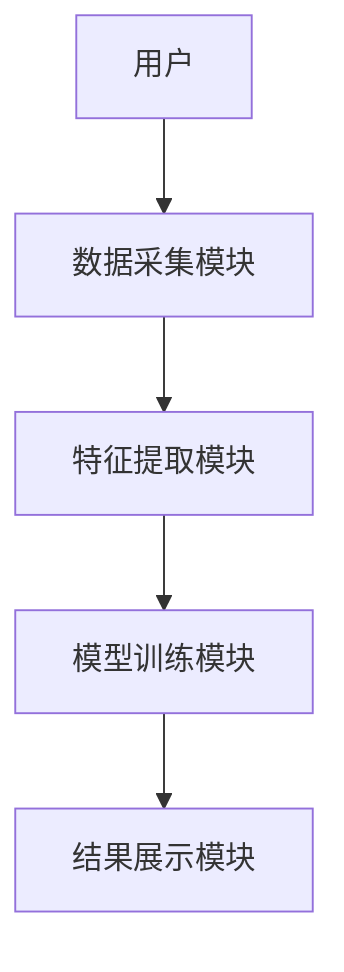

                 


# 智能个人消费行为异常检测

**关键词：** 智能消费行为，异常检测，机器学习，数据挖掘，深度学习

**摘要：**  
智能个人消费行为异常检测是利用人工智能技术，通过分析个人消费数据，识别出异常的消费行为。本文将从背景、数据采集、算法原理、系统架构到项目实战，全面解析智能消费行为异常检测的实现过程。通过监督学习、无监督学习和深度学习等多种算法，结合实际案例，探讨如何有效检测和分析异常消费行为，为金融、零售等领域提供智能化的解决方案。

---

## 第一部分: 智能个人消费行为异常检测概述

### 第1章: 个人消费行为异常检测的背景与意义

#### 1.1 问题背景与定义
消费行为是个人日常生活的重要组成部分，异常消费行为可能表明欺诈、信用风险或其他潜在问题。例如，信用卡欺诈检测、异常支出预警等场景中，及时识别异常行为至关重要。

#### 1.2 消费行为的定义与分类
消费行为可以分为正常行为和异常行为。正常行为符合用户的消费习惯，而异常行为则可能违反用户的消费模式，如短时间内大量消费、地理位置异常等。

#### 1.3 异常检测的必要性
异常检测可以帮助金融机构、零售商等及时发现潜在风险，减少经济损失，提升用户体验。例如，检测信用卡欺诈可以避免银行的经济损失，检测异常支出可以帮助用户防范财务风险。

#### 1.4 问题描述与解决思路
通过分析用户的消费数据，构建一个分类模型，识别正常和异常行为。使用监督学习、无监督学习等方法，结合特征工程，优化模型性能。

---

## 第二部分: 数据采集与预处理

### 第2章: 数据采集与特征工程

#### 2.1 数据来源与采集方法
消费数据可能来自多种渠道，如银行交易记录、电商平台数据、地理位置信息等。需要通过API接口、日志文件等方式采集数据。

#### 2.2 特征工程与数据增强
- **特征选择：** 提取关键特征，如消费金额、时间间隔、地理位置、消费频率等。
- **数据增强：** 通过数据变换（如归一化、标准化）和特征组合，提升模型的鲁棒性。

#### 2.3 数据集构建与管理
- 数据清洗：处理缺失值、异常值。
- 数据标注：将正常和异常行为进行标签化。

---

## 第三部分: 核心算法与模型

### 第3章: 监督学习与无监督学习

#### 3.1 监督学习方法
- **随机森林：** 通过特征重要性分析，识别关键特征。
- **XGBoost：** 常用于分类任务，性能优秀。
- **逻辑回归：** 常用于二分类问题，如正常与异常分类。

#### 3.2 无监督学习方法
- **Isolation Forest：** 适合小样本异常检测。
- **LOF（局部 outlier factor）：** 基于局部密度的异常检测。

#### 3.3 深度学习方法
- **LSTM：** 适用于时间序列数据，捕捉消费行为的时序特征。
- **Transformer：** 适用于长序列数据，捕捉全局特征。

---

## 第四部分: 系统架构与实现

### 第4章: 系统架构与实现

#### 4.1 系统功能设计
- 数据采集模块：采集消费数据。
- 特征提取模块：提取关键特征。
- 模型训练模块：训练分类模型。
- 结果展示模块：可视化异常检测结果。

#### 4.2 系统架构图


---

## 第五部分: 项目实战

### 第5章: 项目实战

#### 5.1 环境安装
- Python 3.8+
- Scikit-learn、XGBoost、TensorFlow

#### 5.2 核心实现代码
```python
from sklearn.ensemble import IsolationForest
import pandas as pd

# 数据加载
data = pd.read_csv('consumption.csv')

# 特征提取
features = data[['amount', 'time', 'location']]

# 模型训练
model = IsolationForest(random_state=42)
model.fit(features)

# 预测异常
outliers = model.predict(features)
data['is_outlier'] = outliers
```

#### 5.3 实际案例分析
- 数据分析：提取消费金额、时间间隔等特征。
- 模型训练：使用Isolation Forest检测异常。

---

## 第六部分: 高级主题与扩展

### 第6章: 高级主题与扩展

#### 6.1 模型可解释性
- 使用SHAP值解释模型决策。

#### 6.2 模型鲁棒性
- 使用网格搜索优化模型参数。

#### 6.3 实时检测
- 实时数据流处理，采用流式计算框架。

---

## 第七部分: 总结与展望

### 第7章: 总结与展望

#### 7.1 总结
通过监督学习、无监督学习和深度学习等多种方法，结合特征工程和系统架构设计，可以有效检测个人消费行为的异常。

#### 7.2 展望
未来可以进一步研究模型的可解释性和实时性，结合联邦学习等技术，提升检测能力。

---

通过以上步骤，我们详细介绍了智能个人消费行为异常检测的实现过程。希望本文能为相关领域的研究和应用提供参考。

