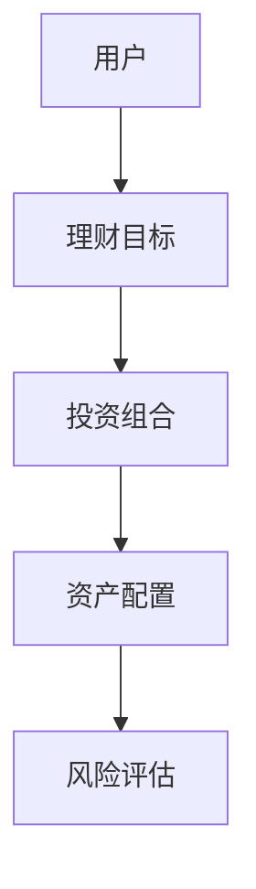
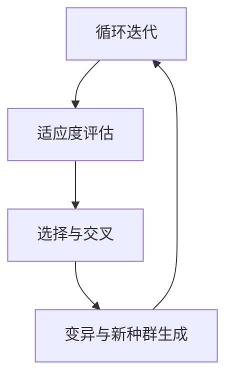
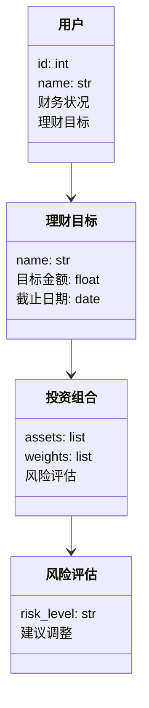
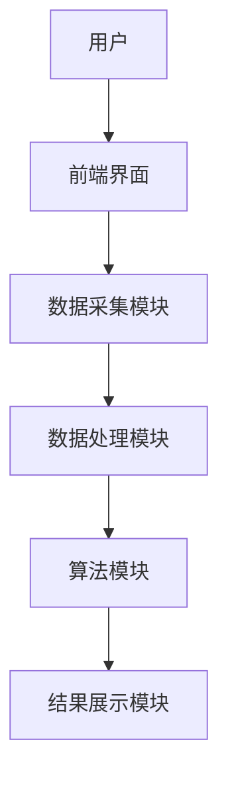

                 


# 智能个人理财目标规划器

## 关键词：
- 智能理财、目标规划、投资组合、风险控制、遗传算法、系统架构

## 摘要：
本文将详细探讨智能个人理财目标规划器的设计与实现，从背景介绍、核心概念、算法原理、系统架构到项目实战，逐步解析如何利用现代技术实现个性化的理财目标规划。本文将结合具体案例，通过技术细节的深入分析，帮助读者理解如何通过智能算法优化投资组合，降低风险，实现财务目标。

---

# 第一部分: 智能个人理财目标规划器的背景与概念

## 第1章: 背景介绍

### 1.1 智能个人理财的背景

#### 1.1.1 传统个人理财的局限性
传统个人理财方式依赖于人工计算和经验判断，存在以下问题：
- 信息不对称：个人难以获取全面的市场数据。
- 计算复杂：手动计算投资组合的收益与风险较为繁琐。
- 时间成本高：需要花费大量时间进行数据分析与策略调整。

#### 1.1.2 数字化与智能化的兴起
随着人工智能、大数据和云计算技术的快速发展，智能理财工具逐渐普及，能够帮助用户：
- 自动化数据采集与分析。
- 实时监控市场动态。
- 提供个性化投资建议。

#### 1.1.3 个人理财目标规划的重要性
明确的理财目标是实现财务自由的关键，智能理财目标规划器能够：
- 帮助用户设定合理的财务目标。
- 制定个性化的投资策略。
- 实时跟踪目标的实现进度。

### 1.2 智能理财规划器的定义

#### 1.2.1 核心概念：问题背景与问题描述
智能理财规划器是一种基于人工智能技术的工具，通过分析用户的财务状况、市场数据和风险偏好，提供个性化的投资建议和目标规划。

#### 1.2.2 问题解决的路径与方法
- 数据采集：获取用户的财务状况、市场数据等信息。
- 数据分析：利用机器学习算法对数据进行建模和分析。
- 投资建议：根据分析结果生成最优投资组合。
- 目标跟踪：实时跟踪投资组合的表现，调整策略以实现目标。

#### 1.2.3 边界与外延：智能理财规划器的功能范围
- 数据范围：包括用户资产、收入、支出等。
- 时间范围：支持短期、中期和长期目标规划。
- 功能范围：包括目标设定、投资建议、风险评估、策略调整等。

#### 1.2.4 核心要素：目标、预算、投资、风险控制
| 核心要素 | 描述 |
|----------|------|
| 目标 | 用户的财务目标，如资产增值、保值等。 |
| 预算 | 用户的可投资金额和风险承受能力。 |
| 投资 | 根据目标和预算制定的投资策略。 |
| 风险控制 | 通过分散投资和动态调整降低风险。 |

### 1.3 本章小结
本章从背景出发，介绍了智能理财规划器的定义、核心概念及其重要性，为后续章节的深入分析奠定了基础。

---

## 第2章: 智能理财规划器的核心概念与联系

### 2.1 核心概念原理

#### 2.1.1 数据采集与处理
智能理财规划器需要采集以下数据：
- 用户数据：收入、支出、资产、负债等。
- 市场数据：股票、基金、债券等的实时价格和历史数据。

#### 2.1.2 风险评估与收益预测
通过历史数据分析和机器学习模型预测：
- 风险评估：使用均值-方差模型评估投资组合的风险。
- 收益预测：基于市场趋势和经济指标预测未来收益。

#### 2.1.3 投资组合优化
通过算法优化投资组合，实现收益与风险的平衡。

### 2.2 核心概念属性对比表

| 核心概念 | 属性 | 描述 |
|----------|------|------|
| 数据采集 | 来源 | 用户输入、市场数据接口 |
| 数据采集 | 方法 | API接口、爬虫技术 |
| 风险评估 | 模型 | Markowitz均值-方差模型 |
| 风险评估 | 参数 | 风险承受能力、历史波动率 |

### 2.3 ER实体关系图



### 2.4 本章小结
本章详细分析了智能理财规划器的核心概念及其联系，为后续的算法设计和系统实现提供了理论基础。

---

## 第3章: 算法原理与数学模型

### 3.1 算法原理

#### 3.1.1 遗传算法在投资组合优化中的应用



#### 3.1.2 均值-方差模型

$$ \text{目标函数} = \min \left( \sigma^2 \right) $$
$$ \text{约束条件} = \begin{cases} \sum w_i r_i = \mu \\ \sum w_i = 1 \end{cases} $$

### 3.2 算法实现

#### 3.2.1 Python实现

```python
import numpy as np
import pandas as pd

def portfolio_optimization(returns):
    n = len(returns.columns)
    # 初始化种群
    population = np.random.random(n)
    # 适应度函数
    def fitness(weights):
        return np.var(weights.dot(returns.T))
    # 迭代优化
    for _ in range(100):
        # 计算适应度
        fitness_scores = [fitness(weights) for weights in population]
        # 选择与交叉
        # 畸异与新种群生成
```

---

## 第4章: 系统分析与架构设计

### 4.1 系统功能设计

#### 4.1.1 领域模型类图



### 4.2 系统架构设计

#### 4.2.1 系统架构图



---

## 第5章: 项目实战

### 5.1 环境安装

#### 5.1.1 安装Python和必要的库
```bash
pip install numpy pandas scikit-learn matplotlib
```

#### 5.1.2 启动环境
```bash
python -m jupyter notebook
```

### 5.2 核心代码实现

#### 5.2.1 数据采集模块

```python
import pandas as pd
import requests

def get_market_data(tickers):
    data = []
    for ticker in tickers:
        url = f"https://api.example.com/stock/{ticker}"
        response = requests.get(url)
        data.append(response.json())
    return pd.DataFrame(data)
```

#### 5.2.2 投资组合优化模块

```python
import numpy as np
from sklearn import metrics

def optimize_portfolio(returns):
    n = len(returns.columns)
    population = np.random.random(n)
    for _ in range(100):
        fitness_scores = [np.var(weights.dot(returns.T)) for weights in population]
        selected = population[np.argsort(fitness_scores)[:2]]
        # 交叉与变异
    best_weights = population[np.argmin(fitness_scores)]
    return best_weights
```

---

## 第6章: 最佳实践

### 6.1 小结
智能个人理财目标规划器通过结合先进的算法和系统架构设计，能够帮助用户实现个性化的理财目标，降低投资风险，提高投资收益。

### 6.2 注意事项
- 数据隐私保护：确保用户数据的安全性。
- 算法的可解释性：避免过于复杂的算法导致用户不信任。
- 动态调整策略：根据市场变化实时调整投资组合。

### 6.3 扩展阅读
- 《Python机器学习》
- 《投资学原理》
- 《系统设计的艺术》

---

## 附录
- 附录A: 常用Python库与工具
- 附录B: 算法实现的详细代码
- 附录C: 系统架构设计的详细说明

---

## 索引
- 智能理财规划器
- 投资组合优化
- 风险评估
- 系统架构设计
- 机器学习算法

