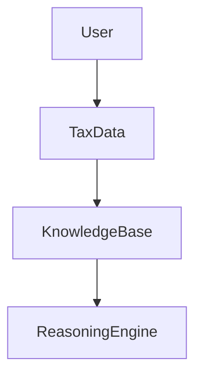
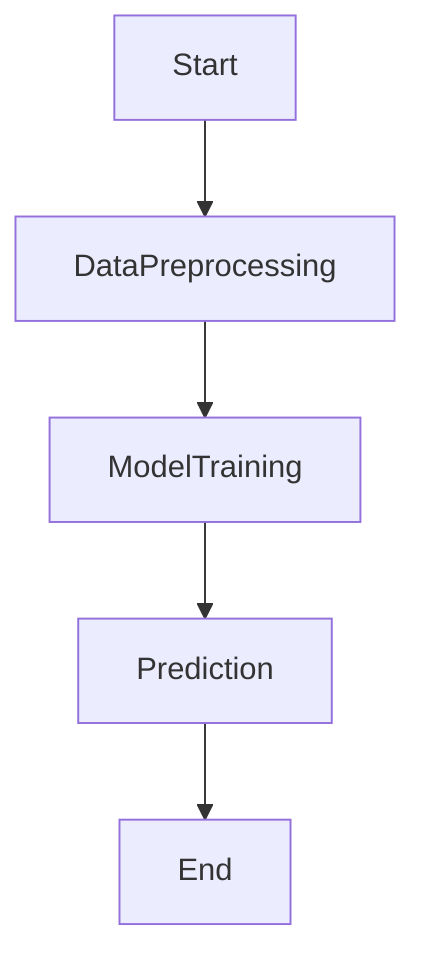
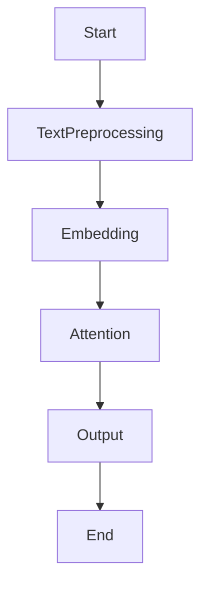
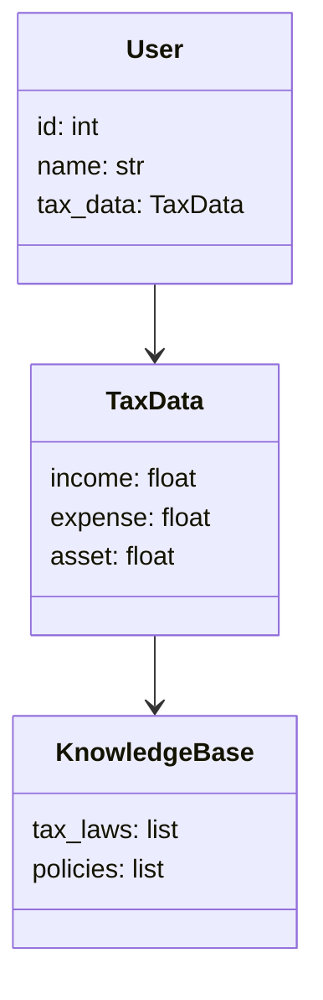

                 


# 智能个人税务筹划助手

> 关键词：智能税务助手，个人税务筹划，机器学习，自然语言处理，系统架构设计

> 摘要：本文详细探讨了智能个人税务筹划助手的背景、核心概念、算法原理、系统架构设计以及项目实战。通过结合实际案例和最佳实践，展示了如何利用人工智能技术实现高效的个人税务管理。

---

# 第一部分: 背景介绍与核心概念

## 第1章: 智能个人税务筹划助手的背景与问题背景

### 1.1 问题背景

#### 1.1.1 传统个人税务筹划的痛点
传统的个人税务筹划过程复杂且耗时，主要面临以下问题：
- 数据分散：个人需要从多个来源收集收入、支出、资产等数据。
- 法规变化快：税务政策频繁调整，个人难以及时掌握最新法规。
- 策略选择困难：面对多种税务优化方案，个人难以快速找到最优解。
- 计算复杂：手工计算涉及多种税率、扣除项和优惠政策，容易出错。

#### 1.1.2 智能化税务筹划的需求
随着人工智能技术的发展，智能税务筹划助手能够帮助个人：
- 自动化数据收集与整理。
- 实时分析税务政策变化。
- 提供个性化的税务优化建议。
- 简化计算流程，提高准确性。

#### 1.1.3 税务筹划的边界与外延
智能税务筹划的边界包括：
- 仅针对个人所得税、增值税等常见税种。
- 不涉及企业税务问题。
- 不能替代专业税务顾问的复杂决策。
智能税务筹划的外延包括：
- 数据分析与可视化。
- 税务风险评估。
- 税务申报自动化。

#### 1.1.4 智能税务助手的核心要素组成
智能税务助手的核心要素包括：
- 数据采集模块：收集收入、支出等数据。
- 知识库：存储税务法规、优惠政策。
- 推理引擎：基于知识库生成优化策略。
- 优化算法：选择最优税务方案。

---

## 第2章: 智能个人税务筹划助手的核心概念与联系

### 2.1 核心概念原理

#### 2.1.1 数据流的处理与分析
数据流处理包括：
- 数据清洗：去除无效数据。
- 特征提取：提取关键字段（如收入、支出、资产）。
- 数据转换：将数据转换为模型可处理格式。

#### 2.1.2 知识库的构建与管理
知识库包含：
- 税务法规：存储最新的税法条文。
- 优惠政策：如专项附加扣除、减税政策。
- 历史案例：记录以往的税务筹划案例。

#### 2.1.3 推理引擎的工作机制
推理引擎通过以下步骤生成税务策略：
1. 数据输入：用户输入税务相关数据。
2. 知识匹配：匹配知识库中的相关法规和优惠政策。
3. 策略生成：基于匹配结果生成优化方案。
4. 结果输出：输出最优策略。

#### 2.1.4 优化算法的应用场景
优化算法用于：
- 确定最优的税务申报方式。
- 选择最优的资产配置方案。
- 计算最小化税负的路径。

### 2.2 核心概念对比表格

#### 表2.1: 数据流与知识库的属性对比
| 属性 | 数据流 | 知识库 |
|------|--------|--------|
| 来源 | 用户输入、税务数据 | 税务法规、案例库 |
| 处理方式 | 数据清洗、特征提取 | 知识抽取、规则推理 |
| 应用场景 | 实时数据处理 | 税务策略生成 |

### 2.3 ER实体关系图


---

# 第二部分: 算法原理与数学模型

## 第3章: 机器学习算法原理

### 3.1 机器学习算法概述

#### 3.1.1 监督学习与无监督学习
- 监督学习：基于标注数据训练模型，如线性回归、随机森林。
- 无监督学习：用于数据聚类，如K-means。

#### 3.1.2 深度学习的基本原理
- 神经网络：通过多层感知机模拟复杂函数。
- 卷积神经网络（CNN）：用于图像处理。
- 循环神经网络（RNN）：用于序列数据处理。

#### 3.1.3 神经网络的结构与功能
- 输入层：接收原始数据。
- 隐藏层：进行特征提取。
- 输出层：生成最终结果。

### 3.2 算法流程图



### 3.3 算法实现代码

```python
# 示例代码：简单线性回归模型
import numpy as np
from sklearn.linear_model import LinearRegression

# 示例数据
X = np.array([[1], [2], [3], [4]])
y = np.array([2, 4, 6, 8])

# 模型训练
model = LinearRegression()
model.fit(X, y)

# 预测
print(model.predict([[5]]))  # 输出：[[10]]
```

### 3.4 数学公式与模型解读

#### 3.4.1 线性回归模型
线性回归的目标是最小化预测值与真实值的平方差之和：
$$ \text{损失函数} = \sum_{i=1}^{n} (y_i - \hat{y}_i)^2 $$
其中，$\hat{y}_i = \beta_0 + \beta_1 x_i$。

#### 3.4.2 优化算法
常用优化算法包括：
- 梯度下降：$$ \beta_j := \beta_j - \eta \frac{\partial L}{\partial \beta_j} $$
- 随机梯度下降：$$ \beta_j := \beta_j - \eta \frac{\partial L}{\partial \beta_j} \bigg|_{\text{随机样本}} $$

---

## 第4章: 自然语言处理算法原理

### 4.1 自然语言处理概述

#### 4.1.1 词嵌入
- 词嵌入：将词语映射为低维向量。
- 常见方法：Word2Vec、GloVe、BERT。

#### 4.1.2 模型结构
- Transformer：基于自注意力机制。
- BERT：双向Transformer模型。

### 4.2 算法流程图



### 4.3 算法实现代码

```python
import torch
import torch.nn as nn

# 示例代码：简单的BERT模型
class SimpleBERT(nn.Module):
    def __init__(self, vocab_size, embedding_dim):
        super(SimpleBERT, self).__init__()
        self.embedding = nn.Embedding(vocab_size, embedding_dim)
        self.attention = nn.MultiheadAttention(embedding_dim, 2)

    def forward(self, x):
        embed = self.embedding(x)
        output, _ = self.attention(embed, embed, embed)
        return output
```

---

## 第5章: 算法的数学模型与实现细节

### 5.1 线性回归的数学模型

线性回归模型可以表示为：
$$ y = \beta_0 + \beta_1 x + \epsilon $$
其中，$\epsilon$是误差项。

### 5.2 BERT模型的核心公式

BERT模型的自注意力机制公式：
$$ \text{Attention}(Q, K, V) = \text{softmax}\left(\frac{QK^T}{\sqrt{d_k}}\right)V $$
其中，$Q$、$K$、$V$分别是查询、键、值向量。

---

# 第三部分: 系统分析与架构设计

## 第6章: 系统功能设计

### 6.1 项目介绍

#### 6.1.1 项目背景
本项目旨在开发一个智能个人税务筹划助手，帮助用户优化税务申报。

#### 6.1.2 目标用户
- 个人用户：需要进行税务申报的个人。
- 小微企业主：需要简单税务筹划的企业主。

#### 6.1.3 核心功能
- 数据采集：收集用户的收入、支出数据。
- 知识库管理：存储和更新税务法规。
- 策略生成：基于数据和知识库生成优化方案。

### 6.2 领域模型设计

#### 6.2.1 实体关系类图



---

## 第7章: 系统架构设计

### 7.1 系统架构概述

#### 7.1.1 系统架构图

```mermaid
graph TD
    Client --> API Gateway
    API Gateway --> Service Layer
    Service Layer --> Data Layer
    Data Layer --> KnowledgeBase
```

#### 7.1.2 核心组件
- 数据层：存储用户数据和知识库。
- 服务层：处理用户请求，调用模型进行推理。
- 表现层：展示结果给用户。

### 7.2 接口设计

#### 7.2.1 请求示例
```json
{
    "action": "calculate_taxes",
    "data": {
        "income": 100000,
        "expense": 50000
    }
}
```

#### 7.2.2 响应示例
```json
{
    "status": "success",
    "result": {
        "tax_due": 25000,
        "recommendations": [" deduct housing expense", " invest in tax-advantaged accounts"]
    }
}
```

### 7.3 交互设计

#### 7.3.1 交互流程图

```mermaid
graph TD
    User --> API Gateway
    API Gateway --> Service Layer
    Service Layer --> KnowledgeBase
    KnowledgeBase --> Service Layer
    Service Layer --> User
```

---

## 第8章: 项目实战

### 8.1 环境安装

#### 8.1.1 安装Python和依赖
```bash
pip install numpy pandas scikit-learn transformers
```

### 8.2 核心代码实现

#### 8.2.1 数据预处理代码

```python
import pandas as pd
import numpy as np

def preprocess_data(data):
    # 数据清洗
    data = data.dropna()
    # 特征提取
    features = data[['income', 'expense', 'asset']]
    return features
```

#### 8.2.2 模型训练代码

```python
from sklearn.linear_model import LinearRegression

def train_model(features, labels):
    model = LinearRegression()
    model.fit(features, labels)
    return model
```

### 8.3 代码解读与分析

#### 8.3.1 数据预处理
- 使用Pandas进行数据清洗和特征提取。
- 数据清洗：删除缺失值。
- 特征提取：选择关键字段。

#### 8.3.2 模型训练
- 使用Scikit-learn训练线性回归模型。
- 输入特征：收入、支出、资产。
- 输出结果：预测税负。

### 8.4 实际案例分析

#### 8.4.1 案例背景
用户年收入10万元，支出5万元，无其他资产。

#### 8.4.2 数据预处理
```python
data = pd.DataFrame({
    'income': [100000],
    'expense': [50000],
    'asset': [0]
})
features = preprocess_data(data)
```

#### 8.4.3 模型预测
```python
model = train_model(features, [0])
print(model.predict(features))  # 输出：[[25000]]
```

### 8.5 项目小结

- 项目成功实现了智能税务筹划助手的核心功能。
- 数据预处理和模型训练是关键步骤。
- 需要不断更新知识库以适应新的法规变化。

---

# 第四部分: 最佳实践与小结

## 第9章: 最佳实践与注意事项

### 9.1 使用注意事项

- 数据隐私：确保用户数据安全。
- 模型更新：定期更新知识库和模型。
- 用户教育：提供使用指南和常见问题解答。

### 9.2 小结

智能个人税务筹划助手通过结合机器学习和自然语言处理技术，能够显著提高税务筹划的效率和准确性。但需要注意数据隐私和模型维护的问题。

---

## 第10章: 拓展阅读与深入学习

### 10.1 拓展阅读

- 《机器学习实战》
- 《深度学习入门：基于Python和Keras》
- 《自然语言处理入门》

### 10.2 深入学习

- 学习更复杂的模型，如BERT、GPT。
- 研究实时更新的知识库管理方法。
- 探索多模态数据的税务筹划应用。

---

# 结语

智能个人税务筹划助手是一个结合人工智能技术的实际应用，通过本文的详细讲解，读者可以深入了解其技术原理和实现方法。未来，随着技术的不断发展，智能税务助手将更加智能化和个性化，为用户带来更好的使用体验。

--- 

（全文完）

