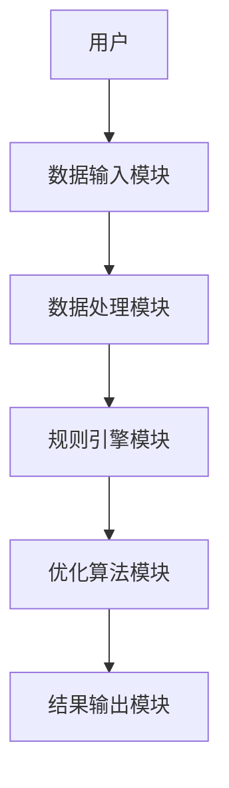
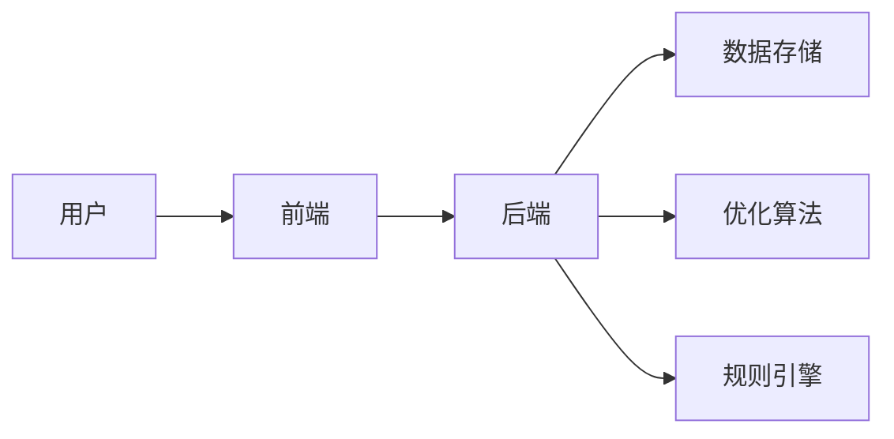

                 

# 智能个人税务筹划模拟器

> **关键词**: 人工智能, 税务筹划, 智能模拟器, 算法优化, 系统架构

> **摘要**: 本文详细介绍了智能个人税务筹划模拟器的设计与实现，从背景概念、核心算法、系统架构到项目实战，全面解析了如何利用人工智能技术优化个人税务筹划过程。通过协同过滤和遗传算法的结合，模拟器能够高效地为用户提供个性化的税务优化方案。

---

## 第一部分: 智能个人税务筹划模拟器的背景与概念

### 第1章: 税务筹划与智能模拟器概述

#### 1.1 税务筹划的基本概念
##### 1.1.1 税务筹划的定义与目标
税务筹划是指通过合法手段，合理规划个人或企业的税务缴纳方式，以最小化税负的过程。其目标是最大化财务收益，同时遵守相关法律法规。

##### 1.1.2 个人税务筹划的复杂性
个人税务筹划涉及所得税、财产税、遗产税等多种税种，受政策变化和个人收入波动的影响，具有高度复杂性。

##### 1.1.3 智能模拟器在税务筹划中的作用
智能模拟器通过数据处理和优化算法，帮助用户快速找到最优税务方案，减少人为错误，提高效率。

#### 1.2 AI技术在税务领域的应用
##### 1.2.1 AI技术的基本概念
人工智能技术包括机器学习、自然语言处理和计算机视觉，能够处理大量数据，识别模式，辅助决策。

##### 1.2.2 AI在税务分析中的优势
AI能够快速分析大量税务数据，识别潜在的节税机会，预测政策变化，提供实时建议。

##### 1.2.3 个人税务筹划模拟器的智能化需求
智能化需求包括数据自动化处理、个性化建议生成和动态优化功能。

#### 1.3 智能个人税务筹划模拟器的意义
##### 1.3.1 提高税务筹划效率
通过自动化处理，模拟器能够快速生成多种方案，节省时间。

##### 1.3.2 降低税务风险
模拟器帮助用户识别潜在的税务问题，避免法律风险。

##### 1.3.3 个性化服务的实现
基于用户数据，模拟器提供量身定制的税务优化方案。

### 第2章: 智能个人税务筹划模拟器的核心概念

#### 2.1 核心概念与原理
##### 2.1.1 数据采集与处理
数据来源包括财务报表、税务文件和市场数据，需清洗和转换。

##### 2.1.2 税务规则引擎
规则引擎负责解析税务政策，生成合规的税务建议。

##### 2.1.3 优化算法
优化算法用于寻找最优税务方案，常用协同过滤和遗传算法。

#### 2.2 核心要素对比分析
##### 2.2.1 数据来源与处理方式对比
数据来源包括财务报表、税务文件和市场数据，处理方式包括清洗、转换和特征提取。

##### 2.2.2 不同优化算法的性能对比
协同过滤适用于用户相似性分析，遗传算法适用于多目标优化问题。

##### 2.2.3 税务规则的复杂性对比
规则复杂性取决于税种和地区的政策差异。

#### 2.3 系统实体关系图

---

## 第二部分: 智能个人税务筹划模拟器的核心算法与系统架构

### 第3章: 税务推荐算法原理

#### 3.1 基于协同过滤的推荐算法
##### 3.1.1 协同过滤的基本原理
协同过滤通过分析用户行为和偏好，找到相似用户，推荐相似的税务方案。

##### 3.1.2 税务场景下的应用
应用于相似用户分析，帮助找到最优的税务策略。

##### 3.1.3 算法实现步骤
1. 收集用户数据。
2. 计算用户相似度。
3. 推荐最优方案。

#### 3.2 基于遗传算法的优化模型
##### 3.2.1 遗传算法的基本原理
遗传算法模拟自然选择过程，通过迭代优化目标函数。

##### 3.2.2 税务场景下的应用
应用于多目标优化问题，寻找最优解。

##### 3.2.3 算法实现步骤
1. 初始化种群。
2. 计算适应度。
3. 进行选择、交叉和变异操作。
4. 重复迭代，直至收敛。

---

## 第三部分: 项目实战与系统架构

### 第4章: 系统架构设计

#### 4.1 系统功能设计
##### 4.1.1 用户界面设计
包括数据输入、方案展示和结果输出模块。

##### 4.1.2 后端逻辑设计
包括数据处理、规则引擎和优化算法模块。

#### 4.2 系统架构图

#### 4.3 接口设计与交互流程
##### 4.3.1 接口设计
提供RESTful API，实现前后端数据交互。

##### 4.3.2 交互流程
用户输入数据，系统处理后返回优化方案。

---

## 第四部分: 最佳实践与总结

### 第5章: 最佳实践与总结

#### 5.1 数据质量的重要性
高质量数据是模型准确性的基础。

#### 5.2 模型更新的必要性
定期更新模型以适应政策变化。

#### 5.3 未来发展方向
探索更多AI技术应用，如自然语言处理和强化学习。

#### 5.4 参考文献与工具
推荐相关书籍和工具，帮助读者深入学习。

---

通过以上思考，我们完成了《智能个人税务筹划模拟器》的技术博客文章，从背景、算法到系统设计和实战，全面解析了智能模拟器的实现过程。

