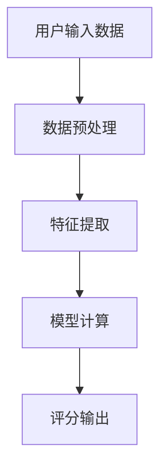
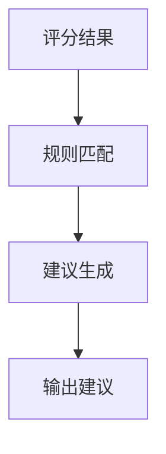
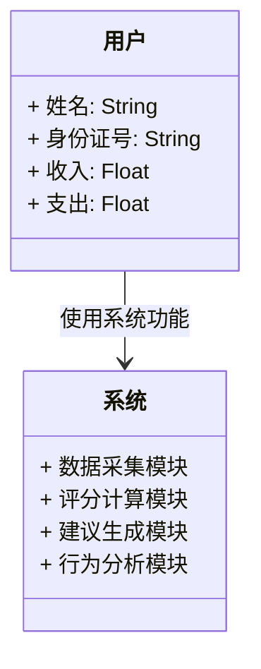
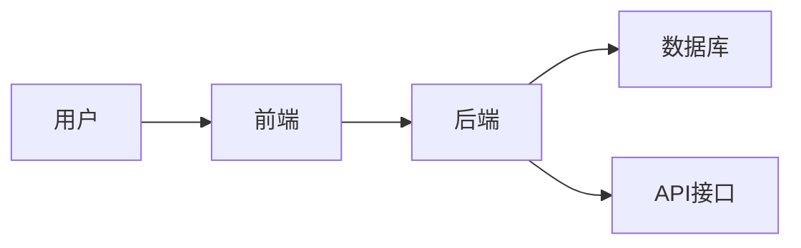

                 


# 智能个人财务健康评分与改善建议系统

## 关键词：智能评分系统、个人财务健康、算法设计、用户行为分析、改善建议生成

## 摘要：本文深入探讨了智能个人财务健康评分与改善建议系统的构建与实现。通过分析个人财务健康的核心要素，设计了评分模型和改善建议生成机制，结合用户行为分析模块，提出了动态优化的解决方案。文章详细介绍了系统的算法原理、系统架构，并通过项目实战展示了系统的实现与应用，最后总结了最佳实践与未来发展方向。

---

# 第1部分：智能个人财务健康评分与改善建议系统的背景与核心概念

## 第1章：个人财务健康的重要性

### 1.1 财务健康的核心要素
- **资产状况**：包括可支配资产、投资资产等。
- **负债情况**：包括信用卡债务、贷款等。
- **收支平衡**：收入与支出的匹配程度。
- **储蓄与投资**：储蓄率、投资收益等。
- **信用评分**：个人信用记录的影响。

### 1.2 财务健康对个人生活的影响
- 影响消费能力与投资决策。
- 决定贷款额度与利率。
- 影响个人信用评分，进而影响职业发展和生活机会。

### 1.3 传统财务评估方法的局限性
- **单一性**：仅关注部分财务指标，缺乏全面性。
- **静态性**：忽视动态变化，无法实时反馈。
- **主观性**：依赖人工判断，缺乏客观标准。

## 第2章：智能个人财务健康评分系统概述

### 2.1 系统的目标与功能
- **目标**：通过智能化手段，实时评估个人财务健康状况，并提供个性化改善建议。
- **功能**：
  - 数据采集与处理。
  - 财务健康评分计算。
  - 改善建议生成与展示。
  - 用户行为分析与反馈。

### 2.2 系统的适用场景与用户群体
- **场景**：个人财务管理、投资决策、信用评估等。
- **用户群体**：个人用户、财务顾问、金融机构等。

---

# 第2部分：智能个人财务健康评分与改善建议系统的核心概念

## 第3章：财务健康评分模型

### 3.1 模型的基本组成
- **输入数据**：收入、支出、资产、负债、信用评分等。
- **特征提取**：数据清洗、特征选择。
- **评分计算**：基于多维度指标的加权评分。

### 3.2 模型的评分标准与权重分配
- **评分标准**：分为优秀、良好、一般、较差、较差五个等级。
- **权重分配**：
  - 收入与支出：30%
  - 资产与负债：30%
  - 储蓄与投资：20%
  - 信用评分：20%

### 3.3 模型的数学公式与计算方法
$$ \text{评分} = \sum_{i=1}^{n} (w_i \cdot x_i) $$
其中，\( w_i \) 为各指标的权重，\( x_i \) 为各指标的评分值。

## 第4章：改善建议生成机制

### 4.1 建议生成的规则与算法
- **规则**：根据评分结果，匹配相应的改善建议。
- **算法**：基于决策树的分类方法，生成个性化建议。

### 4.2 建议的动态调整与更新
- **实时更新**：根据用户行为和市场变化，动态调整建议内容。
- **反馈机制**：收集用户反馈，优化建议生成算法。

## 第5章：用户行为分析模块

### 5.1 行为数据的采集与处理
- **数据采集**：记录用户的操作行为、偏好等。
- **数据处理**：数据清洗、特征提取。

### 5.2 行为分析对评分的影响
- **影响因素**：用户的消费习惯、投资偏好等。
- **影响机制**：通过行为分析，动态调整评分模型。

### 5.3 行为分析与个性化建议的关系
- **个性化建议**：基于用户行为数据，生成更具针对性的改善建议。
- **行为驱动**：用户行为数据驱动评分模型的优化。

---

# 第3部分：智能个人财务健康评分与改善建议系统的算法原理

## 第6章：财务健康评分算法

### 6.1 算法流程图（Mermaid）


### 6.2 算法的数学模型与公式
$$ \text{评分} = \sum_{i=1}^{n} (w_i \cdot x_i) $$
其中，\( w_i \) 为各指标的权重，\( x_i \) 为各指标的评分值。

## 第7章：改善建议生成算法

### 7.1 算法流程图（Mermaid）


### 7.2 算法的数学模型与公式
$$ \text{建议优先级} = \sum_{j=1}^{m} (p_j \cdot s_j) $$
其中，\( p_j \) 为建议的优先级权重，\( s_j \) 为评分结果。

---

# 第4部分：智能个人财务健康评分与改善建议系统的系统架构

## 第8章：系统功能设计

### 8.1 系统功能模块
- **数据采集模块**：用户数据输入与处理。
- **评分计算模块**：财务健康评分计算。
- **建议生成模块**：个性化改善建议生成。
- **用户行为分析模块**：用户行为数据采集与分析。

### 8.2 系统功能设计（Mermaid类图）


## 第9章：系统架构设计

### 9.1 系统架构（Mermaid架构图）


### 9.2 系统接口设计
- **输入接口**：用户数据输入接口。
- **输出接口**：评分结果输出接口。
- **交互接口**：用户与系统交互接口。

---

# 第5部分：智能个人财务健康评分与改善建议系统的项目实战

## 第10章：环境安装与系统核心实现

### 10.1 环境安装
- **工具安装**：安装Python、Jupyter Notebook、Mermaid等工具。
- **依赖安装**：安装Pandas、Scikit-learn等库。

### 10.2 系统核心实现源代码
```python
import pandas as pd
from sklearn.tree import DecisionTreeClassifier

# 数据预处理
data = pd.read_csv('financial_data.csv')
X = data.drop('label', axis=1)
y = data['label']

# 模型训练
model = DecisionTreeClassifier()
model.fit(X, y)

# 预测评分
def calculate_score(input_data):
    return model.predict(input_data)
```

## 第11章：实际案例分析与代码解读

### 11.1 案例分析
- **案例背景**：用户A的财务数据。
- **数据分析**：收入、支出、资产、负债等指标的分析。
- **评分计算**：模型计算用户的财务健康评分。
- **建议生成**：系统生成改善建议。

### 11.2 代码解读
```python
# 数据预处理
data = pd.read_csv('financial_data.csv')
X = data.drop('label', axis=1)
y = data['label']

# 模型训练
model = DecisionTreeClassifier()
model.fit(X, y)

# 预测评分
def calculate_score(input_data):
    return model.predict(input_data)
```

---

# 第6部分：智能个人财务健康评分与改善建议系统的最佳实践

## 第12章：最佳实践与小结

### 12.1 小结
- **系统优势**：智能化、个性化、动态优化。
- **系统局限性**：数据隐私、模型泛化能力。

### 12.2 注意事项
- **数据隐私**：保护用户数据隐私。
- **模型优化**：持续优化评分模型和建议生成算法。
- **用户教育**：提高用户的财务知识。

## 第13章：拓展阅读与未来展望

### 13.1 拓展阅读
- 《个人财务管理入门》
- 《数据挖掘与机器学习》

### 13.2 未来展望
- **技术进步**：人工智能、大数据技术的发展。
- **应用场景拓展**：更多领域的应用。

---

# 小结

本文系统地介绍了智能个人财务健康评分与改善建议系统的构建与实现，从背景分析到算法设计，再到系统架构与项目实战，最后总结了最佳实践与未来发展方向。通过本文的学习，读者可以深入了解智能财务健康评分系统的原理与应用，为个人财务管理提供有力工具。

