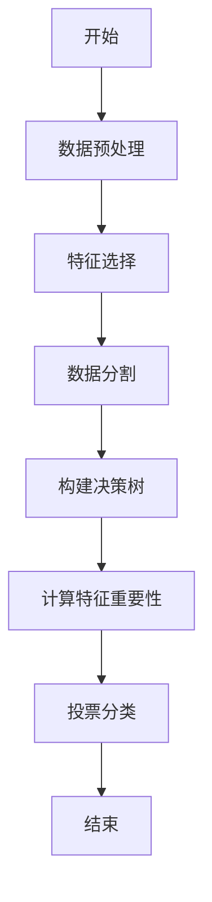
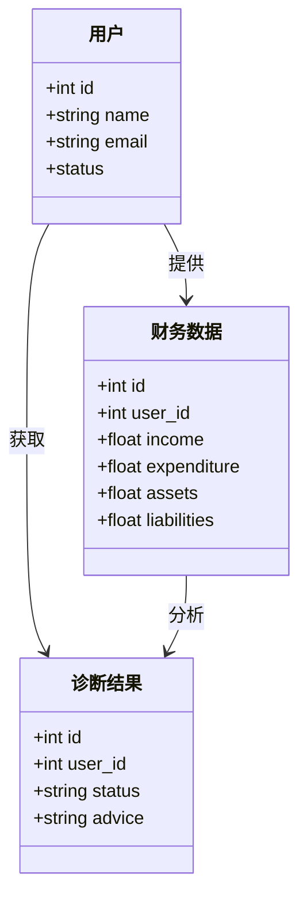
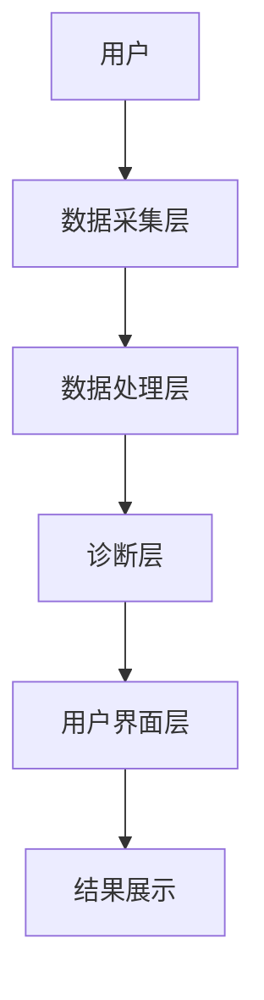
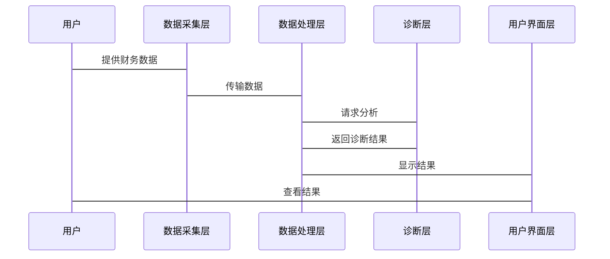

                 


# 智能个人财务健康诊断系统

> 关键词：智能个人财务健康诊断系统，人工智能，财务管理，系统设计，算法实现，健康诊断

> 摘要：本文介绍了一种基于人工智能的智能个人财务健康诊断系统，旨在通过分析个人的财务数据，提供个性化的财务健康评估和优化建议。文章详细探讨了系统的背景与问题分析、核心概念与联系、算法原理与数学模型、系统架构与设计、项目实战以及最佳实践等部分内容，帮助读者全面理解该系统的实现与应用。

---

## 第一部分: 智能个人财务健康诊断系统的背景与核心概念

### 第1章: 个人财务健康诊断的背景与问题分析

#### 1.1 个人财务健康诊断的重要性
个人财务管理是每个人生活中不可忽视的一部分。传统的财务管理方式依赖于人工记录和分析，这种方式效率低下、容易出错，且难以及时发现潜在问题。随着人工智能技术的发展，智能财务健康诊断系统应运而生，能够帮助个人高效、准确地进行财务管理，预防和解决潜在的财务问题。

##### 1.1.1 个人财务管理的传统方式与局限性
传统的个人财务管理方式主要包括手动记录收支、使用简单的电子表格工具进行数据整理等。这种方式存在以下局限性：
- 数据记录繁琐，容易出错。
- 缺乏智能化的分析工具，难以发现潜在问题。
- 无法提供个性化的优化建议。

##### 1.1.2 数字化与智能化财务管理的必要性
随着信息技术的飞速发展，数字化和智能化的财务管理方式逐渐成为趋势。智能个人财务健康诊断系统能够通过自动化数据采集、智能分析和实时反馈，帮助用户更好地管理财务状况。

##### 1.1.3 个人财务健康诊断的定义与目标
个人财务健康诊断是指通过分析个人的财务数据，评估其财务状况的健康程度，并提供相应的优化建议。其目标是帮助个人实现财务安全、资产增值和长期财务规划。

#### 1.2 问题背景与现状分析
##### 1.2.1 当前个人财务管理中的主要问题
当前个人财务管理中存在以下主要问题：
- 数据分散：财务数据可能分布在多个平台，难以统一管理。
- 缺乏深度分析：传统工具难以提供深层次的财务分析和预测。
- 知识不足：部分用户缺乏财务管理知识，无法制定合理的财务计划。

##### 1.2.2 传统财务管理工具的不足
传统财务管理工具主要依赖于电子表格和手动记录，存在以下不足：
- 数据处理效率低。
- 分析功能有限。
- 缺乏智能化的优化建议。

##### 1.2.3 人工智能在财务管理中的应用潜力
人工智能技术在财务管理中的应用潜力巨大，能够通过大数据分析、机器学习等技术，实现财务数据的深度挖掘和智能预测，为用户提供个性化的财务管理服务。

#### 1.3 智能个人财务健康诊断系统的边界与外延
##### 1.3.1 系统的功能边界
智能个人财务健康诊断系统的主要功能包括：
- 数据采集：从多个数据源获取财务数据。
- 数据处理：对数据进行清洗、整理和分析。
- 财务诊断：根据分析结果，评估财务健康状况。
- 优化建议：提供个性化的财务管理建议。

##### 1.3.2 系统的外延与扩展性
系统可以通过扩展功能模块，进一步增强其功能，例如：
- 财务预测：基于历史数据，预测未来的财务状况。
- 资产配置：根据用户的财务目标，优化资产配置。
- 风险预警：实时监测财务风险，及时发出预警。

##### 1.3.3 系统与相关领域的联系
智能个人财务健康诊断系统与多个领域密切相关，例如：
- 人工智能：通过机器学习算法进行数据分析。
- 数据挖掘：从海量数据中提取有价值的信息。
- 财务管理：结合财务管理理论，提供专业的诊断和建议。

### 第2章: 智能个人财务健康诊断系统的概念与核心要素

#### 2.1 智能个人财务健康诊断系统的定义
智能个人财务健康诊断系统是一种基于人工智能技术的财务管理系统，能够通过采集、分析和处理个人财务数据，评估财务健康状况，并提供个性化的优化建议。

##### 2.1.1 系统的定义
智能个人财务健康诊断系统通过整合个人的收入、支出、资产和负债等数据，利用机器学习算法进行分析，评估财务健康状况，并提供优化建议。

##### 2.1.2 系统的核心功能
- 数据采集：从银行账户、信用卡、投资平台等多个数据源获取财务数据。
- 数据处理：对数据进行清洗、整理和分析。
- 财务诊断：基于分析结果，评估财务健康状况。
- 优化建议：根据诊断结果，提供个性化的财务管理建议。

#### 2.2 系统的核心要素与组成
##### 2.2.1 数据采集模块
数据采集模块负责从多个数据源获取财务数据，包括：
- 银行账户：记录收入和支出。
- 信用卡：记录消费记录。
- 投资平台：记录资产和投资收益。

##### 2.2.2 数据处理与分析模块
数据处理与分析模块对采集到的数据进行清洗、整理和分析，包括：
- 数据清洗：去除重复数据、填补缺失值。
- 数据整理：将数据组织成易于分析的格式。
- 数据分析：通过机器学习算法进行分类、聚类和预测。

##### 2.2.3 诊断与建议模块
诊断与建议模块根据分析结果，评估财务健康状况，并提供优化建议，包括：
- 财务状况评估：将用户财务状况分为健康、亚健康和不健康三个等级。
- 优化建议：根据诊断结果，提供具体的财务优化建议，例如调整支出结构、增加投资等。

#### 2.3 系统的核心概念与联系
##### 2.3.1 数据流与系统架构
系统数据流从数据采集模块开始，经过数据处理与分析模块，最终到达诊断与建议模块。整个流程形成了一个闭环，能够实时更新和优化。

##### 2.3.2 核心概念对比表
| 核心概念 | 传统财务管理 | 智能个人财务健康诊断系统 |
|----------|--------------|--------------------------|
| 数据源   | 单一来源     | 多个数据源               |
| 分析方式 | 手工分析     | 智能化分析               |
| 诊断结果 | 简单分类     | 细致分类和优化建议       |

##### 2.3.3 ER实体关系图
以下是系统的ER实体关系图（使用Mermaid）：

```mermaid
erDiagram
    customer[用户] {
        +int id
        +string name
        +string email
    }
    financial_data[财务数据] {
        +int id
        +int customer_id
        +float income
        +float expenditure
        +float assets
        +float liabilities
    }
    diagnosis[诊断结果] {
        +int id
        +int customer_id
        +string status
        +string advice
    }
    customer --> financial_data : 提供
    customer --> diagnosis : 获取
    financial_data --> diagnosis : 分析
```

---

## 第三部分: 系统算法原理与数学模型

### 第3章: 系统算法原理与数学模型

#### 3.1 系统算法概述
##### 3.1.1 算法选择与原理
系统采用随机森林算法进行分类。随机森林是一种基于决策树的集成学习方法，具有高准确性和稳定性。

##### 3.1.2 算法流程图
以下是随机森林算法的流程图（使用Mermaid）：



##### 3.1.3 算法实现与代码示例
以下是Python代码示例：

```python
import pandas as pd
from sklearn.ensemble import RandomForestClassifier
from sklearn.model_selection import train_test_split
from sklearn.metrics import accuracy_score

# 加载数据
data = pd.read_csv('financial_data.csv')

# 特征选择
features = ['income', 'expenditure', 'assets', 'liabilities']
target = 'status'

X = data[features]
y = data[target]

# 数据分割
X_train, X_test, y_train, y_test = train_test_split(X, y, test_size=0.2, random_state=42)

# 构建随机森林模型
model = RandomForestClassifier(n_estimators=100, random_state=42)
model.fit(X_train, y_train)

# 预测
y_pred = model.predict(X_test)

# 计算准确率
accuracy = accuracy_score(y_test, y_pred)
print(f'准确率: {accuracy}')
```

#### 3.2 数学模型与公式
##### 3.2.1 数据预处理与特征提取
- 数据标准化：$x' = \frac{x - \mu}{\sigma}$
- 特征重要性：使用随机森林模型计算特征重要性。

##### 3.2.2 分类模型的构建
随机森林算法的数学模型如下：

$$
y = \sum_{i=1}^{n} \text{Tree}_i(x) \times \frac{1}{n}
$$

##### 3.2.3 风险评估模型
风险评估模型可以使用概率论中的贝叶斯定理：

$$
P(A|B) = \frac{P(B|A) \cdot P(A)}{P(B)}
$$

---

## 第四部分: 系统架构与设计

### 第4章: 系统架构与设计

#### 4.1 系统架构概述
##### 4.1.1 分层架构设计
系统采用分层架构，包括数据采集层、数据处理层、诊断层和用户界面层。

##### 4.1.2 模块化设计
系统功能模块化设计，包括数据采集模块、数据处理模块、诊断模块和用户界面模块。

#### 4.2 系统功能设计
##### 4.2.1 领域模型设计
以下是系统的领域模型设计（使用Mermaid）：



##### 4.2.2 系统架构设计
以下是系统的架构设计图（使用Mermaid）：



##### 4.2.3 系统接口设计
系统接口设计包括：
- 数据接口：从数据源获取财务数据。
- 分析接口：对数据进行处理和分析。
- 展示接口：将诊断结果展示给用户。

##### 4.2.4 系统交互流程
以下是系统的交互流程图（使用Mermaid）：



---

## 第五部分: 项目实战

### 第5章: 项目实战

#### 5.1 环境安装与配置
##### 5.1.1 安装Python
安装Python 3.8或更高版本。

##### 5.1.2 安装依赖库
安装以下依赖库：

```bash
pip install pandas scikit-learn matplotlib
```

#### 5.2 系统核心实现
##### 5.2.1 数据采集模块
数据采集模块可以从多个数据源获取财务数据，例如：

```python
import requests
import json

def get_financial_data(api_key):
    url = f'https://api.example.com/financial_data?api_key={api_key}'
    response = requests.get(url)
    data = json.loads(response.text)
    return data
```

##### 5.2.2 数据处理模块
数据处理模块对采集到的数据进行清洗和分析：

```python
import pandas as pd
from sklearn.impute import SimpleImputer

def process_data(data):
    df = pd.DataFrame(data)
    # 处理缺失值
    imputer = SimpleImputer(strategy='mean')
    df_imputed = imputer.fit_transform(df)
    return df_imputed
```

##### 5.2.3 诊断与建议模块
诊断与建议模块根据分析结果提供优化建议：

```python
from sklearn.ensemble import RandomForestClassifier
import numpy as np

def diagnose财务状况(data):
    # 假设data已经经过处理
    model = RandomForestClassifier()
    model.fit(data, labels)
    predictions = model.predict(data)
    return predictions
```

#### 5.3 实际案例分析与实现
##### 5.3.1 数据准备
加载财务数据：

```python
data = pd.read_csv('financial_data.csv')
```

##### 5.3.2 数据处理
清洗数据：

```python
data.dropna(inplace=True)
data = pd.get_dummies(data)
```

##### 5.3.3 模型训练
训练随机森林模型：

```python
X = data.drop('status', axis=1)
y = data['status']

from sklearn.model_selection import train_test_split
X_train, X_test, y_train, y_test = train_test_split(X, y, test_size=0.2, random_state=42)

model = RandomForestClassifier(n_estimators=100, random_state=42)
model.fit(X_train, y_train)
```

##### 5.3.4 模型评估
评估模型性能：

```python
from sklearn.metrics import classification_report

y_pred = model.predict(X_test)
print(classification_report(y_test, y_pred))
```

##### 5.3.5 优化建议
根据模型预测结果，提供优化建议：

```python
diagnosis = model.predict(X_test)
for i in range(len(diagnosis)):
    if diagnosis[i] == 0:
        print("财务状况健康，继续保持。")
    elif diagnosis[i] == 1:
        print("财务状况亚健康，建议调整支出结构。")
    else:
        print("财务状况不健康，建议寻求专业帮助。")
```

#### 5.4 项目总结
通过实际案例分析，我们可以看到智能个人财务健康诊断系统在实际应用中的潜力。系统能够高效地分析财务数据，提供准确的诊断结果和优化建议，帮助用户实现更好的财务管理。

---

## 第六部分: 最佳实践与总结

### 第6章: 最佳实践与总结

#### 6.1 小结
智能个人财务健康诊断系统通过整合人工智能技术，能够高效、准确地分析个人财务数据，提供个性化的优化建议。系统的实现不仅提高了财务管理的效率，还为用户提供了科学的财务决策支持。

#### 6.2 注意事项
- 数据隐私：在处理个人财务数据时，必须注意数据隐私和安全。
- 模型选择：选择合适的机器学习算法，确保模型的准确性和稳定性。
- 持续优化：定期更新模型和数据，确保系统的持续优化。

#### 6.3 拓展阅读
- 《机器学习实战》：深入理解机器学习算法的实现与应用。
- 《Python数据分析》：掌握Python在数据分析中的应用技巧。
- 《人工智能与财务管理》：探索人工智能在财务管理领域的更多应用。

---

## 结语

智能个人财务健康诊断系统是人工智能技术在财务管理领域的重要应用之一。通过本文的介绍，读者可以全面了解系统的实现过程和应用价值。未来，随着人工智能技术的不断发展，智能个人财务健康诊断系统将更加智能化、个性化，为用户的财务管理提供更加高效和精准的支持。

--- 

以上内容按照要求逐步展开，涵盖了系统背景、核心概念、算法原理、系统架构、项目实战以及最佳实践等部分，结构清晰，内容详实，适合技术博客的撰写要求。

