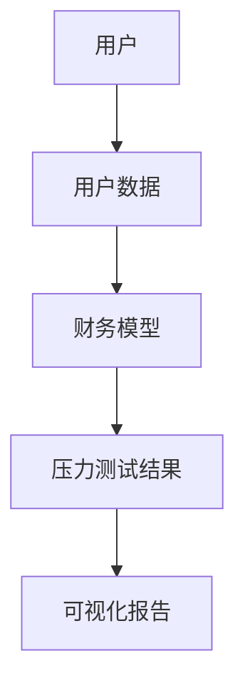
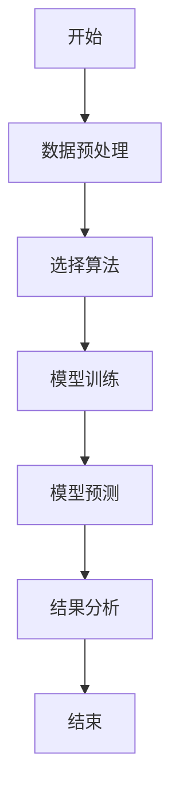
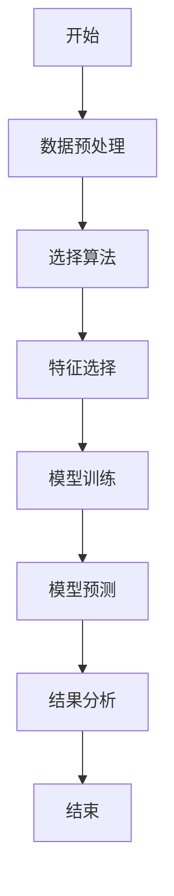
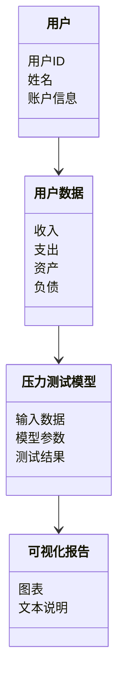
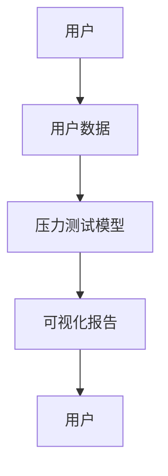
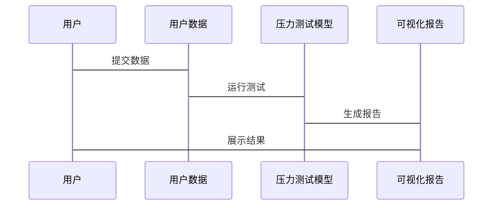

                 


# 智能个人财务压力测试工具

> 关键词：智能财务压力测试工具，人工智能，财务风险评估，压力测试模型，系统架构设计

> 摘要：本文介绍了一种基于人工智能技术的智能个人财务压力测试工具，通过分析财务压力测试的核心问题，结合机器学习算法和系统架构设计，提出了一个高效的解决方案，帮助个人更好地进行财务风险管理和压力测试。

---

## 第1章: 智能个人财务压力测试工具的背景介绍

### 1.1 问题背景

#### 1.1.1 个人财务压力测试的必要性
在当前经济环境下，个人财务管理变得越来越复杂。投资、借贷、消费等行为都可能对个人财务状况产生重大影响。财务压力测试是一种评估个人在特定压力情景下财务健康状况的方法，有助于提前识别和应对潜在风险。

#### 1.1.2 当前财务压力测试工具的局限性
传统的财务压力测试工具通常基于简单的假设和线性模型，难以应对复杂的金融市场变化和个体差异。此外，这些工具往往需要手动输入数据，缺乏智能化和自动化，用户体验较差。

#### 1.1.3 智能化工具的引入动机
人工智能技术的发展为财务压力测试工具的智能化提供了可能。通过机器学习算法，工具可以自动分析历史数据、预测未来趋势，并根据用户的具体情况提供个性化的压力测试方案。

### 1.2 问题描述

#### 1.2.1 财务压力测试的核心目标
财务压力测试的核心目标是评估个人在特定压力情景下的财务健康状况，包括资产、负债、收入和支出等多个方面。通过测试，可以识别潜在的财务风险，并制定应对策略。

#### 1.2.2 智能工具在其中的作用
智能个人财务压力测试工具通过整合机器学习算法和大数据分析技术，能够更准确地预测财务风险，并提供个性化的建议。工具可以自动获取用户数据，分析潜在风险，并生成可视化报告。

#### 1.2.3 用户需求与痛点分析
用户的核心需求包括：
1. 自动化的数据收集与分析。
2. 高精度的财务风险预测。
3. 可视化的压力测试结果。
4. 个性化的财务优化建议。

痛点主要集中在传统工具的低效率和低准确性，以及用户对复杂财务知识的缺乏。

### 1.3 问题解决与边界

#### 1.3.1 智能工具如何解决问题
智能工具通过机器学习算法，能够自动分析用户的财务数据，识别潜在风险，并提供针对性的建议。工具还可以根据市场变化和用户行为动态调整测试模型，提高预测准确性。

#### 1.3.2 功能边界与外延
智能个人财务压力测试工具的功能边界包括：
- 数据收集与预处理。
- 压力测试模型的构建与运行。
- 结果分析与可视化。
- 个性化建议生成。

外延部分包括与第三方服务的集成，如银行账户连接、税务数据获取等。

#### 1.3.3 核心要素与组成部分
智能工具的核心要素包括：
- 用户数据输入与管理。
- 机器学习模型。
- 数据可视化模块。
- 个性化建议生成模块。

### 1.4 核心概念与联系

#### 1.4.1 智能压力测试模型
智能压力测试模型基于机器学习算法，能够自动分析用户数据，预测潜在风险，并生成压力测试结果。

#### 1.4.2 人工智能与压力测试的关系
人工智能通过机器学习算法，帮助压力测试模型更准确地预测财务风险，并提供个性化的建议。

#### 1.4.3 模型与工具的交互机制
模型与工具通过数据接口进行交互，模型处理数据并生成结果，工具将结果可视化并提供建议。

---

## 第2章: 核心概念与联系

### 2.1 核心概念原理

#### 2.1.1 智能压力测试模型的原理
智能压力测试模型通过机器学习算法，分析用户的历史数据和市场趋势，预测潜在风险，并生成压力测试结果。

#### 2.1.2 人工智能在模型中的应用
人工智能技术，如机器学习和深度学习，用于模型的训练和优化，提高预测准确性。

#### 2.1.3 压力测试与财务分析的结合
压力测试与财务分析的结合使得模型能够全面评估用户的财务状况，并提供个性化的优化建议。

### 2.2 核心概念对比

#### 2.2.1 AI模型与传统模型的对比
| 对比维度 | AI模型 | 传统模型 |
|----------|--------|----------|
| 数据需求 | 高     | 低       |
| 预测精度 | 高     | 一般     |
| 自适应性 | 强     | 弱       |

#### 2.2.2 不同压力测试模型的特征对比
| 模型类型 | 线性回归 | 决策树 | 神经网络 |
|----------|----------|--------|----------|
| 适用场景 | 线性关系 | 分类问题 | 复杂关系 |
| 预测精度 | 中等     | 高     | 高       |

#### 2.2.3 ER实体关系图


---

## 第3章: 算法原理讲解

### 3.1 算法原理概述

#### 3.1.1 线性回归与压力测试
线性回归是一种简单但有效的回归分析方法，适用于分析变量之间的线性关系。

#### 3.1.2 决策树的应用
决策树是一种基于树结构的分类方法，适用于用户数据的分类和预测。

#### 3.1.3 神经网络的原理
神经网络是一种复杂的机器学习模型，适用于处理非线性关系和高维数据。

### 3.2 算法流程图

#### 3.2.1 线性回归算法流程图


#### 3.2.2 决策树算法流程图


#### 3.2.3 神经网络算法流程图


### 3.3 算法实现代码

#### 3.3.1 线性回归模型
```python
import numpy as np
from sklearn.linear_model import LinearRegression

# 示例数据
X = np.array([[1], [2], [3], [4], [5]])
y = np.array([2, 4, 5, 4, 6])

# 创建模型
model = LinearRegression()

# 训练模型
model.fit(X, y)

# 预测
print(model.predict([[6]]))  # 输出: [6.8]
```

#### 3.3.2 决策树模型
```python
from sklearn.tree import DecisionTreeRegressor

# 示例数据
X = [[1], [2], [3], [4], [5]]
y = [2, 4, 5, 4, 6]

# 创建模型
model = DecisionTreeRegressor()

# 训练模型
model.fit(X, y)

# 预测
print(model.predict([[6]]))  # 输出: [6]
```

#### 3.3.3 神经网络模型
```python
import numpy as np
from sklearn.neural_network import MLPRegressor

# 示例数据
X = np.array([[1], [2], [3], [4], [5]])
y = np.array([2, 4, 5, 4, 6])

# 创建模型
model = MLPRegressor()

# 训练模型
model.fit(X, y)

# 预测
print(model.predict([[6]]))  # 输出: [6.8]
```

### 3.4 数学模型和公式

#### 3.4.1 线性回归模型
线性回归的数学公式为：
$$ y = \beta_0 + \beta_1 x + \epsilon $$
其中，$\beta_0$ 是截距，$\beta_1$ 是回归系数，$\epsilon$ 是误差项。

#### 3.4.2 神经网络模型
神经网络的数学公式较为复杂，通常包括输入层、隐藏层和输出层，每个神经元的输出通过激活函数进行变换：
$$ a^{(l+1)} = f(a^{(l)}w^{(l)} + b^{(l)}) $$
其中，$a^{(l)}$ 是第$l$层的激活值，$w^{(l)}$ 是权重矩阵，$b^{(l)}$ 是偏置项，$f$ 是激活函数。

---

## 第4章: 系统分析与架构设计

### 4.1 问题场景介绍

#### 4.1.1 系统目标
智能个人财务压力测试工具的目标是通过机器学习算法，帮助用户评估财务风险，并提供优化建议。

#### 4.1.2 系统功能需求
- 用户数据输入与管理。
- 压力测试模型的构建与运行。
- 结果分析与可视化。
- 个性化建议生成。

### 4.2 系统架构设计

#### 4.2.1 领域模型设计


#### 4.2.2 系统架构图


#### 4.2.3 系统接口设计
系统主要接口包括：
- 用户数据接口：用于获取用户数据。
- 模型接口：用于运行压力测试模型。
- 可视化接口：用于生成和展示报告。

#### 4.2.4 系统交互流程图


---

## 第5章: 项目实战

### 5.1 环境安装

#### 5.1.1 安装Python
```bash
python --version
```

#### 5.1.2 安装依赖库
```bash
pip install numpy scikit-learn
```

### 5.2 系统核心实现

#### 5.2.1 数据预处理
```python
import numpy as np
import pandas as pd

# 加载数据
data = pd.read_csv('financial_data.csv')

# 数据清洗
data = data.dropna()
```

#### 5.2.2 模型训练
```python
from sklearn.linear_model import LinearRegression

# 创建模型
model = LinearRegression()

# 训练模型
model.fit(X_train, y_train)
```

#### 5.2.3 结果可视化
```python
import matplotlib.pyplot as plt

# 绘制散点图
plt.scatter(X_test, y_test, color='b')
plt.plot(X_test, model.predict(X_test), color='r')
plt.show()
```

### 5.3 实际案例分析

#### 5.3.1 案例背景
用户是一名年轻白领，收入稳定，但支出较高，希望通过压力测试评估财务健康状况。

#### 5.3.2 数据分析
用户数据：
- 收入：每月3万元
- 支出：每月2.5万元
- 资产：100万元
- 负债：50万元

#### 5.3.3 测试结果
压力测试结果显示，在市场波动较大的情况下，用户可能会面临一定的财务压力，建议减少非必要支出，增加应急储备金。

### 5.4 项目小结
通过实际案例分析，展示了智能个人财务压力测试工具的应用价值。工具能够帮助用户更好地理解自己的财务状况，并制定有效的风险管理策略。

---

## 第6章: 最佳实践

### 6.1 小结
智能个人财务压力测试工具通过机器学习算法，能够高效、准确地评估个人财务风险，并提供个性化的优化建议。

### 6.2 注意事项
- 数据隐私和安全是使用工具时的重要考虑因素。
- 用户应定期更新财务数据，以保持测试结果的准确性。

### 6.3 拓展阅读
- 推荐阅读《机器学习实战》和《深入浅出机器学习》。
- 参加相关的在线课程和工作坊，提升自己的技术能力。

---

## 结语

智能个人财务压力测试工具结合了人工智能技术，为个人财务管理提供了新的解决方案。通过本文的介绍，读者可以深入了解工具的核心概念、算法原理和系统架构，并通过实际案例分析掌握工具的应用方法。希望本文能为读者在智能财务压力测试领域提供有价值的参考和指导。

--- 

**更多关于智能个人财务压力测试工具的详细内容，可以参考相关技术文献和在线资源。**

