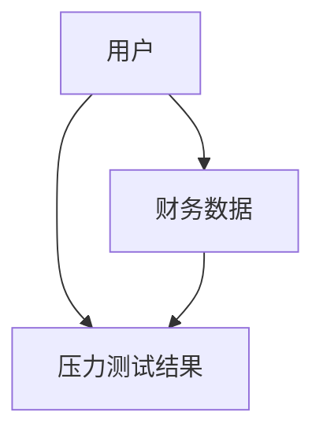
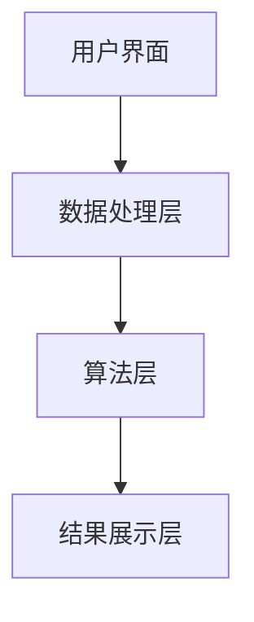

                 


# 《智能个人财务压力测试工具》

## 关键词：智能财务、压力测试、风险管理、数据分析、算法设计

## 摘要：本文介绍了一款智能个人财务压力测试工具，帮助用户评估财务状况。通过数据分析和智能算法，工具能预测极端情况下的财务表现，提供优化建议，提升风险管理能力。

## 目录大纲：

### 第一部分：背景与核心概念

#### 第1章：背景介绍
- 1.1 问题背景
  - 1.1.1 个人财务管理现状与挑战
  - 1.1.2 传统压力测试的局限性
  - 1.1.3 智能工具的必要性
- 1.2 核心概念与要素
  - 1.2.1 工具的定义
  - 1.2.2 功能模块
  - 1.2.3 输入与输出
- 1.3 本章小结

#### 第2章：核心概念与联系
- 2.1 核心概念的原理
  - 2.1.1 压力测试原理
  - 2.1.2 智能算法机制
  - 2.1.3 数据建模基础
- 2.2 概念属性对比
  - 表格：压力测试、智能算法、数据建模的属性对比
- 2.3 ER实体关系图
  - 图：用户、财务数据、测试结果的关系图

### 第二部分：算法与数学模型

#### 第3章：算法原理
- 3.1 算法原理
  - 图：算法流程图（使用mermaid）
  ```mermaid
  graph TD
  A[开始] --> B[数据预处理]
  B --> C[特征提取]
  C --> D[模型训练]
  D --> E[压力测试]
  E --> F[结果分析]
  ```
- 3.2 算法实现
  - Python代码示例
  ```python
  import pandas as pd
  import numpy as np
  # 数据预处理代码
  ```
- 3.3 数学模型
  - 公式：线性回归模型
  $$y = \beta_0 + \beta_1x_1 + ... + \beta_nx_n$$

### 第三部分：系统架构与设计

#### 第4章：系统架构
- 4.1 系统架构设计
  - 图：系统架构图（使用mermaid）
  ```mermaid
  graph TD
  A[用户界面] --> B[数据处理层]
  B --> C[算法层]
  C --> D[结果展示层]
  ```
- 4.2 接口设计
  - 描述系统接口
- 4.3 交互流程图
  - 图：用户与系统的交互流程

### 第四部分：项目实战

#### 第5章：项目实现
- 5.1 环境安装
  - 安装Python和相关库
- 5.2 核心代码实现
  - 数据处理与模型训练代码
- 5.3 实际案例分析
  - 分步分析案例
- 5.4 项目小结

### 第五部分：最佳实践与总结

#### 第6章：最佳实践
- 6.1 小结
  - 工具的使用总结
- 6.2 注意事项
  - 数据隐私和模型维护
- 6.3 拓展阅读
  - 推荐相关书籍和资源

## 正文内容：

### 第1章：背景介绍

#### 1.1 问题背景

个人财务管理是一个复杂的过程，涉及收入、支出、储蓄和投资等多方面。传统的方法依赖于手动记录和简单计算，难以应对突发的财务压力。例如，失业、疾病或经济危机可能导致财务状况急剧恶化，传统的压力测试方法通常基于历史数据，缺乏动态调整和智能化分析，难以准确预测极端情况下的财务表现。

#### 1.2 核心概念与要素

智能个人财务压力测试工具通过整合机器学习算法和数据分析技术，帮助用户预测在各种压力情景下的财务状况，并提供优化建议。其核心功能包括数据采集、情景模拟、结果分析和优化建议。输入包括财务数据、目标和情景参数，输出包括财务健康评分、压力测试结果和优化建议。

### 第2章：核心概念与联系

#### 2.1 核心概念的原理

压力测试通过模拟极端情景，评估财务系统的承受能力。智能算法利用机器学习模型，分析历史数据，预测未来情况。数据建模通过构建数学模型，量化各因素对财务状况的影响。

#### 2.2 概念属性对比

| 概念         | 输入 | 输出 | 方法 | 目标 |
|--------------|------|------|------|------|
| 压力测试     | 数据 | 结果 | 模拟 | 评估承受能力 |
| 智能算法     | 数据 | 预测 | 学习 | 提供优化方案 |
| 数据建模     | 数据 | 模型 | 分析 | 描述关系 |

#### 2.3 ER实体关系图

用户与财务数据、测试结果的关系图如下：


### 第3章：算法原理

#### 3.1 算法原理

智能压力测试工具使用机器学习算法，如随机森林和神经网络，分析财务数据，预测压力情景下的表现。以下是算法流程：

1. 数据预处理：清洗数据，处理缺失值和异常值。
2. 特征提取：选择关键财务指标，如收入、支出、资产和负债。
3. 模型训练：使用训练数据，训练机器学习模型。
4. 压力测试：模拟极端情景，输入模型，生成预测结果。
5. 结果分析：评估财务健康，生成优化建议。

#### 3.2 算法实现

以下是Python代码示例：

```python
import pandas as pd
import numpy as np
from sklearn.ensemble import RandomForestRegressor

# 数据预处理
data = pd.read_csv('financial_data.csv')
data = data.dropna()
data = pd.get_dummies(data)

# 特征选择
features = data.drop(['target'], axis=1)
target = data['target']

# 模型训练
model = RandomForestRegressor()
model.fit(features, target)

# 预测结果
test_features = features.iloc[:10]
predictions = model.predict(test_features)
```

#### 3.3 数学模型

线性回归模型用于预测：

$$y = \beta_0 + \beta_1x_1 + ... + \beta_nx_n$$

其中，$y$是预测结果，$x_i$是输入特征，$\beta$是系数。

### 第4章：系统架构

#### 4.1 系统架构设计

系统分为用户界面、数据处理层、算法层和结果展示层。各层通过接口交互，确保数据流畅处理。

架构图如下：


### 第5章：项目实战

#### 5.1 环境安装

安装Python和相关库：
```bash
pip install numpy pandas scikit-learn
```

#### 5.2 核心代码实现

以下是数据处理和模型训练代码：

```python
import pandas as pd
from sklearn.model_selection import train_test_split
from sklearn.metrics import mean_absolute_error

# 数据加载与预处理
data = pd.read_csv('financial.csv')
data = data.dropna()

# 特征与目标分离
X = data.drop(['target'], axis=1)
y = data['target']

# 数据分割
X_train, X_test, y_train, y_test = train_test_split(X, y, test_size=0.2)

# 模型训练
model = RandomForestRegressor()
model.fit(X_train, y_train)

# 预测与评估
y_pred = model.predict(X_test)
print(mean_absolute_error(y_test, y_pred))
```

#### 5.3 实际案例分析

案例分析步骤如下：
1. 数据收集：收集用户的财务数据。
2. 模型训练：使用历史数据训练模型。
3. 情景模拟：模拟失业或疾病情景。
4. 结果分析：生成压力测试结果和优化建议。

### 第6章：最佳实践

#### 6.1 小结

智能工具通过机器学习算法，提供精准的财务压力测试和优化建议，帮助用户应对各种财务风险。

#### 6.2 注意事项

- 数据隐私：确保数据安全，避免泄露。
- 模型维护：定期更新模型，确保准确性。

#### 6.3 拓展阅读

推荐书籍：《机器学习实战》和《数据驱动的决策》。

---

通过以上目录结构，文章详细介绍了智能个人财务压力测试工具的设计和实现，内容涵盖背景、算法、系统架构和项目实战，帮助读者全面理解工具的原理和应用。

