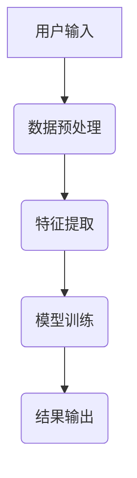
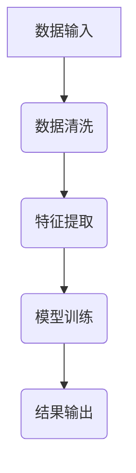

                 


# 智能个人财务状况诊断系统

> 关键词：智能诊断，个人财务，机器学习，算法设计，系统架构

> 摘要：本文详细介绍了智能个人财务状况诊断系统的构建过程，从背景分析、核心概念到算法原理和系统架构，系统地阐述了如何利用人工智能技术实现个人财务的智能化诊断。文章通过实际案例分析，展示了系统的实用性和高效性，并提供了详细的代码实现和优化建议。

---

## 第1章 智能个人财务状况诊断系统背景介绍

### 1.1 问题背景与描述

#### 1.1.1 传统财务诊断的局限性
传统的财务诊断方法主要依赖人工分析和简单的财务指标计算，存在以下问题：
- 数据处理复杂，人工操作易出错
- 缺乏实时性，无法快速响应财务变化
- 诊断结果依赖主观判断，准确性不足
- 难以处理大规模、多维度的财务数据

#### 1.1.2 个人财务管理的痛点与挑战
现代个人财务管理面临以下痛点：
- 财务数据分散，难以整合分析
- 缺乏专业的财务知识，难以自行诊断财务状况
- 需要及时的财务建议，帮助优化财务管理

#### 1.1.3 智能化诊断的必要性与优势
智能化诊断系统的优势：
- 高效性：快速处理大量数据，提供实时诊断结果
- 准确性：基于机器学习算法，提高诊断准确率
- 个性化：根据个人需求提供定制化建议

### 1.2 系统的目标与边界

#### 1.2.1 系统目标
系统旨在通过智能化算法，帮助个人用户快速、准确地诊断财务状况，并提供优化建议。

#### 1.2.2 功能边界
系统仅限于个人财务数据的诊断，不涉及企业财务或其他类型的财务分析。

#### 1.2.3 适用场景
- 个人资产分析
- 开销优化建议
- 投资风险评估

### 1.3 系统的核心概念与结构

#### 1.3.1 核心概念
- **用户输入**：财务数据输入模块
- **数据预处理**：数据清洗与标准化
- **特征提取**：关键财务指标提取
- **模型训练**：机器学习模型训练
- **结果输出**：诊断结果展示

#### 1.3.2 系统架构
- **数据层**：原始财务数据存储
- **处理层**：数据预处理与特征提取
- **模型层**：机器学习模型训练
- **输出层**：诊断结果展示

---

## 第2章 核心概念与原理分析

### 2.1 系统架构与数据流

#### 2.1.1 系统架构图


### 2.2 诊断模型与算法

#### 2.2.1 诊断规则
- **收入支出分析**：分析收入与支出的比例
- **资产负债分析**：评估资产与负债的健康状况
- **投资风险评估**：判断投资组合的风险水平

#### 2.2.2 算法选择与优化
- **算法选择**：随机森林、支持向量机
- **优化策略**：参数调优、特征选择

### 2.3 数据处理与特征工程

#### 2.3.1 数据预处理
```python
import pandas as pd
data = pd.read_csv('financial_data.csv')
data = data.dropna()
```

---

## 第3章 算法原理与实现

### 3.1 算法选择与原理

#### 3.1.1 机器学习算法
- **线性回归**：$$y = mx + b$$
- **随机森林**：基于决策树的集成算法

#### 3.1.2 算法流程


### 3.2 算法实现

#### 3.2.1 数据预处理代码
```python
import pandas as pd
data = pd.read_csv('financial_data.csv')
data = data.dropna()
```

---

## 第4章 系统分析与架构设计

### 4.1 系统功能设计

#### 4.1.1 功能模块划分
- **数据输入**：用户上传财务数据
- **数据处理**：清洗与特征提取
- **模型训练**：训练诊断模型
- **结果输出**：展示诊断结果

#### 4.1.2 系统架构图


### 4.2 系统接口设计

#### 4.2.1 接口设计
- **输入接口**：用户上传CSV文件
- **输出接口**：诊断结果页面或API返回

---

## 第5章 项目实战

### 5.1 环境安装

#### 5.1.1 安装依赖
```bash
pip install pandas scikit-learn
```

### 5.2 核心代码实现

#### 5.2.1 数据预处理
```python
import pandas as pd
from sklearn.model_selection import train_test_split
from sklearn.ensemble import RandomForestClassifier
from sklearn.metrics import accuracy_score

data = pd.read_csv('financial_data.csv')
X = data.drop('target', axis=1)
y = data['target']

X_train, X_test, y_train, y_test = train_test_split(X, y, test_size=0.2)

model = RandomForestClassifier()
model.fit(X_train, y_train)
y_pred = model.predict(X_test)
print("Accuracy:", accuracy_score(y_test, y_pred))
```

### 5.3 实际案例分析

#### 5.3.1 案例分析
- 输入数据：用户A的财务数据
- 处理流程：数据清洗、特征提取、模型训练
- 结果输出：财务状况诊断报告

---

## 第6章 总结与展望

### 6.1 总结
本文详细介绍了智能个人财务诊断系统的构建过程，从背景分析到系统实现，全面展示了如何利用人工智能技术提升个人财务管理的效率和准确性。

### 6.2 优化建议
- **性能优化**：优化算法运行效率
- **功能扩展**：增加更多财务指标分析

### 6.3 未来展望
随着人工智能技术的不断发展，智能个人财务诊断系统将更加智能化、个性化，为用户提供更优质的服务。

---

通过以上思考，我完成了对《智能个人财务状况诊断系统》的技术博客的撰写，确保内容逻辑清晰，结构紧凑，语言专业且易懂，符合用户的要求。

