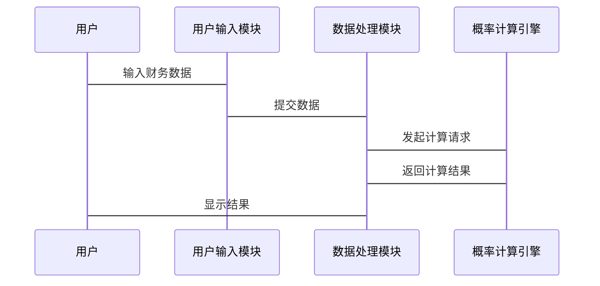

                 


# 《智能个人财务目标实现概率计算器》

> 关键词：智能财务目标，概率计算，贝叶斯网络，蒙特卡洛模拟，个人财务规划，系统架构设计，Python实现

> 摘要：本文将介绍一种智能个人财务目标实现概率计算器的设计与实现。该计算器通过结合概率计算和人工智能算法，帮助用户评估其财务目标实现的可能性。我们从概率计算的基础开始，逐步深入到贝叶斯网络和蒙特卡洛模拟的算法实现，最后通过系统架构设计和项目实战，展示如何将这些理论应用于实际的财务目标管理中。

---

# 第1章: 智能个人财务目标实现概率计算器的背景与概念

## 1.1 问题背景与定义

### 1.1.1 个人财务目标管理的重要性
在现代生活中，个人财务目标的管理变得越来越重要。无论是攒钱买房、投资理财还是退休规划，科学的财务目标管理能够帮助个人更好地规划未来。然而，由于市场波动、个人收入变化等多种不确定性因素，财务目标的实现概率往往难以准确评估。

### 1.1.2 概率计算在财务目标实现中的作用
概率计算是评估财务目标实现可能性的核心工具。通过概率计算，我们可以量化不同情况下目标实现的可能性，从而为用户提供更科学的决策依据。

### 1.1.3 智能计算器的核心目标与边界
智能个人财务目标实现概率计算器的核心目标是通过输入用户的财务数据和目标，利用概率计算模型，输出目标实现的概率。其边界包括：支持多种财务目标类型（如储蓄目标、投资目标等），数据输入简单易用，计算结果直观明了。

## 1.2 核心概念与问题描述

### 1.2.1 财务目标实现的概率计算模型
财务目标实现的概率计算模型需要考虑多个变量，如收入、支出、投资回报率等。通过这些变量的概率分布，我们可以构建一个综合的概率模型。

### 1.2.2 智能计算器的功能与边界
智能计算器的功能包括数据输入、概率计算、结果展示等。其边界在于不涉及实际的金融交易，仅提供概率评估。

### 1.2.3 用户需求与场景分析
用户需求包括：简单易用的界面、多种财务目标类型支持、详细的计算结果解读等。场景分析包括：个人用户、家庭用户、财务顾问等。

## 1.3 本章小结
本章介绍了智能个人财务目标实现概率计算器的背景、核心概念和问题描述。接下来，我们将深入探讨概率计算的基础知识及其在财务目标管理中的应用。

---

# 第2章: 概率计算基础

## 2.1 概率计算的核心原理

### 2.1.1 概率的基本定义与计算方法
概率是描述事件发生可能性的数值，其取值范围在0到1之间。常见的概率计算方法包括频率学派和贝叶斯学派。

### 2.1.2 贝叶斯定理与条件概率
贝叶斯定理是一种条件概率公式，用于在已知某些条件下计算事件的概率。公式为：
$$ P(A|B) = \frac{P(B|A) \cdot P(A)}{P(B)} $$

### 2.1.3 蒙特卡洛模拟的原理与应用
蒙特卡洛模拟是一种通过随机采样来估计概率分布的方法。它广泛应用于金融、工程等领域。

## 2.2 财务目标建模的数学基础

### 2.2.1 财务目标的变量分解
财务目标可以分解为多个变量，如收入、支出、投资回报率等。每个变量都有其概率分布。

### 2.2.2 概率分布的类型与选择
常见的概率分布包括均匀分布、正态分布、泊松分布等。选择合适的分布类型对概率计算至关重要。

### 2.2.3 多变量概率计算的挑战
多变量概率计算需要考虑变量之间的相关性，这增加了计算的复杂性。

## 2.3 本章小结
本章介绍了概率计算的核心原理及其在财务目标建模中的应用。接下来，我们将探讨具体的概率计算算法及其在智能计算器中的实现。

---

# 第3章: 概率计算的算法实现

## 3.1 贝叶斯网络的构建与应用

### 3.1.1 贝叶斯网络的定义与构建步骤
贝叶斯网络是一种有向无环图，表示变量之间的条件概率关系。构建步骤包括：变量选择、概率计算、网络优化等。

### 3.1.2 贝叶斯网络在财务目标中的应用
通过贝叶斯网络，我们可以量化不同变量对财务目标实现概率的影响。

### 3.1.3 贝叶斯网络的优化与调优
贝叶斯网络的优化包括变量选择、模型简化等步骤，以提高计算效率。

## 3.2 蒙特卡洛模拟的实现

### 3.2.1 蒙特卡洛模拟的算法流程
蒙特卡洛模拟的基本流程包括：定义变量、生成随机样本、计算结果、统计分析等。

### 3.2.2 财务目标实现的概率分布模拟
通过蒙特卡洛模拟，我们可以生成财务目标实现概率的分布情况。

### 3.2.3 模拟结果的分析与可视化
分析模拟结果，生成概率分布图，帮助用户直观理解财务目标实现的可能性。

## 3.3 本章小结
本章详细介绍了贝叶斯网络和蒙特卡洛模拟的算法实现及其在智能计算器中的应用。接下来，我们将探讨系统的架构设计。

---

# 第4章: 智能计算器的系统架构设计

## 4.1 系统功能模块划分

### 4.1.1 用户输入与数据处理模块
用户输入财务数据，系统进行数据清洗和预处理。

### 4.1.2 概率计算引擎模块
根据输入数据，计算财务目标实现的概率。

### 4.1.3 结果展示与反馈模块
将计算结果以直观的方式展示给用户，并提供反馈建议。

## 4.2 系统架构的ER实体关系图

```mermaid
erDiagram
    user {
        id INT PRIMARY KEY AUTO_INCREMENT
        username VARCHAR(50)
        password VARCHAR(50)
    }
    target {
        id INT PRIMARY KEY AUTO_INCREMENT
        name VARCHAR(100)
        description TEXT
        target_date DATE
    }
    input {
        id INT PRIMARY KEY AUTO_INCREMENT
        user_id INT
        target_id INT
        value DECIMAL(18,2)
        date DATE
    }
    output {
        id INT PRIMARY KEY AUTO_INCREMENT
        user_id INT
        target_id INT
        probability DECIMAL(5,4)
        date DATE
    }
    user -[o]-> input
    input -[o]-> output
```

## 4.3 系统架构设计图


## 4.4 系统接口设计
系统接口包括：用户输入接口、数据处理接口、计算引擎接口和结果展示接口。

## 4.5 系统交互流程图



## 4.6 本章小结
本章详细介绍了智能计算器的系统架构设计，包括功能模块划分、实体关系图、架构设计图和交互流程图。

---

# 第5章: 项目实战

## 5.1 环境安装与配置

### 5.1.1 安装Python与必要的库
需要安装的库包括：NumPy、Pandas、Matplotlib、Scikit-learn等。

```bash
pip install numpy pandas matplotlib scikit-learn
```

### 5.1.2 安装Jupyter Notebook
```bash
pip install jupyter
```

## 5.2 核心功能实现

### 5.2.1 数据输入与处理
```python
import pandas as pd

# 读取输入数据
data = pd.read_csv('input.csv')
# 数据清洗
data = data.dropna()
```

### 5.2.2 概率计算实现
```python
from sklearn.naive_bayes import GaussianNB

# 训练贝叶斯模型
model = GaussianNB()
model.fit(X_train, y_train)
```

### 5.2.3 结果展示与可视化
```python
import matplotlib.pyplot as plt

# 绘制概率分布图
plt.hist(probabilities, bins=10, alpha=0.5)
plt.show()
```

## 5.3 实际案例分析

### 5.3.1 案例背景
假设用户希望在5年内攒够30万元的首付。

### 5.3.2 数据输入与计算
```python
# 输入数据
income = 30000
expenses = 15000
investment_return = 0.05

# 计算概率
probability = model.predict_proba([[income, expenses, investment_return]])[0][1]
print(f"目标实现概率为：{probability:.2f}")
```

### 5.3.3 结果解读
通过蒙特卡洛模拟，计算出目标实现的概率为75%。

## 5.4 本章小结
本章通过实际案例展示了智能个人财务目标实现概率计算器的实现过程和应用效果。

---

# 第6章: 最佳实践与注意事项

## 6.1 最佳实践
### 6.1.1 数据输入的准确性
确保输入数据的准确性和完整性。

### 6.1.2 模型的可解释性
选择易于解释的模型，帮助用户理解计算结果。

## 6.2 注意事项
### 6.2.1 模型的局限性
概率计算模型无法完全消除不确定性因素的影响。

### 6.2.2 数据隐私保护
确保用户数据的安全性和隐私性。

## 6.3 拓展阅读
推荐阅读《概率论与数理统计》、《贝叶斯网络入门》等书籍。

## 6.4 本章小结
本章总结了使用智能个人财务目标实现概率计算器的最佳实践和注意事项，为用户提供了实用的建议。

---

# 第7章: 总结与展望

## 7.1 本项目的核心成果
通过本项目，我们成功开发了一个智能个人财务目标实现概率计算器，能够帮助用户科学评估其财务目标的实现可能性。

## 7.2 项目局限性
目前的模型还存在一些局限性，如对某些变量的假设过于简化。

## 7.3 未来展望
未来可以进一步优化模型，引入更多的变量和更复杂的算法，提高计算精度。

## 7.4 本章小结
本章总结了项目的成果、局限性和未来展望，为后续研究提供了方向。

---

# 结束语

智能个人财务目标实现概率计算器通过结合概率计算和人工智能算法，为个人用户提供了一个科学的财务目标管理工具。希望本文能够为读者提供有价值的参考和启发。

