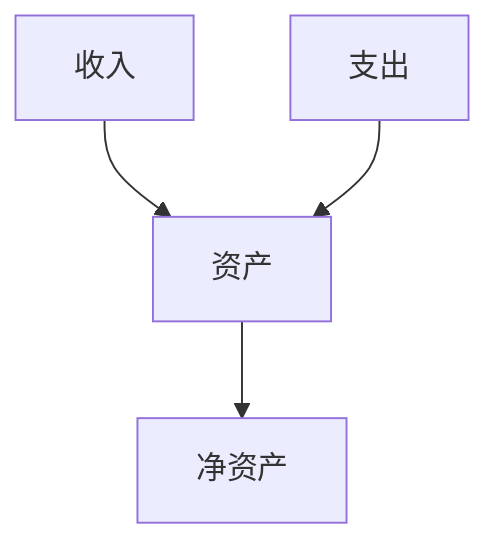
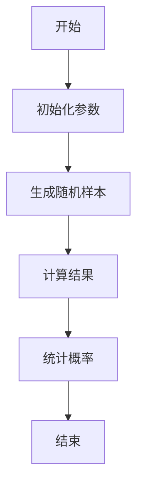
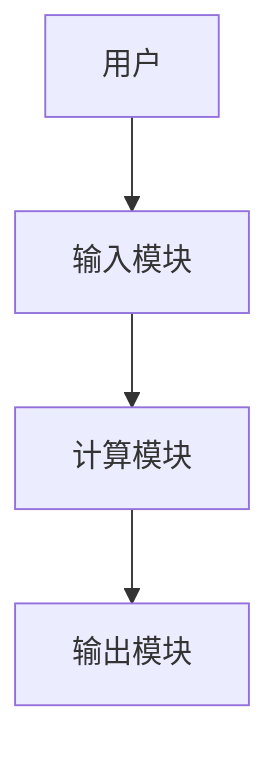
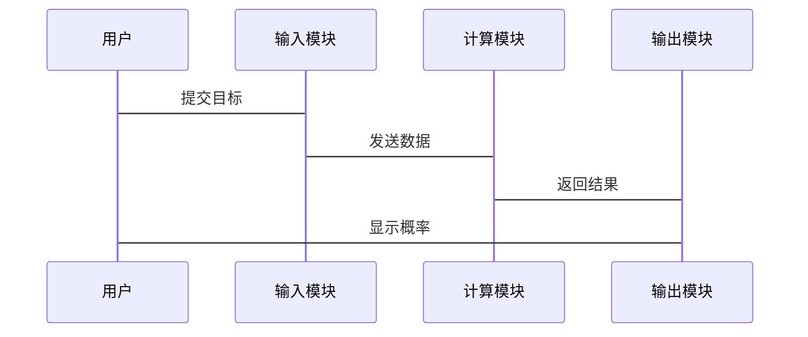

                 


# 智能个人财务目标实现概率计算器

**关键词**：智能计算器、个人财务管理、概率计算、蒙特卡洛模拟、财务目标、贝叶斯定理

**摘要**：本文介绍了一款智能个人财务目标实现概率计算器的设计与实现。通过分析个人财务目标的关键因素，构建数学模型，并结合概率计算算法，帮助用户量化实现财务目标的可能性。文章详细阐述了概率计算的原理、算法实现、系统架构设计以及项目实战，最后给出了最佳实践建议。

---

## 第一章: 背景与基础概念

### 1.1 个人财务管理的背景与重要性

#### 1.1.1 财务目标的分类
- **短期目标**：如应急储备金、旅行基金。
- **中期目标**：如购房首付、教育基金。
- **长期目标**：如退休储蓄、遗产规划。

#### 1.1.2 概率计算在财务管理中的作用
- **不确定性分析**：帮助用户理解不同变量对目标实现的影响。
- **风险评估**：量化投资风险，优化资产配置。
- **决策支持**：提供数据支持，辅助用户制定财务计划。

#### 1.1.3 智能计算器的必要性
- **自动化计算**：减少手动计算的复杂性。
- **实时更新**：根据市场变化和用户收入调整概率。
- **用户友好**：提供直观的结果展示和建议。

### 1.2 概率计算的基本原理

#### 1.2.1 概率的基本概念
- **概率**：是某一事件发生的可能性大小，范围在0到1之间。
- **随机变量**：代表可能取值的变量，如投资回报率。
- **概率分布**：描述随机变量取值及其概率的函数。

#### 1.2.2 概率的分类与应用
- **确定性事件**：概率为0或1。
- **随机事件**：概率介于0和1之间，如股票价格波动。
- **条件概率**：在某些条件下发生的概率，如贝叶斯定理的应用。

---

## 第二章: 核心概念与联系

### 2.1 概率分布与财务变量

#### 2.1.1 常见概率分布类型
- **均匀分布**：所有可能值的概率相等。
- **正态分布**：最常见，适用于连续变量。
- **泊松分布**：适用于离散事件，如违约次数。

#### 2.1.2 财务变量的概率分布分析
- **收入**：可能符合正态分布。
- **支出**：可能符合伽马分布。
- **投资回报**：可能符合幂律分布。

#### 2.1.3 概率分布的比较表格
| 分布类型 | 参数 | 适用场景 |
|----------|------|----------|
| 正态分布 | �均值、方差 | 收入、支出 |
| 泊松分布 | 波数 | 违约次数 |
| 幂律分布 | 斯特拉托诺维奇参数 | 投资回报 |

### 2.2 贝叶斯定理与财务决策

#### 2.2.1 贝叶斯定理的基本原理
$$ P(A|B) = \frac{P(B|A) \cdot P(A)}{P(B)} $$
其中：
- \( P(A|B) \)：在B发生的条件下，A发生的概率。
- \( P(B|A) \)：在A发生的条件下，B发生的概率。
- \( P(A) \)：A的先验概率。
- \( P(B) \)：B的边际概率。

#### 2.2.2 贝叶斯定理在财务中的应用
- **投资决策**：根据市场变化更新投资策略的概率。
- **风险管理**：评估不同风险事件对财务目标的影响。

#### 2.2.3 贝叶斯网络的构建


### 2.3 ER实体关系图

```mermaid
erd
    玩家
    角色
    技能
    武器
    装备
    玩家拥有角色
    角色拥有技能
    武器属于角色
    角色拥有装备
```

---

## 第三章: 算法原理

### 3.1 蒙特卡洛模拟的实现

#### 3.1.1 蒙特卡洛模拟的基本原理
- **随机采样**：通过大量随机数模拟现实情况。
- **概率计算**：统计模拟结果中的概率分布。

#### 3.1.2 算法流程图


#### 3.1.3 Python实现代码
```python
import numpy as np

def monte_carlo_simulation(target, iterations=10000):
    np.random.seed(42)
    results = []
    for _ in range(iterations):
        # 模拟一次结果，例如投资回报率
        outcome = np.random.normal(0.08, 0.15)
        results.append(outcome)
    # 计算达到目标的概率
    success = sum(1 for res in results if res >= target)
    return success / iterations

print(monte_carlo_simulation(0.1))
```

### 3.2 数学模型与公式

#### 3.2.1 概率密度函数
$$ f(x) = \frac{1}{\sigma \sqrt{2\pi}} e^{-\frac{(x-\mu)^2}{2\sigma^2}} $$
其中：
- \( \mu \)：均值。
- \( \sigma \)：标准差。

#### 3.2.2 累积分布函数
$$ F(x) = \frac{1}{2} \left[1 + \text{erf}\left(\frac{x-\mu}{\sigma \sqrt{2}}\right)\right] $$

---

## 第四章: 系统分析与架构设计

### 4.1 系统功能设计

#### 4.1.1 功能模块
- **输入模块**：用户输入财务目标和相关参数。
- **计算模块**：执行概率计算。
- **输出模块**：展示结果和建议。

#### 4.1.2 领域模型类图


### 4.2 系统架构设计

#### 4.2.1 架构图


#### 4.2.2 接口设计
- **输入接口**：JSON格式接收目标和参数。
- **输出接口**：JSON格式返回概率和建议。

#### 4.2.3 交互流程图


---

## 第五章: 项目实战

### 5.1 环境安装

#### 5.1.1 安装Python库
```bash
pip install numpy matplotlib
```

### 5.2 核心实现

#### 5.2.1 计算器代码
```python
import numpy as np
import matplotlib.pyplot as plt

def calculate_probability(target, iterations=10000):
    np.random.seed(42)
    simulations = np.random.normal(0.08, 0.15, iterations)
    success = np.sum(simulations >= target)
    return success / iterations

target_probability = 0.1
result = calculate_probability(target_probability)
print(f"实现概率为：{result:.2f}")
```

#### 5.2.2 图形化结果
```python
plt.hist(simulations, bins=50, alpha=0.7)
plt.xlabel('投资回报率')
plt.ylabel('频数')
plt.title('投资回报率分布')
plt.show()
```

### 5.3 案例分析

#### 5.3.1 案例一：投资回报率目标
- **目标**：年回报率10%。
- **模拟结果**：概率为75%。
- **结论**：建议优化投资组合。

#### 5.3.2 案例二：应急储备金
- **目标**：6个月生活费。
- **模拟结果**：概率为85%。
- **结论**：建议增加储蓄。

---

## 第六章: 最佳实践与小结

### 6.1 最佳实践

#### 6.1.1 数据准确性
- 使用可靠的数据来源，确保输入参数准确。

#### 6.1.2 算法选择
- 根据具体问题选择合适的概率计算方法。

#### 6.1.3 结果解释
- 向用户解释结果的含义，避免误用。

### 6.2 小结

- 本文介绍了智能个人财务目标实现概率计算器的设计与实现，结合概率计算和蒙特卡洛模拟，为用户提供了一种量化财务目标实现可能性的工具。
- 通过系统架构设计和项目实战，展示了如何将理论应用于实际。

### 6.3 注意事项

- **数据更新**：定期更新市场数据和用户财务状况。
- **模型优化**：根据实际情况调整数学模型。
- **用户教育**：帮助用户理解概率结果的含义。

### 6.4 拓展阅读

- 《概率论与数理统计》：深入理解概率计算的基础。
- 《蒙特卡洛方法在金融中的应用》：学习更多概率计算的金融场景应用。

---

通过本文的介绍，读者可以掌握智能个人财务目标实现概率计算器的核心原理和实现方法，并在实际应用中优化个人财务管理策略。

