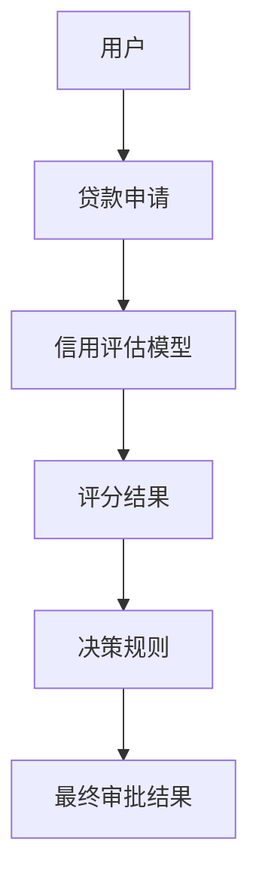
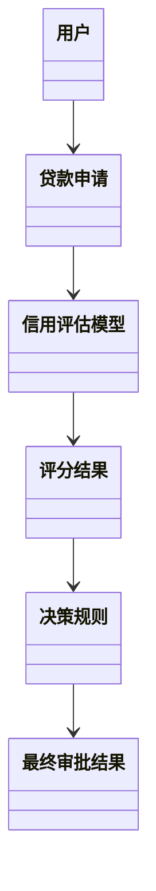
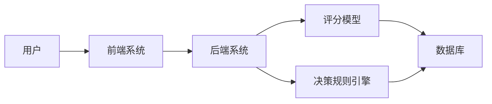

                 


# 智能个人贷款审批系统优化

> 关键词：智能贷款审批，系统优化，机器学习，评分模型，系统架构

> 摘要：本文详细探讨了智能个人贷款审批系统优化的核心概念、算法原理、系统架构以及项目实战。通过对传统贷款审批系统的痛点分析，结合人工智能技术，提出了一种基于机器学习的智能评分模型优化方法，并通过实际案例分析验证了该方法的有效性。本文还提供了系统的详细架构设计和实现代码，为读者提供了从理论到实践的完整指导。

---

## 第一章: 智能个人贷款审批系统优化的背景与问题

### 1.1 传统个人贷款审批系统的局限性

#### 1.1.1 传统贷款审批流程的痛点
传统的个人贷款审批流程通常依赖人工操作，存在以下问题：
- **效率低下**：人工审核需要逐项检查申请人的资质、信用记录、收入证明等，耗时较长。
- **准确性不足**：人工审核可能存在主观判断偏差，导致审批结果不一致。
- **数据孤岛**：不同机构的信用数据分散，难以实现信息共享和统一评估。

#### 1.1.2 人工审批的效率与准确性问题
人工审批的效率与准确性主要受限于以下因素：
- 人工审核人员的经验有限，容易出现误判。
- 数据量大且复杂，人工处理难以高效完成。

#### 1.1.3 数据孤岛与信息不透明的挑战
传统贷款审批过程中，数据孤岛问题导致：
- 无法充分利用多源数据进行综合评估。
- 用户对审批过程缺乏透明度，影响信任度。

### 1.2 智能化贷款审批的必要性

#### 1.2.1 AI技术在金融领域的应用趋势
人工智能技术在金融领域的应用日益广泛，特别是在信用评估、风险控制等领域展现出巨大潜力。

#### 1.2.2 智能审批系统的定义与目标
智能个人贷款审批系统通过整合多源数据，利用机器学习算法，实现自动化、智能化的贷款审批流程。

#### 1.2.3 优化贷款审批流程的意义与价值
优化贷款审批流程的意义在于：
- 提高审批效率，缩短用户等待时间。
- 提升审批准确性，降低风险。
- 降低人工成本，优化资源配置。

### 1.3 本章小结
本章从传统贷款审批系统的痛点出发，分析了智能化贷款审批的必要性，为后续技术实现奠定了基础。

---

## 第二章: 智能个人贷款审批系统的构成与核心要素

### 2.1 系统的核心概念

#### 2.1.1 数据流与信息处理流程
智能个人贷款审批系统的数据流包括：
1. 用户提交贷款申请。
2. 系统采集并整合多源数据（如信用报告、收入证明、银行流水等）。
3. 数据预处理（清洗、特征提取）。
4. 模型计算并生成评分。
5. 决策规则判断，生成审批结果。

#### 2.1.2 评分模型与决策规则
评分模型是系统的核心，负责对申请人进行信用评分。决策规则基于评分结果，结合其他条件（如收入、资产等）决定最终审批结果。

#### 2.1.3 用户画像与信用评估
用户画像是基于多源数据构建的用户信息集合，用于信用评估和风险控制。

### 2.2 核心概念的联系与对比

#### 2.2.1 传统审批与智能审批的对比分析

| 对比维度         | 传统审批                     | 智能审批                     |
|------------------|------------------------------|------------------------------|
| 审批效率         | 较低，依赖人工               | 高，自动化处理               |
| 审批准确性       | 受主观因素影响               | 基于数据驱动，准确性高       |
| 数据利用         | 单一来源，信息有限           | 多源数据，信息全面           |

#### 2.2.2 核心要素的属性特征对比表

| 核心要素         | 特征                         |
|------------------|------------------------------|
| 数据流           | 多源、实时、动态             |
| 评分模型         | 基于机器学习，动态优化       |
| 决策规则         | 综合评分、风险控制           |

#### 2.2.3 系统实体关系的ER图



---

## 第三章: 智能个人贷款审批系统的算法原理

### 3.1 评分模型的构建

#### 3.1.1 评分模型的数学公式
评分模型可以表示为一个线性回归模型：
$$ \text{信用评分} = \sum_{i=1}^{n} w_i x_i + b $$
其中，$w_i$ 是特征权重，$x_i$ 是特征值，$b$ 是偏置项。

#### 3.1.2 评分模型的训练过程


### 3.2 算法实现

#### 3.2.1 算法选择与实现代码

```python
import pandas as pd
from sklearn.linear_model import LinearRegression

# 数据预处理
data = pd.read_csv('loan_data.csv')
X = data.drop('target', axis=1)
y = data['target']

# 模型训练
model = LinearRegression()
model.fit(X, y)

# 模型预测
predicted = model.predict(X)
```

---

## 第四章: 智能个人贷款审批系统的系统架构设计

### 4.1 系统功能设计

#### 4.1.1 领域模型类图



### 4.2 系统架构设计

#### 4.2.1 系统架构图



---

## 第五章: 智能个人贷款审批系统的项目实战

### 5.1 项目环境搭建

#### 5.1.1 环境要求
- Python 3.8+
- 安装必要的库：`pandas`, `scikit-learn`

### 5.2 核心代码实现

#### 5.2.1 数据预处理

```python
import pandas as pd

data = pd.read_csv('loan_data.csv')
# 删除缺失值
data.dropna(inplace=True)
# 转换为数值类型
data['income'] = pd.to_numeric(data['income'], errors='coerce')
```

#### 5.2.2 模型训练

```python
from sklearn.model_selection import train_test_split
from sklearn.metrics import accuracy_score

X = data.drop('target', axis=1)
y = data['target']

X_train, X_test, y_train, y_test = train_test_split(X, y, test_size=0.2)

model = LinearRegression()
model.fit(X_train, y_train)

# 预测结果
y_pred = model.predict(X_test)
print("Accuracy:", accuracy_score(y_test, y_pred))
```

---

## 第六章: 总结与展望

### 6.1 总结
本文详细探讨了智能个人贷款审批系统优化的核心技术，包括系统背景、核心概念、算法原理、系统架构和项目实战。

### 6.2 展望
未来，随着人工智能技术的不断发展，智能个人贷款审批系统将更加智能化和个性化，为金融机构提供更高效、更精准的服务。

---

以上是《智能个人贷款审批系统优化》的技术博客文章的完整目录大纲和部分核心内容。

