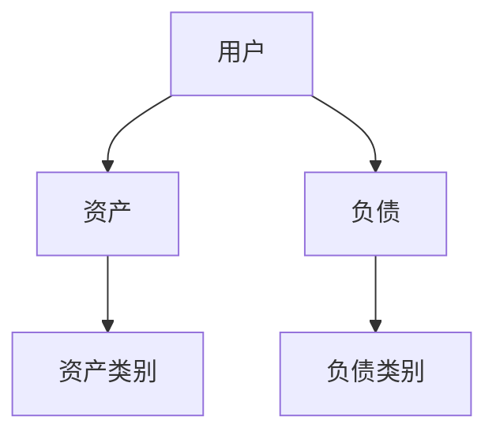
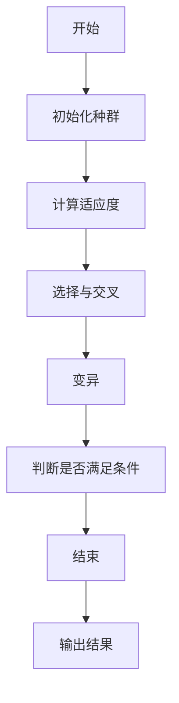
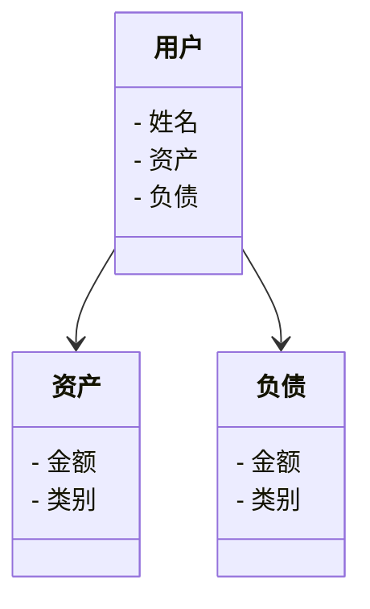
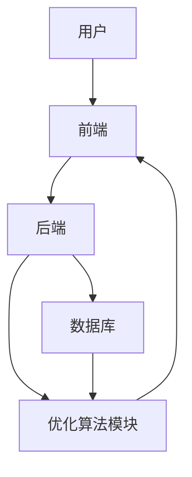
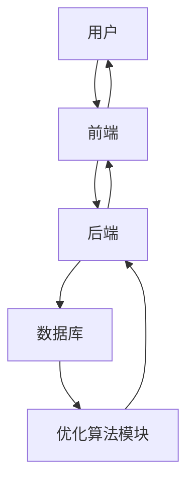

                 


# 智能个人资产负债结构优化系统

> 关键词：智能资产负债优化，人工智能算法，系统架构设计，资产配置，财务优化

> 摘要：本文将详细介绍智能个人资产负债结构优化系统的构建与实现。从背景到核心概念，从算法原理到系统架构设计，再到项目实战与最佳实践，我们将全面解析如何利用人工智能技术优化个人资产配置，实现财富最大化。

---

# 第一部分: 智能个人资产负债结构优化系统背景

# 第1章: 从0到1：智能资产负债优化系统的构建之路

## 1.1 问题背景与重要性

### 1.1.1 个人资产负债管理的重要性
在当今复杂的经济环境下，个人资产管理变得越来越重要。随着通货膨胀、市场波动和多样化的投资渠道，如何科学地配置资产以实现财富最大化，是每个投资者都需要面对的挑战。

### 1.1.2 传统资产负债管理的局限性
传统的资产负债管理依赖于人工计算和经验判断，存在以下问题：
1. **效率低下**：手动计算复杂，难以实时调整。
2. **主观性**：依赖个人经验，缺乏客观依据。
3. **动态变化**：市场环境变化快，人工调整难以及时响应。

### 1.1.3 智能优化的必要性与优势
智能优化算法能够快速处理大量数据，提供精准的优化建议，帮助用户在复杂市场中做出最优决策。

---

## 1.2 智能个人资产负债结构优化系统的定义

### 1.2.1 系统的核心概念
智能个人资产负债结构优化系统是一种基于人工智能技术的财务管理系统，通过分析用户的资产和负债情况，提供最优的资产配置建议。

### 1.2.2 系统的目标与功能
- **目标**：在满足用户风险承受能力的前提下，最大化资产收益。
- **功能**：
  - 数据采集与分析
  - 资产负债结构优化
  - 投资组合建议
  - 风险评估与预警

### 1.2.3 系统的边界与外延
- **边界**：仅关注个人资产和负债的优化，不涉及企业或机构资产。
- **外延**：可扩展至家庭资产配置、多资产类别优化等场景。

---

## 1.3 系统的核心要素与组成

### 1.3.1 资产负债的核心要素
| 要素 | 描述 |
|------|------|
| 资产 | 用户拥有的金融资产和实物资产 |
| 负债 | 用户需要偿还的债务 |
| 收入 | 用户的收入来源 |
| 支出 | 用户的日常支出 |

### 1.3.2 智能优化算法的组成部分
- **目标函数**：最大化资产收益
- **约束条件**：风险承受能力、投资期限、流动性需求
- **优化模型**：基于机器学习的资产配置模型

### 1.3.3 系统架构的核心模块
- **数据采集模块**：收集用户的资产、负债、收入和支出数据
- **数据分析模块**：对数据进行清洗和特征提取
- **优化算法模块**：基于智能算法生成优化方案
- **结果展示模块**：以可视化形式呈现优化结果

---

## 1.4 系统优化目标与实现路径

### 1.4.1 优化目标的设定
- **收益最大化**：在风险可控的前提下，实现资产收益的最大化。
- **风险最小化**：通过合理配置资产，降低投资风险。
- **流动性管理**：确保资产的流动性，满足紧急资金需求。

### 1.4.2 优化路径的选择
1. **数据采集与清洗**：获取准确的资产和负债数据。
2. **模型选择**：根据用户需求选择合适的智能优化算法。
3. **算法实现**：通过机器学习模型生成优化方案。
4. **结果验证**：对优化结果进行验证和调整。

### 1.4.3 实现路径的可行性分析
- **技术可行性**：基于现有的机器学习技术，实现资产优化是可行的。
- **数据可行性**：需要用户提供的详细资产和负债数据。
- **用户接受度**：用户需要对系统有一定的信任度。

---

## 1.5 本章小结

---

# 第二部分: 智能个人资产负债结构优化系统的核心概念与联系

# 第2章: 核心概念与原理

## 2.1 智能优化算法原理

### 2.1.1 基础概念与原理
智能优化算法是一种基于机器学习的优化方法，通过训练模型来预测最优的资产配置方案。

### 2.1.2 算法的数学模型
$$ \text{目标函数} = \sum_{i=1}^{n} w_i \cdot r_i $$
其中，\( w_i \) 是第 \( i \) 种资产的权重，\( r_i \) 是对应的预期收益率。

### 2.1.3 算法的优化目标
- **收益最大化**：通过调整资产权重，最大化投资组合的预期收益。
- **风险最小化**：通过优化资产配置，降低投资组合的波动性。

---

## 2.2 核心概念对比分析

### 2.2.1 资产负债结构的属性特征对比
| 特性 | 资产 | 负债 |
|------|------|------|
| 风险 | 较低 | 较高 |
| 收益 | 较高 | 无直接收益 |

### 2.2.2 智能优化算法的特征对比
| 特性 | 遗传算法 | 机器学习算法 |
|------|----------|-------------|
| 优缺点 | 全局最优，但计算复杂 | 局部最优，但计算效率高 |

### 2.2.3 系统功能模块的对比分析
- **数据采集模块**：需要实时更新数据
- **优化算法模块**：需要定期重新计算
- **结果展示模块**：需要动态调整展示内容

---

## 2.3 系统实体关系架构

### 2.3.1 ER实体关系图


---

## 2.4 算法流程图

### 2.4.1 遗传算法流程图


---

## 2.5 本章小结

---

# 第三部分: 智能个人资产负债结构优化系统的算法原理

# 第3章: 智能优化算法的数学模型与实现

## 3.1 算法原理概述

### 3.1.1 算法的核心思想
通过模拟自然选择和遗传机制，逐步优化资产配置方案。

### 3.1.2 算法的数学模型
$$ \text{适应度函数} = \sum_{i=1}^{n} w_i \cdot r_i $$

### 3.1.3 算法的优化目标
- **全局最优**：找到最优的资产配置组合。
- **收敛速度**：算法需要在合理的时间内收敛。

---

## 3.2 数学模型与公式

### 3.2.1 目标函数
$$ \text{max} \quad f(x) = \sum_{i=1}^{n} w_i \cdot r_i $$

### 3.2.2 约束条件
- \( \sum_{i=1}^{n} w_i = 1 \) （权重之和为1）
- \( w_i \geq 0 \) （权重非负）

---

## 3.3 算法实现

### 3.3.1 遗传算法实现
1. 初始化种群：随机生成一组资产配置方案。
2. 计算适应度：计算每个方案的预期收益。
3. 选择与交叉：选择适应度高的方案进行交叉，生成新方案。
4. 变异：对新方案进行随机变异，增加多样性。
5. 判断是否收敛：若满足收敛条件，输出最优方案。

---

## 3.4 本章小结

---

# 第四部分: 智能个人资产负债结构优化系统的系统分析与架构设计

# 第4章: 系统分析与架构设计方案

## 4.1 问题场景介绍
用户希望通过系统实现资产的智能优化配置，提高投资收益。

## 4.2 项目介绍
本项目旨在开发一个基于机器学习的智能资产负债优化系统，帮助用户实现资产的科学配置。

## 4.3 系统功能设计

### 4.3.1 领域模型类图


## 4.4 系统架构设计

### 4.4.1 系统架构图


## 4.5 系统接口设计
- **输入接口**：用户资产和负债数据
- **输出接口**：优化后的资产配置方案

## 4.6 系统交互序列图


---

## 4.7 本章小结

---

# 第五部分: 智能个人资产负债结构优化系统的项目实战

# 第5章: 项目实战与代码实现

## 5.1 环境安装
- Python 3.8+
- PyTorch 1.9+
- Pandas 1.3+
- Matplotlib 3.5+

## 5.2 系统核心实现

### 5.2.1 数据采集与处理
```python
import pandas as pd

# 读取数据
data = pd.read_csv('assets.csv')

# 数据清洗
data.dropna(inplace=True)
data = data.astype(float)
```

### 5.2.2 模型训练与优化
```python
import torch
import torch.nn as nn

# 定义模型
class AssetOptimizer(nn.Module):
    def __init__(self, input_dim, output_dim):
        super(AssetOptimizer, self).__init__()
        self.fc = nn.Linear(input_dim, output_dim)

    def forward(self, x):
        return self.fc(x)

# 训练模型
optimizer = torch.optim.Adam(model.parameters(), lr=0.001)
criterion = nn.MSELoss()

for epoch in range(100):
    outputs = model(inputs)
    loss = criterion(outputs, labels)
    loss.backward()
    optimizer.step()
```

### 5.2.3 结果展示
```python
import matplotlib.pyplot as plt

plt.plot(range(len(losses)), losses)
plt.xlabel('Epoch')
plt.ylabel('Loss')
plt.show()
```

---

## 5.3 项目小结

---

# 第六部分: 智能个人资产负债结构优化系统的最佳实践

# 第6章: 最佳实践与总结

## 6.1 最佳实践

### 6.1.1 数据质量
确保数据的准确性和完整性。

### 6.1.2 模型选择
根据具体需求选择合适的优化算法。

### 6.1.3 系统维护
定期更新模型，确保系统的实时性。

---

## 6.2 小结与展望

### 6.2.1 小结
本文详细介绍了智能个人资产负债结构优化系统的构建与实现，从背景到算法，从系统架构到项目实战，为读者提供了一套完整的解决方案。

### 6.2.2 展望
未来，随着人工智能技术的发展，智能资产负债优化系统将更加智能化和个性化，为用户提供更精准的资产配置建议。

---

# 结语

智能个人资产负债结构优化系统是人工智能技术在金融领域的典型应用之一。通过本文的介绍，读者可以深入了解系统的构建过程，并掌握其实现方法。希望本文能为读者在智能财务管理和资产优化方面提供有价值的参考。

---

**关键词**：智能资产负债优化，人工智能算法，系统架构设计，资产配置，财务优化

