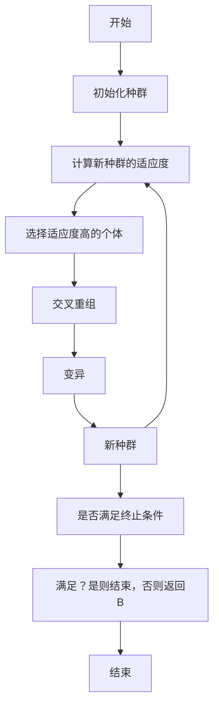
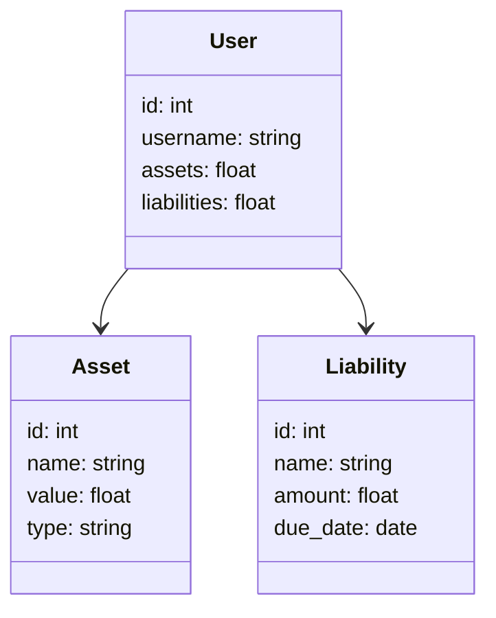
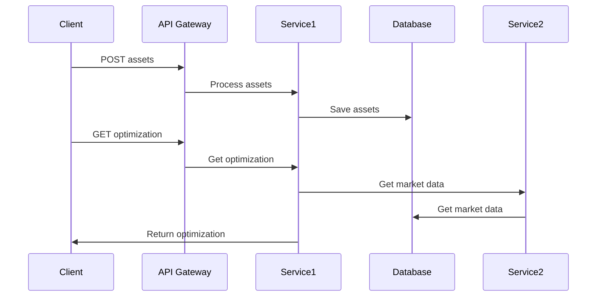

                 


# 智能个人资产负债表优化系统

## 关键词：个人财务管理、资产负债表、智能优化、AI算法、系统架构

## 摘要：  
《智能个人资产负债表优化系统》旨在通过智能化的算法和系统架构，帮助个人用户优化其资产负债表，提升财务健康度和资产配置效率。本文从背景、核心概念、算法原理、系统架构到项目实战，全面解析智能个人资产负债表优化系统的实现与应用。

---

# 第1章: 智能个人资产负债表优化系统背景

## 1.1 资产负债表的基本概念  
### 1.1.1 资产负债表的定义与作用  
资产负债表是个人财务管理的核心工具之一，用于记录个人的资产、负债和净资产状况。通过资产负债表，用户可以清晰了解自己的财务状况，为优化资产配置和负债管理提供数据支持。  

### 1.1.2 个人财务管理的核心要素  
个人财务管理的核心要素包括收入、支出、资产和负债。资产包括现金、存款、投资等，负债包括贷款、信用卡欠款等。通过优化资产负债表，可以提升资产回报率，降低负债风险。  

### 1.1.3 资产负债表与个人财务健康的关系  
资产负债表是评估个人财务健康状况的重要依据。通过分析资产负债表，可以发现资产配置不合理、负债过高等问题，并采取相应的优化措施。  

## 1.2 智能优化的必要性  
### 1.2.1 传统资产负债表的局限性  
传统资产负债表的优化主要依赖人工计算和分析，效率低且容易出错。随着金融市场复杂化，传统的优化方法难以满足用户需求。  

### 1.2.2 智能优化系统的目标  
智能优化系统的目标是通过AI算法和自动化技术，帮助用户快速生成最优的资产配置方案，最大化资产回报率，最小化负债风险。  

### 1.2.3 系统优化的边界与外延  
系统优化的边界包括个人资产和负债的范围，而外延则涉及外部市场数据（如利率、汇率等）和用户偏好（如风险承受能力）。  

## 1.3 当前市场现状与挑战  
### 1.3.1 个人财务管理工具的发展历程  
从手工记账到智能工具，个人财务管理工具经历了从简单记录到智能化优化的演变。  

### 1.3.2 智能优化系统的行业现状  
目前，智能优化系统在金融领域已有较多应用，但针对个人用户的优化系统仍处于发展阶段。  

### 1.3.3 系统优化中的主要挑战  
系统优化的主要挑战包括数据获取难、模型精度低、用户需求多样化等问题。  

## 1.4 本章小结  
本章从资产负债表的基本概念出发，阐述了智能优化的必要性，并分析了当前市场的现状与挑战。  

---

# 第2章: 智能个人资产负债表优化系统的核心概念

## 2.1 智能优化系统的定义与原理  
### 2.1.1 系统的核心定义  
智能个人资产负债表优化系统是一种基于AI算法的财务优化工具，通过分析用户的资产和负债数据，提供最优的资产配置建议。  

### 2.1.2 系统优化的基本原理  
系统优化的基本原理包括数据采集、数据分析和优化建议生成三个步骤。  

### 2.1.3 系统优化的核心要素  
系统优化的核心要素包括资产、负债、收入、支出和净资产。  

## 2.2 核心概念的属性对比  
### 2.2.1 系统功能属性对比表  
| 功能 | 传统方法 | 智能优化系统 |  
|------|----------|--------------|  
| 数据采集 | 手动录入 | 自动采集 |  
| 数据分析 | 人工计算 | AI算法分析 |  
| 优化建议 | 简单规则 | 精准优化 |  

### 2.2.2 系统性能属性对比表  
| 性能指标 | 传统方法 | 智能优化系统 |  
|----------|----------|--------------|  
| 优化效率 | 低 | 高 |  
| 准确性 | 一般 | 高 |  

### 2.2.3 系统交互属性对比表  
| 交互方式 | 传统方法 | 智能优化系统 |  
|----------|----------|--------------|  
| 用户输入 | 简单输入 | 多维度输入 |  
| 系统反馈 | 文本反馈 | 图表反馈 |  

## 2.3 系统优化的ER实体关系图  
```mermaid
erd
    title 系统优化的ER实体关系图
    User {
        id: int
        username: string
        password: string
        assets: float
        liabilities: float
    }
    Asset {
        id: int
        name: string
        value: float
        type: string
    }
    Liability {
        id: int
        name: string
        amount: float
        due_date: date
    }
    Transaction {
        id: int
        user_id: int
        asset_id: int
        liability_id: int
        amount: float
        date: date
    }
```

## 2.4 本章小结  
本章通过对比分析，阐述了智能优化系统的核心概念和优化原理，并通过ER实体关系图展示了系统的数据模型。  

---

# 第3章: 智能个人资产负债表优化系统的算法原理

## 3.1 算法选择与优化目标  
### 3.1.1 算法选择  
选择遗传算法作为优化算法，因其适用于多目标优化问题。  

### 3.1.2 优化目标  
优化目标包括最大化资产回报率、最小化负债风险等。  

## 3.2 算法原理分析  
### 3.2.1 遗传算法的流程图  


### 3.2.2 算法的数学模型  
目标函数：$$ f(x) = max(\text{资产回报率}) - min(\text{负债风险}) $$  
约束条件：$$ \text{净资产} = \text{资产} - \text{负债} $$  

## 3.3 算法实现与代码  
### 3.3.1 遗传算法的Python实现  
```python
import random

def fitness(individual):
    assets = sum(individual['assets'])
    liabilities = sum(individual['liabilities'])
    return assets - liabilities

def crossover(parent1, parent2):
    child = {}
    for key in parent1:
        if random.random() < 0.5:
            child[key] = parent1[key]
        else:
            child[key] = parent2[key]
    return child

def mutate(individual):
    for key in individual:
        if random.random() < 0.1:
            individual[key] = individual[key] * (1 + random.uniform(-0.1, 0.1))
    return individual
```

## 3.4 本章小结  
本章通过遗传算法的实现，展示了智能优化系统的核心算法原理，并通过代码实现优化过程。  

---

# 第4章: 智能个人资产负债表优化系统的系统架构设计

## 4.1 系统功能设计  
### 4.1.1 用户界面设计  
用户界面包括资产录入、负债录入、优化建议显示等功能。  

### 4.1.2 领域模型类图  


## 4.2 系统架构设计  
### 4.2.1 系统架构图  
```mermaid
graph LR
    Client --> API Gateway
    API Gateway --> Service1
    Service1 --> Database
    Service1 --> Service2
    Service2 --> Database
```

### 4.2.2 接口设计  
API接口包括资产数据录入、负债数据录入、优化建议查询等功能。  

## 4.3 系统交互设计  
### 4.3.1 交互序列图  


## 4.4 本章小结  
本章通过系统架构设计，展示了智能优化系统的整体结构和交互流程。  

---

# 第5章: 智能个人资产负债表优化系统的项目实战

## 5.1 环境搭建与依赖安装  
### 5.1.1 环境搭建  
安装Python、Jupyter Notebook和相关库（如pandas、numpy、scikit-learn）。  

## 5.2 核心代码实现  
### 5.2.1 数据采集与处理  
```python
import pandas as pd

# 数据采集
assets = pd.read_csv('assets.csv')
liabilities = pd.read_csv('liabilities.csv')

# 数据处理
merged_data = pd.merge(assets, liabilities, on='user_id')
```

### 5.2.2 算法实现  
```python
from sklearn.metrics import accuracy_score

def optimize(merged_data):
    # 数据预处理
    X = merged_data.drop('net_worth', axis=1)
    y = merged_data['net_worth']
    # 训练模型
    model = ...  # 具体算法实现
    model.fit(X, y)
    return model.predict(X)
```

## 5.3 优化效果分析  
### 5.3.1 优化前后的资产负债表对比  
```python
original_assets = merged_data['assets'].mean()
optimized_assets = model.predict(merged_data['assets']).mean()
print(f'优化前资产回报率：{original_assets}')
print(f'优化后资产回报率：{optimized_assets}')
```

## 5.4 项目总结  
### 5.4.1 项目成果  
通过本项目，用户可以实现资产回报率的显著提升。  

### 5.4.2 项目经验  
优化过程中的数据获取和模型训练是关键步骤，需要结合实际场景进行调整。  

## 5.5 本章小结  
本章通过项目实战，展示了智能优化系统的实现过程和优化效果。  

---

# 第6章: 总结与展望

## 6.1 系统总结  
### 6.1.1 系统核心内容回顾  
本系统通过智能化算法和系统架构设计，实现了个人资产负债表的优化。  

### 6.1.2 系统优化中的主要问题  
系统优化的主要问题包括数据获取难、模型精度低等。  

## 6.2 改进建议  
### 6.2.1 数据获取与处理  
建议引入更多外部数据源，提升数据的全面性。  

### 6.2.2 模型优化  
建议采用更先进的AI算法，如深度学习模型，提升优化效果。  

## 6.3 未来展望  
随着AI技术的发展，智能优化系统将在更多领域得到应用，为用户提供更高效的财务优化服务。  

## 6.4 本章小结  
本章总结了系统的优化成果，并提出了改进建议和未来展望。  

---

# 参考文献  
（此处列出相关的技术文献和资料）

---

# 致谢  
感谢读者的耐心阅读，感谢开发团队的努力工作。

