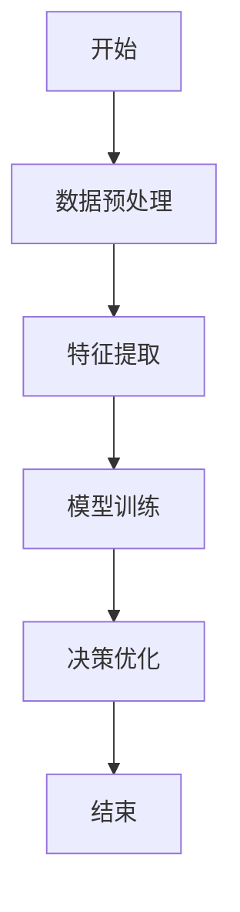

                 


# 智能个人资产配置动态调整器

> 关键词：智能资产配置、动态调整、人工智能、金融投资、风险管理

> 摘要：随着金融市场日益复杂和不确定性增加，传统的静态资产配置方法已无法满足个人投资者的需求。本文提出了一种基于人工智能的智能个人资产配置动态调整器，通过实时数据分析和机器学习算法，实现资产配置的自动化、智能化和动态化。本文详细介绍了该系统的背景、核心概念、算法原理、系统架构、项目实现和最佳实践，为个人投资者提供了一种高效、可靠的资产配置解决方案。

---

# 第一部分: 智能个人资产配置动态调整器的背景与概念

## 第1章: 智能个人资产配置动态调整器的背景与问题背景

### 1.1 个人资产配置的重要性
#### 1.1.1 个人资产配置的基本概念
个人资产配置是指将个人的财务资源（如资金、股票、债券、房地产等）按照一定的比例分配到不同的资产类别中，以实现风险分散和收益最大化。传统的资产配置方法通常基于历史数据分析和固定的投资策略，但在市场环境快速变化的情况下，这种静态的配置方法难以适应投资者的需求。

#### 1.1.2 资产配置在投资中的作用
资产配置是投资组合管理的核心，它决定了投资组合的风险和收益特征。合理的资产配置可以帮助投资者在不同市场环境下平衡风险和收益，避免单一资产类别波动对整体投资组合的影响。

#### 1.1.3 传统资产配置的局限性
- 市场环境变化快，传统方法难以实时调整。
- 个人风险偏好可能随时间变化，静态配置无法动态适应。
- 传统方法依赖历史数据，忽视了市场的非线性变化和黑天鹅事件。

### 1.2 动态调整的必要性
#### 1.2.1 市场环境的变化对资产配置的影响
金融市场波动频繁，经济周期、政策变化、地缘政治等因素都会影响资产价格。动态调整能够根据实时市场信息优化资产配置，提高投资收益。

#### 1.2.2 个人风险偏好的变化
投资者的风险承受能力可能因收入变化、家庭状况、健康状况等因素而变化。动态调整能够根据个人当前的风险偏好进行实时优化。

#### 1.2.3 动态调整在资产保值与增值中的作用
动态调整能够及时捕捉市场机会，规避市场风险，帮助投资者在不同市场环境下实现资产的保值和增值。

### 1.3 当前市场环境的现状
#### 1.3.1 全球经济环境对个人资产的影响
全球经济不确定性增加，如新冠疫情、地缘政治冲突等，都对个人资产配置提出了更高的要求。

#### 1.3.2 数字化金融工具的普及
金融科技的发展使得投资者可以通过数字化工具实时监控和调整资产配置，为动态调整提供了技术基础。

#### 1.3.3 人工智能在金融领域的应用现状
人工智能技术在金融领域的广泛应用，为动态资产配置提供了新的可能性。机器学习算法可以处理海量数据，发现数据中的非线性关系，为动态调整提供科学依据。

### 1.4 智能动态调整器的提出
#### 1.4.1 智能动态调整器的定义
智能个人资产配置动态调整器是一种基于人工智能技术的系统，能够根据实时市场数据和个人投资者的动态需求，自动优化资产配置。

#### 1.4.2 智能动态调整器的核心目标
- 实时监控市场数据，动态调整资产配置比例。
- 根据个人风险偏好和市场环境变化，优化投资组合。
- 提高投资收益，降低投资风险。

#### 1.4.3 智能动态调整器的边界与外延
- 边界：仅针对个人资产配置，不涉及机构投资者。
- 外延：可以与其他金融工具（如智能投顾、量化交易）结合，形成完整的智能投资解决方案。

---

## 第2章: 智能个人资产配置动态调整器的核心概念与联系

### 2.1 核心概念与原理
#### 2.1.1 智能动态调整器的原理概述
智能动态调整器通过实时收集和分析市场数据，结合个人投资者的风险偏好和财务目标，利用机器学习算法生成最优资产配置建议。

#### 2.1.2 人工智能在动态调整中的作用
- 数据处理：利用自然语言处理（NLP）和计算机视觉技术分析新闻、社交媒体等非结构化数据。
- 模型训练：通过机器学习算法（如随机森林、支持向量机、神经网络等）构建资产价格预测模型。
- 决策优化：利用强化学习和遗传算法优化资产配置比例。

#### 2.1.3 数据驱动的动态调整机制
数据驱动的动态调整机制包括数据采集、数据处理、模型训练和决策优化四个步骤。系统通过实时数据更新和模型迭代，实现资产配置的动态优化。

### 2.2 核心概念对比表
#### 2.2.1 不同资产配置模型的对比
| 模型名称       | 基于历史数据 | 基于实时数据 | 是否动态调整 | 是否考虑个体风险偏好 |
|----------------|--------------|--------------|--------------|----------------------|
| 静态资产配置   | 是           | 否           | 否           | 否                   |
| 动态资产配置   | 是           | 是           | 是           | 是                   |
| 智能动态调整器 | 部分         | 是           | 是           | 是                   |

#### 2.2.2 动态调整与静态配置的对比
| 对比维度       | 动态调整     | 静态配置     |
|----------------|-------------|-------------|
| 调整频率       | 实时         | 定期（如季度）|
| 数据依赖       | 实时数据     | 历史数据     |
| 灵活性         | 高           | 低           |
| 适应性         | 强           | 弱           |

### 2.3 核心概念的ER实体关系图
```mermaid
er
actor: 投资者
asset: 资产类别
market_data: 市场数据
risk_preference: 风险偏好
configuration: 资产配置方案
algorithm: 机器学习算法
```

---

## 第3章: 智能个人资产配置动态调整器的算法原理

### 3.1 算法原理概述
智能动态调整器的核心算法包括数据预处理、特征提取、模型训练和决策优化四个步骤。

### 3.2 算法流程图


### 3.3 数据预处理
数据预处理包括数据清洗、特征标准化和数据增强。以下是Python代码示例：
```python
import pandas as pd
import numpy as np

# 数据清洗
data = pd.read_csv('market_data.csv')
data = data.dropna()
data = data[~data.duplicated()]

# 特征标准化
from sklearn.preprocessing import StandardScaler
scaler = StandardScaler()
scaled_data = scaler.fit_transform(data[['return', 'volatility', 'risk']])

# 数据增强
from sklearn.impute import SimpleImputer
imp = SimpleImputer(missing_values=np.nan, strategy='mean')
imp_data = imp.fit_transform(data[['return', 'volatility', 'risk']])
```

### 3.4 特征提取
特征提取是利用主成分分析（PCA）从多维数据中提取关键特征。
```python
from sklearn.decomposition import PCA
pca = PCA(n_components=3)
principal_components = pca.fit_transform(scaled_data)
```

### 3.5 模型训练
模型训练使用支持向量机（SVM）进行资产价格预测。
```python
from sklearn.svm import SVC
model = SVC(kernel='rb

