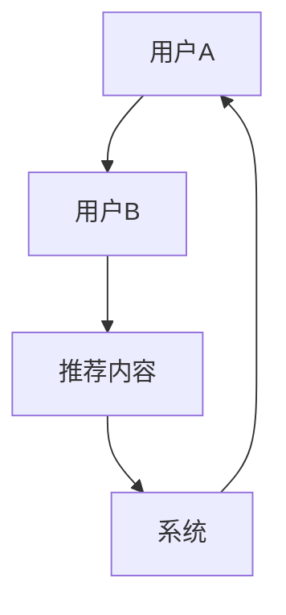
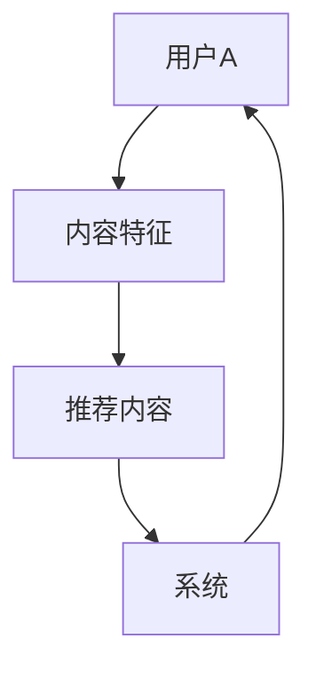
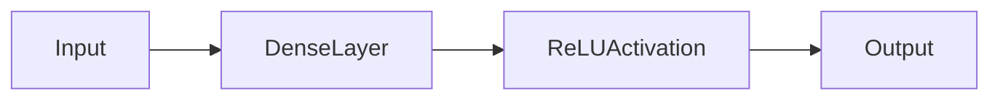
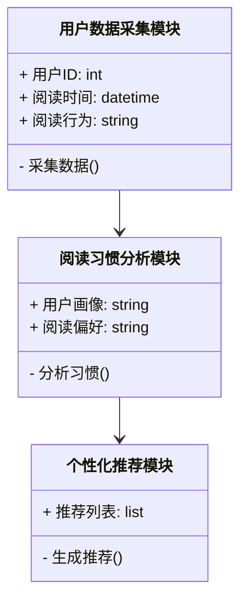
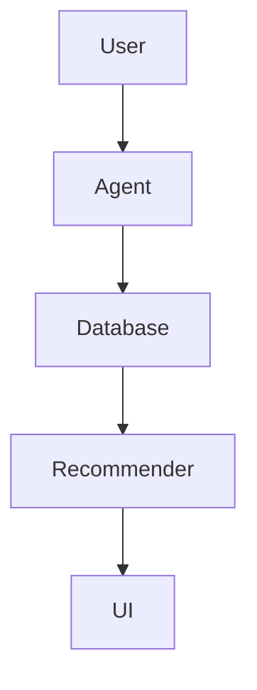
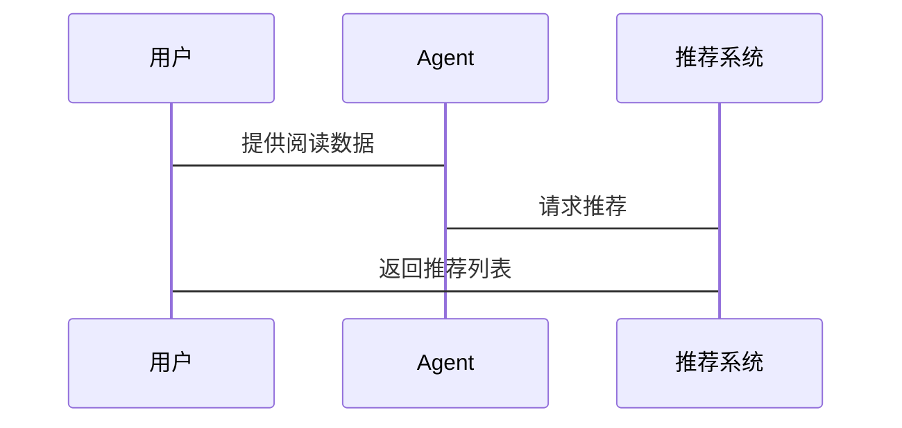

                 


# 智能书架：AI Agent的阅读习惯分析

## 关键词：智能书架，AI Agent，阅读习惯分析，推荐系统，协同过滤，个性化推荐

## 摘要：  
本文深入探讨如何利用AI Agent分析用户的阅读习惯，从而优化智能书架的功能。通过结合背景介绍、核心概念、算法原理、系统架构和项目实战，详细阐述了AI Agent在阅读习惯分析中的应用及其技术实现。本文旨在为读者提供一个全面的视角，帮助他们理解并构建一个基于AI的智能书架系统，实现精准的阅读推荐和个性化管理。

---

## 第1章：背景介绍

### 1.1 问题背景  
阅读习惯分析是提升用户体验的重要手段。传统书架功能单一，无法根据用户的阅读偏好提供个性化推荐。通过引入AI Agent，我们可以实时分析用户的阅读行为，预测用户的兴趣偏好，从而实现智能化的阅读管理。

### 1.2 问题描述  
用户在阅读过程中会产生大量数据，如阅读频率、停留时间、偏好类型等。如何高效地收集、处理和分析这些数据，并将其转化为个性化的推荐结果，是当前智能书架系统面临的主要挑战。

### 1.3 问题解决思路  
AI Agent通过自然语言处理（NLP）和机器学习（ML）技术，可以实时分析用户的阅读数据，构建用户画像，并基于这些画像推荐相关内容。这种数据驱动的方法能够显著提升推荐的精准度。

### 1.4 核心概念与联系  
以下是核心概念及其关系的对比表：

| 概念 | 定义 | 属性 | 关系 |
|------|------|------|------|
| AI Agent | 一种能够感知环境并执行任务的智能体 | 学习能力、推理能力、交互能力 | 与用户行为数据高度关联 |
| 阅读习惯 | 用户在阅读过程中的行为模式 | 阅读频率、偏好类型、阅读时间 | 数据驱动AI Agent的决策 |
| 个性化推荐 | 根据用户特征定制推荐内容 | 精准度、实时性 | AI Agent的核心功能之一 |

### 1.5 ER实体关系图  
以下是阅读习惯分析的核心实体关系图：

```mermaid
er
actor(AgentID, AgentType, Capability) {
    AgentID
    AgentType
    Capability
}
actor阅读习惯(ReadingHabitID, UserID, ReadingBehavior) {
    ReadingHabitID
    UserID
    ReadingBehavior
}
```

---

## 第2章：AI Agent与阅读习惯分析的核心原理

### 2.1 AI Agent的基本原理  
AI Agent通过感知环境和用户行为数据，利用机器学习模型进行推理和决策。其核心算法包括自然语言处理（NLP）、协同过滤（Collaborative Filtering）和深度学习模型。

### 2.2 阅读习惯分析的关键要素  
1. **数据采集**：收集用户的阅读行为数据，如阅读时间、停留时间、点击频率等。  
2. **数据处理**：对数据进行清洗和预处理，提取关键特征。  
3. **模型构建**：基于数据构建用户画像和推荐模型。  

### 2.3 算法原理讲解  

#### 2.3.1 协同过滤算法  
协同过滤是一种基于用户行为相似性的推荐算法。以下是其实现流程：



数学公式：  
$$ \text{相似度} = \frac{\sum (r_{u,i} - \bar{r}_u)(r_{v,i} - \bar{r}_v)}{\sqrt{\sum (r_{u,i} - \bar{r}_u)^2} \sqrt{\sum (r_{v,i} - \bar{r}_v)^2}} $$  

#### 2.3.2 基于内容的推荐算法  
基于内容的推荐算法通过分析内容特征进行推荐。以下是其实现流程：



数学公式：  
$$ \text{相似度} = \frac{\sum w_{i,j} \cdot (f_i - f_j)}{\sqrt{\sum w_{i,j}^2}} $$  

#### 2.3.3 深度学习模型  
深度学习模型（如神经网络）可以自动提取用户和内容的特征。以下是其架构：



数学公式：  
$$ P(y|x) = \sigma(Wx + b) $$  

---

## 第3章：系统分析与架构设计方案

### 3.1 问题场景介绍  
智能书架系统需要实时处理用户的阅读数据，并根据这些数据提供个性化推荐。

### 3.2 项目介绍  
本项目旨在构建一个基于AI Agent的智能书架系统，实现用户的阅读习惯分析和个性化推荐。

### 3.3 系统功能设计  
以下是系统的核心功能模块：



### 3.4 系统架构设计  
以下是系统的整体架构图：



### 3.5 系统接口设计  
系统接口包括数据采集接口、推荐接口和用户反馈接口。

### 3.6 系统交互流程  
以下是用户与系统的交互流程：



---

## 第4章：项目实战

### 4.1 环境安装  
需要安装以下工具：Python、TensorFlow、Pandas、Scikit-learn。

### 4.2 核心代码实现  

#### 4.2.1 数据采集  
```python
import pandas as pd
import requests

def fetch_data():
    response = requests.get('http://example.com/api/users')
    data = response.json()
    df = pd.DataFrame(data)
    return df
```

#### 4.2.2 模型训练  
```python
from sklearn.metrics.pairwise import cosine_similarity

def train_model(data):
    user_features = data[['阅读时间', '阅读行为']]
    similarity_matrix = cosine_similarity(user_features)
    return similarity_matrix
```

#### 4.2.3 推荐生成  
```python
def generate_recommendations(similarity_matrix, user_id):
    recommendations = []
    for i in range(len(similarity_matrix[user_id])):
        if i != user_id:
            recommendations.append(i)
    return recommendations
```

### 4.3 案例分析  
以用户A为例，假设其阅读时间为10:00 AM，阅读行为为“快速浏览”，系统会推荐相关书籍。

### 4.4 系统优化  
根据用户反馈优化推荐算法，如引入实时数据流处理和模型更新机制。

---

## 第5章：最佳实践与总结

### 5.1 小结  
本文详细介绍了AI Agent在阅读习惯分析中的应用，从背景、原理到实现，为构建智能书架系统提供了全面指导。

### 5.2 注意事项  
- 数据隐私保护：确保用户数据的安全性。  
- 算法优化：定期更新模型以保持推荐的精准度。  
- 系统扩展性：设计灵活的架构以支持未来需求。

### 5.3 拓展阅读  
建议读者深入学习协同过滤、深度学习和推荐系统的相关知识。

---

## 结语  
通过本文的介绍，读者可以系统地理解AI Agent在阅读习惯分析中的应用，并能够实际操作构建智能书架系统。未来，随着AI技术的不断进步，智能书架将更加智能化和个性化，为用户提供更好的阅读体验。

