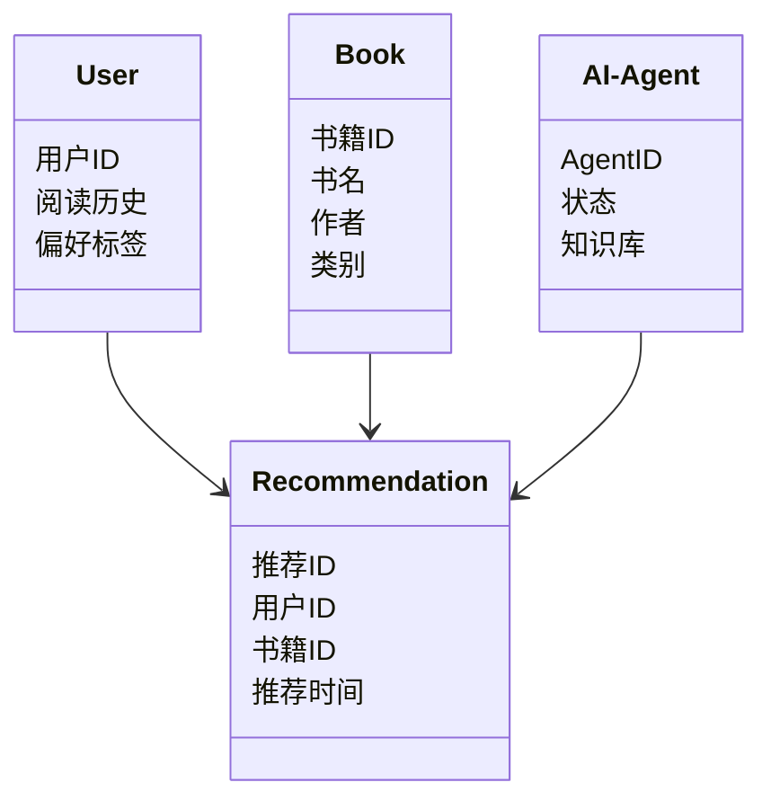

                 


# 智能书架：AI Agent的阅读兴趣拓展系统

## 关键词：
AI Agent, 阅读推荐, 协同过滤, 深度学习, 推荐系统

## 摘要：
智能书架是一种基于AI Agent的阅读兴趣拓展系统，通过分析用户的阅读行为和偏好，利用协同过滤、深度学习等算法，为用户提供个性化、动态更新的阅读推荐。本文将详细介绍智能书架的设计原理、算法实现、系统架构以及实际应用案例，帮助读者理解如何通过AI技术提升阅读推荐的效率和精准度。

---

## 第1章: 智能书架的背景与核心概念

### 1.1 问题背景
#### 1.1.1 阅读兴趣拓展的痛点
现代阅读资源丰富，但用户难以找到符合个人兴趣的书籍。传统推荐系统依赖人工筛选或固定分类，难以满足用户的个性化需求。此外，用户的阅读偏好会随着时间和场景变化，传统推荐系统难以动态调整。

#### 1.1.2 AI Agent在阅读推荐中的作用
AI Agent（智能代理）能够实时分析用户行为数据，结合上下文信息，动态生成个性化推荐。通过学习用户的阅读习惯，AI Agent可以预测用户的兴趣变化，并推荐相关书籍。

#### 1.1.3 智能书架的定义与目标
智能书架是一个基于AI Agent的系统，通过分析用户的阅读行为、偏好和上下文信息，提供动态、个性化的阅读推荐服务。其目标是帮助用户发现符合兴趣的书籍，提升阅读体验。

### 1.2 问题描述
#### 1.2.1 阅读推荐的核心问题
- 如何准确理解用户的阅读偏好？
- 如何实时更新推荐结果以适应用户的兴趣变化？
- 如何处理海量数据并保证推荐效率？

#### 1.2.2 用户阅读行为的多样性
用户的阅读行为受到多种因素影响，包括阅读时间、地点、情绪等。这些因素使得阅读偏好具有动态性和不确定性。

#### 1.2.3 阅读兴趣的动态变化
用户的阅读兴趣会受到外部环境和内在情绪的影响，呈现出动态变化的特点。传统的静态推荐系统难以适应这种变化。

### 1.3 问题解决
#### 1.3.1 AI Agent在阅读推荐中的解决方案
- 使用机器学习算法分析用户行为数据，构建用户画像。
- 基于上下文信息动态调整推荐策略。
- 利用强化学习优化推荐效果。

#### 1.3.2 智能书架的核心功能
- 用户行为分析：收集和分析用户的阅读历史、偏好和情绪。
- 阅读推荐：基于分析结果生成个性化推荐。
- 动态调整：根据用户反馈实时更新推荐策略。

#### 1.3.3 系统的边界与外延
智能书架的边界包括用户端的阅读数据采集、推荐算法实现和推荐结果展示。其外延涉及数据源的获取、推荐效果的评估和用户反馈的收集。

### 1.4 概念结构与核心要素
#### 1.4.1 智能书架的组成要素
- 用户行为数据：包括阅读历史、偏好、情绪等。
- AI Agent：负责数据分析和推荐策略生成。
- 推荐结果：动态更新的个性化书单。

#### 1.4.2 AI Agent与阅读兴趣的关系
AI Agent通过分析用户行为数据，学习用户的阅读偏好，并根据实时数据调整推荐策略。这种关系是动态且双向的，用户的行为数据驱动AI Agent的推荐，而推荐结果又影响用户的阅读行为。

#### 1.4.3 系统的核心算法与模型
- 协同过滤：基于用户相似性生成推荐。
- 基于内容的推荐：基于书籍内容特征生成推荐。
- 深度学习模型：基于神经网络学习用户偏好。

## 1.5 本章小结
本章介绍了智能书架的背景、问题背景和核心概念，分析了AI Agent在阅读推荐中的作用，明确了系统的功能和边界。下一章将深入探讨AI Agent与阅读兴趣拓展的核心概念。

---

## 第2章: AI Agent与阅读兴趣拓展的核心概念

### 2.1 核心概念原理
#### 2.1.1 AI Agent的基本原理
AI Agent通过感知环境、分析数据、执行任务来实现目标。在阅读推荐中，AI Agent感知用户的阅读行为，分析数据生成推荐策略。

#### 2.1.2 阅读兴趣的数学模型
阅读兴趣可以用向量表示，每个维度代表一种兴趣特征。例如，向量的每个元素表示用户对某一类书籍的兴趣程度。

#### 2.1.3 智能书架的推荐机制
推荐机制包括数据采集、用户建模、推荐生成和结果展示四个步骤。AI Agent在每个步骤中发挥关键作用。

### 2.2 核心概念对比
#### 2.2.1 不同推荐算法的对比
| 算法类型        | 优点                           | 缺点                           |
|-----------------|-------------------------------|-------------------------------|
| 协同过滤        | 数据简单，易于实现             | 对冷启动问题敏感               |
| 基于内容的推荐   | 内容特征明确                   | 对稀疏数据敏感                 |
| 深度学习模型     | 表达能力强，适合复杂场景       | 计算资源消耗大                 |

#### 2.2.2 AI Agent与其他推荐系统的特点对比
| 特性            | AI Agent推荐系统                | 传统推荐系统                   |
|-----------------|-------------------------------|-------------------------------|
| 动态性           | 实时调整推荐策略               | 静态推荐，难以动态更新         |
| 个性化          | 高度个性化                     | 个性化有限                     |
| 情境感知         | 能够感知上下文信息             | 无法感知上下文信息             |

#### 2.2.3 阅读兴趣与用户行为的关系
阅读兴趣是用户行为的内在驱动，用户行为是阅读兴趣的外在表现。AI Agent通过分析用户行为数据，反推阅读兴趣。

### 2.3 ER实体关系图
```mermaid
erd
    User (用户ID, 阅读历史, 偏好标签)
    Book (书籍ID, 书名, 作者, 类别)
    Recommendation (推荐ID, 用户ID, 书籍ID, 推荐时间)
    AI-Agent (AgentID, 状态, 知识库)
```

## 2.4 本章小结
本章分析了AI Agent的核心概念，对比了不同推荐算法的特点，展示了阅读兴趣与用户行为的关系。下一章将详细讲解智能书架的算法原理。

---

## 第3章: 智能书架的算法原理

### 3.1 算法原理概述
#### 3.1.1 基于协同过滤的推荐算法
协同过滤是一种经典的推荐算法，通过寻找用户之间的相似性，推荐相似用户的书籍。

#### 3.1.2 基于内容的推荐算法
基于内容的推荐算法通过分析书籍的内容特征，推荐与用户偏好相似的书籍。

#### 3.1.3 基于深度学习的推荐算法
深度学习模型（如神经网络）能够学习复杂的用户偏好，推荐效果更优。

### 3.2 协同过滤算法实现
#### 3.2.1 基于用户的协同过滤
```python
def user_based_recommendation(user_id, user_similarity_matrix):
    # 获取与目标用户相似的用户
    similar_users = user_similarity_matrix[user_id]
    # 计算推荐分数
    recommendation_scores = {}
    for user in similar_users:
        for book in similar_users[user]:
            recommendation_scores[book] += similar_users[user][book]
    # 排序并返回推荐结果
    return sorted(recommendation_scores.items(), key=lambda x: x[1], reverse=True)
```

#### 3.2.2 基于物品的协同过滤
```python
def item_based_recommendation(book_id, item_similarity_matrix):
    # 获取与目标书籍相似的书籍
    similar_books = item_similarity_matrix[book_id]
    # 计算推荐分数
    recommendation_scores = {}
    for book in similar_books:
        recommendation_scores[book] = similar_books[book]
    # 排序并返回推荐结果
    return sorted(recommendation_scores.items(), key=lambda x: x[1], reverse=True)
```

#### 3.2.3 混合推荐算法
混合推荐算法结合了基于用户的协同过滤和基于物品的协同过滤，通过加权平均生成推荐结果。

### 3.3 深度学习推荐模型
#### 3.3.1 基于神经网络的推荐系统
深度学习模型通过学习用户和书籍的特征表示，生成推荐结果。例如，使用Word2Vec模型将书籍表示为向量。

#### 3.3.2 神经网络推荐模型的数学公式
推荐模型的损失函数可以表示为：
$$ L = \sum_{i=1}^{n} (y_i - \hat{y}_i)^2 $$
其中，$y_i$是实际值，$\hat{y}_i$是预测值。

---

## 第4章: 系统分析与架构设计

### 4.1 系统功能设计
#### 4.1.1 领域模型


### 4.2 系统架构设计
系统架构分为数据层、处理层和应用层。

#### 4.2.1 数据层
数据层负责存储用户行为数据、书籍信息和推荐结果。使用数据库进行存储和管理。

#### 4.2.2 处理层
处理层负责数据分析、模型训练和推荐生成。使用AI Agent进行实时分析和推荐。

#### 4.2.3 应用层
应用层负责用户交互和推荐结果展示。用户可以通过界面查看推荐结果并进行反馈。

### 4.3 系统接口设计
系统接口包括用户登录、获取推荐、反馈评价等。

### 4.4 系统交互流程
系统交互流程如下：
1. 用户登录系统。
2. 系统采集用户的行为数据。
3. AI Agent分析数据并生成推荐结果。
4. 用户查看推荐结果并进行反馈。
5. 系统根据反馈调整推荐策略。

---

## 第5章: 项目实战

### 5.1 环境安装
需要安装Python、Flask框架、scikit-learn库和TensorFlow库。

### 5.2 核心代码实现
#### 5.2.1 协同过滤实现
```python
from sklearn.metrics.pairwise import cosine_similarity

# 示例数据
users = ['user1', 'user2', 'user3']
books = ['book1', 'book2', 'book3']

# 计算用户相似性矩阵
user_similarity = cosine_similarity(...)
```

#### 5.2.2 深度学习模型实现
```python
import tensorflow as tf
from tensorflow.keras import layers

model = tf.keras.Sequential([
    layers.Dense(64, activation='relu'),
    layers.Dense(1, activation='sigmoid')
])
model.compile(optimizer='adam', loss='binary_crossentropy')
```

### 5.3 案例分析
通过实际案例分析推荐系统的性能和效果，展示如何根据用户反馈调整推荐策略。

---

## 第6章: 最佳实践、小结与展望

### 6.1 最佳实践
- 数据预处理是关键，需要清洗和特征提取。
- 模型调优可以显著提升推荐效果。
- 注意数据隐私和用户隐私保护。

### 6.2 小结
本文详细介绍了智能书架的设计原理、算法实现和系统架构，展示了如何通过AI Agent提升阅读推荐的效率和精准度。

### 6.3 注意事项
- 数据量过大会影响推荐效率，需要优化算法。
- 模型的可解释性需要进一步提升。
- 用户反馈机制是系统优化的重要手段。

### 6.4 拓展阅读
推荐相关书籍和论文，深入学习AI Agent和推荐系统的知识。

---

## 附录
附录包括完整的代码示例、数据集说明和参考文献。

---

以上是文章的详细大纲和内容，希望对您有所帮助！

