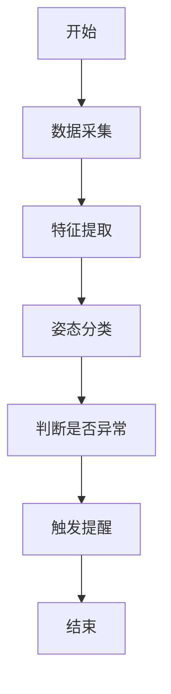
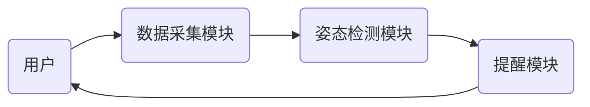

                 


# 智能书桌：AI Agent的姿势提醒系统

## 关键词：智能书桌，AI Agent，姿势提醒，健康生活，人工智能技术

## 摘要：智能书桌通过AI Agent实时监测用户坐姿，利用先进的姿态检测算法和反馈机制，提醒用户保持正确的坐姿，从而预防健康问题。本文详细探讨其背景、核心概念、算法原理、系统架构及实际应用。

---

## 第1章：背景介绍

### 1.1 问题背景
现代人长时间久坐，导致颈椎病、腰椎病等健康问题日益严重。传统姿势提醒装置存在提醒方式单一、缺乏智能性等问题，难以有效改善用户的坐姿习惯。AI Agent的引入为解决这一问题提供了新的可能性。

### 1.2 问题描述
智能书桌的目标是实时监测坐姿，当检测到不良姿势时，通过震动或语音提醒用户调整。系统边界包括坐姿监测和反馈提醒，不涉及其他健康监测功能。核心要素包括传感器、AI算法和反馈机制。

---

## 第2章：核心概念与联系

### 2.1 AI Agent的定义与原理
AI Agent是一种智能体，能够感知环境并自主决策。它具备自主性、反应性、目标导向和社交能力，与传统软件不同，能根据环境变化做出实时反应。

### 2.2 姿势提醒系统的属性特征对比

| 特性        | 传统提醒装置 | AI Agent提醒系统 |
|-------------|--------------|-----------------|
| **功能**    | 单一提醒     | 智能监测与提醒   |
| **性能**    | 固定频率     | 实时动态调整     |
| **交互**    | 被动触发     | 主动学习与反馈   |

### 2.3 ER实体关系图
```mermaid
erd
    title 实体关系图
    User (用户ID, 用户名称, 用户权限)
    Sensor (传感器ID, 传感器类型, 连接状态)
    Reminder (提醒记录ID, 提醒时间, 提醒方式)
    User -> Sensor: 使用
    Sensor -> Reminder: 触发
```

---

## 第3章：算法原理讲解

### 3.1 数据采集与处理
使用摄像头或人体传感器采集坐姿数据，预处理步骤包括去噪和平滑处理，提取关键特征如肩部高度、背部倾斜角度。

### 3.2 姿态检测算法
基于深度学习的姿态估计网络，通过训练数据学习正常坐姿特征，检测用户当前姿势。流程如下：



### 3.3 提醒机制的设计
采用多模态提醒，根据用户习惯调整提醒频率和方式，减少干扰。

---

## 第4章：数学模型与公式

### 4.1 姿态检测的几何模型
通过关键点坐标计算坐姿角度，公式为：
$$ \theta = \arctan\left(\frac{y_2 - y_1}{x_2 - x_1}\right) $$

---

## 第5章：系统架构与设计

### 5.1 系统架构设计
模块化架构包括数据采集、姿态检测、提醒模块，各模块协同工作：



---

## 第6章：项目实战

### 6.1 环境安装
安装Python、OpenCV、TensorFlow等库，配置开发环境。

### 6.2 核心代码实现
实现数据采集、姿态检测、提醒触发功能，代码示例如下：

```python
import cv2

def capture_image():
    cap = cv2.VideoCapture(0)
    while True:
        ret, frame = cap.read()
        cv2.imshow('Capture', frame)
        if cv2.waitKey(1) & 0xFF == ord('q'):
            break
    cap.release()
    cv2.destroyAllWindows()
```

### 6.3 案例分析
通过实际数据验证系统有效性，优化提醒策略，提升用户体验。

---

## 第7章：最佳实践与小结

### 7.1 最佳实践
- 定期校准传感器，确保准确性。
- 根据用户反馈优化提醒策略。
- 注意数据隐私保护。

### 7.2 小结
智能书桌结合AI Agent技术，显著提升了姿势管理的效率和效果。本文详细探讨了系统的设计与实现，为类似项目提供了参考。

### 7.3 注意事项
- 确保系统稳定性，避免误报。
- 考虑用户体验，提醒方式多样化。

### 7.4 拓展阅读
推荐相关书籍和论文，深入学习AI在健康领域的应用。

---

通过以上步骤，文章系统地介绍了智能书桌的设计与实现，为读者提供了全面的技术视角和实际应用案例，帮助理解AI在健康生活中的潜力。

