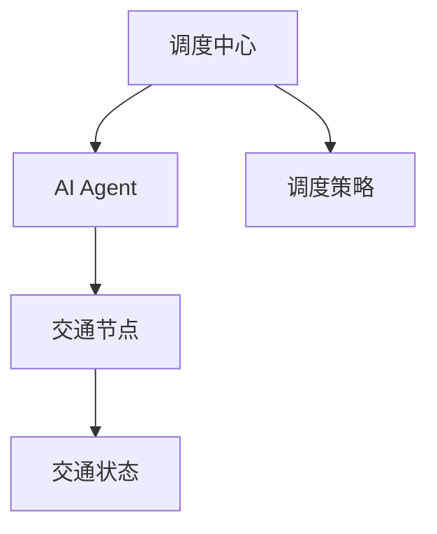
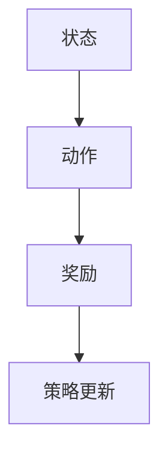
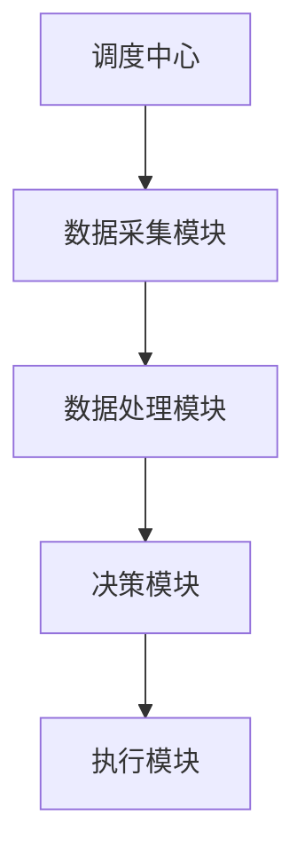
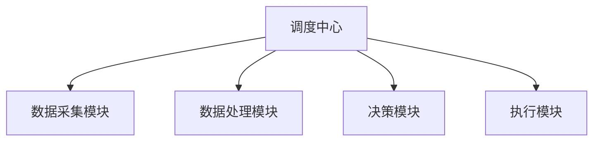

                 


# 智能交通系统中的AI Agent调度中心

## 关键词：智能交通系统、AI Agent、调度中心、实时调度、智能算法、交通优化

## 摘要：  
本文探讨了AI Agent在智能交通系统中的应用，重点分析了AI Agent调度中心的设计与实现。通过系统性地介绍背景、核心概念、算法原理、系统架构及项目实战，本文揭示了AI Agent如何通过智能算法优化交通调度，提升交通系统的效率与用户体验。文章内容涵盖了从理论到实践的全过程，为智能交通系统的开发者和研究者提供了深度的技术指导。

---

# 第一部分: 背景介绍

## 第1章: 背景介绍

### 1.1 智能交通系统的发展历程  
智能交通系统（Intelligent Transportation System, ITS）是将现代信息技术、通信技术与交通管理相结合的产物。随着城市化进程的加快，交通拥堵、资源浪费等问题日益突出，传统的交通管理系统已无法满足现代城市的需求。智能交通系统通过引入AI、大数据和物联网等技术，实现了交通管理的智能化和自动化。  

#### 1.1.1 传统交通系统的特点与局限性  
传统交通系统主要依赖人工管理，存在以下问题：  
1. **信息孤岛**：各个交通节点（如收费站、交通灯）之间缺乏有效的信息共享。  
2. **效率低下**：人工调度依赖经验，难以应对复杂的交通状况。  
3. **资源浪费**：交通信号灯、道路资源等未能实现最优分配。  

#### 1.1.2 智能交通系统的定义与目标  
智能交通系统通过整合多种技术手段，实时感知、分析和优化交通状况，目标是实现交通资源的高效利用和交通管理的智能化。  

#### 1.1.3 AI技术在智能交通中的应用现状  
AI技术在智能交通中的应用主要体现在以下几个方面：  
1. **交通预测**：利用机器学习算法预测交通流量和拥堵情况。  
2. **路径优化**：为车辆提供实时最优路径。  
3. **智能调度**：通过AI Agent实现交通资源的智能分配。  

### 1.2 AI Agent的基本概念与特点  
AI Agent（智能代理）是一种能够感知环境并采取行动以实现目标的实体。在智能交通系统中，AI Agent通常用于交通调度、路径规划和资源分配。  

#### 1.2.1 AI Agent的定义与分类  
AI Agent可以根据智能水平分为以下几类：  
1. **反应式AI Agent**：基于当前感知做出反应，不依赖历史信息。  
2. **认知式AI Agent**：具有推理、规划和学习能力，能够处理复杂任务。  
3. **协作式AI Agent**：能够与其他Agent或人类协同工作，实现共同目标。  

#### 1.2.2 AI Agent的核心功能与优势  
AI Agent的核心功能包括：  
1. **感知环境**：通过传感器或数据源获取交通信息。  
2. **决策制定**：基于感知信息做出最优决策。  
3. **执行行动**：通过接口将决策转化为实际操作。  

AI Agent的优势在于其智能化和自动化能力，能够显著提高交通系统的效率。  

#### 1.2.3 AI Agent在交通系统中的作用  
AI Agent在交通系统中的作用主要体现在以下几个方面：  
1. **实时调度**：动态调整交通信号灯、公交调度等。  
2. **路径优化**：为车辆或行人提供最优路径。  
3. **资源分配**：优化道路资源的使用，减少拥堵。  

### 1.3 AI Agent与智能交通系统的结合  
AI Agent与智能交通系统的结合，使得交通管理更加智能化和高效化。  

#### 1.3.1 AI Agent在智能交通中的应用场景  
AI Agent在智能交通中的应用场景包括：  
1. **交通信号灯控制**：根据实时交通流量调整信号灯周期。  
2. **公交调度**：根据客流量动态调整公交班次。  
3. **路径规划**：为自动驾驶车辆提供实时路径规划。  

#### 1.3.2 调度中心在智能交通系统中的地位  
调度中心是智能交通系统的核心部分，负责协调和管理各类交通资源。AI Agent作为调度中心的执行单元，承担了关键的决策和行动任务。  

#### 1.3.3 AI Agent调度中心的定义与目标  
AI Agent调度中心是一个基于AI技术的智能调度系统，目标是通过实时数据处理和智能决策，实现交通资源的最优分配和交通流量的高效管理。  

### 1.4 本章小结  
本章从智能交通系统的发展历程入手，介绍了AI Agent的基本概念和特点，分析了AI Agent在智能交通系统中的作用，最后明确了AI Agent调度中心的定义与目标。这些内容为后续章节的深入分析奠定了基础。

---

# 第二部分: AI Agent调度中心的核心概念与联系

## 第2章: AI Agent调度中心的核心概念与联系  

### 2.1 核心概念原理  
AI Agent调度中心的核心概念包括AI Agent的智能决策机制、调度中心的多目标优化以及智能交通系统的实时性要求。  

#### 2.1.1 AI Agent的智能决策机制  
AI Agent的决策机制通常包括以下几个步骤：  
1. **感知环境**：通过传感器或数据源获取交通信息。  
2. **状态识别**：识别当前交通状态（如拥堵、畅通）。  
3. **决策制定**：基于状态信息制定最优决策。  
4. **执行行动**：将决策转化为实际操作。  

#### 2.1.2 调度中心的多目标优化  
调度中心需要在多个目标之间进行权衡，例如：  
1. **减少拥堵**：通过优化信号灯周期降低交通拥堵。  
2. **提高效率**：通过动态调度提高交通资源利用率。  
3. **减少排放**：通过优化路径降低碳排放。  

#### 2.1.3 智能交通系统的实时性要求  
智能交通系统需要实时处理大量的交通数据，因此对实时性要求较高。  

### 2.2 核心概念属性特征对比  
为了更好地理解AI Agent调度中心的核心概念，我们可以通过对比分析其属性特征。  

#### 2.2.1 AI Agent的属性特征表  

| 属性       | 描述                                       |
|------------|------------------------------------------|
| 智能水平     | 反应式、认知式或协作式                 |
| 决策能力     | 基于实时数据做出最优决策               |
| 执行能力     | 能够通过接口执行实际操作               |
| 学习能力     | 具备学习能力，能够优化决策策略         |

#### 2.2.2 调度中心的功能模块对比  

| 功能模块     | 描述                                       |
|--------------|------------------------------------------|
| 数据采集模块   | 采集交通数据（如车流量、信号灯状态）     |
| 数据处理模块   | 对采集数据进行清洗、转换和分析         |
| 决策模块       | 基于数据处理结果制定调度策略           |
| 执行模块       | 将调度策略转化为实际操作               |

#### 2.2.3 智能交通系统的性能指标分析  
智能交通系统的性能指标包括：  
1. **响应时间**：系统对交通事件的响应速度。  
2. **处理能力**：系统同时处理多个交通场景的能力。  
3. **优化效果**：系统对交通流量的优化程度。  

### 2.3 ER实体关系图  
为了更好地理解AI Agent调度中心的实体关系，我们可以通过ER图进行建模。  



### 2.4 本章小结  
本章通过对比分析AI Agent和调度中心的核心概念，揭示了它们在智能交通系统中的关系和作用。通过ER实体关系图，进一步明确了各实体之间的关联和交互方式。

---

# 第三部分: AI Agent调度中心的算法原理

## 第3章: AI Agent调度中心的算法原理  

### 3.1 算法原理概述  
AI Agent调度中心的算法原理主要体现在智能决策和多目标优化两个方面。  

#### 3.1.1 AI Agent的决策模型  
AI Agent的决策模型通常包括感知、推理和行动三个阶段。  

#### 3.1.2 调度中心的优化算法  
调度中心的优化算法通常采用强化学习、遗传算法等方法。  

#### 3.1.3 智能交通系统的实时计算需求  
智能交通系统需要实时处理大量的交通数据，因此对算法的实时性和计算效率提出了较高要求。  

### 3.2 强化学习算法的应用  
强化学习是一种通过试错机制来优化决策的算法，非常适合应用于AI Agent调度中心。  

#### 3.2.1 强化学习的基本原理  
强化学习的基本原理包括以下步骤：  
1. **状态感知**：AI Agent感知当前环境状态。  
2. **动作选择**：基于当前状态选择一个动作。  
3. **奖励机制**：根据动作的结果获得奖励或惩罚。  
4. **策略更新**：根据奖励更新策略，优化未来决策。  



#### 3.2.2 强化学习的数学模型  
强化学习的核心是Q-学习算法，其数学模型如下：  
$$ Q(s, a) = Q(s, a) + \alpha (r + \gamma \max Q(s', a') - Q(s, a)) $$  
其中：  
- $s$ 表示当前状态  
- $a$ 表示当前动作  
- $r$ 表示奖励  
- $\gamma$ 表示折扣因子  
- $\alpha$ 表示学习率  

### 3.3 算法实现的数学模型  
为了更好地理解强化学习的数学模型，我们可以通过以下公式进行分析：  

1. **状态空间的定义**  
$$ S = \{ s_1, s_2, ..., s_n \} $$  
2. **动作空间的定义**  
$$ A = \{ a_1, a_2, ..., a_m \} $$  
3. **奖励函数的定义**  
$$ R(s, a) = r \in \mathbb{R} $$  

### 3.4 算法实现的代码示例  
以下是一个简单的强化学习算法实现示例：  

```python
import numpy as np

class Agent:
    def __init__(self, state_space, action_space):
        self.state_space = state_space
        self.action_space = action_space
        self.reward = 0
        self.q_table = np.zeros((state_space, action_space))
    
    def take_action(self, state):
        # 选择最优动作
        best_action = np.argmax(self.q_table[state])
        return best_action
    
    def update_q_table(self, state, action, reward, next_state):
        # 更新Q表
        self.q_table[state][action] += self.reward + reward
```

### 3.5 本章小结  
本章详细介绍了AI Agent调度中心的算法原理，重点分析了强化学习的应用及其数学模型。通过代码示例，进一步展示了算法的实现过程。

---

# 第四部分: AI Agent调度中心的系统分析与架构设计

## 第4章: AI Agent调度中心的系统分析与架构设计  

### 4.1 系统分析  
AI Agent调度中心的系统分析包括问题场景介绍、项目介绍和系统功能设计。  

#### 4.1.1 问题场景介绍  
智能交通系统面临的主要问题包括：  
1. **交通拥堵**：道路资源利用不均导致拥堵。  
2. **资源浪费**：交通信号灯、公交调度等资源未被优化利用。  
3. **用户体验差**：驾驶员和乘客的出行体验不佳。  

#### 4.1.2 项目介绍  
本项目旨在通过AI Agent调度中心实现智能交通管理，优化交通流量和资源利用。  

#### 4.1.3 系统功能设计  
系统的功能设计包括：  
1. **数据采集**：采集交通流量、信号灯状态等数据。  
2. **数据处理**：对采集数据进行清洗、转换和分析。  
3. **智能调度**：基于强化学习算法优化交通信号灯、公交调度等。  
4. **实时监控**：监控交通状况并实时调整调度策略。  

### 4.2 系统架构设计  
系统架构设计包括领域模型类图、架构图和序列图。  

#### 4.2.1 领域模型类图  
领域模型类图展示了系统中各实体之间的关系。  



#### 4.2.2 系统架构图  
系统架构图展示了系统的整体架构。  



#### 4.2.3 系统交互序列图  
系统交互序列图展示了系统中各模块的交互过程。  

```mermaid
graph TD
A[调度中心] --> B[数据采集模块]: 获取交通数据
B --> C[数据处理模块]: 处理数据
C --> D[决策模块]: 制定调度策略
D --> E[执行模块]: 执行调度
```

### 4.3 本章小结  
本章通过系统分析和架构设计，明确了AI Agent调度中心的各个功能模块及其交互关系，为后续的项目实现奠定了基础。

---

# 第五部分: 项目实战

## 第5章: 项目实战  

### 5.1 环境配置  
项目实战需要以下环境配置：  
1. **Python**：编程语言  
2. **NumPy**：数值计算库  
3. **Matplotlib**：数据可视化库  
4. **Mermaid**：图表绘制工具  

### 5.2 系统核心实现源代码  
以下是AI Agent调度中心的核心实现代码：  

```python
import numpy as np
import matplotlib.pyplot as plt

class TrafficScheduler:
    def __init__(self, num_intersection=4, num_agent=2):
        self.num_intersection = num_intersection
        self.num_agent = num_agent
        self.state = np.zeros(num_intersection)
        self.agent = Agent(num_intersection, num_agent)
    
    def simulate(self, steps=100):
        for _ in range(steps):
            # 获取交通数据
            data = self.get_traffic_data()
            # 分配任务给AI Agent
            action = self.agent.take_action(np.argmax(data))
            # 更新Q表
            self.agent.update_q_table(np.argmax(data), action, self.calculate_reward(data, action), self.get_next_state(data, action))
            # 可视化结果
            self.visualize(data, action)
    
    def get_traffic_data(self):
        # 模拟交通数据
        return np.random.rand(self.num_intersection)
    
    def calculate_reward(self, current_state, action):
        # 计算奖励
        return np.sum(current_state * (1 if action == np.argmax(current_state) else -1))
    
    def get_next_state(self, current_state, action):
        # 获取下一步状态
        next_state = current_state.copy()
        next_state[action] += 0.1
        return next_state
    
    def visualize(self, data, action):
        # 可视化结果
        plt.bar(range(self.num_intersection), data)
        plt.title(f"Action: {action}")
        plt.show()
```

### 5.3 代码应用解读与分析  
上述代码实现了一个简单的交通调度系统，通过模拟交通数据和AI Agent的决策过程，展示了调度中心的核心功能。  

### 5.4 实际案例分析和详细讲解剖析  
以一个简单的交通场景为例，假设我们有4个交通节点，AI Agent需要根据实时数据动态调整信号灯周期。  

#### 5.4.1 案例分析  
1. **初始化**：AI Agent初始化为2个代理，分别负责不同的交通节点。  
2. **数据采集**：AI Agent从各个交通节点获取实时数据。  
3. **决策制定**：AI Agent基于数据制定信号灯调度策略。  
4. **执行行动**：AI Agent根据策略调整信号灯周期。  
5. **反馈与优化**：AI Agent根据反馈优化调度策略。  

#### 5.4.2 详细讲解剖析  
通过上述案例，我们可以看到AI Agent调度中心在实际应用中的具体流程和实现方式。  

### 5.5 本章小结  
本章通过项目实战，展示了AI Agent调度中心的核心功能和实现过程，帮助读者更好地理解理论知识。

---

# 第六部分: 总结与展望

## 第6章: 总结与展望  

### 6.1 总结  
本文详细探讨了AI Agent在智能交通系统中的应用，重点分析了AI Agent调度中心的设计与实现。通过系统性地介绍背景、核心概念、算法原理、系统架构及项目实战，本文揭示了AI Agent如何通过智能算法优化交通调度，提升交通系统的效率与用户体验。  

### 6.2 展望  
未来，随着AI技术的不断发展，AI Agent调度中心在智能交通系统中的应用将更加广泛和深入。例如，通过引入更复杂的强化学习算法、优化系统架构设计、提升系统的实时性和可靠性，AI Agent调度中心将为智能交通系统的发展注入更多活力。

---

# 第七部分: 最佳实践 Tips

## 第7章: 最佳实践 Tips  

### 7.1 开发建议  
1. **选择合适的算法**：根据实际需求选择适合的AI算法。  
2. **注重数据质量**：确保数据的准确性和实时性。  
3. **优化系统架构**：设计高效的系统架构，确保系统的可扩展性和可维护性。  

### 7.2 注意事项  
1. **数据隐私保护**：注意交通数据的隐私保护问题。  
2. **系统稳定性**：确保系统的稳定性和可靠性。  
3. **用户体验优化**：优化用户体验，提高系统的可用性。  

### 7.3 拓展阅读  
1. **强化学习算法**：深入学习强化学习的相关算法和应用。  
2. **交通调度系统**：研究其他交通调度系统的实现与优化。  
3. **AI Agent设计**：探索更复杂的AI Agent设计与实现。  

### 7.4 本章小结  
本章通过总结与展望，提出了AI Agent调度中心在智能交通系统中的最佳实践建议，并为读者提供了进一步学习和研究的方向。

---

# 第八部分: 结语

## 结语  
通过本文的系统性介绍，我们深入探讨了AI Agent调度中心在智能交通系统中的设计与实现。从背景介绍到算法原理，从系统架构到项目实战，本文为读者提供了一个全面的技术视角。未来，随着AI技术的不断发展，AI Agent调度中心将在智能交通系统中发挥越来越重要的作用，为交通管理的智能化和高效化提供更强大的技术支持。

---

# 参考文献  
（此处可根据实际需要添加相关文献和资料）

---

**感谢您的阅读！**

