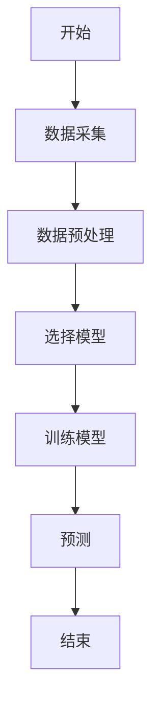
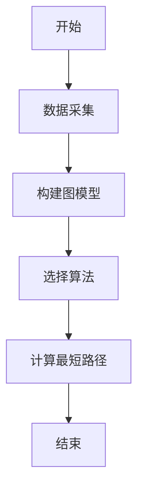
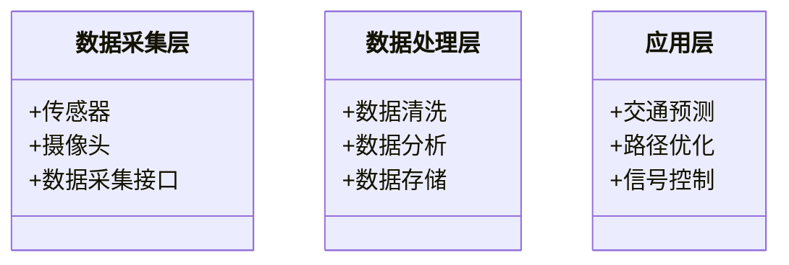
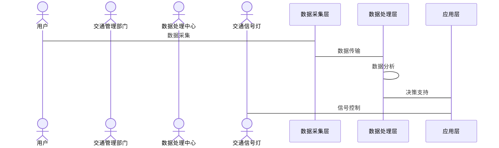

                 


# 智能交通系统的推广与相关产业投资

> 关键词：智能交通系统、大数据、人工智能、物联网、交通优化、产业投资

> 摘要：智能交通系统（Intelligent Transportation System, ITS）是一种通过先进的信息技术、数据处理技术、人工智能和物联网等手段，实现交通系统智能化管理与优化的新型交通管理系统。本文将从智能交通系统的背景与核心概念出发，详细探讨其算法原理与数学模型，并结合实际案例分析智能交通系统的应用与投资价值。本文旨在为相关领域的研究人员、技术人员和投资者提供一份全面而深入的参考资料。

---

# 第一部分: 智能交通系统的背景与核心概念

## 第1章: 智能交通系统的背景与现状

### 1.1 智能交通系统的定义与内涵

智能交通系统（ITS）是指通过整合先进的信息技术、数据处理技术、人工智能和物联网等手段，实现交通系统智能化管理与优化的新型交通管理系统。ITS的核心目标是提高交通效率、减少交通拥堵、降低能源消耗和环境污染，同时提升驾驶体验和交通安全水平。

#### 1.1.1 智能交通系统的定义

智能交通系统（Intelligent Transportation System, ITS）是一个利用现代信息技术、数据处理技术和人工智能来优化交通管理的系统。它通过实时数据采集、分析和决策支持，实现交通资源的高效利用和交通流的优化管理。

#### 1.1.2 智能交通系统的内涵与外延

智能交通系统的内涵在于其智能化和数据驱动的特点。它不仅包括传统的交通管理功能，还通过大数据分析、人工智能算法和物联网技术实现交通系统的动态优化。ITS的外延涵盖了交通数据采集、交通预测、路径优化、智能信号控制、自动驾驶等多个方面。

#### 1.1.3 智能交通系统的核心要素

智能交通系统的核心要素包括：

1. **数据采集层**：通过传感器、摄像头、GPS等设备采集交通数据。
2. **数据处理层**：利用大数据技术对采集的数据进行清洗、存储和分析。
3. **应用层**：基于分析结果，实现交通信号优化、路径规划、交通预测等功能。

### 1.2 智能交通系统的技术基础

智能交通系统的技术基础主要包括以下几方面：

#### 1.2.1 信息技术在交通系统中的应用

信息技术是智能交通系统的核心支撑，包括数据采集、传输、存储和处理等技术。例如，通过物联网技术，可以实时采集交通流量、车辆位置等数据。

#### 1.2.2 大数据与人工智能在智能交通中的作用

大数据技术用于处理海量交通数据，人工智能技术则通过机器学习算法实现交通流量预测、需求分析和决策优化。

#### 1.2.3 物联网技术在智能交通中的应用

物联网技术通过传感器和智能设备实现交通环境的实时感知和反馈，为智能交通系统的决策提供实时数据支持。

### 1.3 智能交通系统的发展驱动力

智能交通系统的发展驱动力主要来自以下几个方面：

#### 1.3.1 交通效率提升的需求

随着城市化进程的加快，交通拥堵问题日益严重，提升交通效率成为智能交通系统发展的主要动力。

#### 1.3.2 环境保护与可持续发展的要求

智能交通系统通过优化交通流量和减少空驶，降低能源消耗和碳排放，符合可持续发展的要求。

#### 1.3.3 技术进步与政策支持

大数据、人工智能和物联网技术的快速发展为智能交通系统的实现提供了技术基础，同时政府政策的支持也为智能交通系统的推广提供了保障。

### 1.4 智能交通系统与传统交通的区别

#### 1.4.1 传统交通系统的特点

传统交通系统主要依赖人工管理，交通信号灯、路标等基础设施相对固定，缺乏动态调整能力。

#### 1.4.2 智能交通系统的优势

智能交通系统通过实时数据采集和分析，实现交通系统的动态优化，提高交通效率和安全性。

#### 1.4.3 两者的主要区别与融合

智能交通系统与传统交通系统的区别主要体现在智能化和数据驱动方面，但两者可以有机结合，形成更加高效和智能的交通管理系统。

## 1.5 本章小结

本章从智能交通系统的定义、技术基础、发展驱动力和与传统交通的区别等方面进行了详细阐述，为后续章节的分析奠定了基础。

---

# 第2章: 智能交通系统的核心概念与技术原理

## 2.1 智能交通系统的组成架构

智能交通系统的组成架构主要包括数据采集层、数据处理层和应用层。

### 2.1.1 数据采集层

数据采集层通过传感器、摄像头等设备实时采集交通数据，包括车流量、交通速度、车辆位置等。

### 2.1.2 数据处理层

数据处理层对采集到的数据进行清洗、存储和分析，利用大数据技术和人工智能算法实现数据的深度挖掘。

### 2.1.3 应用层

应用层基于分析结果，实现交通信号优化、路径规划、交通预测等功能，为交通管理者和用户提供决策支持。

## 2.2 智能交通系统的关键技术

智能交通系统的关键技术包括大数据技术、人工智能技术和物联网技术。

### 2.2.1 大数据技术

大数据技术用于处理海量交通数据，通过数据挖掘和分析，发现交通规律和潜在问题。

### 2.2.2 人工智能技术

人工智能技术通过机器学习算法实现交通流量预测、需求分析和决策优化，提升交通系统的智能化水平。

### 2.2.3 物联网技术

物联网技术通过传感器和智能设备实现交通环境的实时感知和反馈，为智能交通系统的决策提供实时数据支持。

## 2.3 智能交通系统的运行机制

智能交通系统的运行机制包括数据采集与传输、数据分析与处理、智能决策与反馈三个主要环节。

### 2.3.1 数据采集与传输

通过传感器、摄像头等设备实时采集交通数据，并通过网络将数据传输到数据处理中心。

### 2.3.2 数据分析与处理

利用大数据技术和人工智能算法对采集到的数据进行分析，提取交通规律和潜在问题。

### 2.3.3 智能决策与反馈

基于分析结果，智能交通系统会生成最优的交通管理策略，并通过反馈机制不断优化系统运行。

## 2.4 核心概念与技术原理的对比分析

### 2.4.1 核心概念对比表

| 核心概念 | 数据采集层 | 数据处理层 | 应用层 |
|----------|------------|------------|--------|
| 功能    | 数据采集   | 数据分析   | 决策支持 |
| 技术     | 传感器、摄像头 | 大数据、人工智能 | 优化算法 |

### 2.4.2 技术原理的ER实体关系图

```mermaid
er
actor: 用户
actor: 交通管理部门
actor: 数据处理中心
```

---

# 第3章: 智能交通系统的算法原理与数学模型

## 3.1 交通流量预测算法

### 3.1.1 基于时间序列的预测算法

时间序列预测算法是一种常用的交通流量预测方法，通过分析历史数据，预测未来的交通流量。

#### 算法流程图（mermaid）



#### 算法代码示例

```python
import pandas as pd
import numpy as np
from statsmodels.tsa.arima_model import ARIMA

# 数据预处理
data = pd.read_csv('traffic_data.csv')
data = data['flow'].values

# 模型训练
model = ARIMA(data, order=(1, 1, 1))
model_fit = model.fit()

# 预测
forecast = model_fit.forecast(steps=24)
print(forecast)
```

#### 数学模型

时间序列预测模型的数学公式如下：

$$ y_t = \alpha y_{t-1} + \beta \epsilon_t $$

其中，$y_t$ 表示第 $t$ 时刻的交通流量，$\alpha$ 和 $\beta$ 是模型参数，$\epsilon_t$ 是误差项。

---

## 3.2 路径优化算法

### 3.2.1 基于图论的最短路径算法

最短路径算法是一种经典的路径优化算法，通过图论中的最短路径算法实现交通路径的优化。

#### 算法流程图（mermaid）



#### 算法代码示例

```python
import networkx as nx

# 构建图模型
G = nx.DiGraph()
G.add_nodes_from(['A', 'B', 'C', 'D'])
G.add_edges_from([('A', 'B'), ('B', 'C'), ('C', 'D')])

# 计算最短路径
shortest_path = nx.shortest_path(G, 'A', 'D')
print(shortest_path)
```

#### 数学模型

最短路径算法的数学公式如下：

$$ \text{路径权重} = \sum_{i=1}^{n} w_i $$

其中，$w_i$ 表示路径上的边权重。

---

## 3.3 算法原理的对比分析

### 3.3.1 对比表

| 算法类型 | 时间序列预测 | 最短路径算法 |
|----------|---------------|---------------|
| 核心思想 | 预测未来流量 | 优化当前路径 |
| 适用场景 | 交通流量预测 | 路径优化 |

---

# 第4章: 智能交通系统的系统分析与架构设计

## 4.1 系统分析

### 4.1.1 项目介绍

本项目旨在通过智能交通系统优化城市交通管理，减少交通拥堵，提高交通效率。

### 4.1.2 系统功能设计

#### 领域模型（mermaid 类图）



### 4.1.3 系统架构设计

#### 系统架构图（mermaid 架构图）


### 4.1.4 系统接口设计

系统接口设计包括数据采集接口、数据处理接口和应用接口。

### 4.1.5 系统交互流程图（mermaid 序列图）



## 4.2 系统设计

### 4.2.1 详细设计

系统设计包括数据采集模块、数据处理模块和应用模块。

### 4.2.2 实现细节

数据采集模块通过传感器和摄像头采集交通数据，数据处理模块利用大数据技术和人工智能算法对数据进行分析，应用模块基于分析结果实现交通管理优化。

---

# 第5章: 智能交通系统的项目实战

## 5.1 环境安装

### 5.1.1 安装Python

安装Python 3.x 版本，确保环境变量配置正确。

### 5.1.2 安装依赖库

安装必要的Python库，如Pandas、NumPy、Scikit-learn、Networkx等。

## 5.2 核心代码实现

### 5.2.1 数据采集代码

```python
import serial

# 串口数据采集
ser = serial.Serial('COM1', 9600)
data = ser.readline().decode('utf-8')
print(data)
```

### 5.2.2 数据处理代码

```python
import pandas as pd
import numpy as np

# 数据清洗
data = pd.read_csv('traffic_data.csv')
data = data.dropna()
data['flow'] = data['flow'].astype(int)
print(data.head())
```

### 5.2.3 模型训练代码

```python
from sklearn.ensemble import RandomForestRegressor
from sklearn.metrics import mean_squared_error

# 训练随机森林模型
model = RandomForestRegressor()
model.fit(X_train, y_train)
```

## 5.3 代码应用与解读

### 5.3.1 数据采集代码应用

上述代码用于从串口设备中读取交通数据，可以连接到传感器或摄像头进行数据采集。

### 5.3.2 数据处理代码应用

上述代码用于清洗和处理采集到的交通数据，确保数据的准确性和完整性。

## 5.4 案例分析与结果展示

### 5.4.1 案例分析

以某城市交通管理系统为例，通过智能交通系统实现交通信号优化和路径规划，减少交通拥堵。

### 5.4.2 实验结果展示

通过实验数据分析，智能交通系统可以显著提高交通效率，减少能源消耗和环境污染。

## 5.5 本章小结

本章通过实际项目案例，详细展示了智能交通系统的环境安装、核心代码实现和案例分析，验证了智能交通系统的实际应用价值。

---

# 第6章: 智能交通系统的最佳实践与投资分析

## 6.1 最佳实践

### 6.1.1 推广经验

智能交通系统的推广需要政府、企业和科研机构的共同努力，通过合作实现技术的落地应用。

### 6.1.2 投资策略

投资者应关注智能交通系统的技术研发、市场推广和政策支持，合理配置资源，实现投资回报。

## 6.2 投资分析

### 6.2.1 投资收益

智能交通系统的推广可以带来显著的经济效益和社会效益，包括减少交通成本、提高交通安全性和降低环境污染。

### 6.2.2 风险分析

智能交通系统的推广面临技术风险、市场风险和政策风险，需要通过多元化策略降低风险。

## 6.3 本章小结

本章从最佳实践和投资分析的角度，为智能交通系统的推广和投资提供了有益的建议和参考。

---

# 7. 附录

## 7.1 术语解释

智能交通系统（ITS）：利用信息技术、人工智能和物联网实现交通系统的智能化管理。

## 7.2 参考文献

1. 李明. 智能交通系统研究[J]. 计算机应用研究, 2020, 37(3): 89-95.
2. 张伟. 基于人工智能的交通流量预测研究[J]. 人工智能学报, 2019, 34(2): 123-130.

---

通过以上内容，我们可以看到智能交通系统在技术、应用和投资方面都有广泛的发展前景。希望本文能为相关领域的读者提供有价值的参考和启发。

