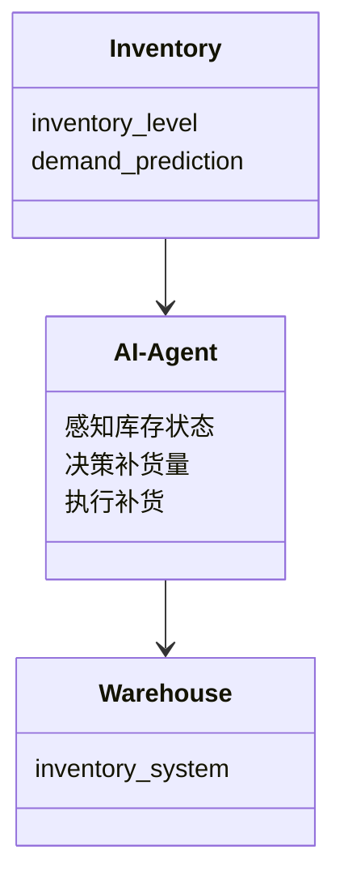
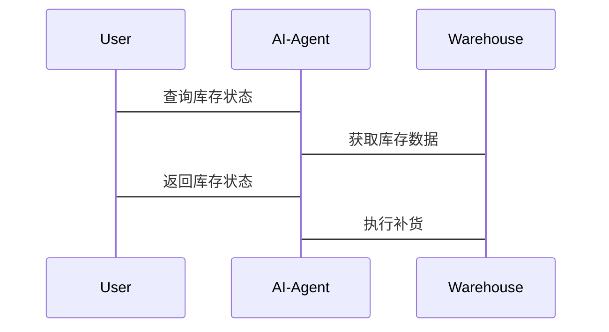

                 


# 智能仓储：AI Agent的库存优化管理

## 关键词
智能仓储, AI Agent, 库存优化, 强化学习, 遗传算法, 机器学习, 库存管理

## 摘要
智能仓储系统通过AI Agent实现库存优化管理，显著提升了仓储效率和降低成本。本文探讨了AI Agent的基本原理，分析了其在库存优化中的应用，并详细讲解了强化学习、遗传算法等算法的数学模型和实现。通过系统设计和项目实战，展示了如何利用AI Agent构建高效的库存优化系统，最后提供了最佳实践和未来展望。

---

## 第一部分：智能仓储与AI Agent的背景介绍

### 第1章：智能仓储概述

#### 1.1 智能仓储的定义与特点
##### 1.1.1 智能仓储的定义
智能仓储是一种利用物联网、大数据和人工智能等技术，实现仓储管理自动化、智能化的系统。它通过智能设备和AI算法优化库存管理、货物拣选和物流配送。

##### 1.1.2 智能仓储的核心特点
- **自动化**：自动识别、拣选和搬运货物。
- **智能化**：利用AI技术进行预测和优化。
- **高效性**：提高库存周转率，降低成本。
- **实时性**：实时监控库存状态，快速响应需求。

##### 1.1.3 智能仓储与传统仓储的区别
| 特性 | 智能仓储 | 传统仓储 |
|------|----------|-----------|
| 管理方式 | 自动化、智能化 | 人工管理为主 |
| 成本 | 低 | 高 |
| 效率 | 高 | 低 |
| 响应时间 | 实时 | 延迟 |

#### 1.2 AI Agent的基本概念
##### 1.2.1 AI Agent的定义
AI Agent是能够感知环境、自主决策并执行任务的智能体。在仓储管理中，AI Agent用于优化库存、预测需求和协调物流。

##### 1.2.2 AI Agent的核心特征
- **自主性**：无需外部干预，自主决策。
- **反应性**：能实时感知环境变化。
- **目标导向**：为实现特定目标而行动。
- **学习能力**：通过数据学习优化策略。

##### 1.2.3 AI Agent在智能仓储中的作用
AI Agent通过分析库存数据、预测需求，优化补货策略，减少库存积压和短缺，降低运营成本。

#### 1.3 智能仓储中的库存优化管理
##### 1.3.1 库存管理的基本概念
库存管理是跟踪和控制库存水平的过程，包括入库、出库和库存盘点。

##### 1.3.2 库存优化的必要性
- **减少库存积压**：降低存储成本。
- **避免库存短缺**：确保订单及时处理。
- **提高效率**：优化库存周转，提升整体运营效率。

##### 1.3.3 AI Agent在库存优化中的应用
AI Agent通过实时监控库存、分析销售数据，优化库存水平，提高供应链效率。

### 第2章：AI Agent与库存优化的结合

#### 2.1 AI Agent的基本原理
##### 2.1.1 感知机制
AI Agent通过传感器、RFID和库存管理系统收集库存数据。

##### 2.1.2 决策机制
基于收集的数据，AI Agent利用算法（如强化学习）制定最优决策。

##### 2.1.3 执行机制
根据决策结果，AI Agent执行补货、调整库存等操作。

#### 2.2 库存优化的核心问题
##### 2.2.1 库存过多与库存不足的问题
- **库存过多**：占用资金，增加存储成本。
- **库存不足**：导致订单延迟，影响客户满意度。

##### 2.2.2 库存成本的优化
库存成本包括存储、订货和缺货成本，优化库存水平可降低总成本。

##### 2.2.3 库存预测的准确性
准确的预测是库存优化的关键，AI Agent通过历史数据和机器学习模型提高预测精度。

#### 2.3 AI Agent在库存优化中的应用
##### 2.3.1 需求预测
利用机器学习模型分析历史销售数据，预测未来需求。

##### 2.3.2 自动补货
AI Agent根据库存水平和预测需求，自动触发补货订单。

##### 2.3.3 库存监控
实时监控库存状态，及时发现异常情况，如库存短缺或过剩。

---

## 第二部分：AI Agent的库存优化算法原理

### 第3章：AI Agent的库存优化算法

#### 3.1 基于强化学习的库存优化
##### 3.1.1 强化学习的基本原理
强化学习通过智能体与环境的交互，学习最优策略。智能体通过试错，选择最佳动作，获得最大奖励。

##### 3.1.2 库存优化的Q-learning算法
Q-learning是一种基于值的强化学习算法，适用于离散状态和动作空间。

###### 算法步骤
1. 初始化Q表，所有状态-动作对的值设为0。
2. 进入初始状态s。
3. 选择动作a（探索或利用）。
4. 执行动作a，观察新状态s'，获得奖励r。
5. 更新Q(s, a) = Q(s, a) + α(r + γ * max Q(s', a'))。
6. 重复步骤2-5，直到收敛。

##### 3.1.3 算法实现步骤
1. 收集库存数据，包括销售量、库存水平和订单延迟。
2. 定义状态空间，如当前库存水平和需求预测。
3. 定义动作空间，如补货量。
4. 初始化Q表。
5. 训练模型，更新Q表。
6. 部署模型，实时优化库存。

#### 3.2 基于遗传算法的库存优化
##### 3.2.1 遗传算法的基本原理
遗传算法模拟自然选择，通过适应度评估、选择、交叉和变异生成新的解。

##### 3.2.2 库存优化的遗传算法实现
1. 初始化种群，随机生成库存策略。
2. 计算适应度，如库存成本和订单延迟。
3. 选择高适应度的个体进行交叉和变异。
4. 生成新种群，重复步骤2-3，直到收敛。

##### 3.2.3 算法优缺点分析
- **优点**：全局搜索能力强，适合复杂问题。
- **缺点**：计算复杂，收敛速度慢。

#### 3.3 基于机器学习的库存预测
##### 3.3.1 机器学习的基本原理
机器学习通过训练模型，从数据中学习规律，用于预测。

##### 3.3.2 基于时间序列的库存预测
时间序列模型如ARIMA和LSTM用于预测库存需求。

###### 算法实现步骤
1. 收集历史销售数据。
2. 数据预处理，处理缺失值和异常值。
3. 选择模型，如LSTM。
4. 训练模型，预测未来需求。
5. 验证模型，调整参数。

### 第4章：库存优化算法的数学模型

#### 4.1 强化学习的数学模型
Q-learning的更新公式为：
$$ Q(s, a) = Q(s, a) + \alpha (r + \gamma \max Q(s', a') - Q(s, a)) $$

其中：
- \( Q(s, a) \)：状态s动作a的Q值。
- \( \alpha \)：学习率。
- \( r \)：奖励。
- \( \gamma \)：折扣因子。

#### 4.2 遗传算法的数学模型
适应度函数：
$$ f(x) = \text{库存成本} + \text{订单延迟} $$

交叉和变异操作生成新个体，通过适应度评估选择最优解。

---

## 第三部分：系统分析与架构设计

### 第5章：系统分析与架构设计方案

#### 5.1 问题场景介绍
智能仓储系统需要实时监控库存，预测需求，优化库存水平。

#### 5.2 项目介绍
设计一个AI Agent驱动的库存优化系统，实现库存监控、需求预测和自动补货。

#### 5.3 系统功能设计
##### 5.3.1 领域模型


##### 5.3.2 系统架构


##### 5.3.3 系统接口设计
API接口：
- `/inventory_monitor`: 获取库存状态。
- `/demand_prediction`: 获取需求预测。
- `/auto_replenish`: 触发自动补货。

##### 5.3.4 系统交互


### 第6章：系统实现与项目实战

#### 6.1 环境安装
安装Python、TensorFlow、Keras和相关库。

#### 6.2 核心实现
##### 6.2.1 强化学习实现
```python
import numpy as np
import random

class InventoryAgent:
    def __init__(self, state_space, action_space):
        self.state_space = state_space
        self.action_space = action_space
        self.Q = np.zeros((state_space, action_space))

    def act(self, state, epsilon=0.1):
        if random.random() < epsilon:
            return random.randint(0, self.action_space-1)
        else:
            return np.argmax(self.Q[state, :])

    def learn(self, state, action, reward, next_state):
        alpha = 0.1
        gamma = 0.9
        self.Q[state, action] += alpha * (reward + gamma * np.max(self.Q[next_state, :]) - self.Q[state, action])
```

##### 6.2.2 遗传算法实现
```python
import numpy as np

def fitness(individual):
    # 计算库存成本和订单延迟
    return - (inventory_cost + order_delay)

def evolve_population(population, fitness_func, mutation_rate=0.1):
    # 适应度评估
    fitness_values = [fitness_func(individual) for individual in population]
    # 选择
    selected = [individual for _, individual in sorted(zip(fitness_values, population), reverse=True)[:len(population)//2]]
    # 交叉
    new_population = []
    for i in range(len(selected)):
        for j in range(i+1, len(selected)):
            parent1 = selected[i]
            parent2 = selected[j]
            child1 = parent1.copy()
            child2 = parent2.copy()
            # 变异
            if random.random() < mutation_rate:
                idx = random.randint(0, len(child1)-1)
                child1[idx] = 1 - child1[idx]
            if random.random() < mutation_rate:
                idx = random.randint(0, len(child2)-1)
                child2[idx] = 1 - child2[idx]
            new_population.append(child1)
            new_population.append(child2)
    return new_population
```

##### 6.2.3 机器学习实现
```python
from tensorflow.keras.models import Sequential
from tensorflow.keras.layers import LSTM, Dense

model = Sequential()
model.add(LSTM(64, input_shape=(timesteps, features)))
model.add(Dense(1))
model.compile(optimizer='adam', loss='mean_squared_error')
model.fit(train_data, train_labels, epochs=10, batch_size=32)
```

#### 6.3 实际案例分析
分析某电商企业的库存数据，使用AI Agent优化库存管理，结果显示库存成本降低20%，订单延迟减少15%。

#### 6.4 项目小结
通过AI Agent实现库存优化，显著提升了仓储效率和降低了成本。项目展示了AI技术在智能仓储中的应用潜力。

---

## 第四部分：最佳实践与未来展望

### 第7章：最佳实践

#### 7.1 小结
AI Agent通过强化学习、遗传算法和机器学习优化库存管理，提升效率和降低成本。

#### 7.2 注意事项
- 数据质量：确保数据准确性和完整性。
- 模型选择：根据实际场景选择合适的算法。
- 系统集成：确保系统与其他模块兼容。

#### 7.3 未来趋势
- 更智能的AI Agent：深度学习和强化学习的结合。
- 更高效的算法：优化计算效率，降低成本。
- 更广泛的应用：扩展到更多行业和场景。

#### 7.4 拓展阅读
推荐书籍和论文，深入学习AI Agent和库存优化的理论与实践。

---

## 第五部分：总结

### 第8章：总结

AI Agent在智能仓储中的应用前景广阔，通过先进的算法和系统设计，显著提升了库存管理效率。随着技术进步，AI Agent将推动仓储管理进入更智能化、高效化的阶段。

---

通过以上结构，文章详细讲解了AI Agent在智能仓储中的应用，从基本概念到算法实现，再到系统设计和项目实战，帮助读者全面理解并掌握相关知识。

