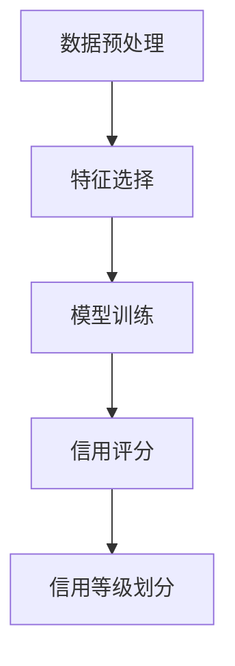
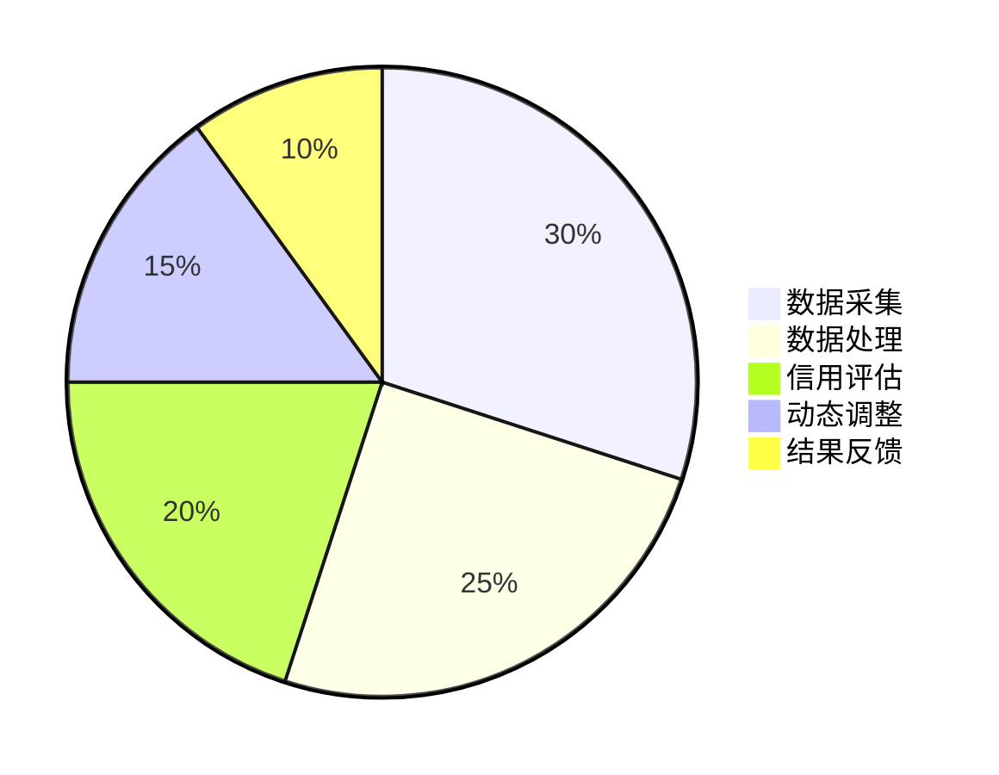

                 


# 智能企业信用限额动态调整系统

> 关键词：企业信用管理、动态调整、人工智能、风险评估、机器学习

> 摘要：本文详细探讨了智能企业信用限额动态调整系统的构建与实现，结合实际应用场景，系统性地分析了信用评估的核心算法、动态调整机制以及系统架构设计。通过具体案例分析和项目实战，深入阐释了如何利用机器学习技术实时优化企业信用限额，显著降低信用风险，提升企业运营效率。

---

## 第1章：背景介绍

### 1.1 问题背景

在现代商业环境中，企业的信用管理至关重要。传统的企业信用管理依赖于静态的信用评估和固定的信用限额，这种模式在面对市场波动、企业经营状况变化时显得力不从力。企业可能因信用限额不合理而导致资金链断裂，或者错失业务机会。

#### 1.1.1 企业信用管理的重要性
- 信用管理是企业财务管理的核心部分，直接影响企业的资金周转和风险控制。
- 合理的信用限额能够平衡企业赊销和回款之间的矛盾，优化客户关系。

#### 1.1.2 传统信用限额管理的局限性
- **静态评估**：传统信用评估基于历史数据，无法实时反映企业的最新状况。
- **人工干预**：信用限额调整依赖人工决策，效率低下且容易出错。
- **风险控制不足**：固定的信用限额可能导致企业过度授信或错失优质客户。

#### 1.1.3 智能化信用管理的必要性
- 随着大数据和人工智能技术的发展，企业可以利用实时数据和智能算法动态调整信用限额。
- 智能化信用管理能够提高企业的风险控制能力，降低坏账率，同时提升客户满意度。

### 1.2 问题描述

企业信用限额动态调整的核心问题是如何根据企业的实时经营状况和市场环境，快速、准确地调整信用限额。这涉及以下几个方面：
- 如何实时获取企业的最新数据，包括财务数据、市场数据等。
- 如何建立有效的信用评估模型，准确预测企业的信用风险。
- 如何设计动态调整机制，确保信用限额的合理性和及时性。

### 1.3 问题解决思路

智能化信用限额动态调整系统的解决思路可以总结为以下几个步骤：
1. **数据采集**：实时采集企业的经营数据，包括销售收入、利润、资产负债率等。
2. **数据预处理**：清洗数据，消除噪声，确保数据质量。
3. **信用评估模型**：利用机器学习算法建立信用评估模型，预测企业的信用风险。
4. **动态调整机制**：根据模型预测结果和企业当前信用状况，动态调整信用限额。
5. **反馈优化**：根据实际效果，不断优化模型和调整机制。

### 1.4 系统边界与外延

系统边界是指智能企业信用限额动态调整系统与其他系统的接口和交互范围。系统外延则包括系统的扩展性和适用范围。

- **系统边界**：系统主要与企业的财务系统、销售系统、客户管理系统等进行交互，获取必要的数据。
- **系统外延**：系统可以扩展到供应链金融、风险管理等领域，形成更全面的企业信用管理解决方案。

---

## 第2章：核心概念与联系

### 2.1 核心概念解析

#### 2.1.1 企业信用评估
- **定义**：对企业偿债能力和意愿的综合评价。
- **关键指标**：包括流动比率、速动比率、资产负债率等。
- **流程**：数据采集 → 数据分析 → 信用评分 → 信用等级划分。

#### 2.1.2 动态调整机制
- **定义**：根据企业实时数据和信用评估结果，自动调整信用限额。
- **触发条件**：企业财务状况恶化、市场环境变化等。
- **调整规则**：基于信用评分和企业风险等级，动态调整信用限额。

#### 2.1.3 系统功能模块
- **数据采集模块**：实时采集企业经营数据。
- **信用评估模块**：利用机器学习模型评估企业信用风险。
- **动态调整模块**：根据评估结果调整信用限额。

### 2.2 核心概念联系

通过表格和Mermaid图展示核心概念之间的关系。

#### 2.2.1 核心概念属性对比表

| 属性       | 企业信用评估                     | 动态调整机制                       |
|------------|----------------------------------|------------------------------------|
| 输入数据   | 企业财务数据、市场数据           | 信用评估结果、企业实时数据         |
| 输出结果   | 信用评分、信用等级               | 调整后的信用限额                   |
| 目标       | 评估企业信用风险                 | 动态优化信用限额                   |
| 实现方法   | 机器学习模型、统计分析           | 基于规则的调整策略、反馈优化机制   |

#### 2.2.2 实体关系图（Mermaid）

```mermaid
er
  actor 企业
  actor 信用管理机构
  actor 市场环境
  database 企业信用数据
  database 市场数据
  relation 企业 -[拥有]-> 企业信用数据
  relation 信用管理机构 -[管理]-> 企业信用数据
  relation 市场环境 -[影响]-> 市场数据
  relation 企业信用数据 --[用于]-> 信用评估
  relation 市场数据 --[用于]-> 信用评估
```

---

## 第3章：算法原理

### 3.1 风险评估模型

#### 3.1.1 模型选择
- 使用随机森林（Random Forest）算法进行信用评估。该算法具有高准确性和良好的特征重要性解释能力。

#### 3.1.2 模型流程



#### 3.1.3 模型数学公式

随机森林的预测公式为：

$$
\hat{y} = \sum_{i=1}^{n} \frac{1}{n} \sum_{j=1}^{m} H(x_i, t_j)
$$

其中，$n$ 是树的数量，$m$ 是每个树的特征数量，$H(x_i, t_j)$ 是第$j$棵树对样本$x_i$的预测结果。

---

## 第4章：系统分析与架构设计

### 4.1 系统架构设计

#### 4.1.1 系统功能设计
- **数据采集**：实时采集企业经营数据。
- **数据处理**：清洗、转换和集成数据。
- **信用评估**：利用机器学习模型评估企业信用风险。
- **动态调整**：根据评估结果调整信用限额。
- **结果反馈**：将调整结果反馈给相关部门。

#### 4.1.2 系统架构图（Mermaid）



---

## 第5章：项目实战

### 5.1 环境安装

#### 5.1.1 安装Python和相关库
```bash
pip install numpy pandas scikit-learn
```

#### 5.1.2 数据集准备
- 数据集包括企业财务数据、市场数据和信用标签。

### 5.2 核心实现

#### 5.2.1 数据预处理
```python
import pandas as pd
import numpy as np

# 读取数据
data = pd.read_csv('credit_data.csv')

# 删除缺失值
data = data.dropna()

# 标准化处理
from sklearn.preprocessing import StandardScaler

scaler = StandardScaler()
data_scaled = scaler.fit_transform(data)
```

#### 5.2.2 模型训练
```python
from sklearn.ensemble import RandomForestClassifier
from sklearn.metrics import accuracy_score

# 训练模型
model = RandomForestClassifier(n_estimators=100)
model.fit(data_scaled, target)

# 预测结果
predicted = model.predict(data_scaled)
print("Accuracy:", accuracy_score(target, predicted))
```

---

## 第6章：总结与展望

### 6.1 总结

智能企业信用限额动态调整系统通过实时数据采集、机器学习模型和动态调整机制，显著提高了信用管理的效率和准确性。系统不仅能够降低企业风险，还能优化客户关系，提升企业竞争力。

### 6.2 展望

未来，随着人工智能技术的不断发展，信用限额动态调整系统将更加智能化和自动化。可能的方向包括：
- 更加精准的信用评估模型。
- 更加灵活的动态调整机制。
- 更广泛的行业应用，如供应链金融、小额信贷等。

---

### 最佳实践 Tips

- 数据质量是信用评估的关键，确保数据的准确性和完整性。
- 定期优化模型，根据新的数据和业务需求调整参数。
- 保持系统的实时性和稳定性，确保在关键时刻能够正常运行。

---

通过本文的详细分析，我们希望能够为企业的信用管理提供一个智能化的解决方案，帮助企业在复杂多变的市场环境中稳健发展。

