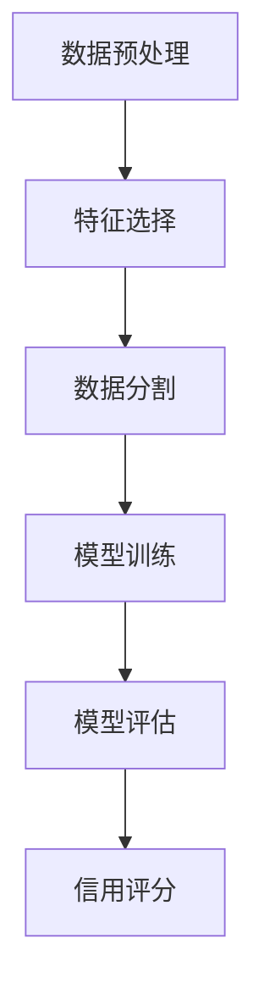

                 


# 智能企业信用限额管理系统

## 关键词：智能信用限额管理、企业信用评估、机器学习、系统架构设计、Python实现

## 摘要：本文详细介绍智能企业信用限额管理系统的背景、核心概念、算法原理、系统架构设计及项目实战。通过分析传统信用管理的局限性，提出基于机器学习的智能化解决方案，结合实际案例，展示系统设计与实现过程，为读者提供深入的技术指导。

---

## 第一部分：背景与概述

### 第1章：智能企业信用限额管理的背景与目标

#### 1.1 问题背景

- 1.1.1 传统信用管理的局限性  
传统的企业信用限额管理依赖人工审核和静态评估，存在效率低、误差大、风险控制不足等问题。随着企业规模扩大和交易复杂化，传统方法难以满足实时性和精准性需求。

- 1.1.2 智能化信用管理的需求  
企业需要更高效、精准的信用评估方法，以应对日益复杂的市场环境和客户信用风险。

- 1.1.3 企业信用限额管理的重要性  
信用限额管理直接关系到企业的资金流动和风险管理，是企业稳健运营的关键环节。

#### 1.2 系统目标

- 1.2.1 提供智能化的信用评估  
利用机器学习算法对客户信用进行自动化评估，提升评估效率和准确性。

- 1.2.2 实现动态限额调整  
根据实时数据和市场变化，动态调整客户信用限额，优化资源配置。

- 1.2.3 提供实时风险预警  
通过实时监控和分析，及时发现潜在风险，降低企业损失。

#### 1.3 技术基础

- 1.3.1 人工智能与大数据分析  
利用AI和大数据技术，从海量数据中提取有价值的信息，支持信用评估和决策。

- 1.3.2 机器学习在信用评估中的应用  
通过机器学习算法，构建信用评分模型，预测客户信用风险。

- 1.3.3 区块链技术在信用数据中的潜在应用  
区块链技术可以提供数据的不可篡改性和透明性，增强信用数据的安全性。

---

## 第二部分：核心概念与原理

### 第2章：智能信用限额管理的核心概念

#### 2.1 信用评分模型

- 2.1.1 信用评分的定义与作用  
信用评分是对客户信用状况的量化评估，用于判断客户违约的可能性。

- 2.1.2 常见的信用评分方法  
传统的评分方法包括线性回归、决策树等，但机器学习方法更具优势。

- 2.1.3 基于机器学习的信用评分模型  
使用逻辑回归、随机森林等算法构建信用评分模型，提高评估精度。

#### 2.2 风险控制策略

- 2.2.1 风险评估的基本原理  
通过分析客户的历史数据和行为特征，评估其信用风险。

- 2.2.2 基于信用评分的风险分层  
根据信用评分将客户分为不同风险等级，实施差异化管理。

- 2.2.3 动态调整信用限额的策略  
根据市场变化和客户信用状况，实时调整信用限额，优化资源配置。

---

## 第三部分：算法原理与实现

### 第3章：信用评分模型的算法原理

#### 3.1 逻辑回归模型

- 3.1.1 逻辑回归的数学模型  
$$ P(y=1|x) = \frac{1}{1 + e^{- (w \cdot x + b)}} $$  
其中，$w$为权重，$b$为偏置，$x$为输入特征。

- 3.1.2 逻辑回归的损失函数  
$$ L = -\sum_{i=1}^{n} [y_i \ln(p_i) + (1 - y_i) \ln(1 - p_i)] $$  
其中，$p_i$为预测概率，$y_i$为真实标签。

- 3.1.3 逻辑回归的优化方法  
使用梯度下降或Adam优化器，最小化损失函数，优化模型参数。

#### 3.2 支持向量机（SVM）

- 3.2.1 SVM的基本原理  
SVM通过构建超平面，将数据分为不同类别，适用于小样本数据。

- 3.2.2 核函数的选择与应用  
常用的核函数有线性核、多项式核、径向基函数（RBF）核等。

- 3.2.3 SVM在信用评分中的应用  
通过非线性特征映射，提升模型的分类精度。

#### 3.3 随机森林

- 3.3.1 随机森林的基本原理  
随机森林通过构建多个决策树，集成预测结果，降低过拟合风险。

- 3.3.2 随机森林的优势  
特征重要性分析、抗噪声能力强、计算效率高。

- 3.3.3 随机森林在信用评分中的应用  
通过特征选择优化模型性能，提升分类精度。

---

### 第4章：基于机器学习的信用评分模型实现

#### 4.1 算法流程图



#### 4.2 Python代码实现

```python
import pandas as pd
from sklearn.model_selection import train_test_split
from sklearn.linear_model import LogisticRegression
from sklearn.metrics import accuracy_score

# 数据预处理
data = pd.read_csv('credit_data.csv')
data = data.dropna()
data['target'] = data['default'].astype('int')

# 特征选择
features = ['income', 'debt', 'history']
X = data[features]
y = data['target']

# 数据分割
X_train, X_test, y_train, y_test = train_test_split(X, y, test_size=0.2, random_state=42)

# 模型训练
model = LogisticRegression()
model.fit(X_train, y_train)

# 模型评估
y_pred = model.predict(X_test)
print("准确率:", accuracy_score(y_test, y_pred))
```

---

## 第四部分：系统分析与架构设计方案

### 第5章：系统架构设计

#### 5.1 系统功能设计

- 5.1.1 数据采集模块  
从企业ERP、CRM等系统中采集客户信用数据。

- 5.1.2 风险评估模块  
基于机器学习模型，评估客户信用风险，生成信用评分。

- 5.1.3 决策支持模块  
提供信用限额调整建议，优化企业信用管理。

#### 5.2 系统架构设计图


#### 5.3 系统接口设计

- API接口  
提供RESTful API，支持外部系统调用信用评估服务。

---

## 第五部分：项目实战

### 第6章：基于Python的信用评分系统实现

#### 6.1 环境安装

- 安装Python和必要的库  
```bash
pip install numpy pandas scikit-learn
```

#### 6.2 核心代码实现

```python
from sklearn.ensemble import RandomForestClassifier
import pandas as pd

# 数据预处理
data = pd.read_csv('credit_data.csv')
data = data.dropna()
X = data.drop('default', axis=1)
y = data['default']

# 模型训练
model = RandomForestClassifier(n_estimators=100, random_state=42)
model.fit(X, y)

# 模型预测
test_data = pd.read_csv('test_credit_data.csv')
test_data = test_data.dropna()
test_X = test_data.drop('default', axis=1)
test_y = test_data['default']

y_pred = model.predict(test_X)
print("预测结果:", y_pred)
```

---

## 第六部分：总结与展望

### 第7章：最佳实践与总结

#### 7.1 最佳实践

- 数据质量是关键，确保数据的完整性和准确性。  
- 选择合适的算法，根据数据规模和特征选择最优模型。  
- 定期更新模型，适应市场变化和客户需求。

#### 7.2 小结

智能企业信用限额管理系统通过机器学习和大数据分析，显著提升了信用评估的效率和准确性。本文详细介绍了系统的设计与实现过程，为企业的信用管理提供了有力支持。

#### 7.3 注意事项

- 数据隐私和安全问题需严格控制，避免信息泄露。  
- 系统上线前需进行充分的测试，确保稳定性和可靠性。  
- 定期监控系统性能，及时优化和调整。

#### 7.4 拓展阅读

- 探索区块链技术在信用管理中的应用，提升数据信任度。  
- 研究深度学习模型（如神经网络）在信用评估中的潜力。  
- 关注行业动态，了解最新的信用管理技术和工具。

---

通过本文的详细讲解，读者可以全面了解智能企业信用限额管理系统的构建过程，并能够实际应用所学技术解决问题。

