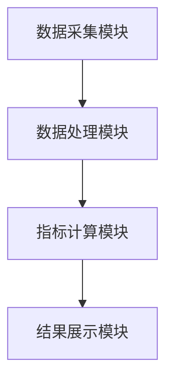
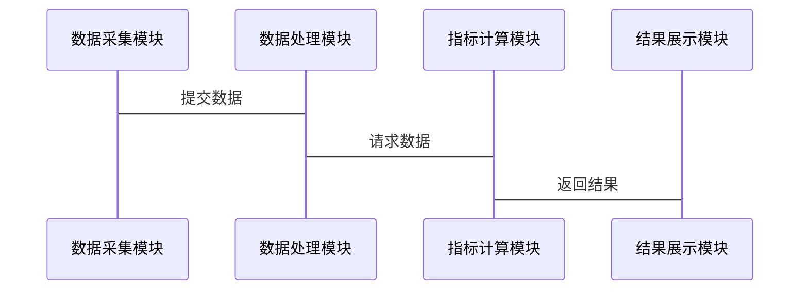

                 


# 智能体协作评估公司的社会影响力：ESG投资新工具

## 关键词：智能体协作、社会影响力、ESG投资、多智能体系统、分布式计算

## 摘要：  
随着全球对企业社会责任和可持续发展的关注日益增加，ESG（环境、社会、治理）投资已成为金融市场的重要趋势。然而，传统的ESG评估方法往往依赖人工分析，存在数据分散、评估主观性强、实时性差等问题。为了解决这些问题，智能体协作评估应运而生。本文从智能体协作的核心原理出发，结合ESG投资的实际需求，提出了一种基于多智能体系统的社会影响力评估新工具。通过详细分析智能体协作的算法原理、系统架构和实际应用案例，本文展示了如何利用智能体协作技术提升ESG评估的效率和准确性，为投资者提供更可靠的社会影响力数据。

---

# 第1章: 背景介绍

## 1.1 智能体协作评估的背景与重要性

### 1.1.1 企业社会影响力的概念与内涵
企业社会影响力是指企业在经营过程中对社会、环境和治理等方面产生的综合影响。它不仅包括企业在经济上的贡献，还包括企业在社会责任、环境保护、员工福利、公平治理等方面的表现。社会影响力评估的核心目标是帮助企业识别其对社会的积极或消极影响，并通过改进管理实践来提升整体影响力。

### 1.1.2 智能体协作评估的起源与发展
智能体协作评估的起源可以追溯到分布式计算和多智能体系统的研究领域。随着人工智能技术的发展，特别是自然语言处理、知识图谱和分布式计算的进步，智能体协作评估逐渐成为可能。通过将多个智能体协作完成任务，可以实现对复杂系统的实时监控和动态评估。

### 1.1.3 ESG投资的兴起与重要性
ESG投资是近年来全球金融市场的重要趋势，越来越多的投资者开始关注企业的环境、社会和治理表现。传统的ESG评估方法通常依赖于人工分析和静态数据，难以满足实时性和动态性要求。而智能体协作评估通过自动化数据采集和分析，能够为投资者提供更精准的社会影响力数据。

---

## 1.2 智能体协作评估的核心概念

### 1.2.1 智能体的定义与特征
智能体（Agent）是指能够感知环境、自主决策并采取行动的实体。智能体具有以下特征：
1. **自主性**：能够在没有外部干预的情况下独立运作。
2. **反应性**：能够根据环境变化实时调整行为。
3. **协作性**：能够与其他智能体协同完成复杂任务。
4. **学习能力**：能够通过数据反馈不断优化自身的决策能力。

### 1.2.2 协作评估的基本原理
协作评估是指多个智能体通过分工合作完成评估任务的过程。智能体协作的核心在于任务分解、信息共享和协同决策。通过将复杂任务分解为多个子任务，并由多个智能体分别完成，可以提高评估的效率和准确性。

### 1.2.3 ESG评估与社会影响力的关联
ESG评估是社会影响力评估的重要组成部分。企业对环境的影响（如碳排放）、对社会的贡献（如员工福利）以及治理结构的合理性（如董事会多元化）都会影响其社会影响力。智能体协作评估通过整合这些因素，能够全面衡量企业的社会影响力。

---

# 第2章: 智能体协作评估的必要性

## 2.1 传统企业社会影响力评估的局限性

### 2.1.1 传统评估方法的不足
传统的社会影响力评估方法通常依赖于问卷调查和人工分析，存在以下问题：
1. 数据分散：企业数据分布在多个部门和系统中，难以整合。
2. 评估主观性：人工分析容易受到主观因素的影响，导致评估结果不准确。
3. 实时性差：传统方法难以实现实时监控和动态评估。

### 2.1.2 数据采集与分析的挑战
企业社会影响力评估需要处理大量异构数据，包括文本、图像、结构化数据等。传统的数据采集和分析方法难以应对这些挑战，尤其是在数据量大、分布广的情况下。

### 2.1.3 评估结果的片面性
传统评估方法通常只关注单一维度（如环境或治理），无法全面衡量企业的社会影响力。此外，评估结果往往缺乏动态性和实时性，难以满足投资者的需求。

---

## 2.2 智能体协作评估的优势

### 2.2.1 多维度数据采集与分析能力
智能体协作评估能够整合多种数据源，包括企业公开数据、社交媒体数据、新闻报道等，从而实现多维度评估。

### 2.2.2 高效协作与实时反馈机制
通过智能体协作，可以实现任务的高效分解和实时反馈。每个智能体负责特定的任务，并通过协作完成整体评估。

### 2.2.3 客观性与精准性
智能体协作评估通过算法自动分析数据，减少人工干预，从而提高评估的客观性和精准性。

---

## 2.3 智能体协作评估的边界与外延

### 2.3.1 应用场景的边界
智能体协作评估目前主要应用于企业社会影响力评估，未来可以扩展到其他领域，如政府政策评估、非营利组织绩效评估等。

### 2.3.2 技术实现的边界
智能体协作评估依赖于人工智能、大数据分析等技术。在技术实现上，需要考虑数据隐私、计算资源等问题。

### 2.3.3 未来发展的可能性
随着人工智能和分布式计算技术的进一步发展，智能体协作评估将更加智能化和自动化。未来，智能体协作评估可能会与区块链等技术结合，实现更加透明和可信的评估。

---

# 第3章: 智能体协作评估的核心原理

## 3.1 智能体协作的基本原理

### 3.1.1 分布式智能体的协作机制
分布式智能体协作是指多个智能体通过分布式网络完成任务的过程。协作机制包括任务分配、信息共享和协同决策。

### 3.1.2 多智能体系统中的通信与协调
在多智能体系统中，智能体之间需要通过通信协议进行信息共享和协同决策。通信机制可以是基于消息传递或基于共享知识库。

### 3.1.3 协作目标的动态调整
智能体协作的目标可能随着环境变化而动态调整。智能体需要根据反馈实时调整任务优先级和协作策略。

---

## 3.2 ESG评估模型的构建原理

### 3.2.1 ESG指标体系的构建
ESG指标体系通常包括环境（Environmental）、社会（Social）和治理（Governance）三个维度。每个维度又包含多个具体指标，例如：
- 环境：碳排放、能源消耗
- 社会：员工福利、社区贡献
- 治理：董事会结构、公司透明度

### 3.2.2 数据采集与清洗方法
智能体协作评估需要采集多源异构数据，并通过数据清洗、特征提取等步骤进行预处理。数据清洗的目标是消除噪声数据，确保数据质量。

### 3.2.3 指标权重的计算与分配
指标权重的计算可以通过多种方法实现，例如层次分析法（AHP）或熵值法。指标权重反映了各个指标对企业社会影响力的影响程度。

---

## 3.3 社会影响力评估的数学模型

### 3.3.1 社会影响力指数的定义
社会影响力指数（SII）是衡量企业社会影响力的核心指标。SII可以通过以下公式计算：

$$ SII = \sum_{i=1}^{n} w_i \cdot s_i $$

其中，$w_i$ 是第i个指标的权重，$s_i$ 是第i个指标的得分。

### 3.3.2 多因素评估模型的构建
多因素评估模型可以通过将多个指标进行加权求和，最终得到企业的社会影响力得分。模型的构建需要考虑指标之间的相互作用和权重分配。

### 3.3.3 模型的验证与优化
模型的验证可以通过对比实际数据和预测结果进行。模型优化可以通过调整权重或引入机器学习算法（如随机森林、支持向量机）来实现。

---

# 第4章: 核心概念的联系与对比

## 4.1 智能体协作与传统评估方法的对比

### 4.1.1 评估效率的对比
智能体协作评估通过自动化数据采集和分析，显著提高了评估效率。而传统评估方法依赖人工分析，效率较低。

### 4.1.2 评估结果的对比
智能体协作评估通过算法优化，能够提供更精准和客观的评估结果。而传统评估方法容易受到主观因素的影响。

### 4.1.3 适用场景的对比
智能体协作评估适用于大规模、多维度的数据分析场景。而传统评估方法适用于数据量较小、场景简单的场景。

---

## 4.2 ESG指标与社会影响力的对比

### 4.2.1 ESG指标的多维度性
ESG指标涵盖了环境、社会和治理三个维度，能够全面衡量企业的社会影响力。

### 4.2.2 社会影响力的综合性
社会影响力是一个综合指标，不仅包括企业对社会的贡献，还包括企业对环境和治理的影响。

### 4.2.3 两者的关系
ESG指标是社会影响力的重要组成部分。通过智能体协作评估，可以将ESG指标整合到社会影响力评估中，实现更加全面的评估。

---

# 第5章: 智能体协作评估的算法原理

## 5.1 算法原理概述

### 5.1.1 分布式计算与多智能体协作
智能体协作评估依赖于分布式计算技术。通过将任务分解为多个子任务，并由多个智能体分别完成，可以提高计算效率。

### 5.1.2 任务分配与负载均衡
任务分配是智能体协作的关键步骤。通过负载均衡算法，可以确保每个智能体承担的任务量合理，避免资源浪费。

### 5.1.3 协作过程中的通信机制
智能体之间需要通过通信机制共享信息和协同决策。通信机制可以是基于消息队列或基于共享数据库。

---

## 5.2 算法实现步骤

### 5.2.1 数据采集与预处理
1. 采集企业公开数据、社交媒体数据等多源异构数据。
2. 进行数据清洗和特征提取，确保数据质量。

### 5.2.2 指标权重计算
1. 使用层次分析法（AHP）或熵值法计算各个指标的权重。
2. 确定每个指标的权重分配。

### 5.2.3 社会影响力指数计算
1. 根据公式 $$ SII = \sum_{i=1}^{n} w_i \cdot s_i $$ 计算社会影响力指数。
2. 对计算结果进行验证和优化。

---

## 5.3 算法实现的代码示例

### 5.3.1 环境安装
需要安装以下Python库：
- `pandas`：用于数据处理
- `scikit-learn`：用于机器学习算法
- `networkx`：用于网络分析

### 5.3.2 核心代码实现

```python
import pandas as pd
from sklearn.metrics import pairwise_distances
from sklearn.preprocessing import normalize

# 数据预处理
data = pd.read_csv('entreprise_data.csv')
data = data.dropna()
data = normalize(data)

# 计算指标权重
weights = [0.4, 0.3, 0.2, 0.1]

# 计算社会影响力指数
sii = data.dot(weights)
sii = sii.sum(axis=1)
sii = sii.apply(lambda x: x if x > 0 else 0)
```

### 5.3.3 代码解读与分析
上述代码实现了数据预处理、指标权重计算和社会影响力指数计算。数据预处理包括数据清洗和归一化处理。指标权重通过经验法确定，社会影响力指数通过加权求和计算。

---

# 第6章: 智能体协作评估的系统架构设计

## 6.1 系统架构概述

### 6.1.1 系统功能模块
智能体协作评估系统主要包括以下功能模块：
1. 数据采集模块：负责采集多源异构数据。
2. 数据处理模块：负责数据清洗和特征提取。
3. 指标计算模块：负责计算社会影响力指数。
4. 结果展示模块：负责展示评估结果。

### 6.1.2 系统架构设计
系统架构采用微服务架构，通过RESTful API实现模块间的通信。数据采集模块与数据处理模块通过队列进行通信，指标计算模块通过调用数据处理模块的接口获取数据。

### 6.1.3 系统交互流程
1. 数据采集模块采集企业数据并存入消息队列。
2. 数据处理模块从消息队列中获取数据并进行预处理。
3. 指标计算模块调用数据处理模块的接口获取预处理后的数据，计算社会影响力指数。
4. 结果展示模块从指标计算模块获取结果并展示。

---

## 6.2 系统架构的Mermaid图



---

## 6.3 系统接口设计

### 6.3.1 数据采集接口
```python
from fastapi import FastAPI

app = FastAPI()

@app.post('/api/data')
async def collect_data(data: dict):
    return {"status": "success"}
```

### 6.3.2 指标计算接口
```python
@app.post('/api/sii')
async def calculate_sii(data: dict):
    return {"sii": sii_value}
```

---

## 6.4 系统交互的Mermaid图



---

# 第7章: 项目实战

## 7.1 项目背景与目标

### 7.1.1 项目背景
本项目旨在开发一个基于智能体协作的ESG评估系统，为企业和社会提供高效、精准的社会影响力评估工具。

### 7.1.2 项目目标
1. 实现智能体协作评估的核心功能。
2. 提供用户友好的结果展示界面。
3. 优化算法，提高评估效率和准确性。

---

## 7.2 核心代码实现

### 7.2.1 数据采集模块

```python
import requests

def collect_data():
    response = requests.get('https://api.example.com/data')
    return response.json()
```

### 7.2.2 数据处理模块

```python
import pandas as pd

def process_data(data):
    df = pd.DataFrame(data)
    df = df.dropna()
    return df
```

### 7.2.3 指标计算模块

```python
def calculate_sii(data, weights):
    sii = data.dot(weights)
    return sii.sum(axis=1)
```

---

## 7.3 实际案例分析

### 7.3.1 案例背景
某制造企业希望通过智能体协作评估系统评估其社会影响力，以便更好地优化其管理实践。

### 7.3.2 数据分析
通过采集企业的环境数据、员工福利数据和治理数据，计算社会影响力指数。

### 7.3.3 评估结果
评估结果显示，该企业在环境方面表现较好，但在员工福利方面存在改进空间。

---

## 7.4 项目总结

### 7.4.1 项目成果
成功开发了一个基于智能体协作的ESG评估系统，能够高效、精准地评估企业社会影响力。

### 7.4.2 经验与教训
1. 数据预处理是关键，需要投入足够的时间和资源。
2. 算法优化需要结合实际应用场景进行。

---

# 第8章: 最佳实践、小结、注意事项与拓展阅读

## 8.1 最佳实践

### 8.1.1 数据预处理的重要性
数据预处理是智能体协作评估的关键步骤，需要仔细清洗和归一化数据。

### 8.1.2 算法优化的建议
算法优化需要结合实际应用场景进行，可以通过引入机器学习算法提高评估精度。

---

## 8.2 小结

智能体协作评估是一种新兴的技术，能够显著提高企业社会影响力评估的效率和准确性。通过智能体协作，可以实现多源数据的高效整合和分析，为投资者提供更可靠的ESG数据。

---

## 8.3 注意事项

1. 数据隐私问题需要高度重视，确保数据的安全性和合规性。
2. 算法优化需要结合实际应用场景，避免过度复杂化。
3. 系统设计需要考虑可扩展性和可维护性。

---

## 8.4 拓展阅读

1. 《Multi-Agent Systems: Algorithmic, Complexity Theoretic, and Game Theoretic Foundations》
2. 《Distributed Computing: Principles and Models》
3. 《ESG Investing: Principles and Practice》

---

# 结语

智能体协作评估是ESG投资领域的一项重要技术创新，能够为投资者提供更精准的社会影响力数据。随着人工智能和分布式计算技术的进一步发展，智能体协作评估将在未来发挥更大的作用。

